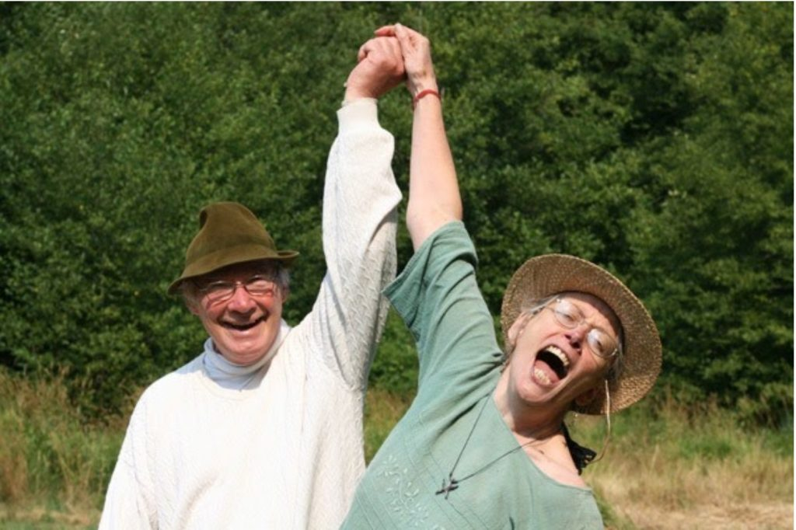

It’s so easy to complain about life; it doesn’t take any effort at all.  There’s always something we’re critical of, irritated by, angry about. Even if things are generally going pretty well, we can usually find something. Why do we focus on what’s wrong? It turns out we humans have a predilection for negativity. The ego feels stronger in negativity; negative thinking builds a sense of separateness from others. When we believe that we’re right, we can get quite self-righteous. This is not helpful.. Right-wrong thinking keeps us separate, and we can build a whole story about why we’re right and keep ourselves locked in the prison of our negativity. Where does peace and happiness fit into this picture? We have to consciously choose peace to bring it into our lives.

*You have your duties and responsibilities to the world and you can do them with a smile on your face or you can have a sad heart and tears in your eyes. It doesn’t make any difference to the world, but it makes a difference in the way you feel.*

The Sufi poet, Hafiz, says, “Complaint is only possible when living in the suburbs of God.”

What if we began to listen without preparing to make our argument while the other person is speaking? What if we could see the other person as a mirror in which we can see ourselves?

Here’s a suggestion from Hafiz:

“How do I listen to others?  
As if everyone were my Master  
Speaking to me his cherished last words.”

Whatever is going on in your life, don’t give up on yourself. You can switch your ‘glass-half-empty’  lenses to “glass-half-full” lenses that give you a different view of life. Suddenly it’s not all dark; the light is shining through. The outside situation may or may not have changed, but your outlook has changed, and you may even realize that the difficulties you’re facing are pushing you out of your comfort zone and helping you grow.

In “The Uses of Sorrow” Mary Oliver writes:

“Someone I loved once gave me a box full of darkness.  
It took me years to understand that this too was a gift.”

Certainly life has its ups and downs, we all have our share of contentment and happiness and also fear, sadness and anger. We take ourselves so seriously, but we can lighten up.  Babaji says: *Don't think you are carrying the whole work. Make it easy, make it play, make it a prayer.*

The practice of gratitude is a potent medicine. Even when you’re down in the dumps, you can probably find something to be grateful for. It can be something small; it can be anything. Start a list. Perhaps at first you’ll have trouble thinking of much that you’re grateful for, but just start. Write down one thing, and chances are more will follow. There are many things we take for granted without recognizing that they are gifts. Keeping a gratitude journal is a simple but powerful practice.

Even when we’re sad or depressed, there is still kindness in the world. Sometimes a simple smile from someone can make a big difference in your life. The same holds true if you’re the one smiling at someone else. If you appreciate something someone has done for you, tell them so. Many people are starving for kind human words.

What happened today that lifted your spirits? Did someone smile at you? Did you smile at someone?

Did someone in the grocery store notice you had only a couple of items and invited you to step up to the till first? You may not be feeling well and are barely holding it together; yet expressing appreciation to someone who’s brought some light into the world, even in a very simple way, lifts both your hearts. These are small, but precious moments. You don’t need to have everything figured out in order to be kind.

Celebrations of life are planned following someone’s death. This is a lovely idea, but why wait? Why not celebrate life right now?

Contributed by Sharada  
All quotes in italics are from writings by Baba Hari Dass

---

**Sharada Filkow,** a student of classical ashtanga yoga since the early 70s, is one of the founding members of the Salt Spring Centre of Yoga, where she has lived for many years, serving as a karma yogi, teacher and mentor.
