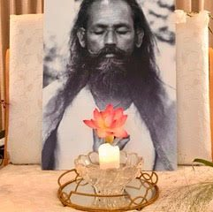
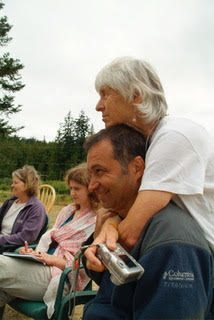

> "Mind creates the outer world. You can create a miserable, frightening world, or you can create a peaceful, blissful world.You have to understand the value of human life, the aim of life, and then work on yourself." ~ Babaji

My spiritual journey actually began long before I met Babaji. When I was about 8 years old, my father and I were star-gazing on a warm August night in Richmond Highlands, surrounded by deep darkness. He pointed to the constellation of Orion and helped me to locate the Andromeda galaxy, saying that it was the only galaxy we could see from earth without a telescope. Something magical possessed me, and I felt a presence reaching out and into me from Andromeda, two and a half million light years away – a consciousness, a knowing awareness, a presence. Ever since, I’ve known we are not the only conscious beings in the universe.

My father figures in another early introduction to spirituality as well. When I was in my early 20’s he handed me a copy of the Yoga Sutras (translated by Charles Johnson, which by the way still graces my bookcase), and said, “I think you might find this interesting.” At the time, I was a young wife and mother, and ancient Indian philosophy held only a vague interest . . . mostly because my father had recommended it!

Ten years later, things had changed. The husband left, daughter and I moved into community life in Bellingham (where, by the way, Dan Jason and I first met), and daily life had begun to pall. The question arose: is this all there is to life? Working? Eating? Smoking dope? Sleeping? Procreating? Isn’t there something more we humans were meant to be doing?

So, when Babaji’s picture came to my awareness, promoting a yoga retreat in BC, I found myself heading north up the Okanagan Valley to the first Oyama retreat. Something told me yoga might help. (Help what? The anger? The confusion? Who knew!) We arrived in a rain storm; I learned that Babaji didn’t speak but communicated with a chalkboard (‘how can he be a teacher if he doesn’t speak?’ went through my mind); and then we locked eyes, and I felt again the same presence that had greeted me from Andromeda so many years earlier!

And the rest, as they say, is history!

The retreat was a great surprise – like-minded people, studying, playing, sitting, laughing, struggling through strange postures, together with a little brown man who didn’t speak, yet clearly was our teacher! After the retreat, it was the Four Purifications that carried me through. Their regular practice brought a sense of focus, clarity, and groundedness that I didn’t even know had been missing from my life. So when the next summer retreat rolled around, I trekked north again to Oyama for a repeat. Even after moving to Santa Cruz in the late 70’s, our connection remained; in the years since, we became part of the Dharma Sara family as the ACYR became our family vacation each summer.

In reflecting back over 45 years of practice with Babaji and the teachings of yoga, what stands out is how Babaji embodied the teachings. His very presence exuded peace – calm, open, present, engaged. His first teaching to pierce my heart was ‘Attain Peace.’ Sitting on the dock at Oyama, I’d asked him my first question: “Babaji, if you had only two words to say to the people of the world, what would they be?” His chalk hit the board before I’d even finished the question: “Attain peace,” he wrote.

Babaji’s teachings were what carried me along through the decades to follow: I hadn’t learned modesty, gratitude, patience, or compassion in my childhood home. And the benefits of some of these qualities were gradually becoming clear as I began to integrate with Babaji’s community. And so as the sadhana continued over the next decade, the internal work began . . . to weed out some of the noxious plants growing in my mind and heart, and replanting with more open, generous and inclusive ones.

First there was questioning about the guru. I never though I was looking for a guru . . . and what is a guru, anyway? And what does it mean to have a guru? After gaining some freedom during the women’s movement of the 70’s, I wasn’t about to offer blind obedience to any man, even a wise brown yogi from India! And the satsang – what does it mean to sit in the company of truth? And what to make of all the rituals and incomprehensible mantras? So many mysteries!!

## Remember Your Aim: Attain Peace

And in the midst of these musings, there were lessons in patience, truth-telling, anger – each one a story in itself. But first came an early lesson from Ma Renu. I had been doing some karma yoga (typesetting Wings of Breath, actually, the Fellowship kirtan booklet) at Ma’s house one chilly winter day. Her home in the Santa Cruz mountains where she provided a home for Babaji was nestled in the forest about 15 miles from town. I didn’t have a car at that point, and when it came time to walk the mile to the bus-stop to catch the last bus of the day into town, it was raining quite heavily. In her gracious manner, Ma asked if I’d like a ride. As we waited in her blue Volvo for the bus to arrive, I was responding to her question with some circuitous tale about my life and, just as she said, **‘**Remember your aim,Pratibha. Remember your aim,’ the bus pulled into sight. And I was left with her words as I quickly dashed out the door: ‘Remember your aim . . .’ Goodness, what did she mean by that? And what is my aim, anyway? Does one need an aim in life? So many questions arose and tumbled through my thoughts for the next few weeks. And then one day, it occurred to me, a remembrance from the Oyama retreat. Babaji had written clearly about the aim: ‘attain peace.’ Duh! What could be more obvious?

## Anger and Patience

And when the goal was clearly seen, the next big lesson was in **Patience**. I could not help but notice, as the months and years went by, the extraordinary patience Babaji exhibited. Each and every crazy person, stupid question, or simple mistake, was accepted by Babaji with the same unwavering equanimity. I’d also noticed the lack of patience in myself, and in fact a feeling of impatience, even anger, often overcame me when encountering similar situations. The anger sometimes even erupted and injured others; there would then follow several days of beating myself up for getting angry.

So, entering the appointment room (with equal parts excitement and trepidation, of course), I confessed to Babaji that I’d begun to see how impatient I can be and how **angry** I often felt. So, expecting a rebuke from Babaji, I was astonished when he wrote “Good!” on the chalkboard. Followed by, “Now you see it!” Well, that was not what I’d expected at all! But then he explained the difference between feeling angry and expressing anger that injures others and offered me a mantra designed to overcome both desire and anger. And the work began . . . to increase patience and overcome anger.

## Regular Sadhana

As we know, Babaji emphasized Regular Sadhana is a foundation for all of our practice. The phrase became so well known that Babaji would often simply write ‘R S’ in answer to a question. And one time, when asked what he meant by ‘regular sadhana’*,* he wrote *‘*you eat every day; you sleep every day. That is regular.’ During the 1980’s, while working at the University, my days were full with a 2-hour commute, an 8-hour work day, and maintaining a home for the children. There simply wasn’t time for much sadhana each morning. But I was faithful with meditation class at MMC. From 7:30-9:30 each Saturday morning found me sitting for 2 hours in the Community Building with 30-40 others. And one morning driving to work, it occurred to me that I actually was doing ‘regular sadhana:’ once a week for 2 hours with Babaji. It may not have been daily, but it was certainly ‘regular’!

## Live a Virtuous Life

After a few years (probably 20 or so), I realized that my chances of becoming enlightened in this lifetime were getting slimmer and slimmer. While still not fully comprehending what ‘enlightenment’ might be (let alone ‘liberation’), it seemed less and less likely that I’d be able to reach that final state in this life. So why keep on trying, if one is convinced of not being able to reach the top of the mountain? Well, Babaji had an answer even for that one. “Live a virtuous life,” he told us . . . over and over, he wrote it. Again the questions came: ‘what is a virtuous life?’ What does that look like? And after some reflection it become clear that practicing the yamas, developing positive qualities, and regular sadhana were all involved in living a virtuous life. And of course his famous: “Work honestly, meditate every day, meet people without fear, and play.” ‘That I can do,’ I told myself. Or at least make efforts in that direction. It helped, somehow to know there was an achievable goal available!

## Karma Yoga

And through the years, it became more and more clear that ‘it’s all about me,’ at least in my mind. ‘Life is the story we tell ourselves,’ as one friend said recently. And yes, we each tell ourselves the story of our life, which doesn’t make it true, but does make it ‘our story,’ And along comes the teaching about karma yoga, selfless service, the offering of the fruits of our actions in the service of the greater good. Like the sun shines equally on everyone, being available to offer assistance as it’s needed to the best of one’s ability, serving more than just the little ego, the I-am-ness in the story of our life. And so Pacific Cultural Center looms into view, as after retirement, I offered my service in support of the Hanuman Fellowship’s town center. A community learning crucible where we tumbled about like rocks being polished as the rough edges of our egos were being scrubbed away.

More on the karma yoga journey next month, and the various forests and meadows through which Babaji’s guidance led this wandering soul.

---

**Pratibha Queen** is an Ashtanga Yoga instructor and Ayurvedic practitioner who lives in Santa Cruz. She is a member of DSS who attends Salt Spring Centre of Yoga retreats on a regular basis.
