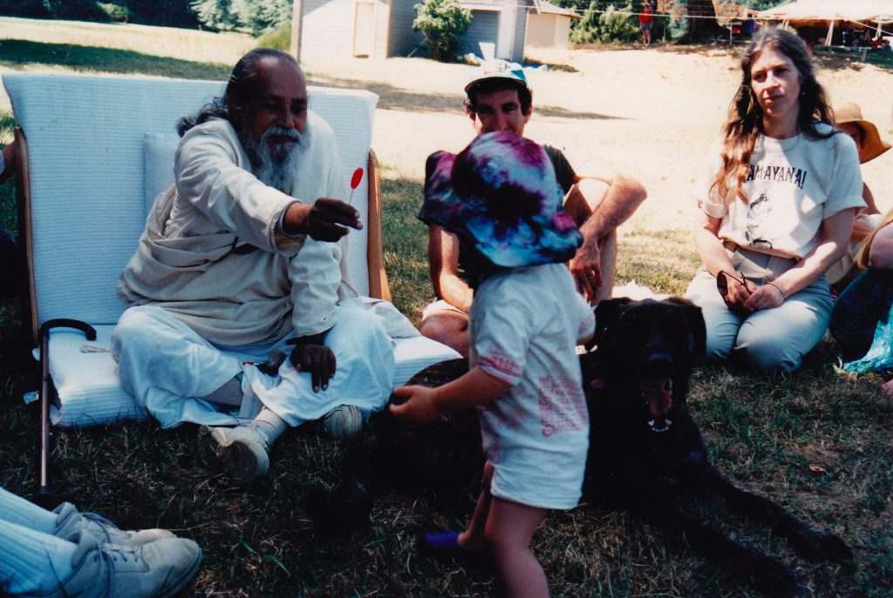

*This is life. It includes pleasure, pain, good, bad, happiness and depression.  There can’t be day without night. So don’t expect that you or anyone else will always be happy and that nothing will go wrong. Stand in the world bravely and face good and bad equally. Life is for that.*

There are external circumstances that can be hard to deal with, but it doesn’t help to blame the external conditions for our unhappiness. We’re in the middle of a pandemic, not something anyone enjoys, but it doesn’t help to be angry at the pandemic.

How we respond to situations makes the difference between our happiness or unhappiness.

No matter what is going on, we have a choice about how we respond. If you find yourself tightening up and closing down, don’t make it worse by blaming yourself. If you’re unhappy, be kind and gentle with yourself.  Thich Nhat Hanh says, “When I am angry, I rock my anger like a baby.” Being kind to yourself softens your heart, and your tenderness changes the way you look at the world.

Having compassion for  yourself may be the hardest part of the process, but you are worthy of your own kindness. Whatever mistakes you’ve made in the past are done; you can’t change the past. What causes your suffering is dwelling on the problems of the past, telling yourself you should have done better. What you did that you regret is already done. Had you had the understanding and skills you have now, you would have acted differently. When you have awareness and skills, you can  make different choices, wiser choices. It  is not too late and you are not  hopeless.

*The main thing in spiritual life is developing positive qualities.Reducing negative qualities and developing positive qualities are not two different things*

The Dalai Lama tells us, “Be kind whenever possible. It is alway possible.”

Waiting for an imaginary day in the future when you’ll have everything together won’t work. The only time you can make positive changes is the present.

Thich Nhat Hanh says, “The seed of suffering in you may be strong, but don’t wait until you have no more suffering before allowing yourself to be happy.”

Of all the teachings of yoga, the foundation is ahimsa - non-harming. Without having any harmful or violent thoughts, what’s left is love.

*Ahima means not to harm anyone, including yourself. You are harming yourself by your negativities.*

*To love God we have to love God’s creation. To feel God’s love we should accept ourselves first because we are also in God’s creation.*

Understanding allows for compassion, which can then lead to forgiveness. When you understand someone's pain - including your own - your heart will soften. There will be no room for hate; there will be compassion based on understanding, and then the realization will dawn that there is no one to blame.

*Love everyone, including yourself. This is real sadhana.*

*Love and hate are two opposites. If one is capable of removing hate within, then love will emanate without.*

In a recent online sutra class, participants shared some of the practices that have helped them in tense and challenging situations. These are simple, practical tools for digging ourselves out of the hole we’ve dug for ourselves when we’re stuck in negative thought patterns.

1. Feel your heart beating, and remember that everyone else’s heart is also beating.
2. When you notice yourself having judgments of another, put your hand on your heart. This serves as a reminder of your tenderness, and of the possibility of understanding both yourself and others.
3. When you notice you’re having critical thoughts about another person’s behavior or attitude, think about a time you’ve acted in the same way. Let the other person be your mirror.

You may have other little tricks to bring you back into balance. Here’s another reminder from the Dalai Lama:

“There is a Tibetan saying: ‘When things are difficult, then let yourself be happy.’  Otherwise, if happiness is relying on others or the environment or your surroundings, it’s not possible. Like an ocean, the waves always go up and down, but underneath, it always remains calm. We have that ability as well.”

*Cultivate a sympathetic heart, humility in dealings and selflessness in action. If these are practiced with earnestness and sincerity, then you will win the game of life.*

Contributed by Sharada  
All text in italics is from writings by Baba Hari Dass

---

**Sharada Filkow,** a student of classical ashtanga yoga since the early 70s, is one of the founding members of the Salt Spring Centre of Yoga, where she has lived for many years, serving as a karma yogi, teacher and mentor.
