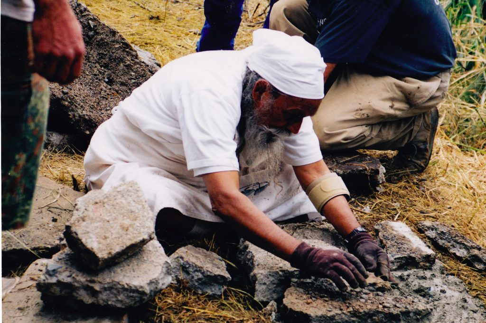
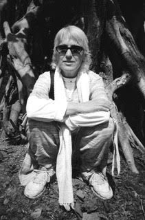

Over the years, one of the karma yoga tasks that came my way was taking notes at Satsang. After the reading of a few verses from the Gita, Babaji would answer questions for the rest of the hour. Because I’d learned Gregg Shorthand way back in high school, and couldn’t bear to listen to his wisdom simply vanish into endless space, I began to take notes. Soon it became a habit, and as the years rolled by, I realized that there were certain topics that repeated themselves, such as karma yoga, develop positive qualities, and binding thoughts, for example. So as an exercise, I gathered up a dozen or so quotes that related to binding thoughts and liberation, and send them to him to review before we published them in the Pathways newsletter.

And much to my surprise, Babaji not only edited them, but actually wrote an essay to precede them. And so the pamphlet “Binding Thoughts and Liberation” was born. I printed up a few and offered them for sale to benefit the Sri Ram Orphanage. And shortly thereafter, Sri Ram Publishing decided to make a series and subsequently also published “Mind is our World” and “Karma Yoga” pamphlets as well. As with all of Babaji’s published works, the proceeds are dedicated to support Sri Ram Ashram, his special project for the neglected children of India.

*Guru is a person in our eyes. Actually the guru is his or her teachings.*  
*Remove that physical form – that will not remain forever.*  
*If we think that the guru is a person, then the guru will die and the game is over.*  
*If the guru is the teaching, then that guru will remain until you are liberated.*  
*–Baba Hari Dass*

## Sri Ram Ashram

In the middle 1980’s Babaji arranged for the purchase of land near Haridwar, in northern India, to create a home for abandoned children. The word ‘ashram’ in Hindi means ‘home,’ and since he was a teenager, Babaji had harbored the vision of a home for children where those abandoned by their families could be provided a loving home – to be cared for, loved, and educated. And over the course of the next several decades, an extraordinary home was created. A home that included not only housing, but a health clinic, a garden, and a school that continues to serve over 500 children from the surrounding countryside.

*Pratibha in India, circa 2008*

Traveling to India with Babaji, as I was able to do on several occasions, was an education in itself. His solicitous attention to every member of the traveling party, to every single child, to every guest and visitor to the ashram was simply astonishing. His openness, his availability, his presence – whether in a filthy train station in Delhi or the VIP suite in an upscale hotel – was unswerving. All are welcomed. No one is turned away. Some are offered teachings. Some are offered candy. Some are offered a nod. Some were even offered a stone-faced wall of indifference. He manifested so beautifully the verse from Yoga Sutras: The mind becomes serene by the cultivation of feelings of love for the happy, compassion for the suffering, delight for the virtuous and indifference for the non-virtuous. (I:33)

## Pacific Cultural Center (PCC)

Other important lessons in karma yoga came thru living/working at Pacific Cultural Center. As I was preparing to retire from the University, decisions loomed about what to do next. The pension would be small, and the intention was to live in community, so when writing to Babaji about it, the words that came were: “I was thinking I’d like to live at SSC or MMC.” And his reply came as another huge surprise! He wrote, “You can live at MMC or PCC, but I think PCC will need you more!” Well, as you may have noticed, I’d not mentioned as PCC as an alternative, but here was my guru pointing at the moon, so I decided I’d better have a look! While looking where Babaji’s finger pointed, I discovered a group of resident volunteers (headed by our beloved Kalpana Tabachnick) who were then living and working at the Hanuman Fellowship’s town center in Santa Cruz.

Beginning in the 1990s, PCC hosted Babaji two days a week. He came on Thursdays about 7:30 am to hold a study class in the Bhagavad Gita. We would chant 4 verses each week and have plenty of time for questions and answers. And again on Sunday afternoon for satsang. PCC had actually been purchased in order to have a home for the Hanuman Fellowship Sunday satsang. And many joyous hours were spent there with Babaji for nearly 20 years – chanting kirtan, breathing, meditating, reading Gita verses, listening to the clicks from his chalkboard, and sharing a meal together afterwards!

In addition to Babaji’s visits to PCC, of course, there was busy-ness every day of the week – yoga classes, small meditation groups, programs with nationally known presenters, satsangs with Tibetan rinpoches, and a blue-grass band or two! And the small group of resident volunteers took care of all the details – from booking rentals to cleaning the toilets! Experiencing what it means to do the work that presents itself and needs to be done (and with no attachment to the results of your efforts), rather than what one chooses or what one likes, brings up the need to surrender once again. And I found myself back in the Office (where I’d had already had enough experience to last a life-time!)! Surrendering to the need of the situation, rather than my own ego’s sense of what it wanted! Humbling to be sure.

Living at PCC and working where you live was another unique experience. Before that time, work had always been a distance away, and it was easy to maintain a sense of separation between work-life and home-life. There was always the drive-time (or in earlier days, the bus-time) as a buffer between home and work and home. Now, not so much! And living with a group of unrelated people – that was new also! So the combination of all that with learning the day-to-day meaning of karma yoga was awesome! Our life /work together there was sometimes compared to the experience of rocks in a tumbler, where all the sharp edges are scraped clean, rounded off and polished, so we can shine in the light of the Self! You can imagine that some of that scrapping felt more painful than expected.

*Lord, make me an instrument of your peace**Where there is hatred, let me sow love**Where there is injury, let me sow pardon**Where there is doubt, let me sow faith**Where there is despair, let me sow hope**Where there is darkness, let me sow light**And where there is sadness, let me sow joy.*

## Develop Positive Qualities

‘Develop positive qualities’ is one of the phrases (like ‘regular sadhana’ and ‘face, fight, finish’) that came up regularly on Babaji’s chalkboard. Usually these pithy phrases were in response a question about thoughts and actions that seem negative or tend to perpetuate our dark side. When asked what are positive qualities, he would often write, ‘love, compassion, patience, non-violence.’ We could add ‘kindness, respect, speaking the truth, contentment.’ The list is long. And when we sit for meditation, one of the first things many people notice is that when the mind drifts (or leaps) away from its object, it’s likely to encounter negative thoughts. Perhaps some of these sound familiar: ‘Why was that person so mean to me?’ ‘I am such a worthless person.’ ‘The president is an idiot.’ ‘Babaji loves her more than me.’ The list is long and while unique to each of us, many are also shared.

Patience was one of the first that presented itself to me. Impatience, actually! I couldn’t help but notice how patient Babaji was. Unhurried, focused, unflappable – he was able to meet each moment with equanimity while keeping to his own routine. Which was in contrast to my own reactions: impatience, irritability, even anger when things didn’t go according to plan. But Babaji showed us another way. Someone was late to pick him up? Wait while another driver shows up. Someone bollixed up a Ramayana prop? No problem! Fix it! One of the children is kicking up a fuss? Offer a smile and a piece of candy!

So just as we practice the four purification breathing techniques for cleansing of the physical body, Babaji encouraged us to purify the mind of these toxic negative thoughts. These unwholesome thoughts are the ones that lead to negative actions, which in turn create more karma to be cleared out in the future.

As one step on our path to merging with the Self, or surrendering to God, or attaining the thoughtless state (many are the names for our final goal), developing positive qualities is a step in the right direction. We develop the sattvic mind-state, releasing the rajasic anxiety and the tamasic lethargy that are obstacles on the path. By developing positive qualities, the negative ones fall away and we create the foundation for higher consciousness.

*Therefore be at peace with God -*  
*whatever you conceive God to be,*  
*And whatever your labors and aspirations,*  
*in the noisy confusion of life, keep peace with your soul.*  
*With all its sham, drudgery and broken dreams,*  
*It is still a beautiful world.*  
**–** *Desiderata*

The teachings of yoga continue even to this day, becoming more and more subtle as the years go by. The lessons in patience, compassion, equanimity, tolerance, contentment are continually tested as we move through these tumultuous times. How do we tolerate racial injustice? How can we be compassionate with those who are cruel? Anxiety arises as to what the future will bring. Fears for the health and safety of our children. Concern for the earth itself, as environmental degradation, fires and floods continue to plague our world. And when my mind slips over in that direction, I remind myself of the appointment with Babaji where I was kvetching about the state of the world (and this was probably 35 years ago!), and he wrote,

*Don’t worry for the world.*  
*The world is God’s creation.*  
*And God takes care of his creation.*

This has become a touchstone for me. When it all seems overwhelming, terrifying, confusing or downright unbearable, I take comfort in this expanded view that allows for things to be as they are, usually far beyond my control. We each play our part; we do our best; and then we allow God’s creation to unfold.

Ommm, love, peace,  
Pratibha

---

150

**Pratibha Queen** is an Ashtanga Yoga instructor and Ayurvedic practitioner who lives in Santa Cruz. She is a member of DSS who attends Salt Spring Centre of Yoga retreats on a regular basis.
