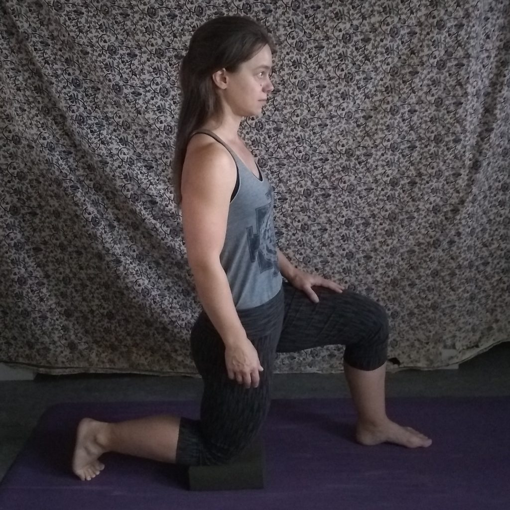
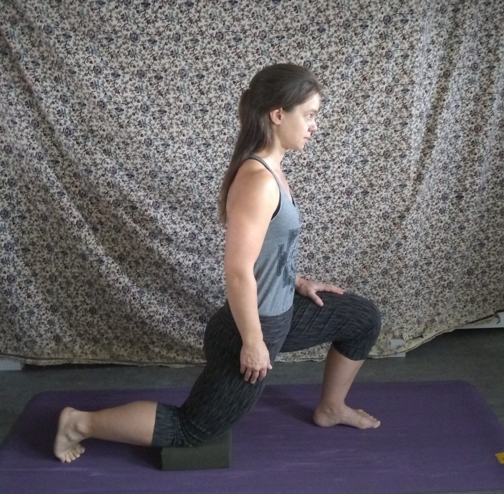
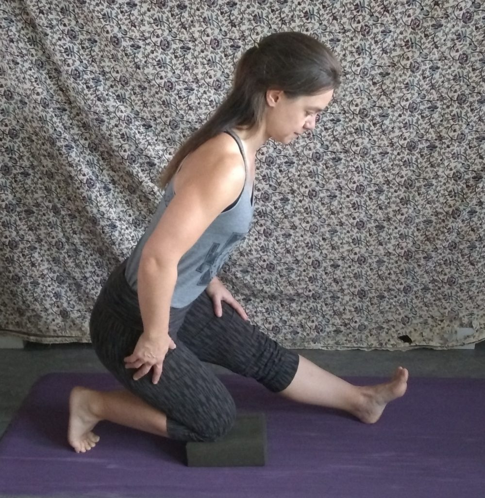
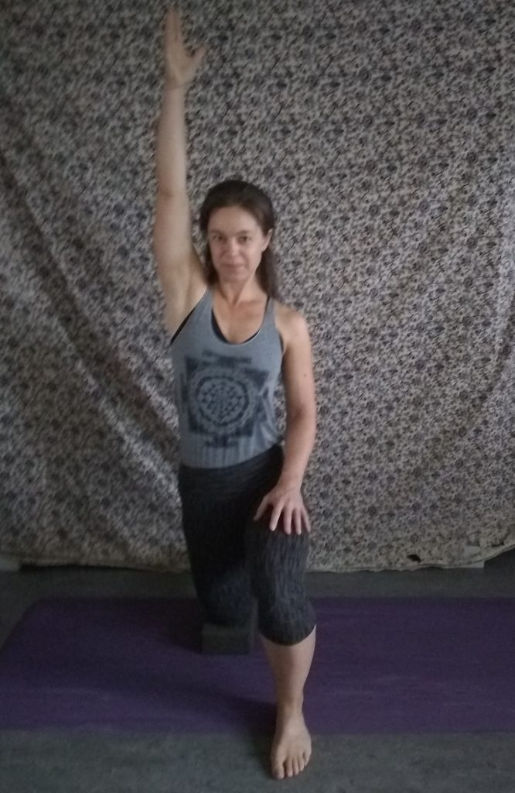
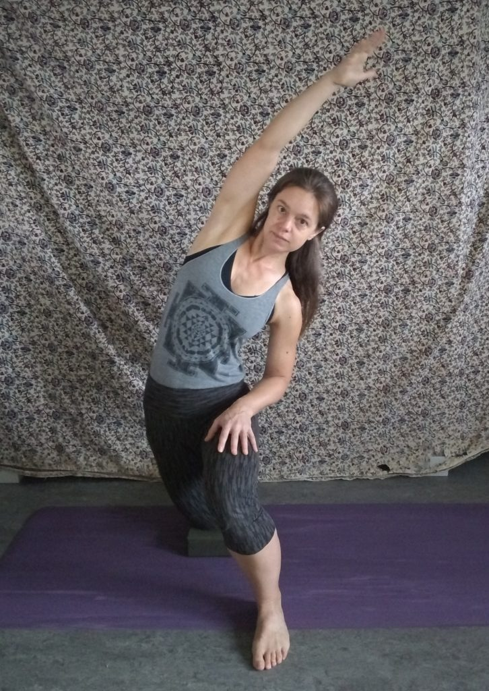
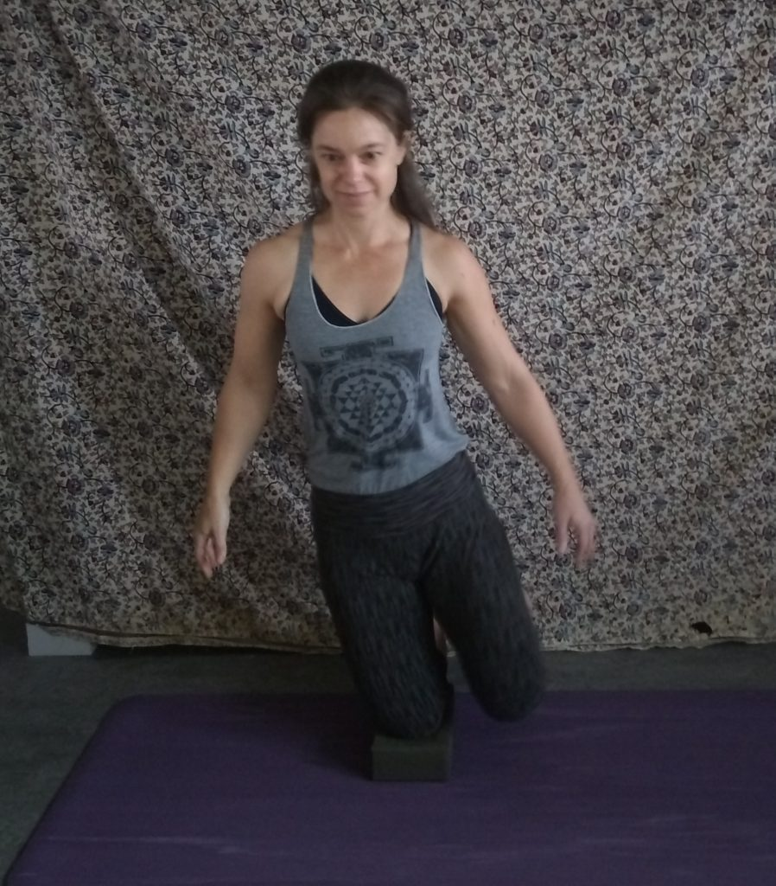

## An Antidote to Prolonged Sitting: Anjaneyasana or Kneeling Lunge

Inevitably, my asana practice and teaching have evolved over time. These days I find I use individual yoga postures as a centre point to move in and out of, and around, a shape, in as many novel ways as possible. Anjaneyasana,or kneeling lunge, is one of my favourite poses to explore in this way. When I researched this pose, there was very little exploration beyond the intended shape of the pose, and yet every commentary recommended this pose as an antidote to prolonged sitting. So this got me thinking...

For most of us, when we sit for any length of time (and most of us do -using the toilet, eating our meals, riding in a car, using a computer ), our hip flexors shorten and ‘grip’, our hip extensors disengage (while leaving the hamstrings feeling ‘tight’), and our psoas contracts to shore up a seated posture whose external scaffolding is now in a weakened state, while also making it harder for the diaphragm to move with the breath. The more time we spend practicing the ‘posture’ of sitting in a chair, the more our entire fascial body begins to shrink wrap to support this shape, even once we are no longer sitting.

If we were to simply attempt to make our body into the intended shape of anjaneyasana, our chair-shaped body might co-operate, but might also compensate by moving unintended joints and muscles. But if we explore the wiggle room around the pose, with movements that lengthen, strengthen and awaken the muscles and tissues most impacted by sitting we might eventually find our way into the pose over time, as the pose was intended.  So, if like me, you’ve logged a few extra hours sitting lately  and might be starting to feel it, why not try this little flow, and notice how you feel?

*Step 1*

From all fours or kneeling, step the right foot forward and tuck a foam block under the back, left, knee. Tuck the back toes under and press them into the floor. Find an upright, neutral pelvis and spine, with right knee over right ankle, left hip over left knee. Rest the hands on the front thigh and shift the right foot to the right to widen the base of the posture if feeling unsteady. Slide the front ribs slightly together and down towards the front of the pelvis, to stack ribs over hips, and prevent an anterior pelvic tilt.

*Step 2*

Root the front heel and gently pull it backwards (it won’t go anywhere- sticky mat!) as the front knee begins to track over the second or third toe. The torso remains upright as the pelvis shifts forward to maintain the front rib/pelvis connection (as opposed to extending the spine in the classic posture and allowing an anterior pelvic tilt), which allows for an ‘honest’ stretch to the left thigh through hip extension. Squeeze the left glute and press the left thigh forward to return to the starting upright lunge position.

*Step* 3

Keep growing the movement forward and back for a minute or so, inviting the breath to settle into its own rhythm and the arms to move freely for balance. Depending on balance and hamstring length, it’s possible to move the left hip towards the left heel (into a ‘typical’ hamstring stretch), while pressing down through the left heel as part of the flowing movement.

*Step* 4

Return to the neutral, upright starting position and reach the left arm up towards the left ear, fingertips towards the ceiling, while the right hand rests on the right thigh. Press down through the left knee and reach up through the left fingertips to feel the left side ribs lengthen away from the left side of the pelvis. Engage the left buttock and gently press the left thigh forward.

*Step* 5

Side bend towards the right while shifting the left hip towards the left. Feel the left side rib slide away from the side of the pelvis as the rib cage begins to fan open on the left side. Return to the upright position, and feel the reverse movement of the side ribs as they slide towards the side of the pelvis. Continue to move in and out of the side bend seven to ten times. Again, invite the breath to settle into the movement.

*Step* 6

This is a novel BALANCE component that is surprisingly tricky. Being close to a wall or having a chair nearby could be helpful. Float arms to the sides for balance, find a gaze point, and begin to shift the weight of the body onto the back knee by lifting and lowering the front foot. Try tapping points on the floor towards the right of the mat. Maybe bend and guide the right knee in to float beside the left knee, and allow the right toes to touch down now and then.The more the ‘standing knee’ can press down into the block, the more stability will gather through the ‘core’ (which includes almost everything from knees to ribs).

Here is a short video that leads you through these movements all together.

https://youtu.be/kL8KLmKubwY

I know my yoga practice has saved me from undue suffering throughout this pandemic. I’ve  had to remain both flexible and strong, on ALL levels, as the qualities of my family-life and work-life continue to change. When I feel stuck, I find I’m often trying to hold onto a part of my life that is STILL changing shape. Finding some wiggle room by exploring the possibilities of a pose is a skill I can take with me off of the mat and into my everyday life. It takes flexibility AND strength to be with what is, when what is is continually changing. Events of this year have only sped up the inevitable. Change happens! Yoga helps!

---

***Kenzie Pattillo** is a householder yogi living in North Vancouver, with her beloved partner and two rapidly growing  tween/teen boys/men(!). She completed her 200 hour YTT at Salt Spring Centre of Yoga waaaaaaaaaaay back in 2002, and her 500 hour YTT through Semperviva Yoga College in 2015. She currently teaches much less than she did pre-pandemic, and is most inspired by her ongoing work with Every Day Counts, a North Shore Hospice initiative. Through this (currently entirely on-line) program she has been given the opportunity to offer folks with life-limiting illnesses as well as their family, friends and caregivers, access to free Restorative and Therapeutic Hatha Yoga classes.*
