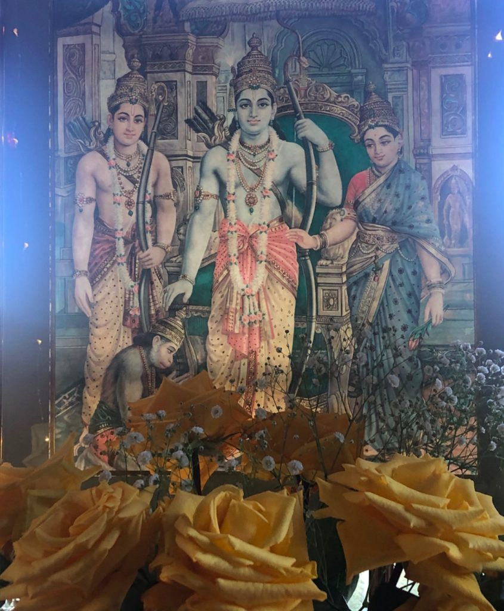

> *There are various paths, like Hinduism, Buddhism, Christianiety, Zen, Taoism, etc. Each path teaches the same thing in different ways. The main aim is to purify the mind.  ~ Baba Hari Dass*

---

Dear friends,

This past month we celebrated a sweet Canadian Thanksgiving at the Centre, and this month we send our warm, loving Thanksgiving wishes to our American friends. We recently also celebrated Navaratri, symbolizing the return of Rama and Sita to Ayodhya, from the story of the Ramayana, reminding us of the return of the light and the forces of goodness, even  in the midst of darkness. Speaking of returning, we are delighted that Anuradha has returned to the Centre, bringing her light to the community.

- 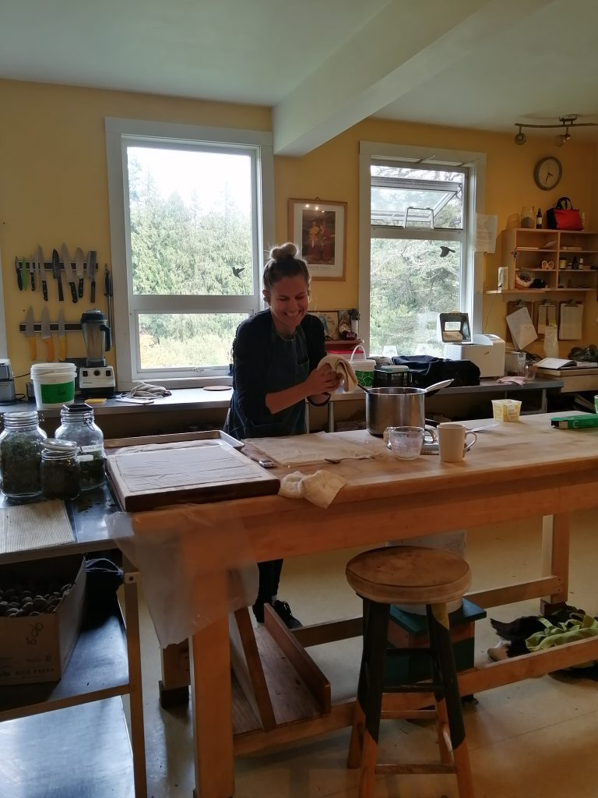

  Kris making pumpkin pies
- 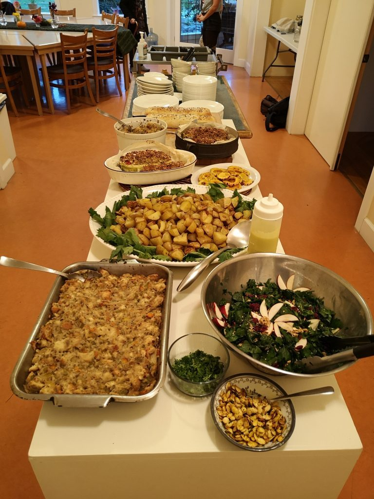

  Thanksgiving dinner - all from the garden

By the time you read this, the American presidential election will have happened while Covid numbers continue to rise in much of the world. Wherever you live, it’s easy to get caught up in life's dramas, forgetting our intention to stay in the present moment rather than worrying about the future. Whatever you are preoccupied with, I encourage you to stop for a moment and take a few deep breaths. There is much to be thankful for.

There are many pointers to come back to the present moment. Noticing that your body keeps breathing and your heart keeps beating, without any effort on your part, can remind us that life itself is a blessing. Look out your window; whether you see snow, rain, wind or sunshine or clouds, shifting your attention to life outside your thoughts can bring you back to the miracle of this moment. The first of November marks the return to standard time - falling back to a quieter, more inward time.

Earlier in October, Mount Madonna Center celebrated its second Annual Re-Union Retreat. One of the gifts of Covid is that with all programs being online, many, many people are able to attend. This retreat was organized and hosted by second generation community members, and was a wonderful gathering of our multigenerational community, continuing to meet (and have fun) in the company of truth seekers.

Here at the Centre, we have a new gazebo which will allow for pujas to continue outdoors on the mound with a bit of protection from rain. The gazebo remained after a fire down the road a year or so ago, and we were invited to make an offer, which we did. Here are some photos of the gazebo being walked onto the land and placed in its new home on the mound.

- 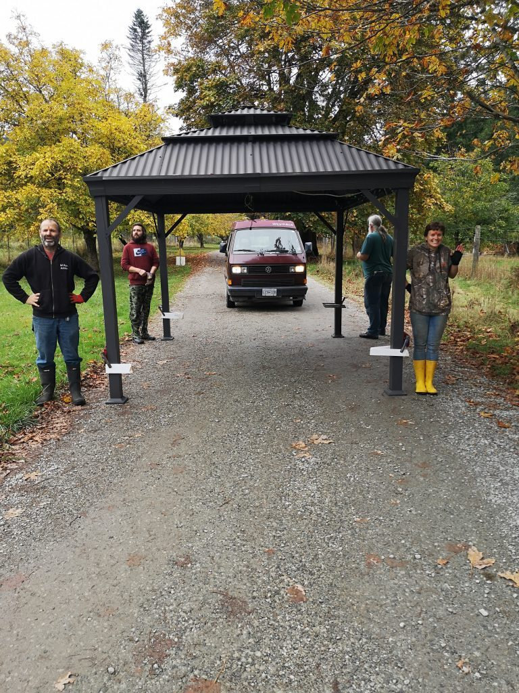

  walking the gazebo down the road to the land  
  Mahavir, Alex, Amanda, Suneel
- 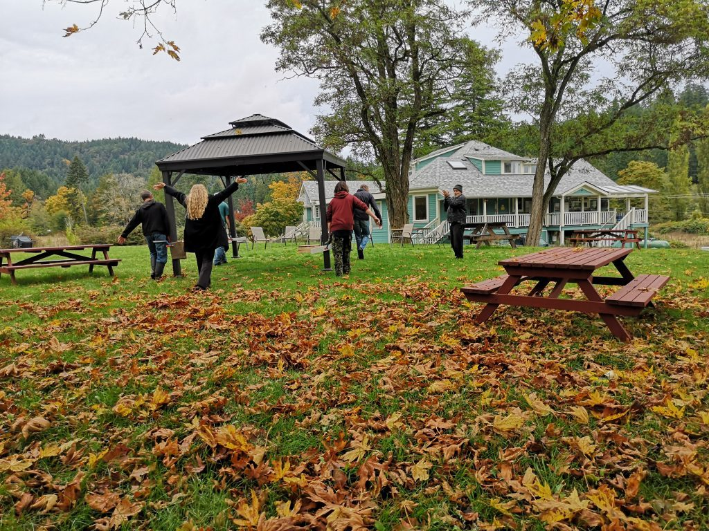

  Anuradha excited about the new Gazebo. Jai Babaji!
- 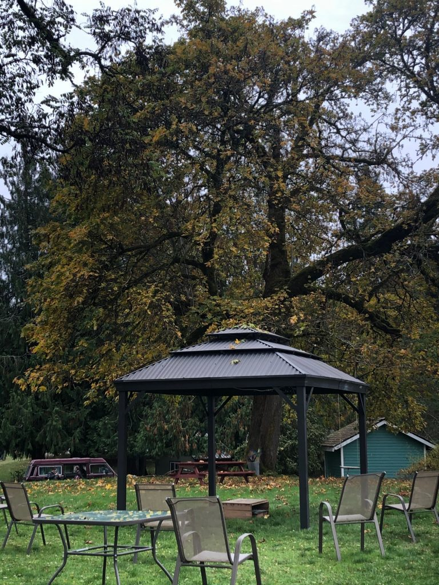

  the gazebo looking like it's always been there
- 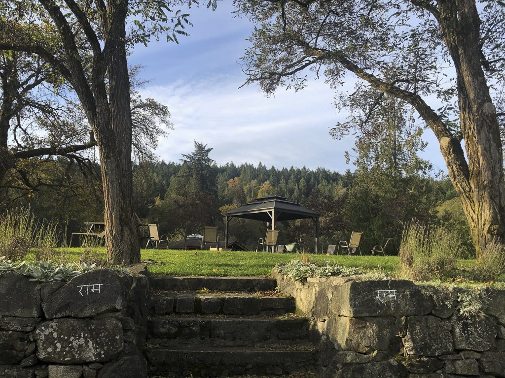

  The new gazebo in its place on the mound

## Farm Update

Dan is back east in Ontario, but Amanda graciously stepped up to share some updates. Thanks to Marion for all the photos.

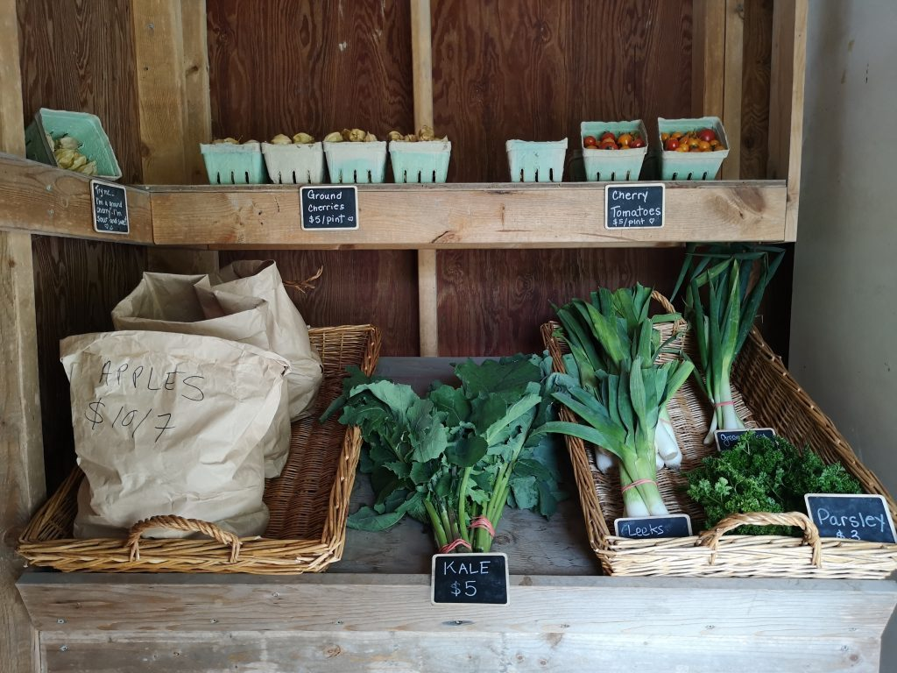

*Our lovely little farm stand*

- 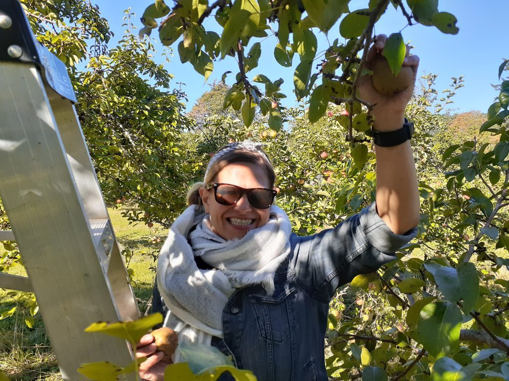

  Kris harvesting pears
- 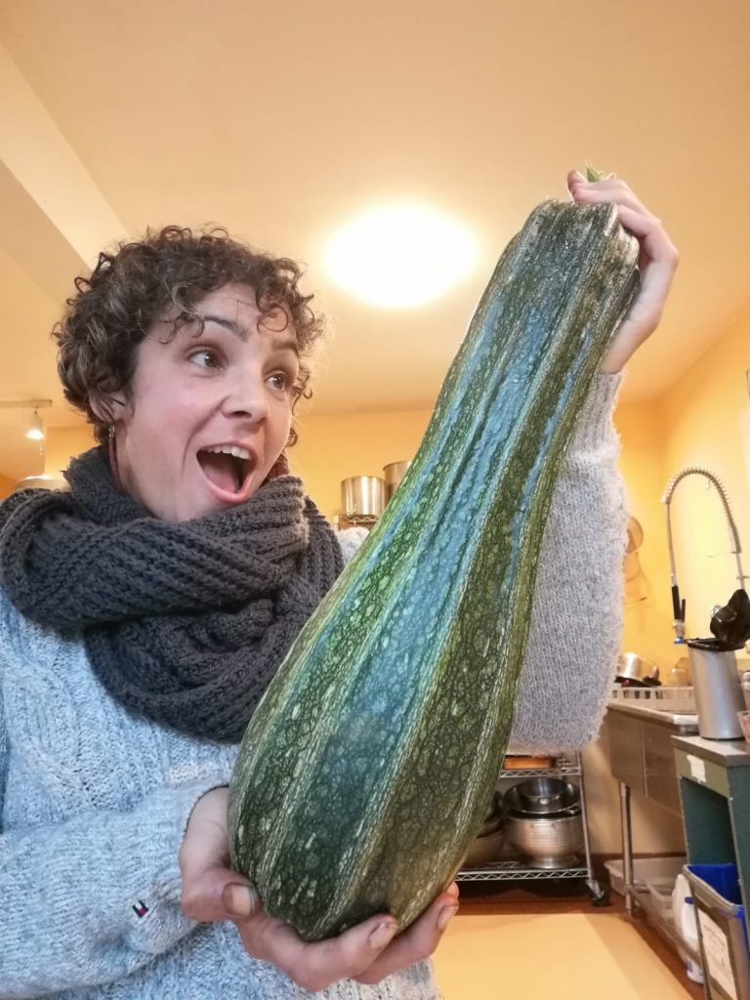

  Marion and the giant zucchini
- 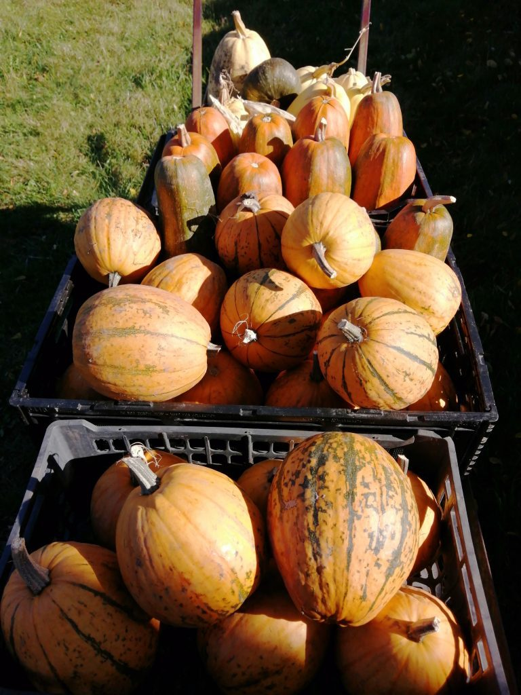

  beautiful squash

> It has been a pleasure to join the Salt Spring Centre of Yoga's farm team this fall.
>
> The past few weeks we have harvested many apples! We took a trip to make some apple juice and came back with an additional 71 bottles to stock the freezer. There are still apples and pears to harvest on the trees, though we have stored most of the apples and pears in the cooler to last our winter months and have been getting creative making fruit leather, applesauce and apple pies.
>
> With the abundance of basil planted as a companion plant in our greenhouses, it has served its purpose of repelling unwanted insects off our tomatoes. It was time to harvest all of them since they are very cold sensitive, and we made a delicious vegan pesto for our pasta dishes, which also included fresh walnuts harvested by former farm coordinator Milo and the kids from the SSC School. It was fun to climb the trees, shake the walnuts onto the tarps and have everyone collect them. The walnuts were put into buckets and were stomped by the children to husk the outer shell.
>
> We've also harvested the ground cherries, also known as Cape Gooseberries (because they were first cultivated in the Cape of Good Hope in South Africa). They are usually grown in warm regions like South Africa, South America, Central America, India and China, but because of the temperate climate on SSI, we are able to grow a variety of vegetables such as these that are not normally grown in other parts of Canada. We experimented making a nice chutney with them, which turned out delicious.
>
> On one of the community days, we also harvested Goumi Berries, a small red tart and sweet fruit native to China and Japan. We made some delicious Goumi Berry Jelly and have lots left over for pies or muffins! It has been fun learning more about non-traditional fruits and vegetables grown on the property.
>
> Our farmstand has been steady as we put out new produce for the community. The pumpkins were a big hit! They make wonderful pumpkin pies, and Alex, the Centre Cook, has made some wonderful pumpkin curries and pumpkin spice lattes with them. We have also been selling kale, leeks, green onions, ground cherries and cherry tomatoes alongside our abundance of apples and pears.
>
> The frost has finally arrived and Mother Nature has begun her transition into the winter months. The remainder of the squash and pumpkins have been harvested and are curing for the next two weeks before we bring them indoors. Kale and leeks are hardy enough to stay in the ground through the winter months. Meanwhile, there are still beets to be harvested and more salad greens have been planted in the greenhouse that will overwinter and provide some early spring salads for the community. The irrigation system has come out and the fields are soon to be prepped for overwintering.
>
> It’s a time for reflection as the cold winds blow through the fields. The trees turn from bright colours of red to shades of brown to bare trees in some areas. Some reluctance sets in waking up early; it’s still dark out. Walking on the cold frost under the feet, water frozen in some areas, watching the breath being exhaled. There’s a stillness in the air at that time. I am enjoying our “tea break” where we come inside and warm up our hands and feet. It’s time to embrace the cold and what Mother Nature has to offer us in this time… letting go and embracing the new, all while enjoying the warmth of our hot apple cider mixed with spices :)
>
> Amanda

## Meet us online

Online programs and classes  will continue for the foreseeable future. Please check the [**Centre’s website**](https://saltspringcentre.com) for information about classes and programs. Coming up soon:

- **[Patanjali’s Yogasutra: A Guided Tour with Yogeshwar](https://saltspringcentre.com/patanjalis-yogasutra-a-guided-tour/)** - October 31, November 1, 7, & 8
- **[Yoga as Medicine with Jyoti](https://saltspringcentre.com/yoga-as-medicine-online-workshop-series/)** (Natasha) - November 5, 12, 19, & 26
- **[Home Yoga Retreat](https://saltspringcentre.com/programs-retreats/home-yoga-retreat/)** - November 13-15

These classes are a way to connect, to spend time with like-minded people, to learn, and at the same time, to know that you are contributing to the well-being of the centre.

Another way to contribute is to [**make a donation**](https://saltspringcentre.com/donate/).

Satsang, Bhagavad Gita, and Yogasutra classes continue. More information and links can be found on the [**Centre’s website**](https://saltspringcentre.com/programs-retreats/public-offerings/). [**Mount Madonna’s classes**](http://mountmadonna.org/) are also ongoing.

#### Here is some news from the Victoria satsang.

If you are in Victoria on Sunday, November 22, you are invited to join the Victoria  satsang - in person (!)  from 3-5 pm at Fierce Studio, 5-770 Bay Street (with sutra study at 1:30)

A note from Kathryn:

*Gathering with fellow truth-seekers to practice various yoga techniques together in the tradition of Classical Ashtanga Yoga. Please bring your own cushion and whatever props you need to be comfortable. By donation.*

*We will practice physical distancing and an RSVP is required as participant numbers are limited by space size. Names and phone numbers will be collected for contact tracing. Hand sanitizer will be provided. Bring your own mask.*

*Yoga provides so many benefits and being with like-minded people is deeply nourishing. We look forward to being together. RSVP to yogakat8@yahoo.ca*

## Dharma Sara AGM

On the 28th of this November, [**Dharma Sara Satsang Society**](https://saltspringcentre.com/dharma-sara-satsang-society/) will hold its Annual General Meeting, the first ever online. If you haven’t yet [**become a member**](https://saltspringcentre.com/form/?fid=7) - or renewed your membership, it’s not too late. We welcome you to become involved, to find out what's happening at the Centre and learn about plans as we move toward 2021.

## For your reading pleasure….

Mahavir visited Dan Jason (of Salt Spring Seeds) this fall, and came away with a wonderful story told by Dan about his long connection with the Centre garden and the Centre School, with this community, and especially about his lifelong love of growing food, and the magic of seeds. It’s an inspiring story.  I hope you enjoy [**This Whole Vast Family; Dan Jason in conversation with Mahavir**](https://saltspringcentre.com/this-whole-vast-family/).

Do you find yourself sitting for hours in front of a computer? I find it all too easy to fall into this pattern, even though I know bodies need to move in order to stay healthy and balanced. Kenzie Pattillo’s asana article provides the inspiration to get up from your chair and onto your mat. I invite you to read [**An Antidote to Prolonged Sitting: Anjaneyasana, or Kneeling Lunge Flow.**](https://saltspringcentre.com/asana-anjaneyasana-or-kneeling-lunge/)

*The eternal, unchanging Self is not affected by anything in the world. In this way, nothing we do matters. At the same time, our actions determine the nature of our experience. In this way, everything we do matters.  ~ Baba Hari Dass*

May all beings be well and happy.

Love,

Sharada
