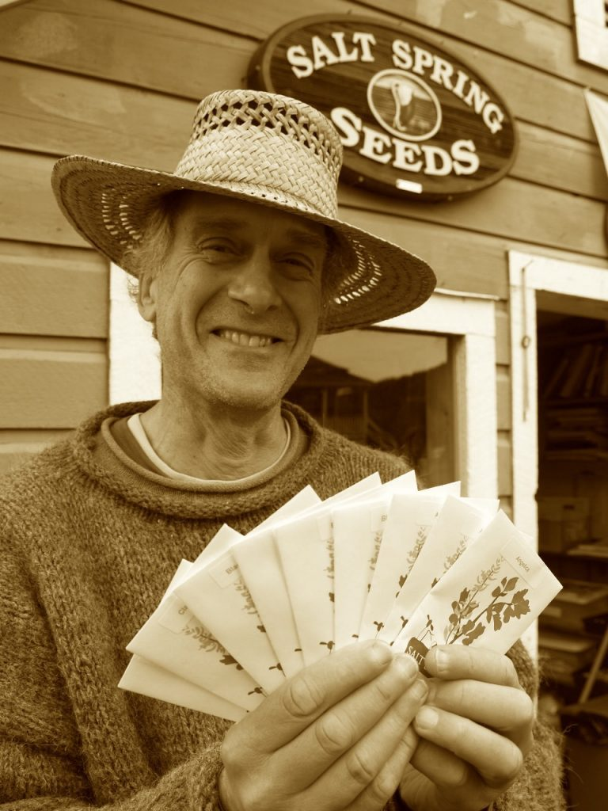
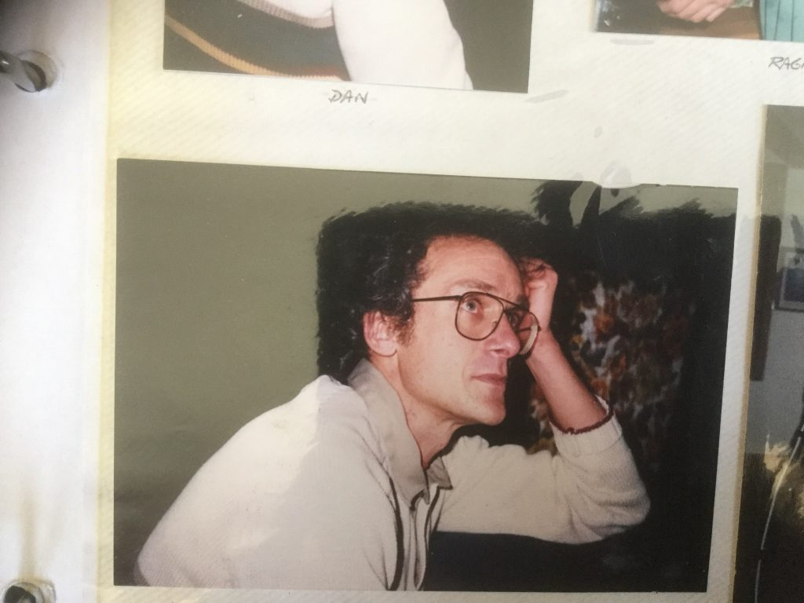
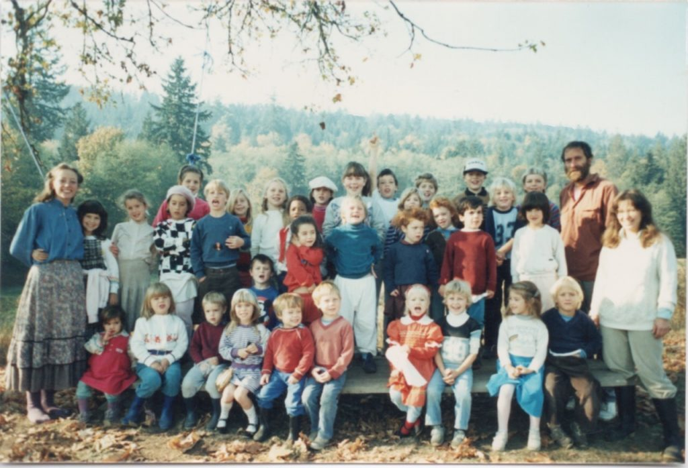
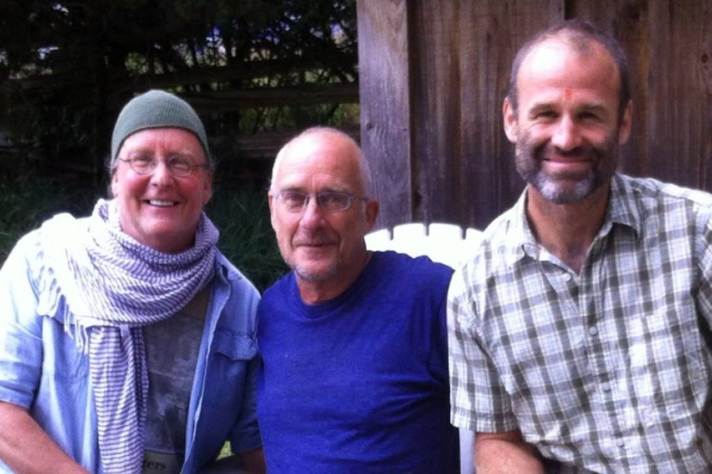

## Dan Jason in conversation with Mahavir

*When I arrived at the centre, I was blessed to be able to serve with Dan Jason.  He was among my first few mentors in the life of the center, and a true living example of the power of selfless service. There are stories of Babaji teaching the importance of karma yoga. and in need of an example, writing, “Dan Jason is a true karma yogi”.*

*I recently drummed up the opportunity to sit down with Dan in the midst of the wildfire smoke, pandemic and political tension of mid-2020.  Despite the conditions, we had a great chat.*

*- Mahavir*

## In my blood and in my bones

When I was growing up and then going to University in Montreal, you couldn't find a more cosmopolitan, exciting, or interesting city. There were some parts of the city, like around Mount Royal Park, where you could go any day and there would be people of different nationalities playing soccer and playing chess; there were kids and lots of others - everyone imaginable. So why would I want to leave that? Well….

Part of it was just the normal thing of a kid growing up and wanting to explore, part of it was I had my brother Mike on the coast who was living right on the beaches of Tofino and Uclulet, but part of it was I never felt that I was a city boy and everything was just too confined. Right from the get-go I loved being outdoors. I was just so attracted to the little semi-wild places on the outskirts of the city where we lived for a while, so attracted to the trees and the bushes and berries and to just being in the woods. So all those things prompted me to come out west.

I went through a very similar upbringing to many Jewish kids in Montreal. In my upbringing there were some of the trappings of the Jewish culture and a little bit of the Jewish religion. We didn't really have love or excitement about it, but we did it because that was the thing we did, and then after my bar mitzvah we just went on our merry way. My parent’s hopes and aspirations were pretty similar to other Jewish parents, but I really went against their whole grain.

As I said, I had this inner desire to be connected to the earth and to the land and possibly to grow food, even back then. I pestered my parents for quite a while to dig up our lawn and to plant veggies. Even with no models it just seemed such a natural thing to do. So it was in my blood and in my bones right from the beginning, and that was when I was still pretty young. We had a kitchen porch on the side and under that I made a little garden bed and planted potatoes and carrots. One day my mom's sister Molly came to the house when I was harvesting some of the carrots and my mom said, “Molly try one of these carrots.” Molly was shocked because she had always believed that carrots grew on trees. So you have my mom saying “no Molly!  Danny grew these! Carrots grow in the ground!”

 I did really well in high school and then went to McGill and ended up studying anthropology and psychology. Yet I had a deeper feeling that just being inside the walls of the University like that was so confining - so claustrophobic - that it was just like being in high school looking out the windows wishing I were outside.

Intellectually I was pretty aware. I read a lot of books and was really into reading philosophy, and I was exposed to this great counter culture stuff with amazing poets like Irving Layton and Leonard Cohen. Some of the most amazing musicians came to Montreal because it was a big city. For illuminating other possibilities, it was the artistic people and the deep thinkers that drew me - and just around then Bob Dylan was coming on and I was pretty smitten with him.

It was really unbelievable that I made it through university because I hardly ever went. My life looked like waking up at 3 o'clock in the afternoon after having been up most of the night going to jazz clubs and poetry readings; perhaps I'd make a class at three o'clock and then that would be it for school time, but somehow I managed to get my degree. I do not know how.

My family lived near a Jewish cemetery and when I was going to university, that's how I made money - working along with Italian labourers under French management in a Jewish cemetery. They called me “le juif" ("the Jew"), because it was so weird for them to have a Jewish person working there helping them, and I was working for like a dollar fifteen an hour or something. But that was my preferred thing to do. It was there, you could say, that my “amazing planting mania” started because I wasn't really digging graves, but was planting a lot of flowers. The French foreman was my first guru, probably because he taught me how to plant really well.  Little did I know that even though I might have planted tens of thousands of flowers there, that I would be spending the rest of my life in the same motion. Now it's probably millions of things that these poor hands have put into the soil over the years, and they're still going.

So I made it through university, and didn't do amazingly well, that's for sure. Then it was Expo 67 and that was when I came across the country.

## A freedom that you just don't see these days

In that period there was what Leonard Cohen would call “a crack.” There was a big crack then and the light got in.  It was a breaking through the cultural restraints that were unconsciously imposed on us, and the normal way of being. All of a sudden people were blowing their minds with LSD or whatever: not going to school and learning in the real world instead of sitting in a classroom, hearing music that went beyond anything that had come before, or standing up to protest ridiculous wars.

In the midst of that, after graduating, I hitchhiked across the country and soon I was living right on the beaches near Tofino and Ucluelet. Now, during this time, quite a number of parents didn't want their kids going to regular school or at least wanted to give them a break. One day two guys, Dave Manning and Bob Barker, showed up on the beach with a whole bunch of kids. Their school was called The Barker Free School and they invited me to come and be a teacher there, in Aldergrove. From there, during a brief period of a few years, Dave and I ended up getting involved in leading, teaching at and organizing about six or seven different alternative schools. I got to live all over BC in various communities and communes and had a very exciting life. It was a very special time when the world I was in had a freedom that just you don't see these days.

Dave had a love and knowledge of plants and so while we were in the Slocan Valley with the “Floating Free School”, we ended up writing a book on edible and medicinal wild plants. “[**Some Useful Wild Plants**](https://harbourpublishing.com/products/9781550177916?variant=32819479117923)” became a best-selling book. It went through seven editions in a period of five years or so. Fifty years ago this book was first published and just last year we republished it. The publishers made just a few edits and it became a best seller again. That was the book that catapulted me into the world of publishing, and more plants, in the years that followed in the early 70s.

## I got the digs

Eventually I was living on Hornby Island when I got a letter from somebody saying that I had this kid in Vancouver who was now five years old and she was asking about her dad.  So I went into Vancouver to check it out. And that was my daughter Zama. What I saw quickly was I had to get her and her mum out of the city. Salt Spring had an alternative school and after I got to know the teacher I thought it would be a great place for Zama.

In my early beginnings on Salt Spring, my gardens kept getting bigger and bigger. Eventually I was living with my daughter on Blackburn Road across from where the Salt Spring Centre is now. In my circles, yoga was around a lot. I was reading a lot of books like, Ram Dass’ “Be Here Now” and Yogananda’s amazing book and some by other spiritual teachers, but I wasn't looking for a guru. And yet, I took a lot of spiritual information from those books of the time.

Before there was satsang activity on the land, I was the activity. Nobody was there and I spent a lot of time on the property. The house was like an old museum, a very big old building with moose and elk heads inside and just sitting derelict. A few years later it was 1981 and there started to be some activity there. I remember Madhav. I didn't know his name back then, but there was this guy playing the flute across the road on the Blackburn property and I was also playing flute, and I started playing flute back and forth with him across the valley sometimes, and it was pretty awesome. I ended up going there and we connected. Naturally enough, I just wanted to see what was going on and so, you know, I got the digs. It’s hard to remember exactly what happened in sequence, but after a while I ended up offering to be their gardener.

My first meeting with Babaji was a pretty poignant one. I'd heard about Babaji quite a bit, but I hadn't met him. It might have been a retreat and I had heard that he was having satsang, with questions and answers, and there was some kirtan - I guess it was a Sunday - and I went in. Everybody was chanting and there was this white clad Babaji. I didn't know any of the routines and rituals or any of that stuff. I'd walked in and the satsang room was full. So I walked in to the back corner and then all kinds of things started going on. The most important thing that was that I looked at Baba Hari Dass and Baba Hari Dass looked at me and we looked at each other and it was an amazing look. It felt like he was just really looking at me and I was really looking at him, an amazing meeting without anything being expressed. I was reading him, he was reading me and that it was all good.

I was there for the first workday breaking the soil for the beginning of the garden. The very top part of the garden where the garden ended, where all of the terraces are now, was all just blackberries - unbelievable blackberries - and Babaji just sort of said, "Come on. Let's go. Let's go do this.” And then the way everybody normally did, they all followed him; it was really amazing to see his white robe being covered with blackberry juice. I remember that purple stain vividly. There was no wasting time or words with Babaji, no "How are we going to do this?” In his characteristic way he just kind of said (though not in words) "Here we go. Let's do this."

It wasn't very long before I was actually working in the garden there, and as it turned out, that first stint there was seven years. We had a long-range vision of bringing all the garden area under production; it took a chunk at a time but eventually it got there.

*Salt Spring Centre School mid-80's (Dan is the tall man on the right)*

I was also there for the beginning of the school. I was one of the teachers along with Sharada and Usha. At the very beginning the school was in the big house. After a while it went into the basement. A lot of those kids I still know and some of them now have their own kids. I taught the older kids, Usha taught the younger kids and Sharada was in there too. It was an amazing school unlike any other. As you know, I was involved with a lot of other schools, but Usha was brilliant: she knows everything! She can tell you exactly when each kid came and everything about them; she has a brilliant memory. I mostly taught arithmetic, spelling, reading and writing, but we also had meetings every day, with incredible processing of the energetics and the drama between the kids. I was with the school for three years and that is a whole part of me that's kept on going: I'm hoping in a few weeks to have school kids from Salt Spring Elementary come to Ruckle Park to pick beans, and it still goes on.

## I was just a Karma Yoga person...still am

I started getting to know all the satsang people, made a lot of nice connections, and I came to understand more as time went on what everybody was about and what they were looking for from Baba Hari Dass. He was a unique, special being but it was never my thought to have him as my guru. I did, however, go and have my meetings with him like everybody else, but I suspect they were a bit different. Mostly he asked me about my relationships: how my partner was and about how my children were doing and he would ask me if the garden was going okay and I’d say “yes.” I got a really strong, good feeling from Babaji, and I thought he appreciated what I was doing. I thought he appreciated that I didn't bug him with questions that he had already answered a million times and that I just came and did the work and that I wasn't worried about how other people saw me.

Everything with the centre went well, and my idea, without really separating it out in my mind, was to grow as much food as I could for the centre as well as to grow as many seed as I could... and it all worked really well.

There have been so many highlights in my time at the centre. Some of the special things were all the games and all the plays and group activities. My kids were in the Ramayana - Naomi was a monkey and I think Leif was Lakshman. I remember a marriage in the backfield and the times at the lake with Babaji. I loved all the retreats and all the craziness. People at the Centre were very good at theatre and there were so many shows that were really funny and very well done.

As time went on I could call myself a karma yogi in a way that kind of summed it up for myself. It seems Babaji thought I was a good karma yogi too, and that was just because I was doing what I was meant to do which was to connect to the land and turn people on to the plants and the seeds and the quality of good food. The question of enlightenment meant to me that we choose from a much deeper place to live in this very narrowly confined and defined reality that we all share, and that we're already enlightened in a sense. We've chosen to be here, so you do what you’re meant to do. You’ve got a job to do; you do the job and then you go back. That part of you knows that you're here because you're supposed to be here and that's good enough. You don’t have to spend your whole life trying to figure it out. You just accept it.

All in all this adventure is an amazing experience for me that I never could have had any other way. There are very few surviving intentional communities, and Baba Hari Dass and the Salt Spring Centre and the whole satsang is a pretty special one, and I could always see that. It's been really amazing to be part of a community that kept pretty true to its vision and to its love of its guru. It's something that most people don't get to experience. When you have this whole vast family of people who are all connected in a special way and who have done and continue to do a lot of things together it's very special.

So now I’ve found another place nearby that's on a farm up in the Cranberry Valley and yet my connection with the centre is still ongoing. We signed a contract for our seed sanctuary to grow plants in the front field at the centre, people are coming to help me from the centre, I’m going there giving advice, and the connection is deep and lasting and it'll go on forever.

## While Rome burns

As for where we’re at now, almost all the books I've written raise the question, “What's going to happen if we can't have those trucks on the ferries to bring us our food or if we can't do this or can't do that?” and I feel like we're in it now. It's like Rome, and Nero fiddling while Rome burns. I just saw on TV that people from California are saying to Trump, “Well, we're all devastated by climate change and we're hoping that you can work with us so that the federal and state authorities can come together because we are all in this together,” and there's Trump smiling and saying “It's going to get cooler.” That was his answer. He might as well have been playing the fiddle.

There definitely is a “how” to keeping it real for me. What I'm doing is keeping these seeds and sending them out everywhere and if catastrophes hit all over the place, some people are going to have these seeds somewhere. I'm in service to the seeds. It’s a no brainer for me. And it's not all seriousness because the seeds have so much beauty and joy and so much oomph that I'm sustained by them every day. They give me so much all the time and I'm just a recipient of their generosity and their perseverance and their brightness.

In a way, we’re very lucky to have somebody like Trump who so clearly shows us our shadow side. Maybe we can finally say "enough of this”, and work in the opposite direction to create peace and loving kindness. It's possible. Probably the most important thing is to transcend fear, in the light of the karma yoga principle, and you just gotta do and be what you gotta do and be, and do it without fear. Meet people without fear.

I resonate with Babaji’s teaching of karma yoga because in my life I'm both attached and not attached. I’m just doing what I‘m doing. I just keep on following my path just like somebody with a musical talent keeps on trying to get better at playing the cello or making up songs or singing in an opera. I keep on growing out these seeds and saving them like I did today. I just finished putting away about eight different varieties of seeds a few minutes ago and every one of them was a gift to me in the first place. They represent the love of other people for seeds and plants and the importance of what they can do for us. I've had relationships with those people so it's all part of community.

*Will, Dan and Mahavir*

## Who's cultivating whom?

It's all still evolving. It's hard to believe I’m still learning more and more about plants all the time and it’s so much not on the mental level. It's an intimacy that enables you to understand that there's an energy there. These plants have such isness in them that you could question “who's cultivating whom?” Is it the people cultivating the plants or are the plants cultivating the humans, you know?

Knowing what my calling was and is has helped a lot, but above and beyond that I think I have a deep spiritual connection to my larger being, a deep trust in the forces of life, and I have faith baby! I have faith that while I may not have a guru, I definitely have angels and spiritual guides that have been there for me all through my life. I might not be able to name them, but they’ve been there and they're still there. Every day for me is a miracle, and I feel energy from a deeper source.

**Connect with Dan and purchase his seeds and books through his website, [www.saltspringseeds.com](http://www.saltspringseeds.com).**
