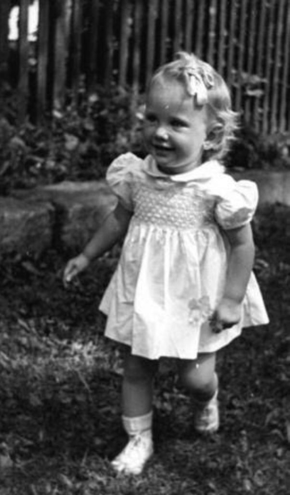
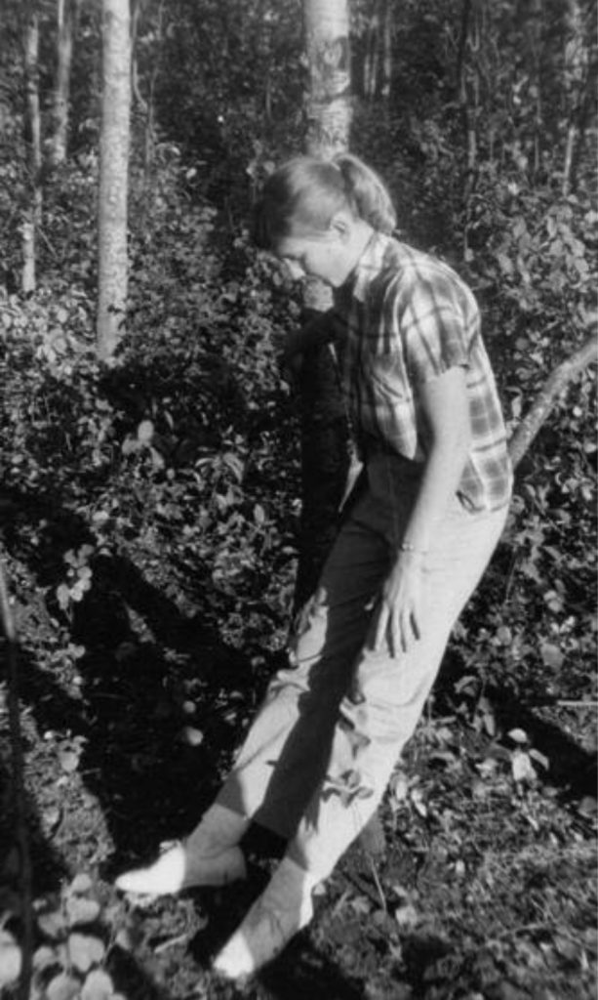
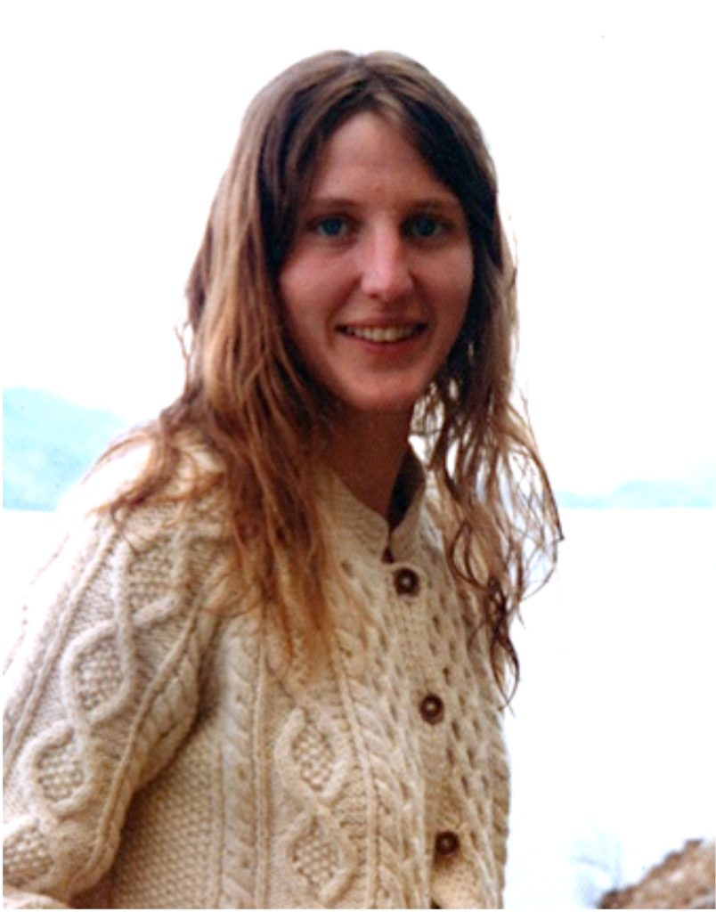
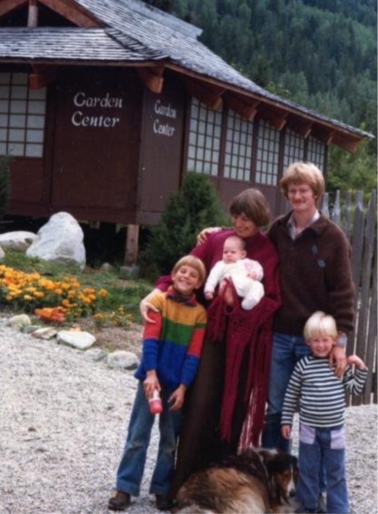
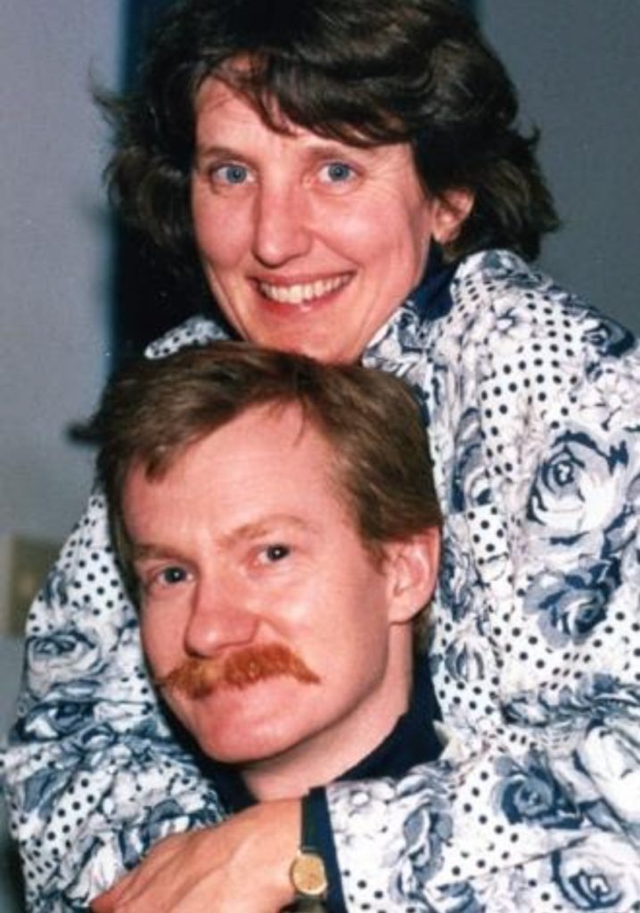
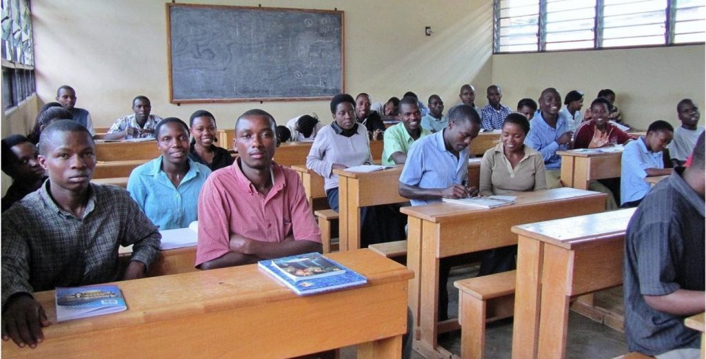
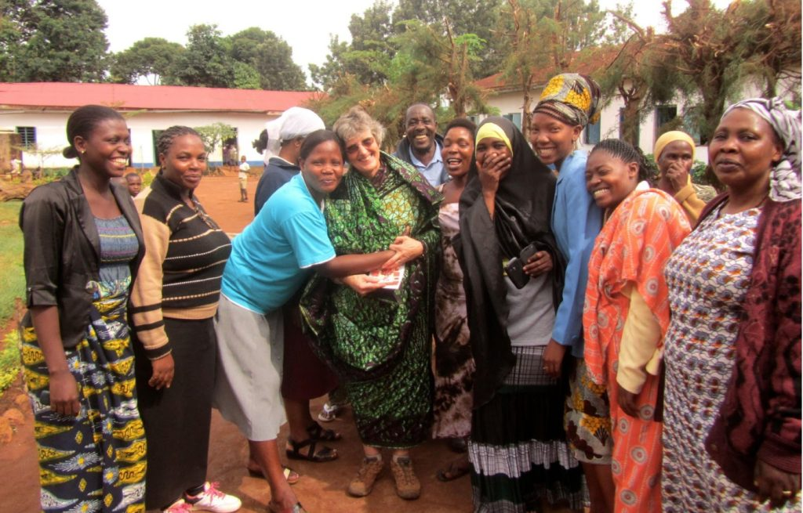
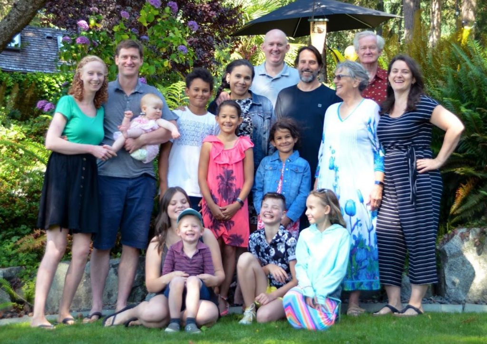

As I begin to write this I have the strong impression that I am not sure where one lifetime starts and another ends. We draw the line with a particular mind/body complex but I can see influence from previous bodies – be it genetic, family history, déjà vu type – but mostly just a sense of continuation.

*c. 1946, Toe-stubbing age*

My earliest memory concerning this lifetime was when I was about 3 years old. I used to run around outside all the time without shoes, frequently stubbing my toes. This didn’t bother me. One morning I stubbed my toe on my way to a friend’s house. I knocked and was invited up the couple of back hall stairs to the kitchen. The dad saw my toe and made a big fuss saying he would clean it up and get a band-aid. I didn’t think there needed to be any such fuss. It was fine the way it was with me. But he insisted on taking me on his knee and gently washing it etc. As I sat there I thought, “He needs to do this because it is what he needs to do. I don’t need it but I’ll allow him to do what he needs.” Looking back on this memory I see it is the first time I remember watching my mind.

*c. 1957, Camper and Lent services*

Growing up in the 40’s and 50’s my daily life was like most others though I took the teachings of the Bible especially the New Testament quite seriously – at least more seriously than those around me. I remember one Lent when I was in about grade 8, there were lunchtime talks at the cathedral downtown. Our lunch break was an hour and a half so I had time to take the bus, catch the talk and get back to school. My mother would often meet me there but I don’t think she would have gone if I hadn’t. Nobody else went except occasionally the bishop’s daughter. In our tradition confirmation meant taking responsibility for our spiritual lives, and happened at about age 14. There was prep of course – none of which I remember, but I do remember the anointing with oil in the shape of the cross on my forehead and the laying on of hands by the Bishop. He was a very holy man. When I looked at him I saw him surrounded in a white glow. When he placed his hands on my head I felt a comfort, a glow of love in my heart, an assurance that I was safe in the hands of God.

From about age 10 to 14 I attended a Baptist horse riding camp outside Rocky Mountain House. The people who ran the camp and all the counsellors were loving, kind, generous people. They did encourage everyone to ask Jesus to be saved. I asked but nothing special happened. I was sorely disappointed.

The real challenges began at the beginning of university. I chafed at being told that only Christians would go to heaven. Nowadays this seems absurd but in those days before Vatican II and ecumenism this tended to be the rule.

I spent a few years in limbo before going on a trip to Europe with a ticket to countries far beyond. There I visited a person I had met earlier who had won a Rhodes Scholarship. Through that connection I met and married another Rhodes scholar, Keir Pearson. Most of the group we socialized with were an atheist or at the very least agnostic. Most were foreign scholars, Rhodes Scholars, Fulbright Scholars or the like. There were a few from Great Britain but not many. I followed along with a quasi agnostic view not really having an idea what fitted – rejecting the rigidity of the Christian church but not accepting the atheistic philosophy either. As far as my conventional education was concerned the three years spent as the wife of an Oxford don and PhD. Oxon fellow were the best education I received. The quality of vocabulary and syntax expected when backing up ideas with concrete reasons left me mute for the first 6 months until I realized their ideas were not better than mine necessarily; they only expressed themselves superbly.

Keir received an invitation of assistant professor at U of A, Edmonton of all places, the city of most of my childhood. There we had our son, Sean, known to many in the satsang as Ashish, in 1970. I had an easy pregnancy and completely natural birth which was uncommon at the time. However, this experience elevated me into another dimension! Held up by God and hormones I floated in bliss for many weeks.

*Move to Nelson, 1972*

However, Keir’s disdain of my chosen field of psychology, his disdain of anything spiritual, but mainly his working 7 days a week, which had been difficult before the birth of Sean – when I negotiated Wednesday evening, Saturday evening and Sunday afternoon as non-work time – became untenable after having Sean. I have a samskara of wanting to matter to my partner. So, I was unhappy. I had everything my parents had taught me was enough, status, good breadwinner, stable employment for my husband, and I was unhappy. This wasn’t “IT.” On my way out of that relationship I ended up at my cousin's flat where I listened in a curtain-drawn living room on a bright sunny day to Ram Dass’s tape of “Be Here Now.” I was transported! It was like finding a translation of the Biblical scriptures. For the first time much of what the Bible was talking about made sense to me. Back at my home in Edmonton, I became interested in yoga and ended up in classes taught by students of Subramunya. I met others and agreed to move to Nelson with a few others to buy a piece of land and live closer to nature. I gave away clothes in 1972 that cost more than what I spend now. I left everything except my son and my car. I look back now and marvel. I left status, comfort, and security and walked into the unknown.

The land didn’t work out, but even better, I met and married Prashant. We bought the Taghum Hill Nursery just outside Nelson. Eben and Naomi were born when we lived there, adding a baby nursery. It was an idyllic life in a beautiful place. But the tiny house had only one bedroom – with three children in it. The nursery only brought enough income during the summer so after 8 years we moved to the coast.

*1978*

During the years at the nursery I met and studied with Subramunya. I was skeptical as he seemed egotistical to me, though I could also sense truth. Though poor, I purchased his Master Course that consisted of 12 hour long tapes. The instruction was to listen to the first half hour side one day then meditate, day 2 the other side and on for 3 days and on the 7th day to listen to the whole hour. It took me 3 months to get through the whole 12.

I went two times to the US to a retreat with Subramunya. In one of his talks he said something like ‘none of you will be able to meditate’ though as I write this it seems too harsh. The message to me was I couldn’t. I thought, this is a very powerful person so I have to counter with all my power. In my head I yelled “NO.” How can I try to describe it? The word was so loud, so powerful, so from beyond my mind I was astounded. Subramunya looked around the room that must have had 75 or 100 people in it and finally settled on looking at me. I had this great tickle in my throat and started to stifle a cough. I didn’t want to disturb anyone with my coughing and thought I might have to leave the room. I focused all my concentration on that tickle and was able to subdue it. Later I realized he had tested me with that tickle.

Another time Subramunya said anyone who wanted to further their studies with him had to become a Hindu. In addition, becoming a Hindu because one didn’t like the church of their upbringing was not acceptable. I did not feel I was a Hindu so I had to move on from being his student. I went back to the Anglican church as that was my upbringing. In conversation with the Dean in Nelson I asked my old question “What happens to babies born that never heard about Jesus and people like Mahatma Gandhi? He said they do not go to heaven. That was not my path. I went in fear of another door closing to the Catholic priest who was a saintly man. I told him my whole story of studying with Subramunya and he listened attentively. When I finished he sat quietly for some minutes before saying something like I wish I prayed as deeply as you do. He was very busy and also ill so he sent me to a nun, Sister Donna, who ran a Prayer House for retreats in Nelson. For years she was my spiritual advisor. I had several week-long lone silent retreats at the prayer house. During one of these I had a profound spiritual experience.

*Iqaluit years, 85-89*

In 1981 we moved away. I was very involved with the spiritual teachings, especially the lives of saints such as St. John of the Cross, Meister Eckhart, Saint Theresa of Avila, St. Francis of Assisi and many more. I devoured any of their writings and biographies. Between 1981 and 1985 we were a year and a half in Nanaimo where we welcomed Ian to our family, then to UBC where both Prashant and myself got teacher certification. Big problem – massive cutbacks to the schools and no jobs in BC. We went north to Iqaluit for 4 years. Another life altering experience! The church was vibrant in that community. The priest had to go to other communities so I even gave a sermon one Sunday! From Iqaluit we moved to Wakefield Quebec, just out of Ottawa There the priests and congregation were less accepting of layperson participation. It turned out that the bishop had happened to be present when I gave the sermon and asked me to help with lay participation. I was too new to be accepted in this town where the pews had been donated by grandparents.

In 1993, just after my 50th birthday we moved to UBC again so I could do a Master’s degree in Counselling Psychology. Yet another lifetime!

In January 1994, Ashish (our oldest child) was going out with Uma and told me he was going to Sri Ram Ashram with her. I knew about many cults and was somewhat concerned. However, when Uma came to Vancouver she brought me “Fire Without Fuel.” I read the first story and realized his holiness.

I met and became a student of Babaji at the July retreat that year. I began studying the Sutras with Divakar and others one afternoon a week and these weekly studies continued until I went to Rwanda in 2011. As well, I was upheld by the Vancouver weekly Satsang, the retreats at SSC and MMC.

I went to Rwanda in 2011 after I retired, to teach student teachers methodology and English. I lived well in a duplex with running water, flush toilet and electricity. The kitchen was somewhat lacking, having only a hot plate, period. I never minded but I did miss a fridge. There were numerous other volunteers from several NGO’s who met regularly. There is not an easy or short way to describe my experiences there. Another life altering perspective.

*One class in Rwanda, 2011*

Prashant met me at the end of my term and we travelled in East Africa, India and South East Asia for 3 months. Within a year we had accepted a placement in Tanzania. This one lasted for a year and a half. Prashant was helping with several projects, then was teaching at a vocational school nearby. With two other volunteers I was helping teachers develop more inclusive and participatory methodology in Bukoba, Tanzania. As a job, this was more satisfying than my work in Rwanda – all to do with me and not the country. I just felt more competent.

We returned to Canada , sold our water- access house on the Sunshine Coast and moved to Maple Bay near Duncan. We feel so blessed to be connected by the Satsang in Canada and the US through Zoom.

*This is all of us – 4 children, 2 spouses, 8 grandchildren! July 31, 2020.*

**JAI BABAJI**  
Anandi Heather Best
