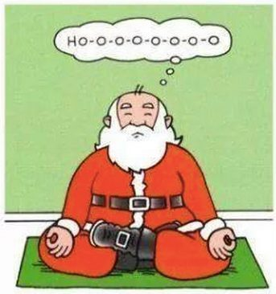

The ideas of Santa Claus are not so far fetched as some grown-ups or non-believers may assume. There are many legends of Santa Claus from countries all over the world and origin stories that can be researched on Google. Many contest that Santa Claus or Saint Nicholas was at some point either ordained a saint or managed to develop saintly qualities; and this is where our explanation begins.

Santa Claus, in any story, represents good will and kindness.  He asks us to be kind to each other, he provides endless selfless service, knows if you have been good or ‘bad’, and has been known to show up when you need some guidance -especially around the holidays. (Well, at least he does in the movies.) 😉

How can a man achieve these seemingly magical qualities of always being kind, endless work to spread joy and giving, and knowing your past, present and future? Well, yoga philosophy (and Patanjali’s Yoga Sutras) again provides us with the answers.

Remember, in our well-known tradition, Santa IS a saint, and according to yoga philosophy to develop saintly qualities one can follow many paths but they all lead to what I’m categorizing in three (3) methods; Self study, developing positive qualities, and selfless service.

## **Self Study**

To become a saint, Santa Claus would have spent much of his time in deep contemplation (meditation) and Self study. Through this practice, Santa was first able to free himself from all the things that make a person happy or sad. By doing this, he can be happy regardless if something good is happening or something difficult. These are referred to as our attachments, both painful and pleasurable that come from participating in the world. The Sutras allude that if you can reach this state of non-attachment you become a joyful, childlike, happy person, or an enlightened being. Still very much participating in the world but with no association of the pain. Now this doesn’t mean you lose your passion or just nature, quite the opposite: Look at Santa Claus, he exudes joy and a child like happiness, passion for good will and peace on earth.

When you attain such a level of enlightenment, the ancient text tells us that superhuman powers can be bestowed upon you. Through deep concentration (the Sutras refer to as Samyama) one can focus on a person and see their past, present and future. It would be assumed then since Santa Claus knows if we have been good or ‘bad’ that he has reached this level of deep meditation and developed this magical yogic power.

## **Developing Positive Qualities**

Santa wants us to be good to one another. He teaches us this as he knows the freedom, joy and love that comes from being true and kind to ourselves and others.

In Self study we played with the idea of Santa Claus reaching the final and last Limb of the 8 Limbs of yoga. Understanding his joyful, giving presence, and seeming magical powers, we can only assume he reached the final Limbs of Yoga Practice.

**Here we talk about the very first Limb of yoga philosophy, the Yamas, or restraints:**

The Yamas help us in developing positive qualities on a much deeper level than just please and thank you and lending a helping hand. The five (5) restraints can start us on the journey of Self study and along the way, change how we really think and the future decisions we make.

- **Non-violence** (refraining from harm to others and, even more common, harm to ourselves): How do our thoughts and actions make us feel and others feel?
- **Truthfulness** (right speech and truthful communication): How do we communicate our truth in a kind and necessary way?
- **Non-Stealing** (What doesn’t belong to you): Understanding our relationship with people’s time, and what we ask of them. In your relationship to people, animals and nature, what might you take?
- **Moderation** (excessive nature leads to depletion): Our desires and expectations lead us to overindulge, working too much and deplete our life energy force. How can we find contentment in what is? Can we give someone the opportunity to help us?
- **Non-Hoarding** (our attachments bring us bondage and pain): Much of our pain and suffering comes from our attachment to an outcome WE wanted or an association that possessing something has some type of prestige or power and can ultimately give us joy. However, as those thoughts fade, or the possession leaves, breaks or becomes old, the suffering can accompany. Are there things you need to let go?

Time to reflect: Have you been good or ‘bad’ this year?

Now I purposely have been putting quotation marks around the word bad for this whole blog because we are not ‘bad’ we are on a journey to be our best self! The key is “developing” positive qualities; now Santa seems to have mastered it but as mere humans we all have some work to do.

## **Selfless Service**

Giving to others without asking for anything in return is another path to enlightenment. We know that no one does this like Santa Claus. He spends all year in deep contemplation learning what we need and want for Christmas and then manifests this very thing and takes the time to deliver it not asking for a single thing in return. Some of us leave him some cookies and snacks to thank him for his efforts.

Giving to others from the heart for the pure joy of it and letting someone know you appreciate them, love them or just see there is a need that you can selflessly offer your help to rectify feels so great! So, I guess there is a return on the investment for most of us. I would think that someone like Santa Claus, just like the non-attachment to pain, also has not-attachment to pleasure. He doesn’t do it for the joy felt from giving, though for sure he feels it.

How does Santa Claus get around to all the houses in one night? Well I have a theory that does not include magical reindeer. Another yogic power attained by many Saints is the ability to be several places at once. When you break the tie of the world in meditation, there is no space and time. My belief is that Santa visits all our homes right from the comfort of his mediation cushion!

Regardless, Santa does inspire us to give to others. Our love and time, in selfless acts happen more over the Christmas season than any other.

So there you have it. Santa Claus, a true inspiration and true yogi.

Wishing you a wonderful holiday season and inspiration to follow in Santa’s footsteps for a happy, joyful life.

---

**Natasha Jyoti Samson** is a member of our Satsang and teaches Ayurveda and Yoga in collaboration with the Centre’s programs. She has a deep love for the philosophy and phycology of these sister sciences, which is evident when witnessing her teach.
