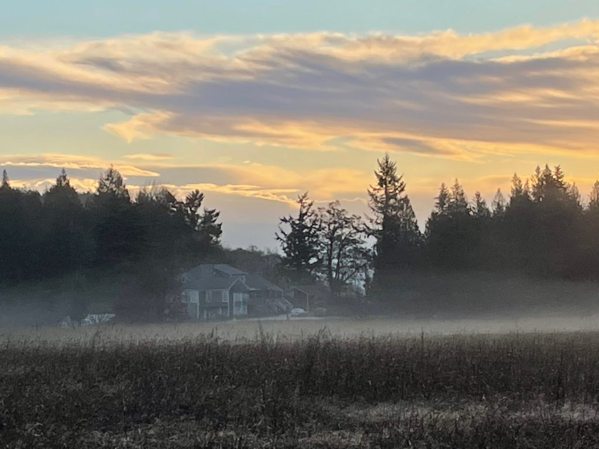

> ***Peace in the mind, love and compassion in the heart bring the scattered world into one reality.***
>
> ***~ Baba Hari Dass***

Dear friends,

I hope you are all well, and that you’re able to celebrate the seasonal holidays, Christmas, Chanukah, Kwanza, or anything else you celebrate, even if you can’t get together with your family in person. Life at the Centre remains quiet although there’s a lot going on in the background and in online satsangs and classes.

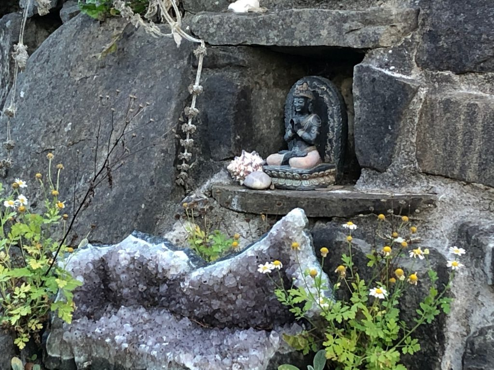

- 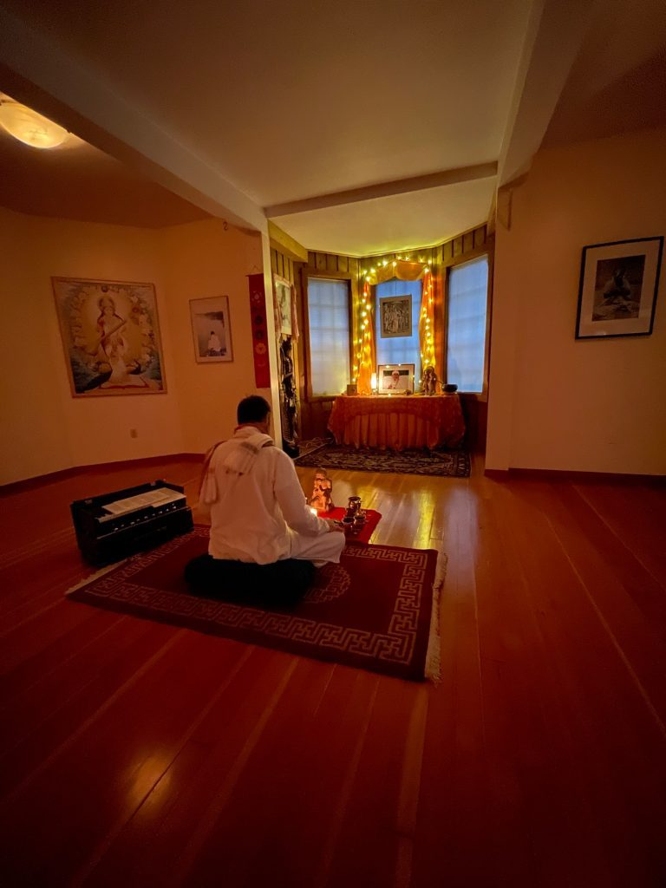

  Arati in the satsang room
- 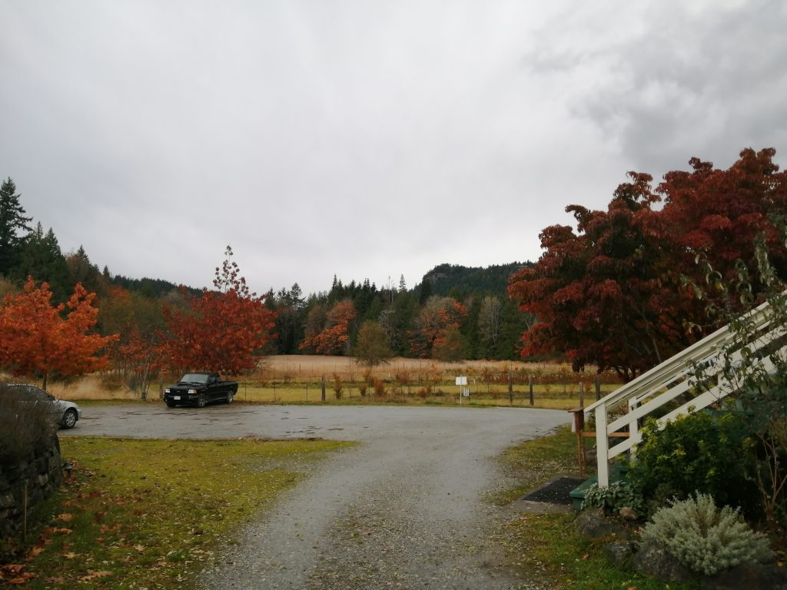

  Fall colours
- 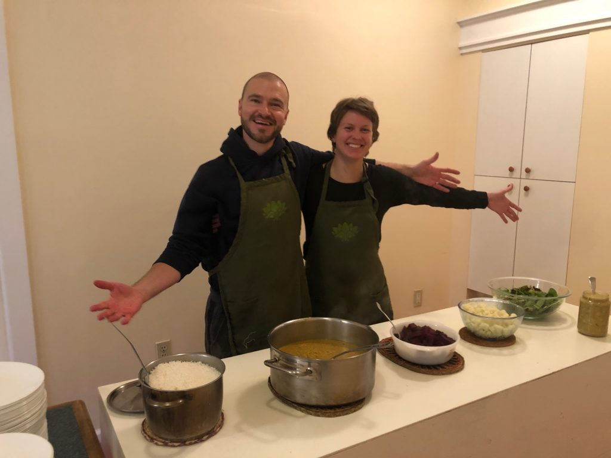

  Santosh and Amanda serving dinner
- 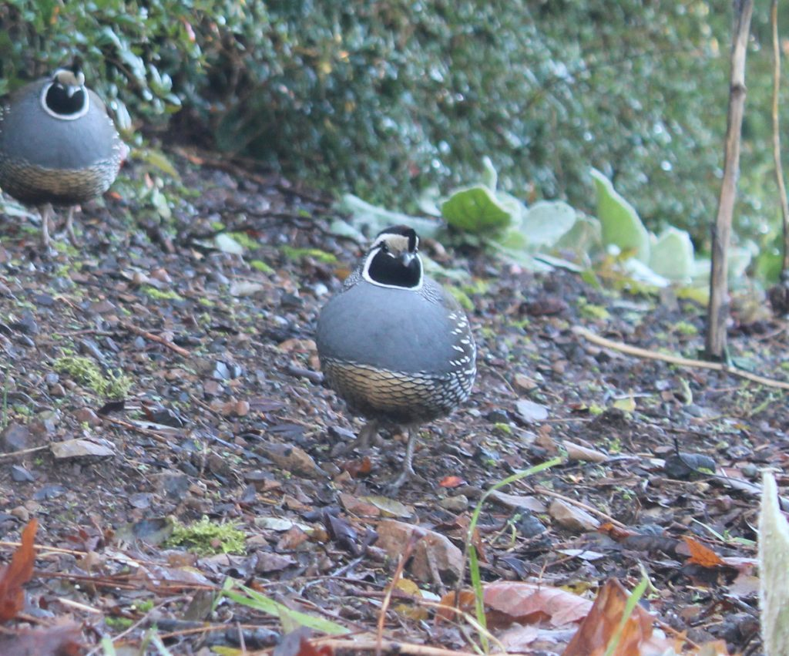

  Quail visiting
- 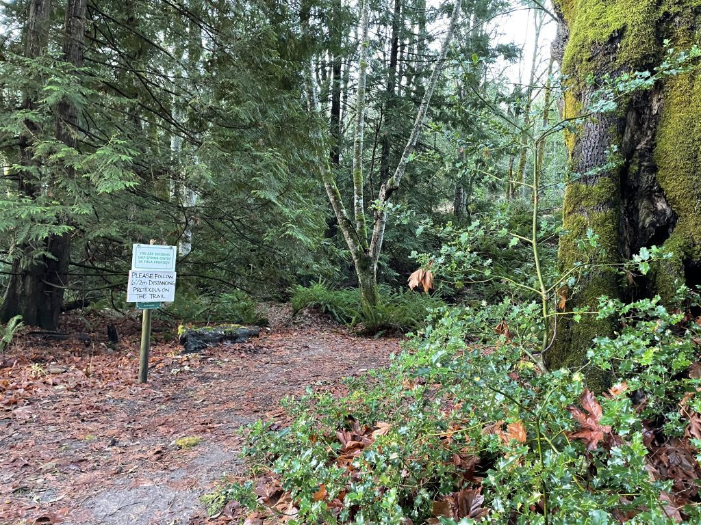
- 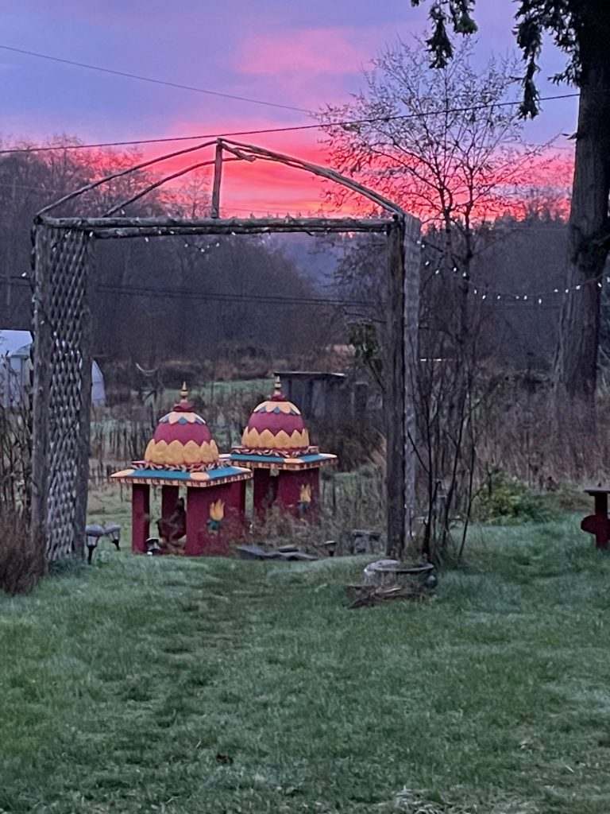

  sunrise at the temples
- 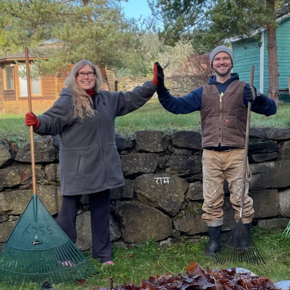

  Anuradha & Santosh
- 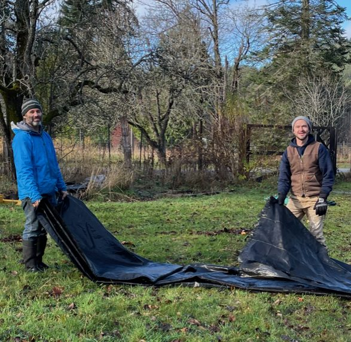

  Mahavir & Santosh
- 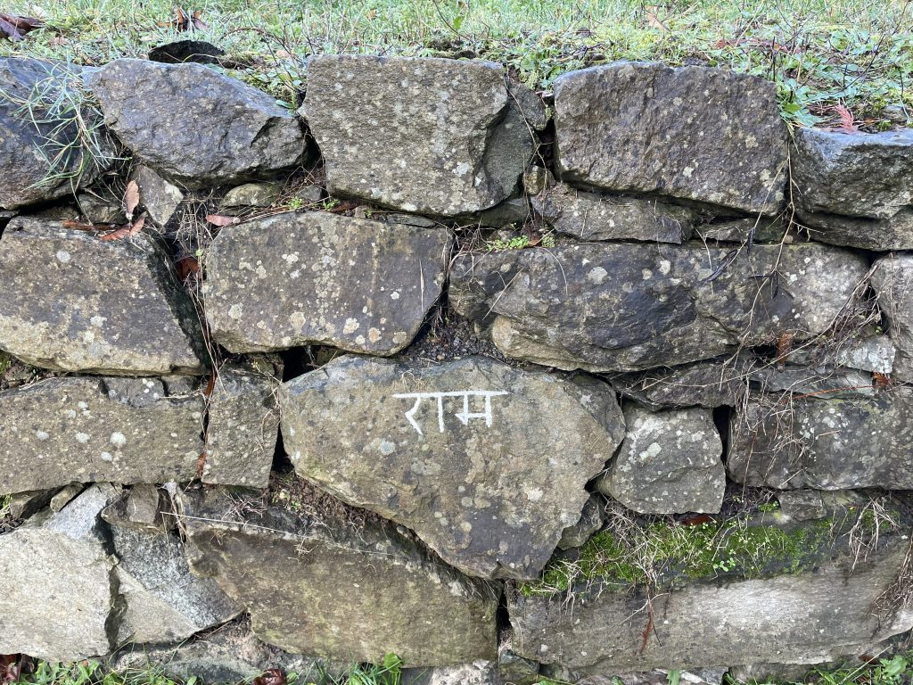

  Rama on the rock wall

## News from the AGM

Dharma Sara Satsamg Society’s Annual General Meeting was held - online - on November 28. The usual AGM date is in the spring, but this year was different in every respect. The reports at the recent AGM covered the past year and a half as well as elections to the board of directors. Two people have decided to step down from the board this year: Sean Crabtree who served as president of the society, and Yogeshwar Humphrey.  Last summer Meera Bennett retired from her board position, at which time Adrienne Cousins was appointed to the board. Fortunately, all three of the retiring members of the board remain committed to supporting Dharma Sara in other roles. We are so very grateful to them for their dedicated service and hard work during this challenging time.

The reports of every department as well as plans for 2021 and beyond were very inspiring. To give you a sense of the tone of the presentations and discussions during the day, I’d like to share with you the society’s core values the board identified: **profound practice**; **right relationships**; **selfless service**. I’m happy to introduce you to the new board: Chetna Boyd (president), Willow Lampard (treasurer), Natasha Jyoti Samson, Adrienne Cousins, Anila Lacroix and Kalpana Tabachnick, and also Christine MacDonald who, though not an elected board member, continues to serve as scribe.

- 

  Chetna Boyd
- 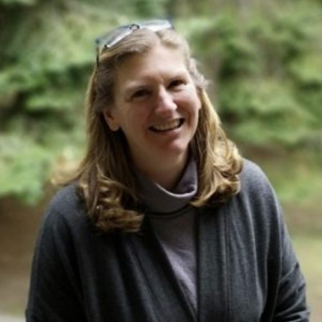

  Willow Lampard
- 

  Natasha Jyoti Samson
- 

  Adrienne Cousins
- 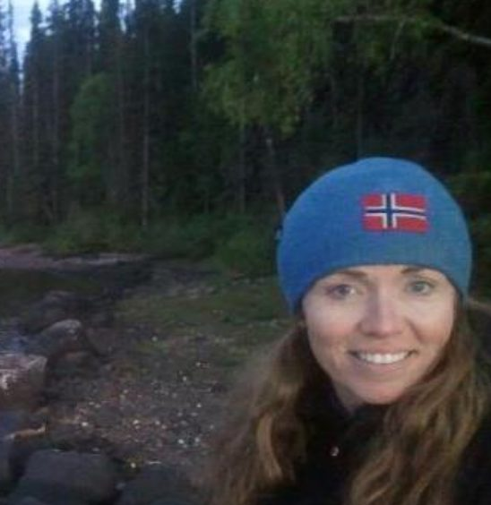

  Anila Lacroix
- 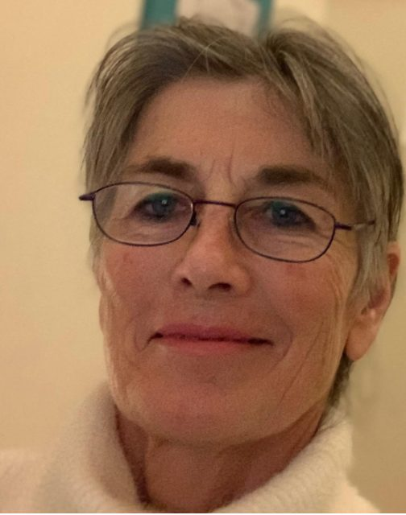

  Kalpana Tabachnick
- 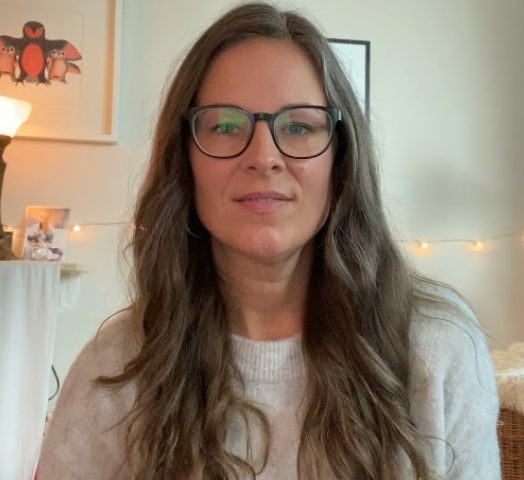

  Christine MacDonald

## Programs and Satsang

Our increasingly popular online Home Yoga Retreats will continue in the new year. New online programs in 2021 will also be posted in the coming weeks. One series to look forward to is Yoga and Nonviolent  Communication.

### Meet us at Satsang

As always, satsang from the Centre continues, but with a new time: **Sunday at 1:30 pm** to make it easier for people who live further east to attend. Vancouver satsang is also on Sundays, from 7:30 - 9:00, the first hour being dedicated to yoga sutra study, followed by kirtan and prayers. The Victoria satsang is on hold for now, hopefully to resume in the spring; stay tuned. Don’t forget there are several other opportunities to join study groups: yoga sutra study on Saturdays at  2:00, Bhagavad Gita on Tuesdays at 7:30 pm. Also check out Mount Madonna’s many online free offerings. Get details and links to all of these on our **[Public Offerings](https://saltspringcentre.com/programs-retreats/public-offerings/)** page.

### BIJA Yoga Retreat

Drishti Point has been holding workshops at the Centre for years. This year you can join Farah online for [BIJA: Planting Seeds for the New Year](https://saltspringcentre.com/bija-planting-seeds-for-the-new-year/), **Dec. 27 2020- Jan. 1 2021**. 30% of all revenue will be donated to the Salt Spring Centre of Yoga. Drop-ins welcome. [**Register online**](https://form.jotform.com/202655406870254).

*Everything we do, say, and think plants a seed deep in our consciousness. This Retreat is intended for yogis who wish to stay rooted in their practices over the holidays and plant seeds of well-being for ourselves, others, and the Earth.*

## Fundraising Update

### ***To date donations are $46,000 towards the goal of $300,000.***

Our contributions support the Centre to continue on the land, and online. Thanking You with love and gratitude!!

- Financial **donations** are gratefully accepted [**here**](https://saltspringcentre.com/donate/)
- To organize a **fundraising event**, please click this [**link**](https://forms.gle/JESLoU7kKbjpT2pf9) for details
- **Spread the word** about the Centre and this fundraising effort to your friends and family by sharing this newsletter.

## A look back at the 2020 farm season

On the ground, Marion and Amanda have been busy putting the garden to bed, completing the last of the harvest and processing apples and other produce. Although Dan headed back to Ontario last month, he wrote a final farm report for the year.

- 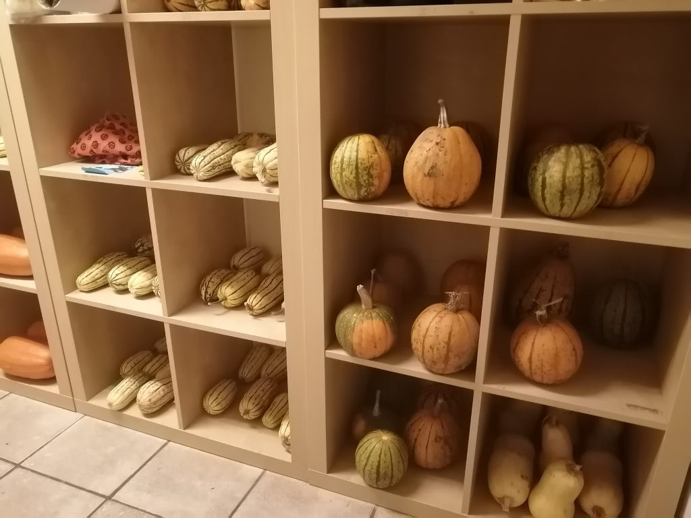
- 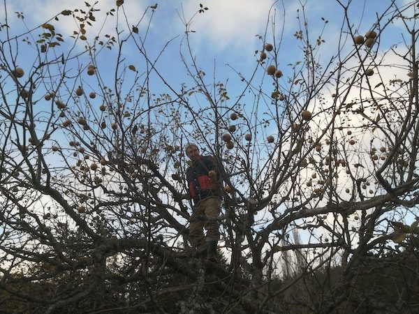

  *Harvesting the last of the apples*
- 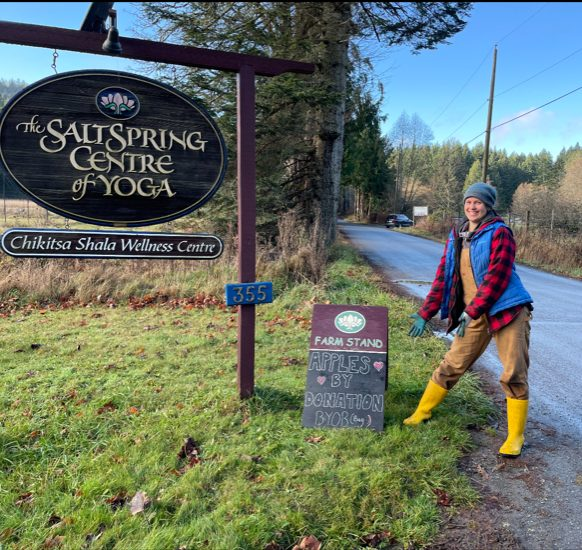

  *Amanda with the sign advertising apples by donation at the farm stand*

> The 2020 farm season was unlike any other in recent memory. The optimism and enthusiasm to start the season gave way to uncertainty shortly thereafter when the pandemic became entrenched in our everyday lives. Yet despite working with a much smaller team than initially anticipated, the Salt Spring Centre farm still had a fairly positive season overall.
>
> Altogether, the farm team harvested at least 6,500 pounds of fruits and vegetables (or just under 3,000 kilograms for all the metric system sticklers), of which about 4,500 pounds was delivered to the kitchen over the course of the season. The overall value of the food produced by the farm team in 2020 was about $20,000, with the bulk of that amount (roughly $18,200) representing the estimated equivalent of how much the Centre kitchen would have spent if they purchased the produce elsewhere.
>
> Meanwhile, the farm revenues as of the end of October totalled $1,700, most of which resulted from the sales of apples and pears to the Salt Spring Wild cidery and bulk orders from island residents, as well as seedling sales in the springtime to many generous members of our Satsang and the island community who were looking to both grow their own gardens and support the Centre at the same time.
>
> It was a stellar year for fruit production at the Centre thanks to a combination of consistently sunny and mild weather right when most of the fruit trees began flowering and some diligent pruning of the orchard and the blueberry bushes by Lotte, Marion, Adam and myself early in the season. This resulted in more than 2,500 pounds of apples and pears at last count, and more than 100 pounds each of plums, blueberries and blackberries, which the Centre will continue to consume throughout the winter fresh and as jams, sauces and compotes.
>
> Some of the other big crop harvests throughout the season included salad greens (nearly 150 pounds), carrots (nearly 150 pounds), winter squash and pumpkins (more than 700 pounds), cucumbers (roughly 400 pounds), tomatoes (almost 500 pounds), peas (more than 100 pounds) and leeks (about 200 bunches/200 pounds). In addition, the farm was also able to yield around 55 pounds of walnuts, 50 pounds of kiwis and 30 pounds of sweet potatoes!
>
> The flower field was also more productive than it has been in recent years. The farm team devoted a great deal more time and compost to the flower field this season, and although we weren’t able to get on top of the weeds as much as we would have liked during the summer months, the extra efforts paid off with a consistent yield of sweet peas, rudbeckias, snapdragons, cosmos and dahlias. In the end, as much as 95% of the flowers that were used at the Centre for ceremonies and in the indoor spaces came from our own flower field and from wildflowers growing on the property that we deliberately left untilled in order to foster more wild and ecologically beneficial grounds for all the fauna on the property.
>
> Although the farm has essentially been shut down for the season, Marion continues to sell some apples, pears and pumpkins at the farm stand and to the Centre school. And in the meantime, the community should be fairly well supplied with food well into the new year, as there are still considerable stockpiles of winter squash, apples and pears in the cooler, as well as an abundance of leeks to harvest from the field, and some kale, greens and fava beans in the field that will become active again and ready to pick next spring.

## Celebrating Sudha

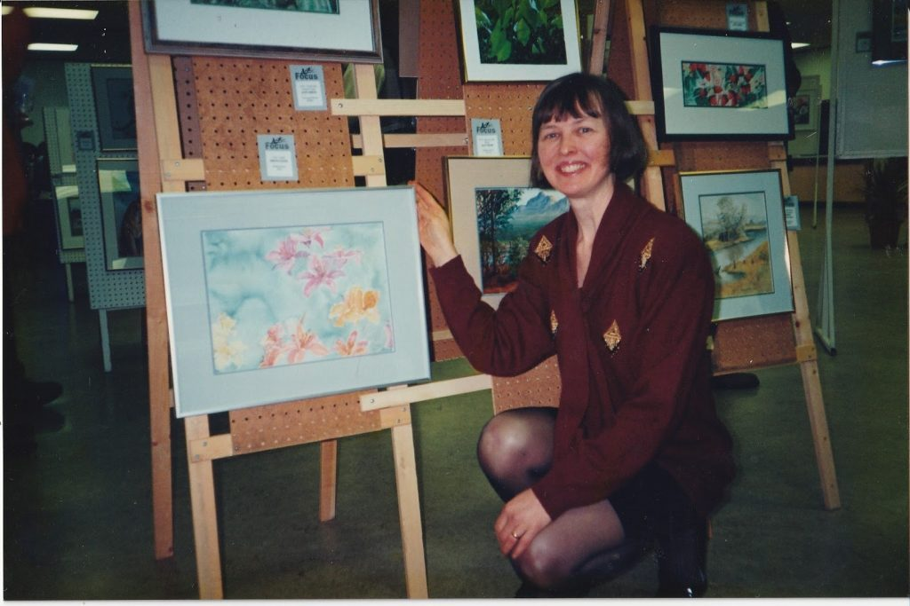

**Celebration of Life for our dear satsang sister, Theota Sudha Soleil Makortoff. Saturday, December 5 at 10:30 am Pacific Time.**

December 5 would have been Sudha’s 70th birthday. Her family would be honoured if you joined this celebration of her wonderful life. During the program there will be an opportunity to share your memories of her, should you wish to do so.

> *Please join the celebration by clicking the [Zoom link](https://us02web.zoom.us/j/87006449807?pwd=L2VoU1JIWk13VFFPdEQzaHRpc2QvQT09) Meeting ID: 870 0644 9807Password: 113806 Try to join the meeting 5-10 minutes early. This will give you time to settle in. You do not have to have a [Zoom account](https://zoom.us/) to  attend this event. You will be prompted to download the software, once you have clicked the Zoom link. Please make sure your name is set so that we can identify you. You can change your username, by clicking the three dots at the top of the screen. **Feel free to add your relationship to Theota, such as "Mischa Makortoff - Son."***

## To read this month...

Anandi Best has been part of the satsang for decades, and I’m delighted that she’s agreed to share her story. As you’ll see, she has been on a spiritual journey since she was a small child, beginning with her early years in the church, and her continuing spiritual explorations. She is now a regular participant in all the online study groups. I’m sure you’ll enjoy reading [**My Spiritual Journey.**](https://saltspringcentre.com/my-spiritual-journey-anandi-heather-best/)

Kenzie, a gifted yoga teacher and writer,  shares her reflections on her quiet life with her husband and sons, in the midst of the Covid lockdown. In [**Living a Small, Peaceful Life**](https://saltspringcentre.com/living-a-small-peaceful-life/), she shares her always inspiring wisdom.

Have you ever wondered about the symbolism of Santa Claus? Jyoti has, and in [**The Magic of Santa Claus Explained**](https://saltspringcentre.com/the-magic-of-santa-claus-explained-with-yogic-philosophy/), she explores the meaning of Santa Claus from a yogic perspective. It is both fun and instructive. You may never see Santa the same way again.

> ***The seed of suffering in you may be strong, but don’t wait until you have no more suffering before allowing yourself to be happy.***
>
> ***~ Thich Nhat Hanh***

May you all be healthy and happy.

Love,  
Sharada
