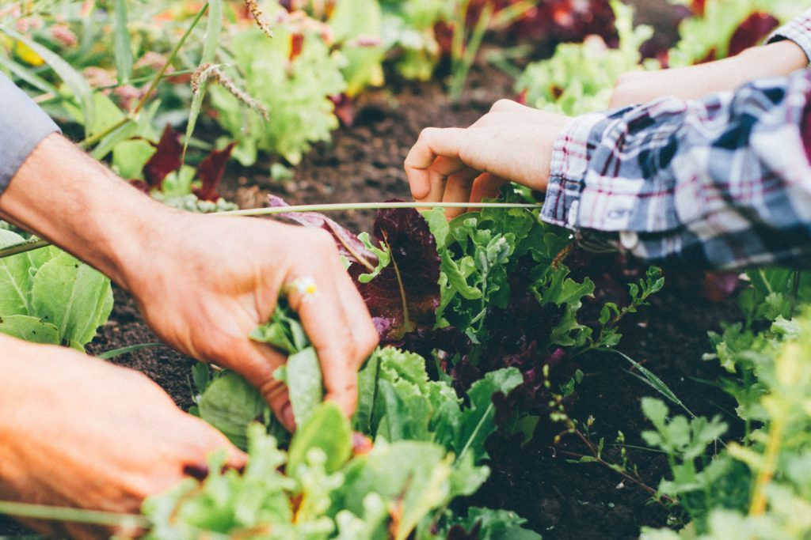

## by Dan Naccarato

If there was one remotely positive aspect to emerge this year from the chaos of the Covid-19 pandemic, it is that many people started thinking more about their food and even began growing their own for the first time. It was encouraging for me to witness this occurrence and to be able to offer seedlings and advice in the springtime to novice gardeners, and to see many of my hard-working farmer friends earning the greater revenues and respect that they deserve.

The uncertainty surrounding transnational food supply chains amidst the pandemic—something Canadians have taken for granted for decades yet which continues to be highly impractical and environmentally devastating—suddenly showed us how precarious our food systems can be. This was the tipping point for many who could no longer ignore the veneer of legitimacy and efficacy that has covered up the country’s and the world’s food distribution system, a system in which market-driven pricing and overproduction of nutritionally inadequate crops has become the norm.

It’s not a secret any longer that the diversity of food crops as well as the varieties of many of these crops has declined significantly within the past century as a direct result of our industrial agriculture practices and the shift towards monocropping (growing acres and acres of only one type of food to maximize yields) on most non-organic farms. According to some estimates, we may have lost as much as 80–90% of the varieties of crops that used to be grown around the world. Meanwhile, the overuse of chemical fertilizers and pesticides have subsequently led to a broad decline in ecological diversity of the flora and fauna that play a crucial and symbiotic role in the health of our farmland, our soil and the food we grow and eat, and thus our own personal health and well-being. All of these elements combined are contributing greatly to the climate crisis we now find ourselves in.

The vast majority of farmers in North America spend thousands of dollars a year on farm inputs such as GMO seeds, chemical fertilizers, pesticides and herbicides such as glyphosate to artificially increase nitrogen in their soil and manage insects, weeds and wild plants that occur naturally in their environment. Yet many of them are still not earning a profit, largely because market prices had been steadily declining for many widely-grown crops such as corn, wheat and canola, until this year when the impacts of the pandemic and various climate catastrophes created shortfalls in supply. Even the neonicotinoids that are decimating our honeybee and wild pollinator populations are proving to be less beneficial to farmers as certain insects develop greater tolerance to these chemicals, as recent studies show that organic and non-organic fields in the same region have comparable insect populations and crop yields, and that most farmers would arguably have higher incomes if they eliminated these inputs altogether.

While the current state of agriculture here in Canada and in most parts of the world may seem desperate, the hope for the future lies in the hands —and the soils — of smaller-scale organic, biodynamic and ecological farmers. It is becoming more evident that replacing our broken agricultural systems with lower-impact farming would lead to a dramatic reduction in carbon emissions, the primary factor contributing to climate change.

Whereas maximizing yields is the primary focus of commercial farming, healthy soil is at the root of all ecological farming that rejects the use of chemicals. Techniques such as applying organic compost and compost tea, planting cover crops wherever there is bare soil, and rotating crops so that nitrogen-fixing legumes including peas or beans are grown in a field directly after garlic or lettuce or any other heavy-feeding crops that require a lot of nitrogen for growth are commonly used to improve soil fertility by increasing the amounts of nitrogen, potassium, organic matter and microorganisms in it.

Two other approaches have been gaining in popularity recently, primarily for their ability to increase ecological biodiversity and sequester more carbon in the soil. These are low- or no-till farming and regenerative agriculture, which incorporates strategies such as managed livestock grazing, more perennial crops and developing whole systems that work in harmony with the ecology of the area in order to increase biodiversity, enrich topsoil, improve water retention and increase the resilience of the land. Increased soil health and carbon sequestration have positive implications for not only the current agricultural crisis but also the climate crises, as soil’s effectiveness as a carbon sink is comparable to that of forests as long as whatever is growing in it is managed appropriately and not depleting the soil.

According to the National Farmers Union (NFU), these methods of farming might not only lead to reduced carbon emissions but also higher incomes for the farmers who utilize them, since it eliminates the need for any external inputs and because soil health is the key to healthier and more abundant crop yields. In light of this, the NFU has presented a list of recommendations to government officials to compel them to implement policies that will encourage a paradigm shift in the agricultural field, recommendations including incentives for climate-friendly farming and tree planting, scaling up production of more environmentally friendly farm machinery, providing financial support for new and young farmers who want to start up ecological farming operations, and offering mentorship programs that connect experienced and innovative growers to those seeking to learn or transition into organic agriculture.

Even without government support, it feels like we are on the cusp of transforming our ailing food systems, as it was the small-scale organic farms with local and direct-to-consumer distribution models that were able to adapt most quickly to the curveballs thrown by the Covid-19 pandemic this year. And there is a way that each and every one of us can make a difference. All it takes is planting a seed or supporting an ecological farmer.
