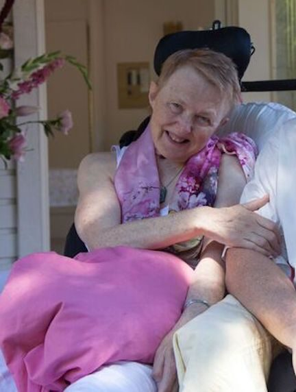

## by Greta Chandrika

*Theota Sudha Soleil*

Happy birthday to my dear friend afar  
Like sisters we were and sisters we still are  
Your quick wit and laughter and very keen mind  
Always so gentle, always so kind

You liked to sing with your lovely voice  
Songs of kirtan and you would rejoice  
In the spiritual oneness of all creation  
And the blessed event of its manifestation

For almost 10 years you lived up the street  
Back and forth we would all meet  
Lisa liked to go over and cut your hair  
As you sat in a comfy chair  
Your special sunflower Jarrad can recall  
It grew and grew so incredibly tall

You taught us well to get value for our money  
Even which toilet paper to buy, now that was funny  
But you had done the calculations-the number of sheets and ply  
And to this day at Costco, those are the ones we still buy

The gifts life offered outweighed the hardships  
And your love of life sparkled in your friendships  
You held steadfast and saw the light   
Of the beauty all around you and kept up the fight  
Your patience and determination saw you through  
The physical hardships that you knew

Last year I remember we ate pizza with you  
Me, Phil, Mischa and Harvey too  
After that we got to chat for awhile  
As we left you graced us with your beautiful smile

As grandmas we shared the love of our little boys  
We talked forever about them, their cuteness and their toys  
With your kindness, strength and determination  
You lived with much appreciation  
Of life’s beauty, joy and love  
Which surrounded you from down here and from above

On my last visit in February, as it came to be  
“I’m leaving my body”, you cried out to me  
You did choose to leave at a time just right  
For only one month later the world shut down tight

With all the visits, fun and meals we got to share  
For your family, Theota, ours will always be there  
Phil, Mischa, Dalton,when the world is back OK  
Once again we will visit and the little boys will play

Greta Chandrika,   
With much love
