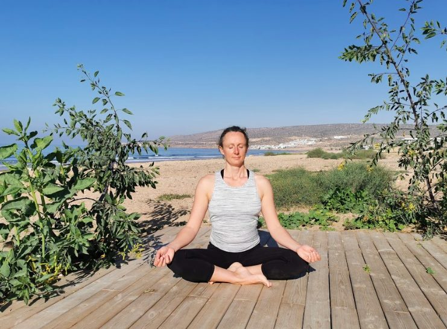
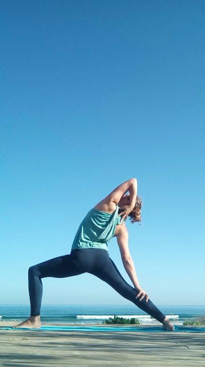
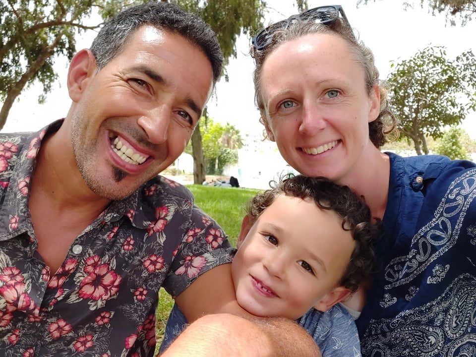
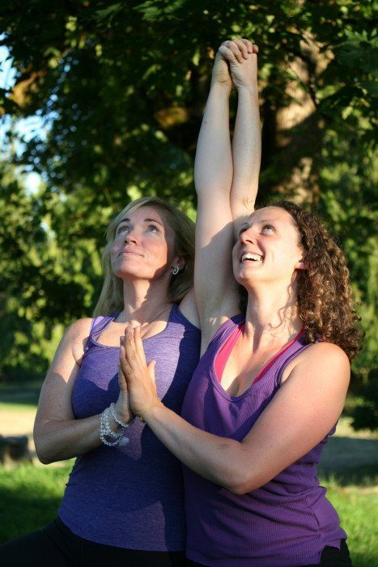
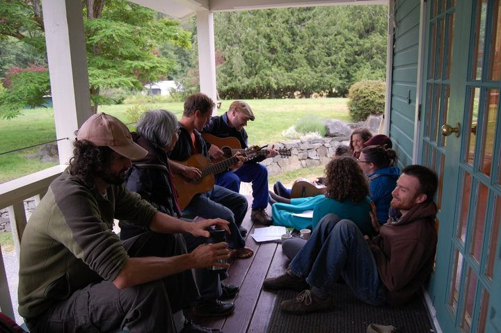
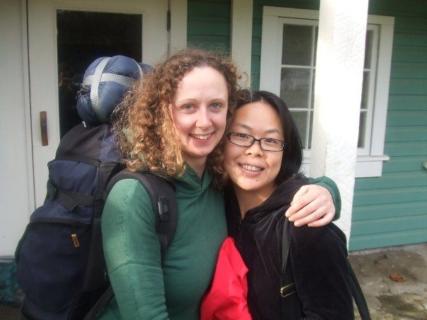
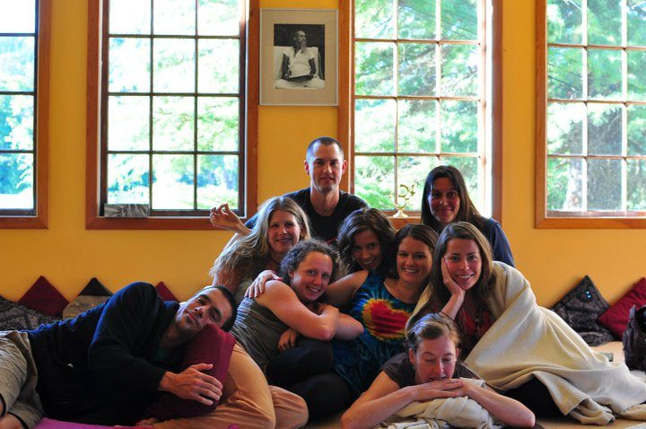
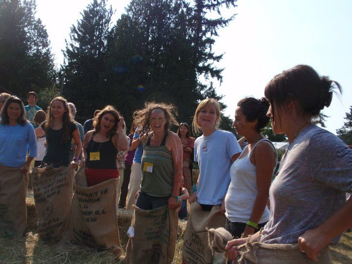
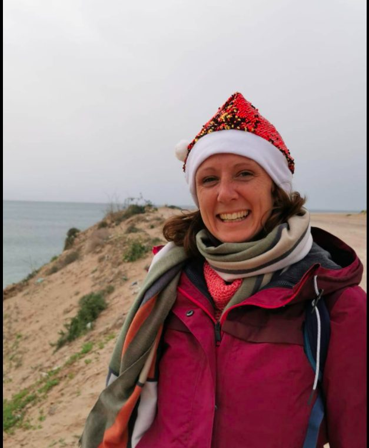
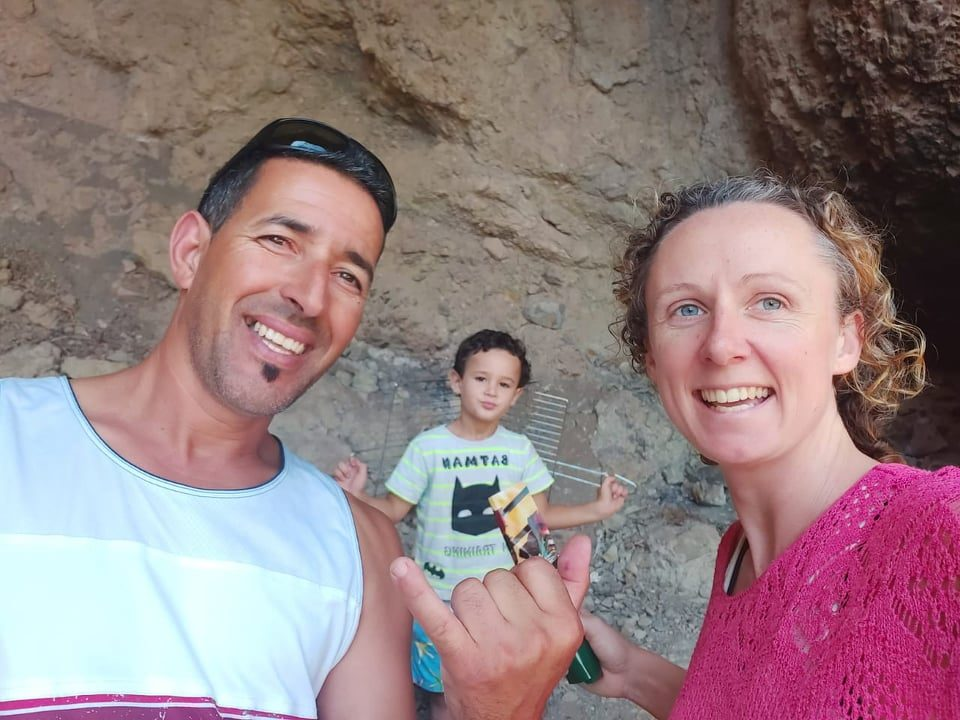

## by Lucie Palmer

*Lucie in meditation*

As I write this story about my experience at the centre, I sit in front of a beautiful warm Moroccan sun setting into the ocean from my rooftop. I am excited to consider the impact the times at the centre had on my life story. How contrasting it is to have 'grown up' so much spiritually there and now be here in Africa. It’s a beautiful feeling to sense my connection to the centre expandi ng. And to reconnect with so many of you, whom I love deeply, whom I greatly respect and whom I am so grateful for! As I reflect, and the colours fill the Moroccan skyline, I am quickly reminded that each time I’ve spent at the centre has greatly shaped my spiritual journey.

God has sung his/her spiritual teachings to me in many beautiful and sometimes harsh ways. Some lessons have come through great love and freedom. Others, through chaos and suffering. A wonderful theme which has appeared in my life story is that God has often sung to me life lessons through Yoga and more specifically through Babaji’s teachings. I can even go as far to say that my spiritual 'boot camp' was at the Salt Spring Centre of Yoga :). It has been the roots of my spiritual foundations which has greatly assisted my personal and professional growth ever since I did the KY and YTT programmes there back in 2008 and 2010.

*Lucie in Warrior pose*

Here my husband and son and I usually run a cafe and a surf yoga camp. We live in a dusty little surf village in southern Morocco near Agadir. Morocco is a spiritual place, and I really feel that my experiences travelling, and especially the selfless service and yogic teachings at the Salt Spring Centre prepared me for this adventure! Here we try to help and support the local community, our large extended family, and provide special experiences to guests who we hope will return next year after the pandemic has eased.

*Lucie, Momo and Adam, family pic*

My connection to Babaji has always been magical, and I never actually met him in person! :) My first yoga teacher, an American beauty called April Nunes Tucker, taught me yoga as part of my dance degree in London, England. I found out when I was at the Salt Spring Centre (the other side of the world) that she had trained with Babaji in California for many years. I also later discovered that a close friend of mine, whom I’d known in Hawaii, had done a course at the centre. And a funny and true fact is that Phil, who was living at the centre when I was a KY, had picked me up once as I was hitch-hiking in Hawaii. I found this all out whilst at the centre. It felt very much as though God had picked me up and told me to train at the Salt Spring Centre of Yoga in Babaji’s teachings. The teachings of the yoga philosophy programme are still a treasured backbone to my own spiritual path.

It is so magical that I have so many connections with this tiny little island on the other side of the world. The first time I was a karma yogi at the centre, I was reading the book “the Power of Now” by Eckhart Tolle. I got up and read it one morning, and then was walking through Ganges when I felt a powerful presence. I walked past the gas station and crossed over the road. It felt so powerful that strangely,I had to stop and then look to see what it was. There stood the author Echkart Tolle, paying for gas at the gas station and getting into his car. The stars were surely aligning! I was meant to be right where I was, reading that book and on this special little island!

*Lucie and Anila at the Salt Spring Centre*

I love the feeling of being right where you are meant to be, that feeling of spiritual safety and harmony. The Salt Spring Centre has always been such a special place for me. When I first arrived, I remember walking up the lane and seeing the sunflowers. I had had a bit of a frightening journey on my way there. A man had frightened me on a bus ride from Banff, and I’d been very upset. I was a little shaken, and I didn’t really know what to expect at the centre. At this point, I didn’t realise that I knew people who had been to the centre so the experience was very fresh. But seeing the sunflowers assured me that it felt right, and I felt safe and at ease. There was a very special energy to the land, something magical and inviting, and sunflowers had always been a sign of something good to me on my previous travels and adventures. My mom had said that I needed to find a place to ‘just be’. And this was it! I sighed a good sigh and walked in. I was invited to jump straight into a yoga class and I exchanged a massive smile with Sasha, who instantly became a cherished friend.

The first weeks at the centre were incredible. I was introduced to concepts I had never heard about or understood in this depth before. The joy, fun and buzz of the Centre felt so contagious. It felt like my soul was happy there, it wanted to dance with the good energy of the people, helping the centre run smoothly. Selfless service started to become a way of life instead of a concept. And knowing that we were all aiming to uphold the same backbone of Babji’s teachings, moral codes and love, allowed me to connect strongly with the community. The love in the community was such a beautiful thing and still is to this day. I really cherish those times. And that first ‘annual family retreat’, especially playing with the kids, and talking to so many inspiring people, was phenomenal. ‘How could so many aware, spiritually committed, loving, kind and intelligent people be in one place?’ I thought to myself! It was an organised loving community. I left on a high for a trip but soon returned back to the centre to see if they would have me back. Thankfully my dear sweet KY friend Kanako allowed me to share her room (which may have been bending the rules). Sharada and the community allowed me to stay and if not this could have been a very different story! It was this time, that I remember being the most difficult but also the most healing. My honeymoon period at the centre was over. Sometimes healing comes with it’s pains, confusions and challenges. I was in for a ride! The guts of the practice started to do its job.

*Music with friends at the Centre*

Daily life as a KY was filled with spiritual action, hard work with attention to detail and quality, learning and reflecting. The mixture of silent days, sharing circles, deeply personal talks, kirtan, satsang, yoga philosophy teachings and physical yoga practice brought about a deep awareness in me which I quite frankly found shocking. I went through a deep inner journey which brought me to a place where I could start to see the violence of my own thoughts towards myself. It wasn't the pretty picture I’d wanted to see. Hearing my own cruel mind, louder than before, manipulative and aggressive, was terrifying. I was lucky to have the essential support of what had truly become my dear chosen soul family members. Never had I experienced such a well organised, well intended, genuinely caring team of friends and staff who were like my therapy soldiers helping me fight that internal fight which many of us face. The fight with our own darkness. I had truly been blessed by Babji’s teachings, but the effect yoga had on me brought up some painful truths about my inner beliefs, the patterns of my thoughts, my morals, how I was treating myself, the motivation behind my actions, other parts of myself, my family and my culture etc. And it was not an easy task to face.

One day, I was listening to kirtan music and I felt a terrible pain in my chest. I had a panic attack. Again, I was shocked. “How could someone have a panic attack in a peace sanctuary?!” I thought. My mind raced, as did my heart, and I actually believed that I was going to die. I feared for the lives of my family knowing they would be horrified and hurt by my loss. I feared for myself, leaving my body so soon. I was in my 20’s and wasn't expecting to go so soon! I asked to see Raven. Raven had been helping me through the teachings of Babaji like a shining light. He came into the room, and I cherish the memory of him smiling and sitting down near me quietly. I was expecting him to panic too. It was as if he knew something I didn't know. He knew how to be calm within the chaos. He managed to guide me into this calm place and ‘just be’. I felt the care and kindness of all the folks living at the centre at that time. Lauren, Santosha, David, Jen, Sharada, Raven and others too. It was a love I received as a chosen sister. I began to close my eyes and I started my own journey to meet my own darkness. I said goodbye to everyone in my life I loved, my UK family and friends, and wished them all well. All with detailed messages to each unique relationship. I imagined that in the end they would all get on with their own lives and that life would go on without me, even if they missed me. I started to calm down as the acceptance of death slowly merged in with the experience I was living and I gradually began to breathe normally. It was as if my body needed to experience the painful thoughts I’d been hearing inside. And I needed to suffer it, in order to find a way of finding the calm within the chaos. Thankfully, I had. I’m especially thankful to Sharada for her healing chats, to all my KY family who shared their hearts and souls in those sharing circles, to Raven for helping to implement the powerful teachings of Babji into daily life, and to Babaji for bringing us all together through his teachings, love and magic.

*Leaving the Centre, 2008*

I remember sitting on a bench with Raven once on the lawn. And feeling the essence of life in a way so beautiful and profound that it was as if I was inside time in a different way. ‘What is the shape of this moment?’ he used to ask. “Surrender to awareness itself”. I have remembered these teachings at the darkest of times. It has allowed me to see that there is a decision to be made, no matter what my monkey mind thinks. And that I am free to make the decision to follow, react, act or do nothing with those thoughts. Thank you Raven.

> "There is an unspoken language. It comes from silence and can’t be heard by the ears, only by the heart." ~Baba Hari Dass

Two years after I was a Karma Yogi, I managed to return to the Salt Spring Centre to do the incredible 200hr Yoga Teacher Training course. WAW! I remember barely being able to speak afterwards. In the final sharing circle, I remember saying that there were no words because we all understood in a different kind of language. It was the language of the heart. Babaji’s teachings had transformed everyone in the course into a better human being, a fully, freer, happier, kinder version of themselves.

*Lucie and friends at the Centre*

Through my time as a KY and a YTT graduate at the Salt Spring Centre, I have not only learned how to do a bit of asana. I’ve gained yogic tools which point towards the importance of community spirit and support. I’ve learned the power of true friendship and selfless service and its ability to uplift people from their darkest times and empower themselves with the direction and conviction to learn, to serve, and to share joy! Babaji taught us to “work honestly, meditate every day, meet people without fear, and play.” and each time I don’t, I pay the consequences! Babaji still continues to teach me. I can’t get enough of his lessons. His teachings lovingly push me to live in peace, to play, to serve, to surrender, to uplift and to share loving kindness. These teachings and values have provided me with spiritual building blocks throughout these years. I’ve not only helped myself, but I’ve helped thousands of people with Babaji’s teachings. To this day, I keep in touch with many friends I met at the centre and some have even come to stay with us in Morocco.

*Playing at the Annual Family Yoga Retreat*

When I was at Salt pring I could never use the word God, and I rejected the concept of God. Interestingly Babaji gave me the name Anuraj which means ‘devoted to God’. At the time, I thought he had got it wrong. I could not understand back then, but now, it makes perfect sense!

I remember on one of my last nights of the YTT, I was hugging the other yogis in a big loving circle. We were on the lawn, under the stars and it was a beautiful clear night. As we were in the circle, I looked up at the sky, which was filled with stars and said how I always love to see the ‘seven sisters’. It’s a star consolation which I always look for. I then looked down and realised that I was hugging 6 other female yoginis. At that moment we were the 7 sisters! And yet again, I felt I was right where I was mean to be. In harmony with the great creator. That night, I looked at the sky. I felt so connected to what I can now call God, I started talking to God in a way I never had before. I told God, “I’m ready to meet a special person” kind of announcing I was happy enough with myself to be in some kind of a partnership with someone special. Not long after this, I flew to Morocco, where I had already got a job to teach yoga at a surf school, and met Mo my husband, the man I worked and lived with before we got together, and now the father to our little boy Adam, who is now 5 years old. After completing YTT at Salt pring, I felt deeply ready for life in a way I never had before, as an adult. As a kid I was ready for life, but the struggles of my inner world had built up as a young adult. After the YTT though, there was a lightness, an excitement, a sense of purpose and play. God wanted to dance and launched me into my new chapter living in Morocco and life has never been the same!

Now I live in Morocco. I provide selfless service, love and care when I can. My husband and I managed to create jobs for many, and we and created a Surf Yoga Camp which offered holidays year round before the pandemic hit. We have a cafe named after our son, 'Adam's Cafe' which provides a community hub and I try to bring people together when I can with meetups and events. I am the longest standing yoga teacher in the area so there isn’t much of a yoga community yet but the pandemic helped to bring us together. Our village is still filled with many uneducated and poor people but there is a gentle peace in the air, richer than that in the cities. I have no doubt that the Salt Spring Centre prepared me for this chapter and that Babaji’s teachings will keep doing so.

*Lucie, Mo and Adam, BBQ Paradise Valley*

So thank you to all those reading. Thank you for all those in the Salt Spring community who helped me when I truly needed it. Each one of you taught me something so special, unique and loving. You are all so wise! Thank you to all those who continue to play a part in my journey. Your messages, visits and thoughts are gratefully received. Thank you to Babaji who has helped me and so many others, to overcome their troubles through his beautiful explanations of the Yoga practice. And thank you to God, in whichever form you relate to him/her/the universe, for showing us such a wild and wonderful ride!

By Lucie Palmer  
ohana.butterflies@gmail.com
