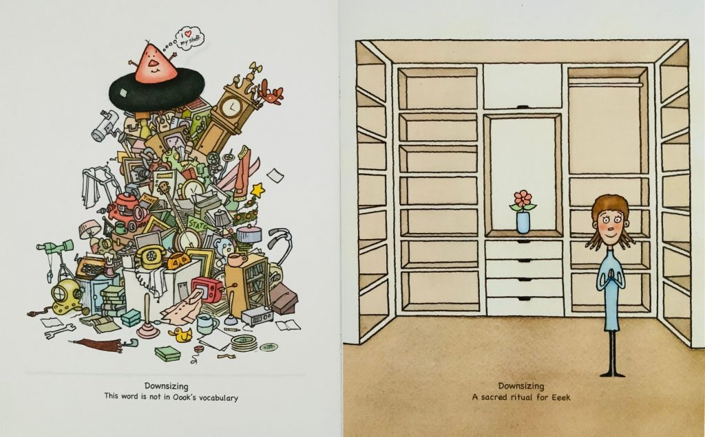

## The practice of non-possessiveness on all levels including thoughts and deeds.

I am the queen of downsizing in our family. I actually need to downsize, declutter, get rid of things. It seems to calm my mind which quite frankly, needs all the help it can get. As a visual artist, when surrounded by excess clutter for more than 5 minutes, i begin to experience fight or flight syndrome. I either need to change it, or exit. The fact is that I’m ATTACHED to downsizing, decluttering, getting rid of things. You could say, it possesses me!

I grew up in a home where there was perpetual clutter. Small rooms with too much furniture. Excessive amounts of family pictures of every size and shape adorning all 4 walls which began to look like a new kind of wall paper! Pics of anything and everything but in particular, small, out of focus pics of long gone relatives whom my mom had never met, let alone me!

Then there were the chotskies of every size, shape, and theme, of little aesthetic or monetary value. Impossible to dust. Odd shaped cushions and blankets of every clashing colour, shape, and texture. An interior designer’s nightmare. And paper....tons and tons and tons of papers. One of my moms past-times was photo-copying magazine articles. Don’t even get me started on the clothes closets, or the kitchen cupboards, and then there was the dreaded basement! If you went down there looking for something, don’t expect to come back for a very, very long time.

Multiples of everything.... why buy just one on sale when you could buy 4 or 5 on sale!!!And that was the cardinal rule growing up in our house: “NEVER EVER buy anything unless its on sale”. Whenever I’d show my mom something I bought, on sale, of course, that i was very happy with, she’d say: “That’s nice. I hope you bought several”. This was her mantra which made me shudder. My mom’s need to acquire things in multiples was not just for herself, by no means. She was a gifter, anyone who visited always received a package of ‘sorts’ when they left. For my brothers and I, it was relentless, she gave us all enough socks, toques, scarves, and mittens to fill a warehouse.

So when the time came to move my 85 yr old mom, Marea, from the family home to a condo, this downsizing queen surfaced with an exhilarating force! I had been waiting my whole life for this ‘aparigraha’ moment, to be rid of the visual clutter that triggered my fight or flight syndrome whenever  i visited my mom, which was frequent. Preparations for the big move took months and months, filtering thru all the ‘stuff’ to the essentials.  I was sooo excited to set up her new downsized condo, free of clutter or discordant colours, well spaced furniture and select photos in matching frames. As it turned out my mom ended up moving 6 times in 3 years. It was like the movie, Groundhog Day. Each time i would passionately remove the clutter and then set up her next home in another decluttered incarnation. And in between each move my mom would go out and collect all the same chotskies at her favourite outlets, the dollar store, neighbourhood garage sales, and church bazaars. She was that little old lady who bought the most with the least. Yeah, she could give any Delhi shop keeper a run for their money - Marea was fearless in bartering for anything, even if it was already on sale!

Looking back, I’m amazed that i never understood what was happening until the very last move. Each time my mom arrived at her next ‘downsized’ home, she would have this mixed look of gratitude and non-excitement, what i now call the ‘aparigraha blues’.  In my need to downsize, my nature was busy overriding her nature. I didn’t get that my moms ‘clutter’ was part of her self-expression. She was an artist and chotskies were her medium, her canvas! As well, a significant aspect of her self-expression was the ability to barter, purchase and gift others, while spending the least amount possible. Perhaps that’s why she didn’t interfere with my obsession of downsizing her personal space... by my removing things, she could fill it up again, and again, and again.

As Babaji said, “ You can’t change the curly tail of the dog”. The curly tail represents our individual samskaras or tendencies.  My ‘curly tail’ is to empty the bucket.  My mom’s ‘curly tail’ was to fill it.  Complimentary actions! The pairs of opposites are everywhere in nature and perfectly natural. Instead of trying to straighten the tail or cut it off, we can cultivate empathy, acceptance and even a curiosity for each other’s curly tails! I say, celebrate the curly!

Clearly the true practice of aparigraha or ‘non-possessiveness’ reaches much deeper than acquiring or removing objects. Anyways, the story doesn’t quite end there. Turns out my beloved spouse has a similar curly tail as my mom! Ground hog day continues but with a little less grip on my part. :)

Kalpana Tabachnick

---

Kalpana is a long time student of Baba Hari Dass, and is deeply honoured and appreciative for a life long involvement with both the Hanuman Fellowship satsang and the Dharma Sara satsang communities.
