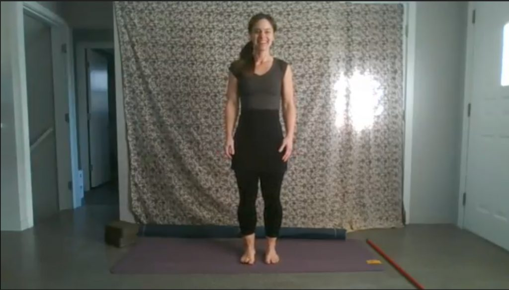
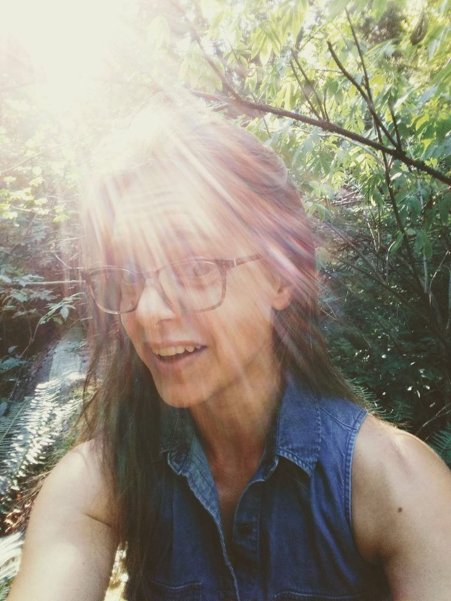

At the start of this pandemic, in answer to the proverbial question, 'How are you doing?’ I most often said, ‘I’m  holding steady’. I offered this response with honesty, some surprise, and a lot of relief. It seemed my years of teaching and practicing yoga had grounded me solidly in a deep felt sense of peace. I was able to anchor into my own calm centre, even as my small world, and the whole world beyond, seemed to be roiling. My anchor was holding, no matter the storm raging around me. In some ways, I thanked my own struggles with anxiety and depression, because they brought me to yoga. Even when those stormy states battered me from within, I learned how to hold steady. At least this storm was beyond my physical shores. At least we were all weathering it together.

Fast forward to the second wave, when I felt my anchor begin to drag. The inner world was getting as stormy as the outer world, and holding steady felt less like a given, and more like a hope -a hope built on faith and practice.

As I struggle to hold steady in these tempestuous times, as I feel my anchor dragging, I look towards my asana practice with humble curiosity. I contemplate Patanjali’s only reference to asana given in the Yoga Sutras; “**sthira sukham asanam**”, meaning that every asana should be 'STEADY' and 'COMFORTABLE' – **STHIRA** and **SUKHA**. '**Sthira**' means steady or stable or grounded or strong and 'Sukha' means comfortable or easy (or 'easeful') or peaceful. In a time of such unrelenting unsteadiness, instability, unease, and discomfort, how do we even recognize these qualities anymore?

I have had to keep reminding myself that this is almost everyone’s first pandemic. This is ALL new territory for us. We are walking a path that is not flat, that is not straight, and that has no visible or familiar end on the horizon. To assume we can take our practice of finding a balance between“steadiness and ease” in our asana practice off of the mat and into a world transformed overnight into the very opposite of these qualities, seemed unhelpful, if not disingenuous.

In Hatha Yoga practice, we often mention finding a balance between ha and tha, sun and moon. We aim to balance body, mind and breath in the present moment. So I began to think about ‘holding steady’ as a practice of keeping my balance on a path made unsteady, towards an unknown future. I wondered what that might look like on the mat, in order to find a way to usefully take it off of the mat.

https://youtu.be/sDH1zsN8gUM

So I offer you this short practice that includes some of what I have come up with. We begin by  feeling the ‘gift of gravity’, acknowledging the quality of stillness and connection where our body touches down, to help us receive the support of the earth beneath our feet. We awaken the feet, to become sensitive to this support, and we use external supports to help us when need be. In doing so, we create opportunities to balance on uneven surfaces in stillness and movement to practice ‘holding steady’. And as is always the way in yoga, we slow down the breath to slow down our thoughts, to help inhabit the present moment where the body always resides. The body is always present, therefore acting as a powerful anchor for the present moment. We ride the wave of breath through the present moment, and maybe, just maybe, we learn to trust that our anchor will hold.

After teaching an especially challenging, balance-based practice I often close the class with these two complimentary quotes below. The second one in particular has become a mantra of sorts for me these last few months. Though the path is unsteady, though the way is not easy or comfortable, I trust I will find my way.

“Yoga is the study of balance, and balance is the aim of all living creatures: it is our home.” - Rolf Gates

“Falling out of balance doesn’t matter, really and truly. How we deal with that moment, and find our way back to centre, every day, again and again- that is the practice of yoga... it is about trusting you will find your way.” -Cindy Lee

*A note about the video- you will need two yoga mats, two blocks and one broomstick, detached from the base.*

---

***Kenzie Pattillo** is a householder yogi living in North Vancouver, with her beloved partner and two rapidly growing  tween/teen boys/men(!). She completed her 200 hour YTT at Salt Spring Centre of Yoga waaaaaaaaaaay back in 2002, and her 500 hour YTT through Semperviva Yoga College in 2015. She currently teaches much less than she did pre-pandemic, and is most inspired by her ongoing work with Every Day Counts, a North Shore Hospice initiative. Through this (currently entirely on-line) program she has been given the opportunity to offer folks with life-limiting illnesses as well as their family, friends and caregivers, access to free Restorative and Therapeutic Hatha Yoga classes.*
