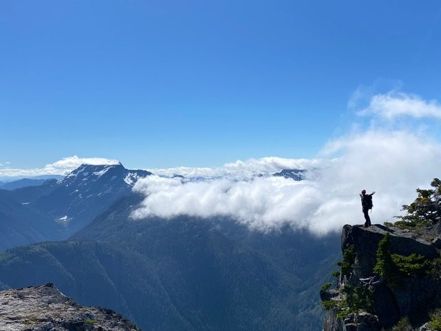
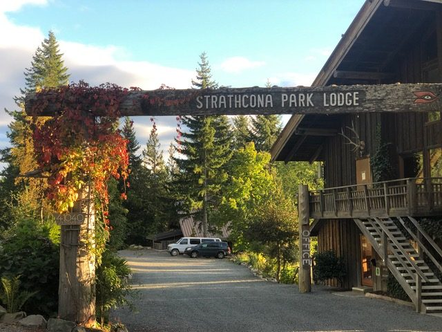
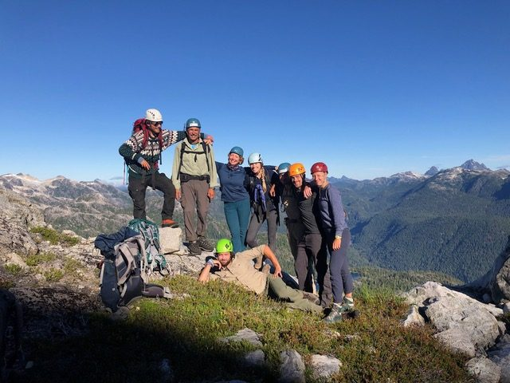
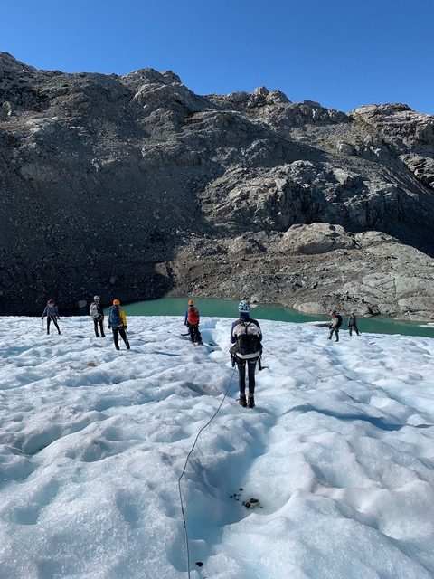
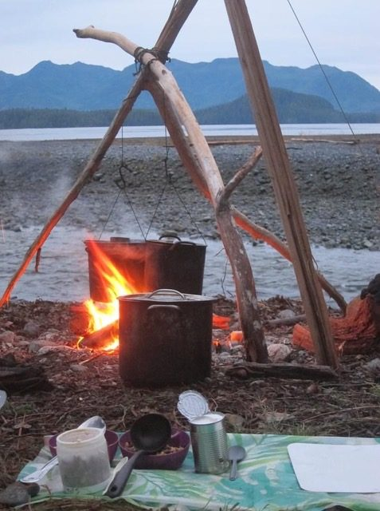
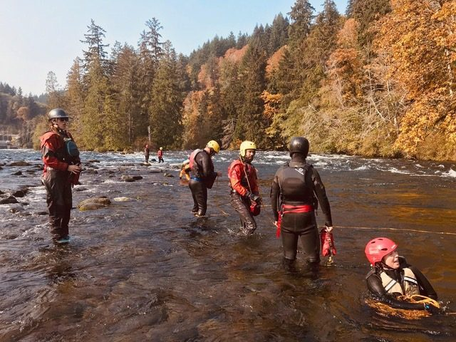
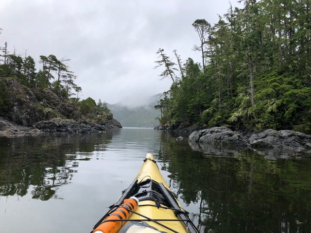
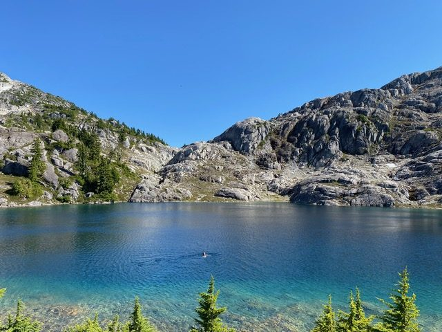
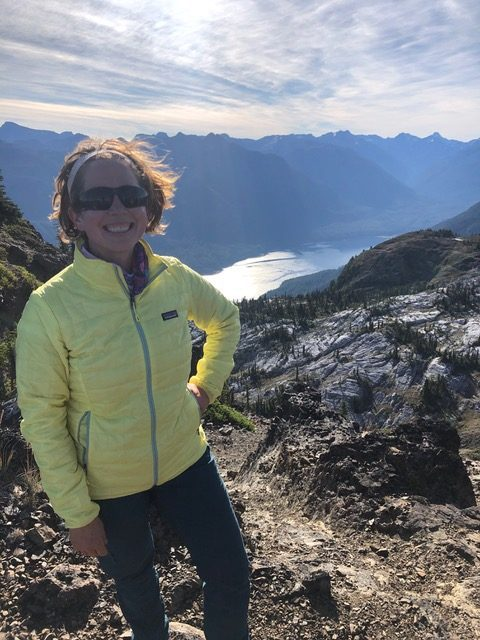

By Courtenay Cullen

There is a remembering that happens outside. “Outside.” Even the word is designed from the perspective of an “inside” being. That being “in” is somehow our natural place, and being on the “outer” side of “in” is somehow the atypical state. That somehow we have always been sitting at the window, looking out. And yet, this is not the truth, and must be chalked up to a fallacy of language. For when we do open the window and step back into the wilderness, we leave ideas of “out” and “in” behind, and return to the natural world, of which we have always been a part; we return to our own true nature. This is where we belong - it’s just that we have forgotten.

I spent one hundred days remembering this past fall. I enrolled in the Canadian Outdoor Leadership Training program, the home base for which is located at Strathcona Park Lodge, on the northern end of Vancouver Island, in Strathcona Park - British Columbia’s oldest provincial park. The renowned program - called COLT for short - has been turning out well-trained outdoor guides for over forty years. In order for this to happen, “COLTies,” as they call us, have to learn an incredible amount of skills in this short period of time. Twenty different canoe paddling strokes. How to pack for fourteen days in the mountains. How you don’t really need that extra thing, ever. How to hike up for seven hours with a 40-pound pack on your back. How to read the topographical lines on a map, and match them up with what you are actually seeing in the land all around you. How good a cookie tastes on top of a mountain. How to climb rocks and rappel down afterward on an anchor you built yourself. How to travel on a glacier with an ice axe and crampons. How to rescue someone if they fall down a crevasse. How to take a compass bearing on land, and on sea. How to use a marine radio to call for help, and how to answer a ship in distress. How to splint a broken leg, and build a stretcher out of backpacks. How to paddle through white water rapids. How to swim safely through those rapids when your boat flips. How to read the sky for the weather to come. How to set up camp and get a fire going in fifteen minutes in the pouring rain. How to start and keep a fire going, under any conditions. How to tell a wet log isn’t waterlogged and will still burn. How to lead our peers. How to leave no trace.

But this was all the new learning, not the remembering. The remembering came because of *where* we did this learning: through the window. Outside the walls. In the wilderness. For the first time in my life, I spent more nights in a month sleeping under trees and stars than beneath ceilings. When it was my turn, I woke early - well before the sun - and made the coffee and the oatmeal, and watched the sky change colours over the ocean. And the sleep was gloriously deep, the coffee was thick, syrupy heaven and the oatmeal warmed my soul. Something was different without walls. I was suddenly more alive. More awake. I was seeing things with a sharpness of focus and crystalline clarity I had never known. The wilderness outside was calling to the wilderness within, in an ancient language my soul was remembering.

The wilderness isn’t always pretty, or convenient. It’s wild, and doesn’t give a fig for the set of rules we’ve come to think ‘should’ govern our lives - like the idea that we have a right to always be comfortable, that anything can be bought, or that our very lives are transactional. The idea that we should be able to stop and get off the ride immediately once things have gotten too difficult. Outside, there was suddenly a different set of rules, and I was often scrambling to keep up. There were plenty of times that I longed for a roof, for a bed, or (and *especially)* for a door to close. However, these were so plainly impossible that, where in the city I may have clung to them with white knuckled fingers, out in the wilderness I just simply let them go. Instead, I had to find a way to dig deeper within myself, to discover a different way of coping, of problem-solving, of dealing with being around the same ten people all day, and all night, every single day. And in doing this I accessed depths of resilience I never knew I possessed.

Our course was broken into modules according to our different activities. At the end of each module we would generally head out “on trip”  - into the wilderness for days or weeks at a time - to truly test our new skills. The River Trip took us up to the Nimpkish River to test our white water paddling. We took white water kayaks, canoes, and even a large raft, so we could all take turns paddling the different craft through some serious class 3 rapids. Located on the north island, the Nimpkish flows northwest and empties into the Broughton Strait, just south of Alert Bay on Cormorant Island. Along its shores is an old abandoned iron mine, which sits overlooking the river’s wildest rapid, aptly named Iron Mine after its crumbling, defunct sentinel. The day we took on the Iron Mine rapid, I was paddling in a tandem canoe with another woman named Alex. I was in the rear, meaning I was in charge of steering. Alex was in front, calling out and helping finesse us around obstacles. When we got to the top of Iron Mine we all stopped and “eddied out” to one side of the river - meaning we caught some of the calm water that pools behind larger obstacles like boulders or downed logs - and took a moment to look downriver to plan our route, or our *line.* It was late fall, and the river was swollen with recent rain, and the water was BIG. We had never paddled in rapids this size. There were actually two sets, the final culminating in a huge “wave train” - a series of about eight standing waves of deep, rushing water with big, crashing whitecaps atop each, followed by deep troughs.

One of our instructors headed down first. We were lucky enough to be led by Laurel Archer, a female legend and personal hero of mine, who has paddled and mapped and written guide books about many of BC’s wildest rivers, breaking down innumerable gender barriers along the way. Alongside her was Jamie Boulding, the son of the Lodge’s founder and its current owner, who has been paddling since he could walk, is 6”5 and a former member of Canada’s national rowing team. We talked about the best line to take, barely able to hear each other over the thundering water, and, boat by boat, we each took our turn taking on the rapid. On the river, you communicate via paddle signals when you’re more than a few feet apart, and one paddle straight up in the air from Laurel at the bottom of rapids meant that the next boat could safely go ahead. Soon it was our turn, and she raised her paddle. We raised ours to show we had received the message and we were ready to go. We peeled out of the eddy in our 20-foot kevlar canoe and headed down, taking the line we had decided was best, just to the left-centre of the first rapid set. Our canoe dipped and leaned as we leaned our bodies and applied our strokes on opposite sides of the canoe. Strokes that by now had become second nature: *draws*, to turn the canoe toward your paddle side; *pries,* to send it away from your paddle side; and in the rear, always, I would be applying *J-strokes* to correct the canoe’s natural tendency to pull toward my left handed paddle side, acting almost as a rudder.

Things happen in an instant in the wilderness, and even faster in white water. Suddenly, Alex and I found ourselves pulled straight into a huge hole (the space on the downriver side of a big obstacle, that can recycle water and boats around and around like a washing machine) we had been trying to avoid at all costs. In the blink of an eye, we went from doing fine to tipping, bow first, down into the swirling abyss of the hole. We were told afterward that after the bow tipped down, the stern flipped straight up into the air so that for a moment the canoe was almost vertical, flinging me and Alex like dolls out of her safety and into the roiling water.

Somehow, we both managed to hang onto our paddles. Chalk it up to good training, or luck. We were also trained to immediately get ourselves into river swimming position in the event of a swim - head up and feet first, pointed down the river, so that you can use your feet to push off any obstacles you meet, so you can see where you’re going, and so you can use your hands and arms out to the sides to scull and control your direction. There is another very big signal on the river, and that is to make a fist and tap on top of your head to indicate “*I’m ok! Are you ok??*” Alex and I managed to find each other with our eyes - she was well behind me in the rapid - and exchanged taps on our helmets. At this point, we had already swum almost all the way through the first rapid, so we even managed a smile and a laugh, with eyes that said “*well, here we are!*”

The smiles didn’t last long, however, because we were fast approaching the wave train. Holding onto a paddle, it is very difficult to swim at the best of the times. And now, in water this big and rough, it was utterly impossible, and my hands out to my sides were not generating nearly enough force to propel me toward the promised land of the river bank. So, I flipped over and attempted to swim, HARD, heads up front crawl, toward the shore. The cursed paddle diminished my stroke’s power by half, and I did not make it far enough to avoid the wave train. It only served to profoundly tire me out. And then the waves were upon me. So I flipped back over onto my back and somehow remembered the words “*breathe in the trough*,” and focused 100% of my energy on just getting enough air into my lungs. Breathing at the crest of the wave is a bad idea, because that’s where all the splashing white water is erupting. The *trough* is the valley after the crest, and your journey down into this slightly smoother water is your one chance at air. And so that’s what I did. I crested each wave on my back, clung to my paddle, and breathed in the trough. I looked longingly toward our camp on river left, as I sailed downriver, gasping for whatever air I could, propelled by the seemingly unending power of the waves. I was more alert than I have ever been. And while part of me was also as terrified as I have ever been, another part, a stronger part, knew I was *doing it*. I was surviving. I was doing everything right and I was going to make it through this crazy rapid. I was even planning, incredibly, for what I would do downriver when I had a chance to really swim again. I was not cold. I was very, very alive.

Suddenly, I saw one of the most beautiful sights I have ever seen. I saw Jamie Boulding slicing through the water toward me in his canoe, making sure, swift strokes and reaching me just before I had well and truly left our camp behind. His bow glided in front of me, and I grabbed it and held on with every ounce of strength I still had, and yes, still clutching my stupid, beloved paddle in a left hand death grip. Jamie towed me to shore, to calm water, and to  the safety of our camp - right outside the old iron mine itself.

In our modern, domesticated lives, many of us have stopped testing our boundaries, and so our boundaries have slowly shrunk in on us. We are capable of so much more than we think.

When Alex and I would tell the story of our epic Iron Mine swim, I noticed that she would sometimes temper it with a bit of embarrassment. I get it, some of our classmates did make it down the gnarly rapids and colossal wave train successfully, and they were rightly proud. But I don’t feel embarrassed. Instead, I feel completely exhilarated by it. I am filled with gratitude for that crazy swim, because that was the scariest thing that could have happened, and I got through it. Even in the midst of that chaos, I remembered my training, and my body and my mind and my spirit *and the water* worked together in a kind of next-level harmony like I have never known. As deeply grateful as I am for Jamie’s help, I also know that I would have survived on my own. I would have swum to shore when the water calmed (as it inevitably does), and I would have made my way back to camp, as sure as the nose on your face. And because I have no question about this now, because I know it deeply, I am stronger. I can feel this strength now, as I write this, coursing through me. It is, in fact, a strength I always had, but the depths of which I had not plumbed, and so, in not knowing it was there, I had not unlocked its gifts. One of which is an incredible feeling of liberation from self-doubt and a new level of confidence. And an awe and respect for the wilderness I have inside me.

It’s just like Babaji says: “A man who has a ten dollar bill in his pocket but does not know it is there possesses ten dollars but also doesn’t possess ten dollars. In the same way God is within us but we don’t possess God as long as we are not aware of God.”

What I experienced in the Nimpkish - that perfect union of mind, body and spirit - feels to me like the very essence of yoga. Experiences like this naturally check the mind and the ego. As we learn in yoga, the mind makes a terrible master, but a truly wonderful servant. The wilderness does not allow for the outsized growth of the individual ego that we see in our modern, commercial society. The ego loves to buy things and keep itself separate and to feel superior. The wilderness has a way of putting a very quick kibosh on our overinflated ideas of ourselves. If you are not present and paying attention while chopping kindling with a hatchet, you are very likely to miss your mark, and receive a dangerous gash in the leg. If you paddle out in a kayak without having checked the weather and the tides, you may be humbled very quickly by storm force winds, lashing rain and an angry sea. And even if you think you’ve planned the best line through a rapid set, anything can happen and send you straight into a hole and out into the rushing water.

In yoga, we are always learning (and re-learning, and re-learning) that we are not separate. That separation is a myth. That we are One with all things. When we bow, and greet each other with a heartfelt “namaste,” we tell the other that our own divine light honours theirs. Yet I have never felt more in tune with this light, with the divine, as I did when facing up to my inner and outer wilderness. And this light that exists in all things. For if we have it correctly, it is all divine. It’s all wilderness. There is the same luminous spark animating the smallest mouse that there is in the 170-tonne blue whale swimming through the ocean’s watery depths. The same divine intuition which impels the chlorophyll in the salmonberry leaves to consume the sun’s rays and transform it into food, as there is in roots of the tallest Douglas Fir, stretching its woody toes out through the soil to absorb its nutrients, as there is in each human animal. As Paul Ferrini notes in his beautiful daily reader *Everyday Wisdom*, “When the One Self is born within, we no longer see an outward separation between self and other, because each self is the One Self. Every man or woman is either a waking or sleeping Christ or Buddha. One Eternal Self dwells within the heart of all beings.”

Where did our forgetting of this begin? What has happened to us? Robin Wall Kimmerer talks about this in her luminous 2013 book, *Braiding Sweetgrass*. She points out that in English, the honour of “personhood” is tragically bestowed only upon human beings - yet another of our language’s deep flaws. Our language itself places us at the top of our own hierarchy. If we are the only “people,” then everything else is below us, and this informs how we act through the very medium of our speech, penetrating our psyches and impacting our thoughts and biases before they are even formed. In her book, Kimmerer goes about the task of learning the ancestral language of her own First Nation, the Potawatomi. In this, she realizes that this ancient language, this way of communication and thought design, acknowledges everything on earth with the deep respect of personhood. These are not merely trees for logging, but “Tree People;” not simply rocks for stepping upon, but “Rock People,” not simply fish for hauling up in nets and eating, but “Fish People.” Admitting and conferring the dignity of personhood on everything on this earth sets us all up as equals. Equally deserving of respect - of not only consideration in decision-making, but of asking permission. Not taking. As human beings, we have laws (both moral and otherwise) restricting our taking of things belonging to each other. We do not, however, extend this integral courtesy beyond ourselves, resulting in the destruction of our world and its wilderness that we are all now bearing witness to. And now that we have found the wilderness to be equally within us, we must realize that there is a deep wound here that we are, in fact, inflicting upon ourselves.

But we are not resigned to this fate. When we remember that we are human animals with a very real place in the wilderness, with an innate and miraculous connection to this living, breathing earth, everything changes. It informs our every decision and interaction. And when we acknowledge all the peoples of the earth, and the earth herself as ALIVE, this relationship becomes not just one-way, but reciprocal. As Kimmerer tells us,” Knowing that you love the earth changes you, activates you to defend and protect and celebrate. But when you feel that the earth loves you in return, that feeling transforms the relationship from a one-way street into a sacred bond.” Knowing that we love the earth and its wilderness is the remembering. And it is easiest to remember our wild nature when we step beyond walls and windows and back among the trees people, and rock people, and bird people and fish people from whence we’ve come. Outside, we can go inside, and rediscover the wilderness and strength and intuition that we’ve always had, just as I discovered my own by swimming through a crazy river rapid. And when we rediscover this beautiful, oft-forgotten but never-broken bond, we will do anything to protect it. And to celebrate it. And I’m with Kimmerer as she states,

*Courtney on a mountain top*

"I want to stand by the river in my finest dress. I want to sing, strong and hard, and stomp my feet with a hundred others so that the waters hum with our happiness. I want to dance for the renewal of the world.”
