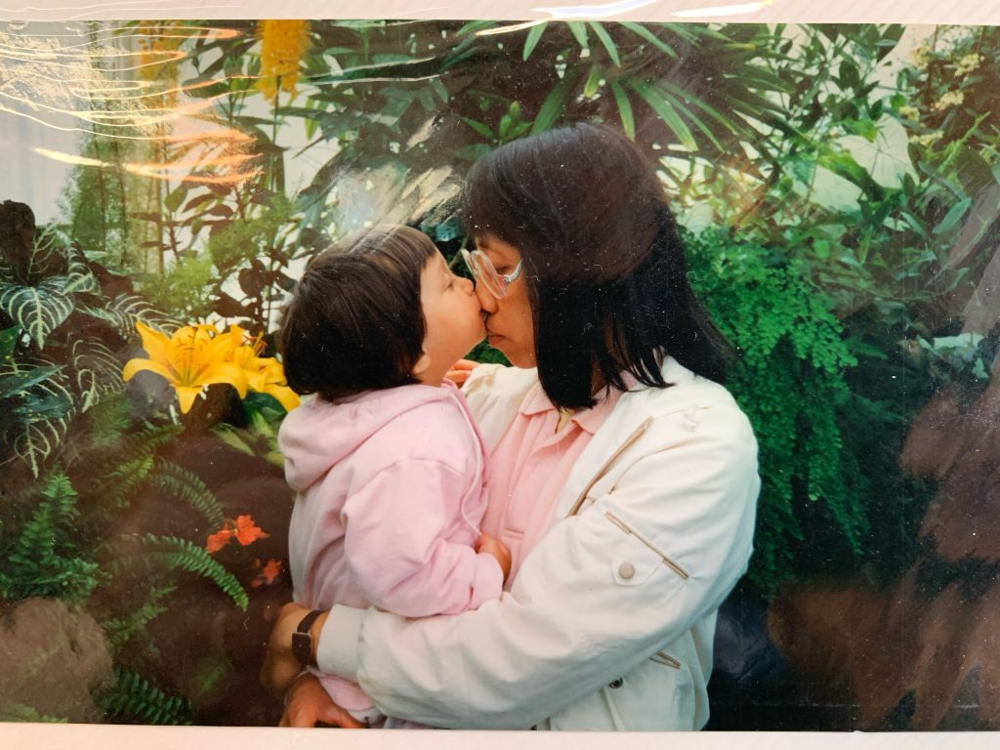
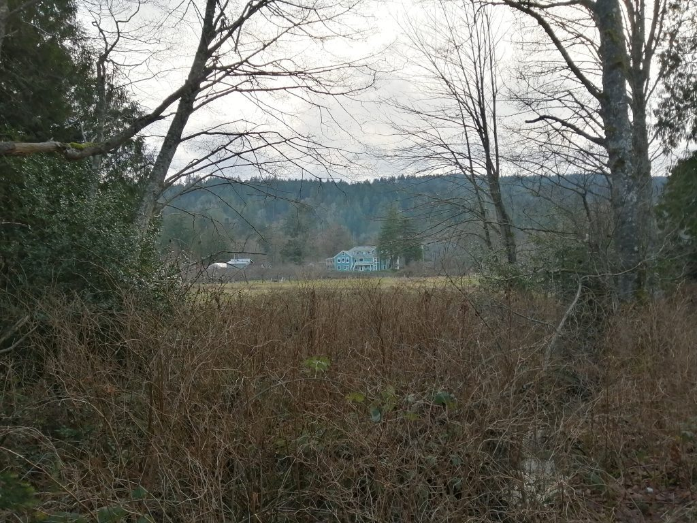
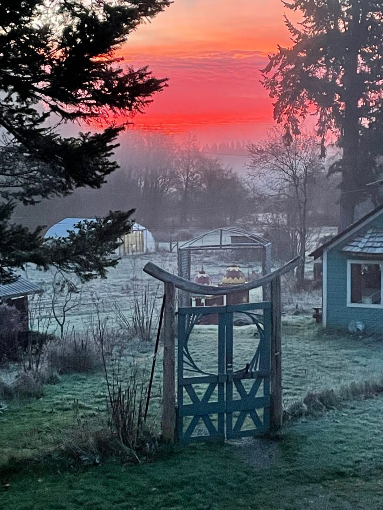
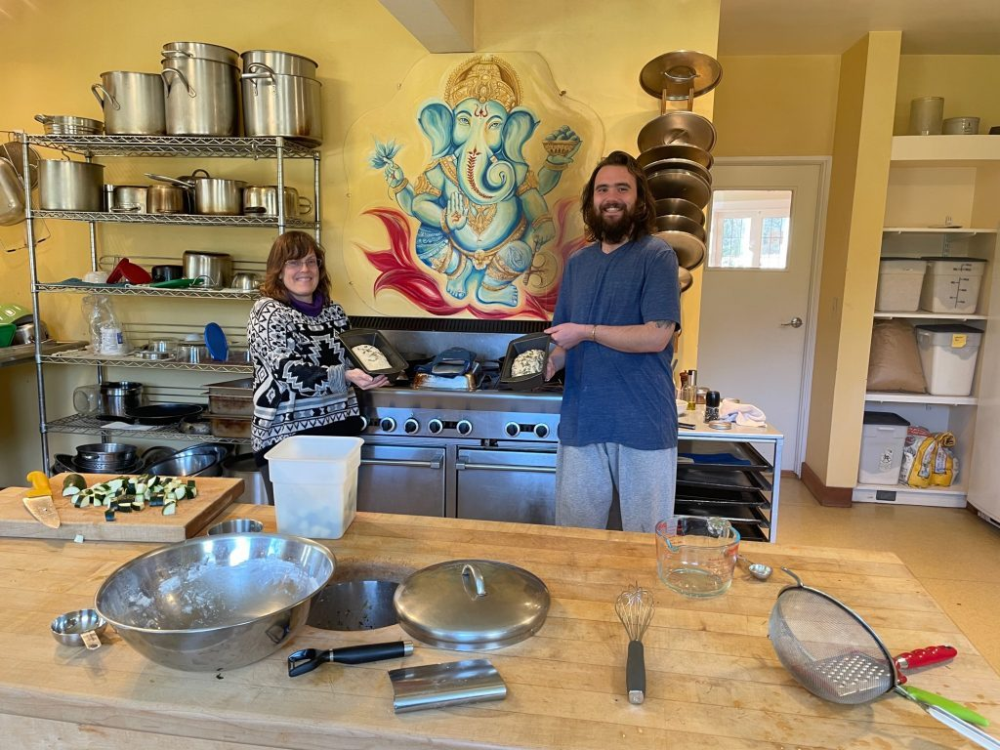
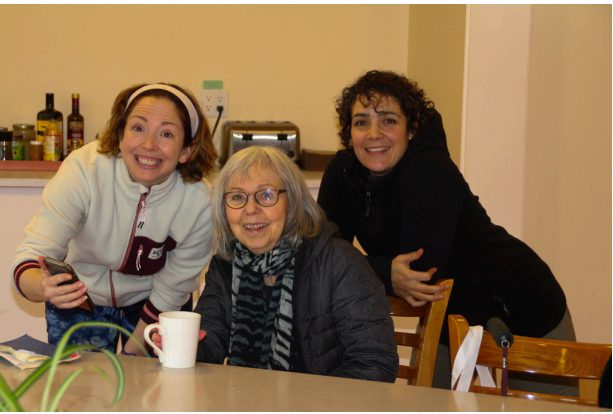
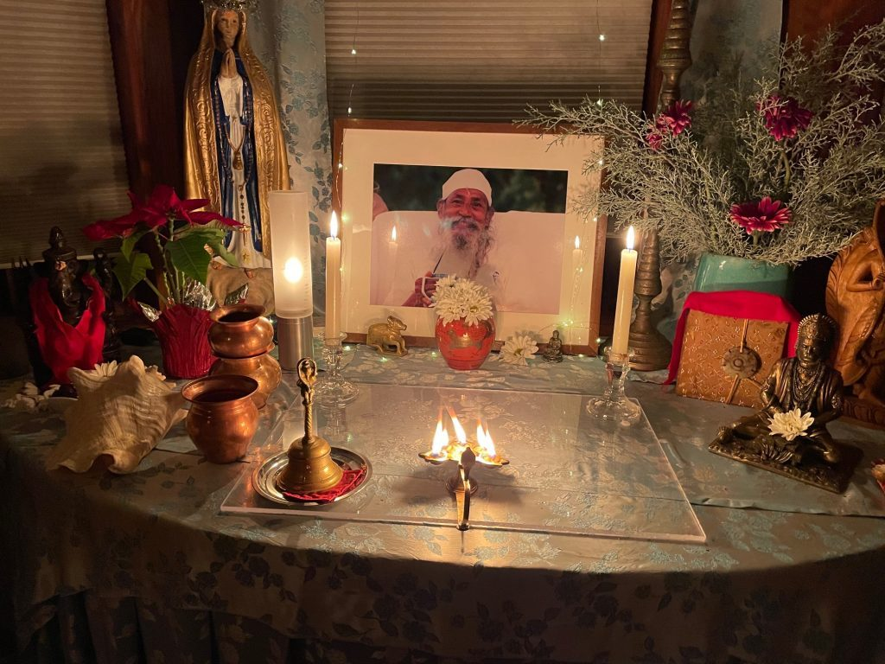
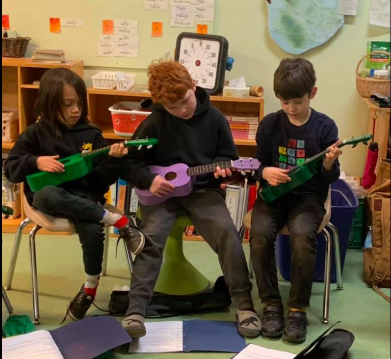
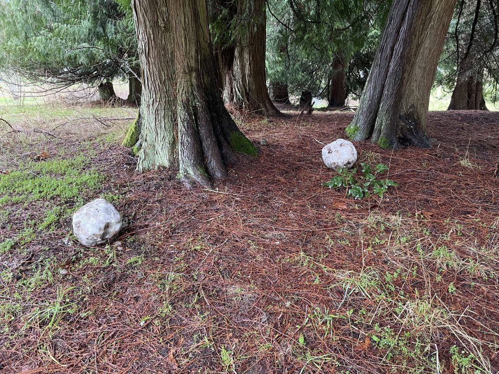
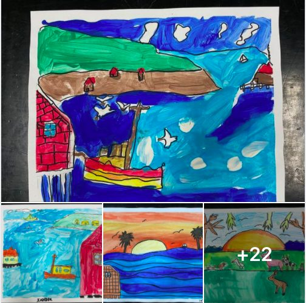

*We will always love Chandra Prabha, who has been  gone for 16 years. Her daughter,  Amita, (The little child in this photo) has written: Every day I work in your honor to make our world better. And so that others don’t have to die as you did. Je t’aime.*

Dear friends,

February is just beginning (and is therefore still winter), but the robins have been spreading the news that spring is around the corner, despite the possibility of snow still to come.

*crisp winter scene*

Congratulations to our American friends on new beginnings. Covid is still keeping us apart physically, but we remain connected in our hearts and on zoom (which Divakar calls zoOM.)

*frosty morning sunrise*

Our small residential community has been getting important projects done. One example: Suneel, with the assistance of Courtenay, has managed to upgrade our wifi connection, with some complex rewiring, involving crawling through cramped spaces inside closets and attics. We’re so happy to have Courtenay back with us - not full time, but a few weeks at a time. Dan will also be returning soon for a month or so, to put some energy into the garden, and Noelle, who lived here years ago, is back with us for a while.

*Noelle and Alex*

*Courtenay, Sharada, Marion*

## Classes and Programs

Satsang continues every Sunday, as do Bhagavad Gita and Yoga Sutra classes. **[F](https://saltspringcentre.com/programs-retreats/public-offerings/)****[i](https://saltspringcentre.com/programs-retreats/public-offerings/)****[n](https://saltspringcentre.com/programs-retreats/public-offerings/)****[d](https://saltspringcentre.com/programs-retreats/public-offerings/)****[o](https://saltspringcentre.com/programs-retreats/public-offerings/)****[u](https://saltspringcentre.com/programs-retreats/public-offerings/)****[t](https://saltspringcentre.com/programs-retreats/public-offerings/)****[m](https://saltspringcentre.com/programs-retreats/public-offerings/)****[o](https://saltspringcentre.com/programs-retreats/public-offerings/)****[r](https://saltspringcentre.com/programs-retreats/public-offerings/)****[e](https://saltspringcentre.com/programs-retreats/public-offerings/)**.

Some asana classes are taking place in person in the satsang room, with all covid protocols being followed - distancing, sanitizing, etc, while other classes continue online. [**Explore yoga classes**](https://saltspringcentre.com/yoga-classes/).

Home Yoga Retreats are back! In response to feedback from participants, these retreats are now scheduled on Saturday and Sunday. **[Check the dates and register here](https://saltspringcentre.com/programs-retreats/home-yoga-retreat/).**

Stay tuned for news about Shiva Ratri on the website and on Facebook. One thing I can tell you for now is that it will be on March 11, and that it may be a joint endeavor, with Salt Spring Centre of Yoga and Mount Madonna Centre. There will be very few people onsite, with most of it being online, some of it live streamed and some on zoom. We’ll let you know more in the March newsletter.

## Monthly Fundraising Update

Thank you to all of you who continue to support the Centre. It all helps and is very much appreciated.

**The total for 2020 came in at $52,177.42. That’s pretty good for our little engine that could!**

We’re still aiming for $300,000.

### [**Donate now**](https://saltspringcentre.com/donate/)

---

## School News

The Salt Spring Centre School students are having a great year despite the times school had to be online because of Covid. In fact the school is expanding by adding a grade 6/7 class for the 2021/22 school year. Here are a few recent school photos.

*Learning to play the ukulele*

*The start of a snowman*. *That's all the snow there was, and then it all melted!*

## Great Reads

Some great reading for you by Kenzie Pattillo, Courtenay Cullen, and  Broderick Rodell.

Kenzie says that in the early phases of the pandemic, when someone asked her how she was doing, she’d say she was holding steady, but by the second wave, she felt her anchor dragging. She writes, “I began to think about ‘holding steady’ as a practice of keeping my balance on a path made unsteady, towards an unknown future.” She took that question to her mat to find a way to take it into the rest of her life. She reminds us that **[though the path may be unsteady, we can find the way](https://saltspringcentre.com/holding-steady/)**.

Coutenay recently returned from a wilderness adventure in the Canadian Outdoor Leadership Training program in Strathcona Park, BC’s oldest provincial park. In ‘[**The Wilderness Without, and Within**](https://saltspringcentre.com/the-wilderness-without-and-within/)’ she shares with us, in words and photos, what she learned about her innate relislence that she didn’t know she had, and how she re-learned about the unity of all life. Her description of her white water canoe trip had me on the edge of my seat.

I’d like to introduce you to Broderick Rodell, who gave a talk at Mount Madonna’s most recent online retreat.  He spoke about choosing light over darkness, ‘[**Turning Towards the Light**](https://saltspringcentre.com/turning-towards-the-light/)’. I was inspired by his gentle voice and the sincerity of his message, and asked him  if he’d be willing to share it with the readers of this newsletter. He wrote it as an essay that I’m delighted to share with you.

*Love for the small self veils the divine within. Love for the divine Self reveals the divinity in everything. ~ Baba Hari Dass*

Love,  
Sharada
