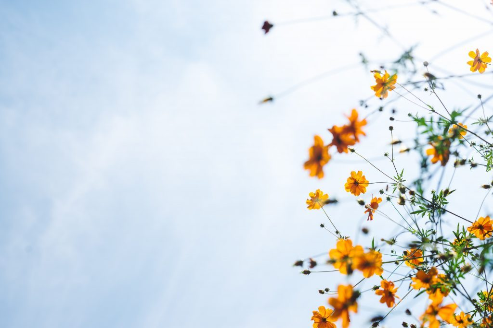
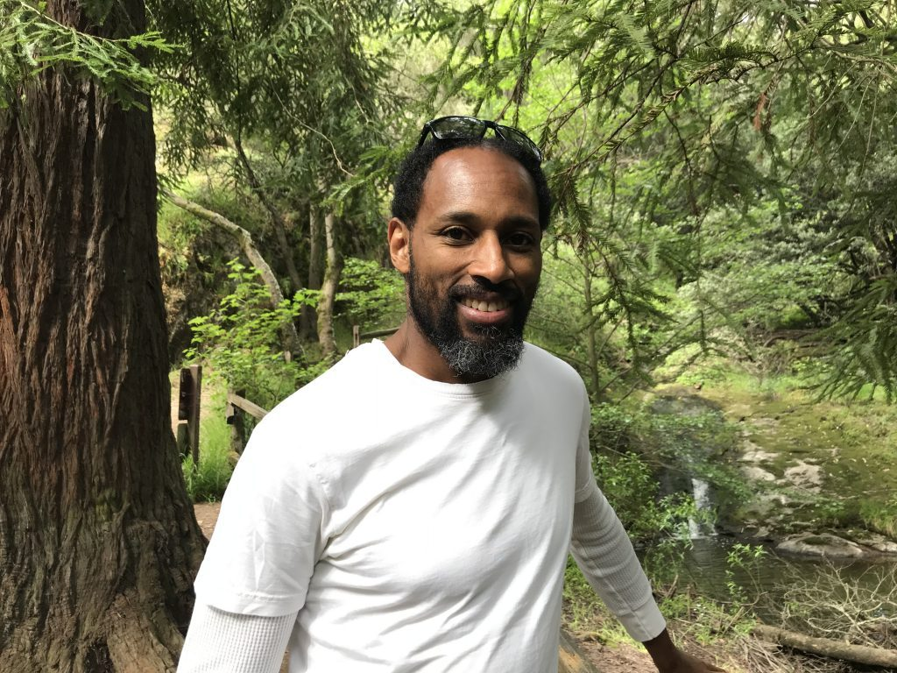

**by Broderick Rodell PhD, ND, E-RYT**

Within each us we have the potential for darkness and light, and we have the choice to pursue either. If we choose to turn towards light, we will realize that it is an ongoing, never-ending process so long as we are embodied beings on this planet.

Darkness represents ignorance, not knowing, as well as the misplacement or misapprehension of knowledge. The implications of ignorance can lead to unnecessary suffering, resulting in a spectrum of consequences from the minor to the catastrophic. For example, not knowing the proper etiquette, social norms, or laws in a particular society can lead to embarrassment in minor situations or even imprisonment or death in others. And indeed, our actions may cause unintended harm to others when we lack the knowledge of our interdependency and interconnection with the universe, planet and all beings. The implications of climate change are a clear example of this. Unaware of the consequences of our actions on the environment not only harms ourselves, but also creates unfortunate and unnecessary quandaries for future generations to contend with. Broadly speaking, not knowing who we truly are and our place in the world, leads to a life of suffering and bondage not only for ourselves but for others as well.

The way out of darkness is through the light. Light represents awareness, knowledge and a clear understanding. The characteristics of light as it is reflected in the world in our lived experiences is associated with human wellbeing and flourishing. The positive virtues of goodness, beauty, truth, love, compassion, kindness and wisdom are reflections of light in how we show up in the world. Ultimately, light provides insight into the true nature of things.

We have the potential for both ignorance, which lends to unnecessary suffering, and knowledge, which advances us toward more wellbeing and greater virtue. We have a choice in what direction we go. If we choose to pursue light, life becomes a process of illumination in a sea of darkness. A process of expanding our awareness and knowledge in a world full of unknowns. By choosing to advance our light in the world we embark on a process of developing our capacity to bring out, expand and intensify our light, and thereby shining our light in our interactions with the world.

This movement from darkness to light is an awakening process, a learning process, an educational process, a process of self-cultivation and character development. By cultivating the characteristics of goodness, beauty, love, compassion, kindness and wisdom we embark on a path to living virtuously and being a lamp unto the world.

To be most effective, this process of educating and developing ourselves ought to include various dimensions of our experience. An assortment of these include spiritual, physical, mental, emotional, social, interpersonal, moral, environmental and political domains of experience. Below is offered a brief description of them and the implications of giving attendance to them.

- Spiritual development is cultivating knowledge of who we truly are beyond the stories of ourselves couched within the surface of our skins. Spiritual development is arguably foundational to any form of character development, because it gets to the root of our true nature.
- Physical development entails learning how to best care for our body. This includes learning how the body works and what we can do by way of activities to enhance its functioning. Getting to know our unique bodies and applying the most effective exercises and diet to support our wellbeing.
- Mental development is learning about how the mind works and how to care for it in order to best serve the characteristics of virtue. This includes cultivating a worldview that can deal with complexity and allow us to take multiple perspectives. Also, developing our cognitive capacity for critical thinking and sense making is vital to illuminating our light.
- Emotional development is learning how to work with our emotions. Emotions are not aberrations. They have played an essential role in our evolution as a species and continue to serve us. So, it would behoove us to get to know them and learn how to properly navigate their expressions in our lives. This is a process of cultivating emotional agility and intelligence.
- Social development involves becoming aware of the social norms, laws, and etiquette in order to navigate the social world with effectiveness, grace and virtue.
- Interpersonal development consists of building skills on learning how to relate to others with love, kindness and compassion, including learning how to relate to others with dignity and respect for their humanity.
- Moral/ethical development is an extension of social and interpersonal development. It involves continually asking ourselves how best to treat others that maximize wellbeing. We decide to live virtuously not only for ourselves, but out of care and concern for the wellbeing of others.
- Developing our environmental awareness enhances our sensitivity to the implications of our actions on the environment, and developing our understanding of our place within the ecology of this planet. How are we a part of the web of life, and how do we best live to facilitate harmony with all of life and nonlife?
- Developing our political intelligence is a process of enhancing our understanding of how governance work, and the part we play in it intentionally or not. What are the implications of participating or not in my own governance? This dimension of our being is often overlooked and neglected in some spiritual seeking circles. A close look at recent and past history would suggest otherwise.

These are just a few of the domains of our experience. You may think of the various other ways that you interreact with the world. What’s important is that we include as much as we can about our experience so that we can most effectively cultivate ourselves in service of shining our light. The more aspects of our being we consider in our self-cultivation process, the more we are capable of illuminating the world with our presence through our actions.

We have a choice. We have agency. How are we going to apply our will and our capacity to choose? Are we going to actively pursue the expansion of our light? If we want to see more light in the world, it is up to each us. It starts with each one of us doing our part in developing our capacity to be a lamp unto the world, to be of service to the world.

---

**Broderick Rodell PhD, ND, E-RYT**, is an educator whose passion and calling is to aid others in the art of practicing a life well lived. He sees his role as a guide to those interested in acquiring the knowledge, skills and practices that will enable them to develop the characteristics that are conducive to self-realization, wellbeing and flourishing. A holistic approach to yoga that embraces a broad spectrum of truth claims from past to present over various traditions and disciplines is his means. Capoeira, a Brazilian dance/martial art, is also one of his teaching instruments for developing character and building community.

---

Nature Photo by [Masaaki Komori](https://unsplash.com/@gaspanik?utm_source=unsplash&utm_medium=referral&utm_content=creditCopyText) on [Unsplash](https://unsplash.com/s/photos/peace?utm_source=unsplash&utm_medium=referral&utm_content=creditCopyText)
