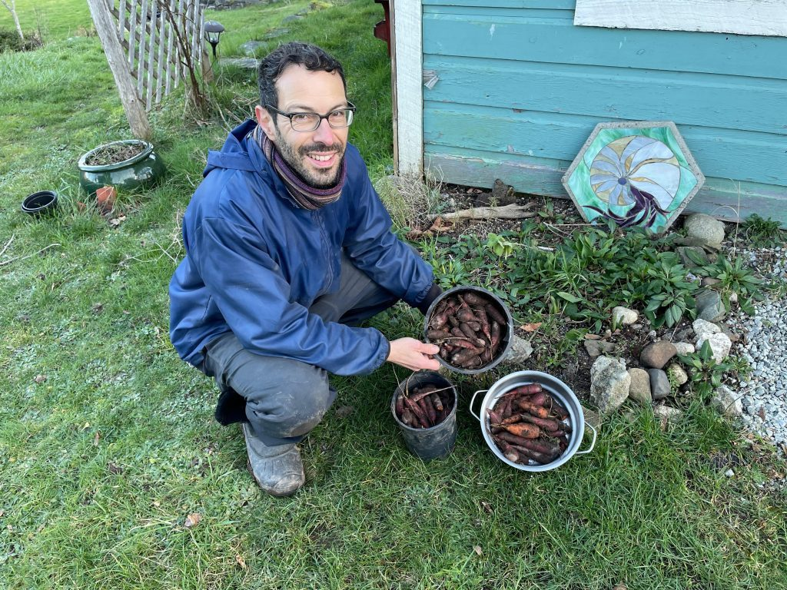
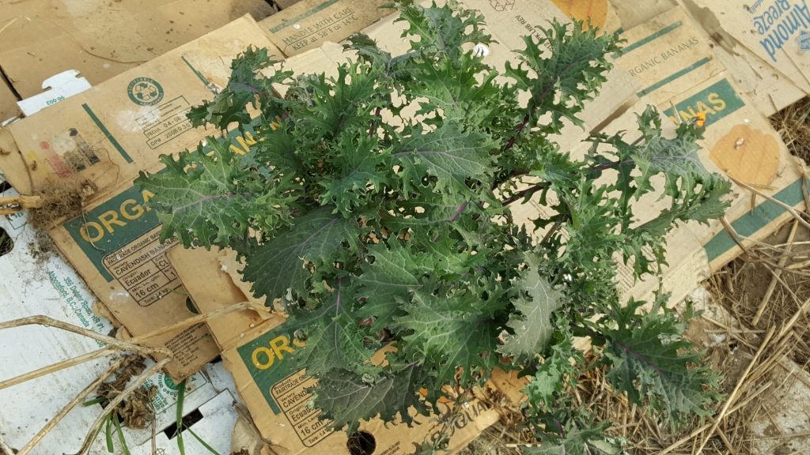
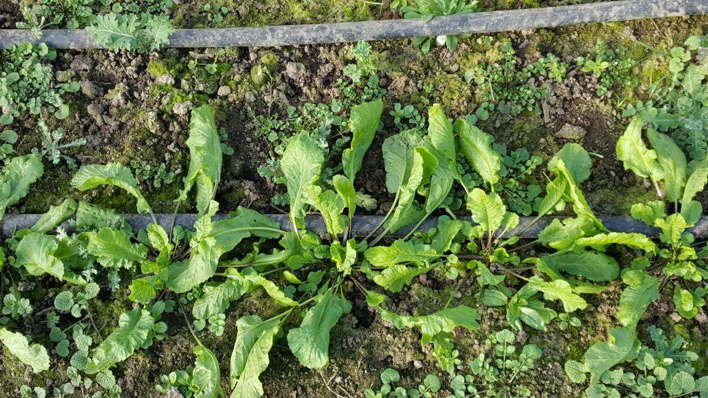
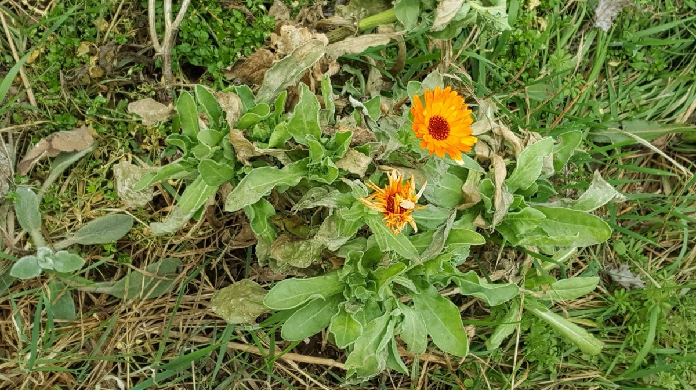
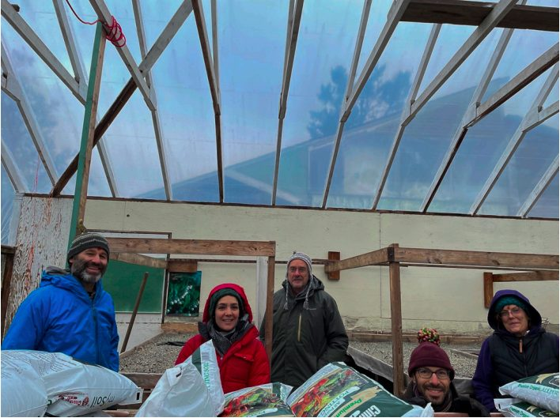

*Dan harvesting carrots in winter*

When I realized I wouldn’t be able to go on my usual volunteer farming trip outside Canada this winter, I thought it would be a good opportunity to return to the Centre for a few weeks to help open up the farm here and get some exercise in the process.

After a weeklong drive that began with a dead battery on the morning I planned to leave Ontario and featured wildly fluctuating temperatures and multiple snowstorms along the way, I was invigorated to be greeted by sunshine and unseasonably warm temperatures on my ferry ride to the island.

I immediately began planning in my mind all the things I would do when I arrived at the Centre, but of course I had to isolate first, so my initial activities mostly involved pruning the blueberry bushes and a few trees in the orchard, as well as doing a bit of a clean-up in the greenhouses and the fields.

*fresh young kale*

When I got my confirmed negative Covid test nearly a week later, my thoughts turned towards harvesting some overwintering leeks, carrots and kale from the field, as well as seeding some hardy crops such as peas and winter greens. And then for the next 48 hours, snow buried everything in the field and piled up nearly a foot high on the roofs of our greenhouses, preventing any light and heat from entering the glasshouse where we typically start our seeds at this time of year.

Once again, I was forced to shift my plans, which mostly revolved around shovelling snow and feeding the birds that spend their winters on the land. At this point, rather than trying to compete against nature and going against the flow, I decided I would be patient and surrender to whatever was coming my way, something I have often been reluctant to do during this year of pandemic restrictions and lockdowns.

*fresh winter cress*

*Early calendula*

And now, as March approaches, the snow has largely melted, many of the trees in the orchard have begun budding, and some of our overwintering vegetables have become visible and accessible again, so I have been able to harvest a few things for the Centre kitchen and have even managed to start seeding the first few trays of the season.

*Planning the garden - Mahavir, Marion, Dan Jason, Dan N, Noelle*

What is even more exciting news for the Centre farm is that Dan Jason has agreed to grow a considerable amount of his crops on the Centre property this season, with the intention of saving seeds for his seed company as well as growing food for the Centre to consume, a plan that was recently conceived between Dan and Mahavir. Much of the Centre community will work closely with Dan Jason to help support him throughout the season.

Stay tuned for next month’s newsletter, when more information will be provided about prospective seedling sales in April and May for your own gardens.

In gratitude,  
Daniel Naccarato
