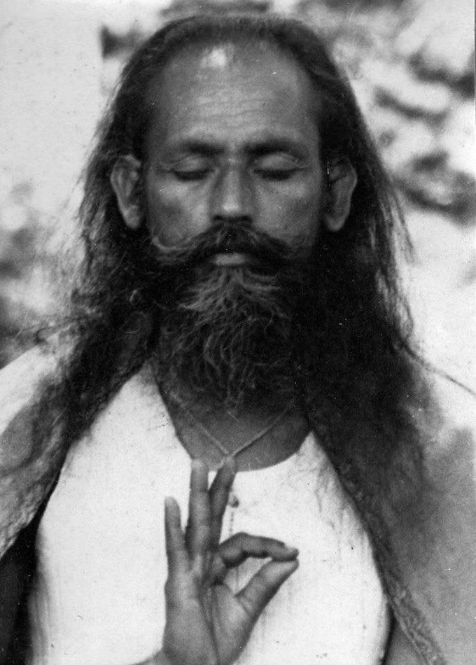

We human beings like to think we can control what happens in our  lives, yet there is so much that is not in our control.

Each of us comes into the world with certain tendencies. We can’t change our height, our body type, the colour of our skin, our age or the family patterns we have inherited. We have to work with what we’ve been given. We can eat well and take care of our bodies, we can do our practices, but there are some things we can’t do anything about. These are built-in limitations. If we don’t accept them, we suffer.

*Non-acceptance of life is pain.  For instance, when one gets older and does not accept age, there is pain.*

*Peace is there when desires are limited. Without limitation of desires, a person is like a deer who runs in a desert chasing a mirage of water without ever finding real water.*

Even if we fully accept our inborn limitations, things happen that are not of our choosing; we don’t know what the future holds. We may get sick, someone close to us may get sick, someone we love may leave or die. An accident could happen, changing what we imagined to be the course of our lives. We may lose our job, our health, or something else we’re counting on. It’s also true that unexpected, wonderful and joyful things can and do happen, but they’re not usually the kinds of events that throw us into a tailspin.

What helps us in those situations? Paradoxical as it may seem, our own self-chosen limitations can come to our rescue. Limiting our desires can support us and keep us from going off the deep end when challenges arise. Without that support we can easily fall into depression or anxiety, reverting to old habits of blame, indulgence in food, drink, other substances, or overwork  to name a few. If we create limits in our day to day life, we are less likely to fall into those traps. This applies in all areas of life: our diet, our entertainment choices, the way we speak to each other. Limiting options is a kind of austerity, one that can support us regardless of what happens.

*Austerity means effort to control desire. It is chosen, not forced. Doing your duty is also austerity when you watch your attachments and self-interest and try to remove them.*

*There is no peace if there is no limitation of desires. That’s why we make rules - to imprison our desires.*

*Life is not a burden; we make it a burden. If we accept the law of nature, which is birth, growth, decay, and death, then life will flow in its natural course. We don’t accept life as it is. That’s why it becomes a burden.*

In order to be able to access healthy choices when times are tough, it helps to establish a regular practice and stick with it.  There are millions of methods, but in order for practice to make a difference, you have to do it.

*By doing sadhana regularly, will power builds up. The first thing is to do sadhana every day in the morning. Gradually the mind will accept the discipline of doing sadhana and then will be able to accept other disciplines.*

*A cotton thread can cut an iron bar if passed over it daily. If you work on yoga, yoga will work on you.*

---

Contributed by Sharada  
*All text in italics is from writings by Babaji*

**Sharada Filkow,** a student of classical ashtanga yoga since the early 70s, is one of the founding members of the Salt Spring Centre of Yoga, where she has lived for many years, serving as a karma yogi, teacher and mentor.
