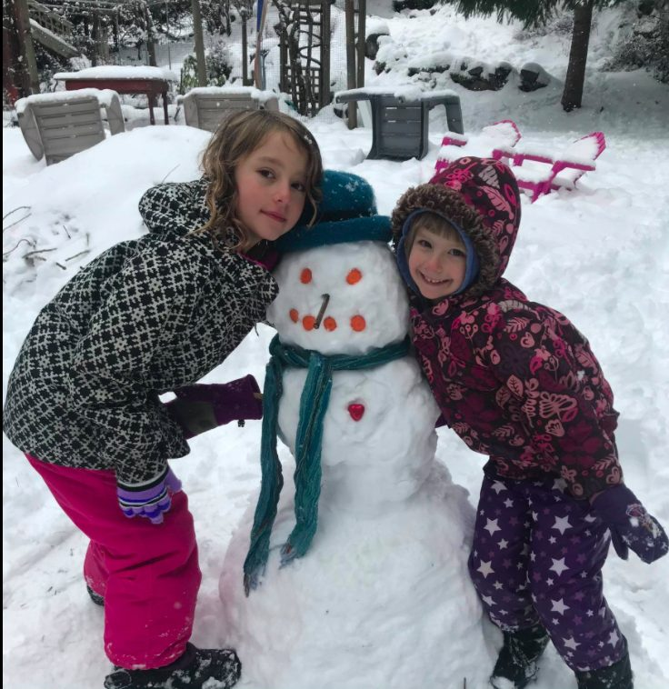
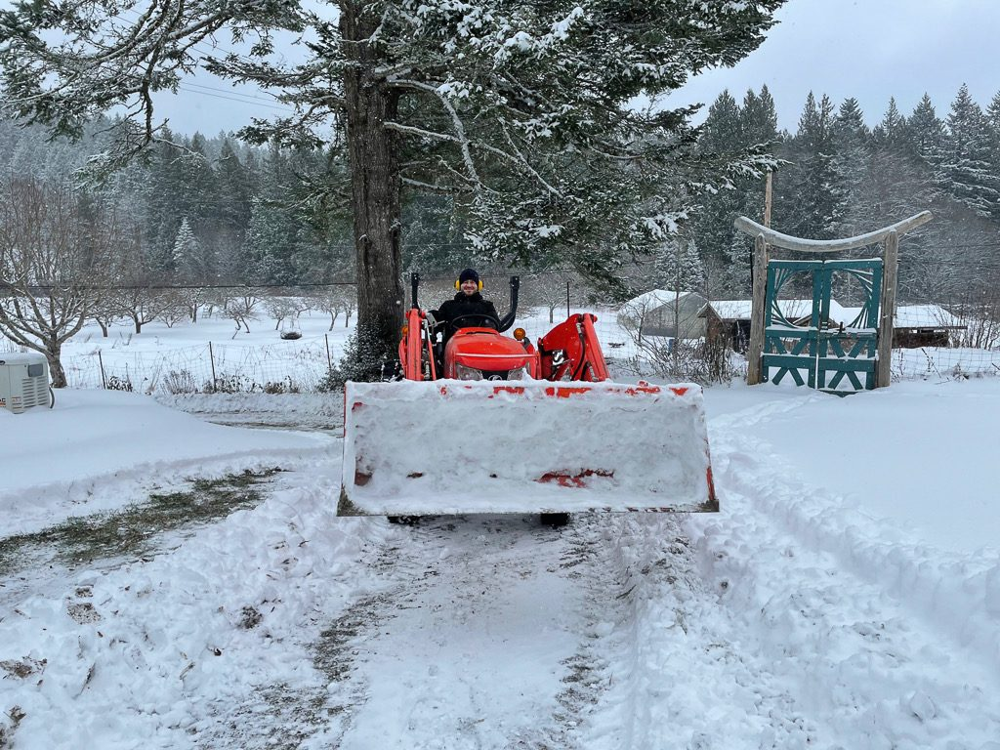
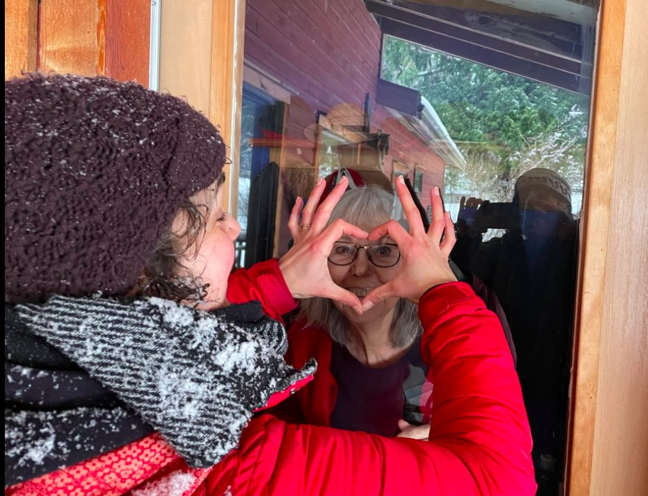
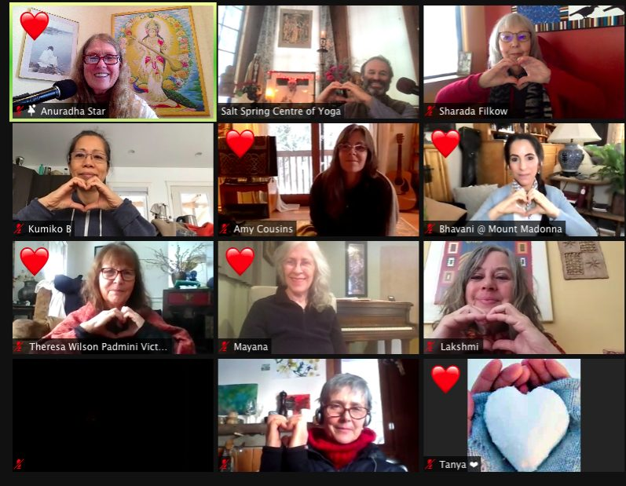
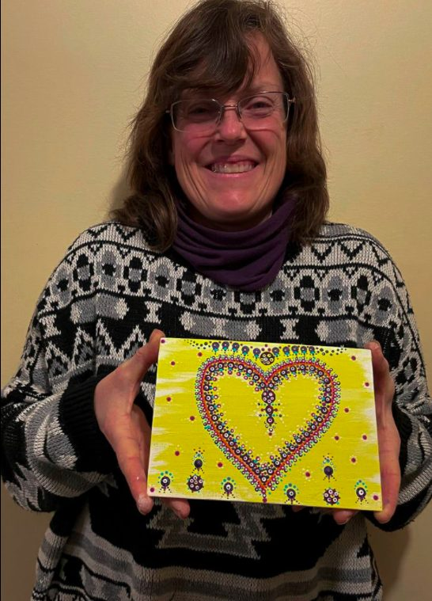
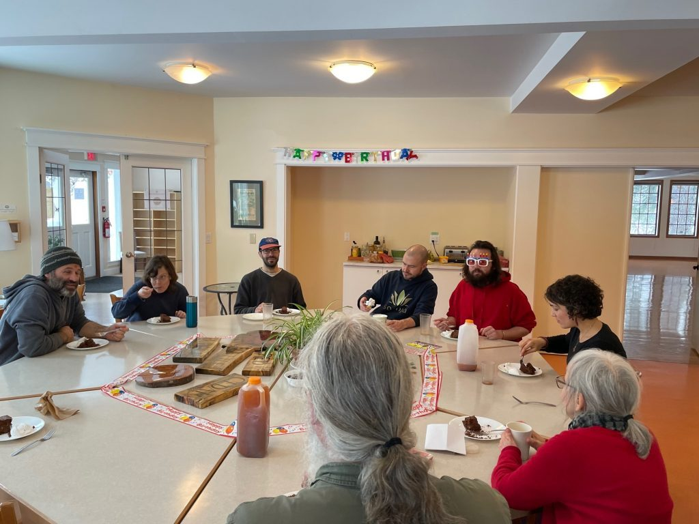
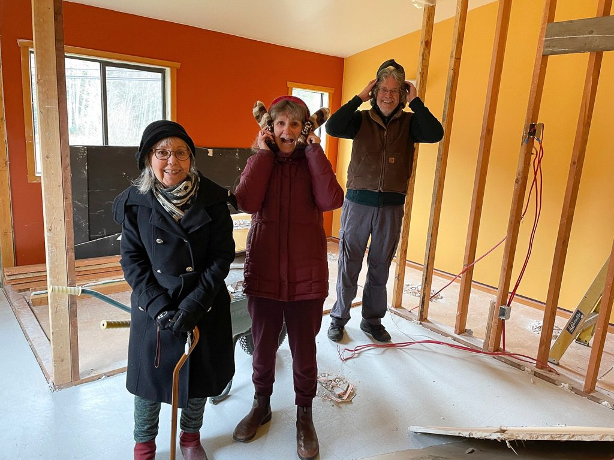

*Work honestly, meditate every day, meet people without fear, and PLAY. ~* Baba Hari Dass

*Penny and Laurel and their snowperson with a chocolate heart*

Dear friends,

Last month I wrote that the robins were spreading the word that spring is just around the corner. That is true, but first there was time for a February winter snow storm.

*Santosh clearing lots of snow*

Here are some Valentine photos taken in the snow - spreading the love.

*Marion and Alex**Marion and Sharada - and Anuradha taking the photo*

*Noelle*

## Happy Birthday Mahesh!

Mahesh, who has been part of our satsang family from the beginning just celebrated his 87th birthday. Here’s a photo of him with Babaji from the late 70s. Happy Birthday Mahesh!

*Mahesh and Babaji in the late 1970s*

## Comings and Goings

*Birthday and farewell lunch for Alex (in birthday glasses) - Mahavir, Noelle, Dan, Santosh, Alex, Marion, Sharada, Suneel (Anuradha taking the photo)*

Dan Naccarato (farmer Dan) drove across Canada from Ontario to help get the garden started. He arrived during the coldest week of the winter, and then ended up shovelling snow rather than planting seeds. He’ll be here for a few weeks yet, so there’s still time to do some planting.

Noelle Rees, who lived at the Centre years ago, has returned, and we welcomed her with open arms (virtual hugs, that is). We’re delighted to have her back in the community.

Coutenay is back for a couple of weeks. We’re always happy when she rejoins the community, bringing her smile and sparkle back to the Centre.

Alex has moved to Vancouver Island. We already miss him, but he promised to keep in touch. Marion drove him to his new home in Parksville, and took some photos of him, in shorts, standing in the ocean.

One community activity that has continued for months is jigsaw puzzle mania. So far, nine 1000-piece puzzles have been completed. The next one will require a major rearrangement of tables in the dining room to make room for a 9000-piece puzzle of The Garden of Earthly Delights, a painting by Hieonomous Bosch.

## Shiva Ratri

This month marks one year of the Centre being closed to in-person classes and gatherings because of Covid. It is also a year since last year’s Shiva Ratri celebration at the Centre. Along with everything else, Shiva Ratri will look different this year because it will be online. Both the Salt Spring Centre of Yoga and Mount Madonna Center will offer parts of Shiva Ratri online. You’ll be able to zoom in to our Shiva Ratri pujas and kirtan, beginning at 7 pm on March 11, through to the morning of March 12. MMC will be livestreaming the pujas and some pre-recorded kirtan. Check both websites for details: [Salt Spring Centre](https://saltspringcentre.com/) and [Mount Madonna Center](http://mountmadonna.org/).

## We need a new truck!

In the past month, we were sad to say farewell to the Centre’s land truck; the transmission died,  and it wasn’t worth repairing, so we’re on the lookout for a replacement. We need a small truck for many purposes, from trips to the recycling depot to hauling building materials. If you have any leads on a replacement truck, we’d love to hear from you. You can email [maintenance@saltspringcentre.com](mailto:maintenance@saltspringcentre.com)

## Garden House Renovations

*Checking out the Chikitsa Shara renovations - Sharada, Rajani, Ompk*

A new project has just been completed in the Garden House. The two small rooms in the Chikitsa Shala side of the building have been made into one larger room. Since Rajani stepped down as the manager of Chikitsa Shala, and the fact that Covid has brought a stop to treatments, the room will be rented to two healthcare professionals: a naturopath and a psychologist/Feldenkreis practitioner (alternating days). They’ve been practicing on Salt Spring for many years, we know them well, and we’re happy to welcome them to the Centre. A big thank you to Suneel and others who worked on it, and to Painter Bob who came for a week to paint the room and also two of the cabins. He’s helped with painting here for years. We’re grateful for his skills and his positive, always-wiling-to-help attitude.

## AGM in May

If you’re a member of [Dharma Sara Satsang Society](https://saltspringcentre.com/dharma-sara-satsang-society/), you will be receiving a notice about our AGM, which is coming up on May 22. If it seems close to the last one, you’re right. The last AGM in November covered a period of 20 months, and now we’re back to our usual spring AGM. If you’d like to be more involved but haven’t yet become a member, now is the time to do it.

## Meet us Online!

Our popular [Home Yoga Retreats](https://saltspringcentre.com/programs-retreats/home-yoga-retreat/) continue each month. Check the dates, and come join us.

Check the regular [online offerings](https://saltspringcentre.com/programs-retreats/public-offerings/) as well. If we can’t be together in person, we can still be together; I hope to see you there.

## Supporting the Centre

We are grateful for the [financial support](https://saltspringcentre.com/donate/) we’ve received from our community thus far. Your support allows us to continue to offer yoga teachings and practices online. Whether you’re able to make a monthly or one-time donation, know that every bit helps.

*“Never doubt that a small group of thoughtful, committed people can change the world. Indeed, it’s the only thing that ever has.”* ~ Margaret Meade

## To read this month...

What is it like living at the Centre during lockdown? A few members of our small residential community who have been here during this time of closure, share their reflections about their experience of living in our community bubble for all these months: [Marion, Satosh, and Mahavir](https://saltspringcentre.com/reflections-on-life-in-the-centres-bubble-during-covid/). Also, here’s [A Time for Everything](https://saltspringcentre.com/a-time-for-everything/), Dan’s story about his journey across the country to get the garden started, just in time to shovel snow.

In digging through the archives, I came across  ‘[Accepting our Limitations](https://saltspringcentre.com/accepting-our-limitations-2/)’ which was first printed in the newsletter in 2015. It remains relevant, whatever is going on, and  particularly in the middle of a global pandemic that we have no control over.

Regardless of our limitations, it’s helpful to remember that the light is returning. Daylight Savings time begins on March 14. Here comes the sun!

*Life is not a burden. We make it a burden by not accepting life as it is. Wish you happy. ~ Baba Hari Dass*

Love,  
Sharada
