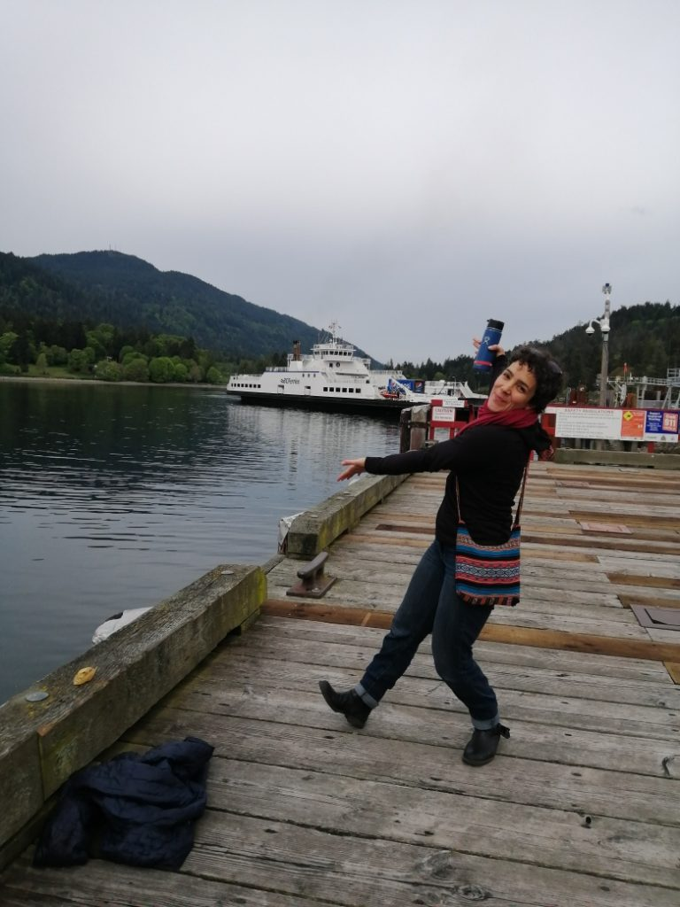
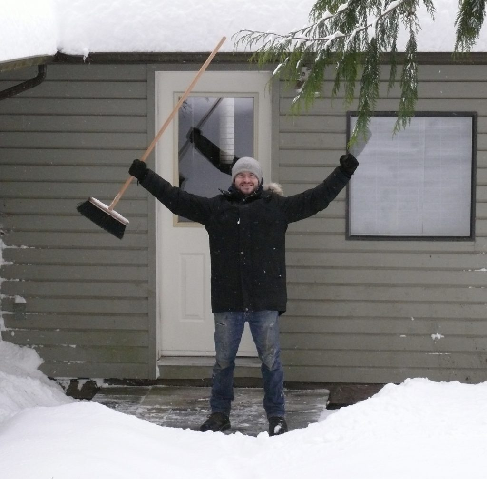
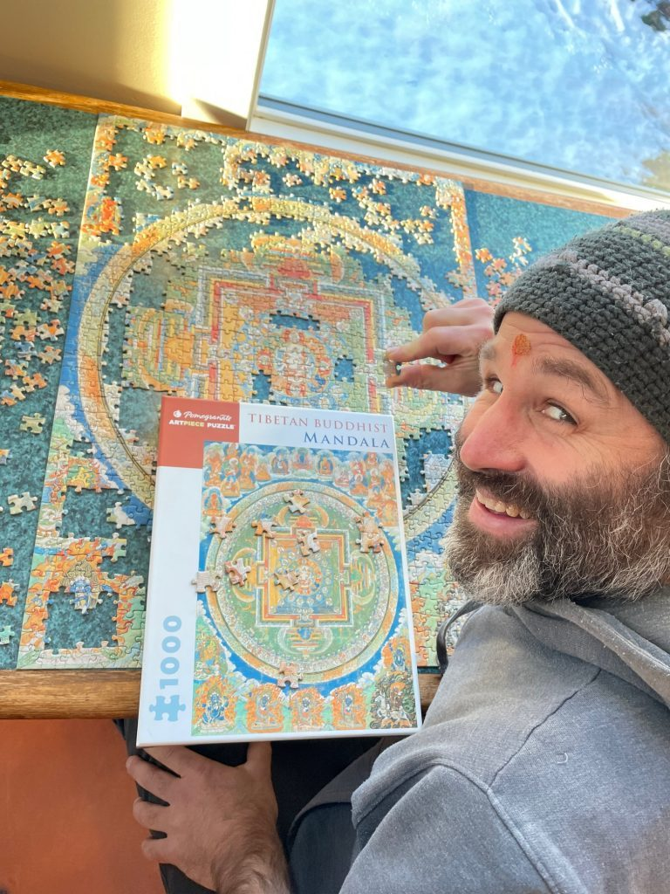

## Marion

When I arrived a year ago I was excited to see how the Centre operated with all the programs and retreats, with lots of new people coming and a lot of connections with people. None of that happened. First of all it was winter, and the one Yoga Getaway that happened during that time was very small, and the community was small. I was excited for all the things that were about to happen, and also curious about how the summer was going to be. I’d had a taste of what the Centre could be at Shiva Ratri - and then Covid shut the Centre down.

Rajani had offered to train me in Ayurvedic treatments, but unfortunately that didn’t happen. I worked in the garden, growing veggies all summer - me, Dan and Lotte. It was a lot of fun; then Lotte left at the end of July. At the beginning of July, the plan was that the community would be reduced by the end of August. . Slowly more people began to leave and the small winter community began early. I wasn’t supposed to stay at first, and I didn’t know what I’d be doing by mid-August. For a month and a half I enjoyed being in the garden, knowing it would end; I was happy to ‘be here now’, not trying to make a plan. I cherished the joyous moments in the summer. I had no plans.

I was going to hike the Juan de Fuca trail by myself, thinking I would get clarity. That was to be the transition to being on my own. After five days on my own I didn’t find any clarity and I still didn’t have a plan. The day I came back, I got a message that someone on the board wanted to talk with me about being in the garden, coordinating the harvest. I wasn’t sure; I was a bit scared about staying through the long, cold, lonely winter. But I stayed, and I’m still here.

It was challenging, yet interesting at the same time. There’s been time for a lot of introspection and learning. I’ve learned a lot from people in the community; there’s been lots of teaching and support. Though it wasn’t always easy, it’s been a gift to be here.

## Santosh

Except for a visit home at Christmas, I’ve been here since May 2019. Being here during Covid has been extremely challenging for me. It’s a completely different lifestyle from what the Centre is usually like, and I’m not doing what I had been doing before. With so few people here and so many changes, I’ve felt lonely.

At first I wondered when this tidal wave would pass, and then realized this is just how it is now. Is this new reality of the ongoing battle with virology  going to go on forever? It’s been hard to comprehend in multiple ways; existential questions arise.

At the same time I’m dealing with serious health concerns that are very challenging - and more so because we’re in the midst of a pandemic. I’m working on not feeling terrified about what life could be like, and at the same time, meditating and trying to not have my moment-to-moment experience contaminated by fear and resistance. I’m focussing on learning to surrender, developing nonattachment, letting go.

During all this it’s definitely better to be here at the Centre than elsewhere; If I were back at my parents’ or on my own, I’d feel more lonely. There is more support here to be able to find peace with what is.

## Mahavir

On one hand, being at the centre through covid has been disorienting. All of the cycles, rhythms and systems, even our reason for being, are organized around curating a place for people to come and gather. So navigating the collapse of that - to go though such a drastic change - has been astonishing.  On the other hand, Babaji has always taught doing actions which serve the world, but to do so with non-attachment. To do it with a sense of being in the present moment and not being psychologically invested in the future outcome, and so it's also been a magical time as all of the delight, love and peace of the Satsang continue to make themselves apparent and available in other ways. The non-attachment has freed up energy to adapt and find other ways to serve.

I've been inspired by the insight which had students recognize that it was "the energy of the Guru" which provided such vibrancy to community life on the land here and elsewhere, and their wondering how to keep that energy going when the Guru is gone. Babaji said something like "you do the practices that the Guru gave you to do." So for me it's primarily Karma Yoga - having the attitude of selfless service. And beyond pitching in as I can in the kitchen, housekeeping, garden, maintenance etc., I've taken on an accent of maintaining and advancing Babaji's ceremonial offerings. I make sure the candles are lit at the temples each morning. I do regular pujas to Ganesh, Hanuman, Divine Mother, as well as full moon yajnas, and other occasions.

I've also taken to the online possibilities afforded by this time. In fact, when we realized the scope of the Pandemic, we stopped our in-person satsang, but managed to miss not-a-one as I was able to get them happening on zoom. So I facilitate zoom satsangs, Bhagavad Gita study group, chanting sessions. I attend the wonderful sessions offered by Mount Madonna, and I'm getting to spend more time with our brothers and sisters at the Vancouver satsang... how wonderful!!

