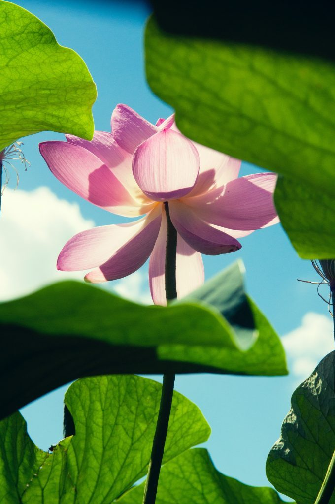

While we’re still in the midst of Covid restrictions, we continue to sing, study and practice online by zoom. There are weekly Yoga Sutra and Bhagavad Gita study opportunities as well as morning meditation offered by the Salt Spring Centre of Yoga, the Vancouver satsang, and Mount Madonna Center. These classes have brought the extended satsang community together in a way we couldn’t have foreseen a year ago. There are also [two satsang gatherings on Sundays](https://saltspringcentre.com/programs-retreats/public-offerings/) - from both Salt Spring and and Vancouver.

Here are some responses from regular attendees about what draws them to satsang and classes, and how these opportunities support them in their daily lives. Reflections by Kumiko Brueckner, Kathryn Kusyzsn, Anusuya Adams, Pratibha Queen, Joe Muller, and Chandrika Lajeunesse

---

***What classes and/or gatherings do you regularly attend by zoom?***

**KUMIKO**: Yoga Sutra Study

**KATHRYN**: Satsang, Bhagavad Gita Study, Yajnas

**ANUSUYA**: I love to attend Satsang, Sutra class, Gita class...whenever time permits

**PRATIBHA**: Occasional Sunday Satsang from SSCY; Tuesday Yoga Sutra class from MMC; Thursday Bhagavad Gita class from MMC; Saturday morning sadhana class with Divakar; Saturday noon: healing mantra from Hanuman Temple; Saturday afternoon irregular attendance at SSCY Yoga Sutra study class. Plus: weekly 3 hour astronomy class; occasional Buddhist meditations; weekly zoom singing class. Yes, I have a very busy zoom schedule!

***How do they support you in your practice and in your life?***

**KATHRYN:** I enjoy seeing the friendly faces of all generations, and I love the reminders that we are all ONE even though we are apart. Gita class inspires RS (regular sadhana), and the discussions are stimulating. Social time after Satsang is helpful in feeling less isolated.

**ANUSUYA:** These classes support me in my practice and in my life by connecting with my fellow yogis/satsang family. So nice to be with like-minded people - friends old and new. This makes me very happy.

**PRATIBHA**: They support me well. They keep me connected with the satsang, with group sadhana practice, with learning new things, with self-expression through music.

***What are you learning?***

**KUMIKO:** A sense of order and a way to surrender.

**KATHRYN:** That the teachings are for challenging times and that satsang is more important to me than ever. A greater devotion to the practice and guru is developing.

**ANUSUYA:** I’m learning so much on so many levels - always so much to learn. Discussions during classes show me a new way of looking at things - different angles of the mind. The connection is awesome and always a joy.

**PRATIBHA:** Astronomy, yoga philosophy, how to communicate in the virtual field, how to sustain connection from great distances.

***If it weren’t online, would you be able to attend?***

**KUMIKO:** Yes, if at home on Salt Spring, but definitely not from Japan. Having access to the Centre’s offerings when I was away was a HUGE help. Thank you for having them available online.

**KATHRYN:** Much less often.

**ANUSUYA:** Without zoom, I would not have the time to go to classes in person. I’m doing chiddcare for my four grandchildren, including on weekends. I’ve been busy working in care over the years, and I feel like I’m making up for lost time being with my yoga family.

***Despite the limitations of Zoom, what is it about it that is satisfying?***

**KUMIKO:** It satisfies my hunger for discussion and learning/growing as well as meeting wonderful people who share their life views/opinions. And to listen to stories about Babaji of course!

**KATHRYN:** Connection with fellow travellers on the path.

**ANUSUYA:** Zoom is so satisfying for me; the connection is real! To be with my satsang family is pure Joy and Love. I’m so grateful to you all.

**PRATIBHA:** Sustaining the satsang connection despite distance and limitations of Covid.

***What draws you back each week?***

**KUMIKO:** All of the above plus a sense of belonging to the community.

**KATHRYN:** Wanting to see people’s faces; chanting, and seeing the SSCY satsang room.

**ANUSUYA:** Babaji’s teachings and the Love he has given us all! The loving kindness, compassion and support of our loving community. So very grateful for you all!

**PRATIBHA:** All of the above.

**JOE:** Attending the online gatherings offers me the support of spiritual community all week long.  As I incorporate the teachings, practices, and insights into my daily life, there will often be moments throughout my week when a specific teaching or point will come to mind.  The more time that I spend with you all, the more I am hearing your statements in my mind at opportune times.  I am learning so much from listening to this diverse group of experienced yogis.  I love hearing Satsang members’ interpretations, analogies, and life examples.  It is truly a gift to hear everyone's insights.  I am continually learning more and more about how to apply the yamas and niyamas into my life, adding techniques and tidbits to my sadhana practice, while continuing to gain a deeper understanding of purusha and prakrati.

I most often attend the Saturday yoga sutra class, Sunday Salt Spring and Vancouver satsangs, and the Bhagavad Gita study group on Tuesday nights.  I really don't like to miss any of these gatherings.

The experience of getting to know so many community members on zoom during the pandemic has been surprising and unexpected.  I never thought that I would have the opportunity to feel so close to all of you and Babaji's teachings from my living room.  I love your smiles and songs, and I feel your light. I am immensely grateful.

**CHANDRIKA:** I attend the following weekly: Sadhana Sat.7:30 a.m; Satsang Sun 7:30 p.m, Bhagavad Gita Tues 7:30p.m. I have also attended about 4 Home Yoga retreats, Saltspring’s ACYR, MMC New Year’s, Jyoti's Ayurvedha series, many Arati sessions at MMC a.m and p.m. on Youtube,Thurs nights at SSCY via FB, Satsang at SSCY.

The Zoom sessions support my sadhana practise, which now has become more regular and lengthier. They support my existence by being a crucial lifeline during this pandemic. I love hearing the singing voices and instruments at kirtan and practising kirtan at home which I offer at Satsang occasionally. I am learning about the Sutras and how totally confusing and totally amazing they are; about the Bhagavad Gita and how much I love learning about the "Capital S" Self. Perhaps what I experienced as a young teen was a premonition of teachings to come. At night when I went to bed, I would lie there for quite some time with my eyes closed, thinking that the universe was in my body. Also I would wonder why we had these bodies because they seemed to prevent us from really getting to know the true natures of our loved ones. So basically I thought I was nuts, and this all stopped when the full-on teen years took over!

If the sessions weren't online I would not be attending with any frequency. I can't begin to imagine life without all of this now. Zoom is the vehicle that allows Babaji's teaching to be shared, so I see only benefits to Zoom. It is such a heartwarming experience to see and hear everyone, to feel a deep sense of community, to meet new people such as YTT graduates many of whom are leaders now in DS, to get to see SSCY and MMC.

I am drawn back each week by the warmth, love and passion of all you leaders. I am drawn back by kirtan, hearing people sing and play their instruments, as well as being able to offer kirtan myself. I am drawn back by the structure of the sessions (formal class followed by informal chit chat). I am drawn back by the prayers and listening to the discussions and analyses of the Sutras and Bhagavad Gita, which is an incredible experience. I am very respectful of the many years you have all been studying and learning from Babaji.

I think we actually feel as if we are going somewhere when we attend our session on Zoom. (How did they ever get through the last pandemic 100 years ago without this technology. LOL)

With much gratitude and love,  
Chandrika

---

If you’re inspired to join us at any of these [classes or gatherings](https://saltspringcentre.com/programs-retreats/public-offerings/), please know you’d be warmly welcomed.

With love from all of us,  
Sharada

---

*Lotus photo by [Al Soot](https://unsplash.com/@anspchee?utm_source=unsplash&utm_medium=referral&utm_content=creditCopyText) on [Unsplash](https://unsplash.com/s/photos/lotus?utm_source=unsplash&utm_medium=referral&utm_content=creditCopyText)*
