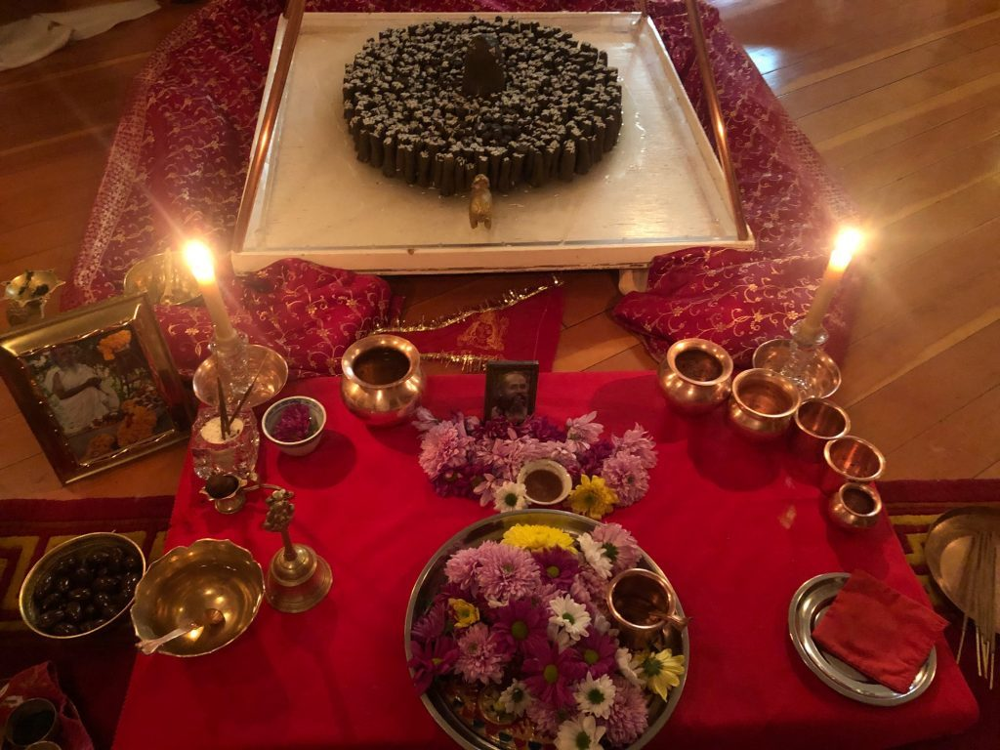

*Lingams and puja*

Another first for the Centre and Satsang, Shivaratri online.Without the possibility of gathering together at the Centre we wanted to come together with zoom to support the tradition and each other through the night long vigil. We also connected with Mount Madonna Center for the beginning of the evening and the Pujas, even some all night chanting up at the temple on a very cold night. It was very special and deep, apart and yet together in practice in honour of the Lord of Yoga; destroyer of illusion, granter of welfare and giver of Peace!! "Shiva danced and I caught a glimpse of freedom. Shiva danced and I caught a glimpse of peace."

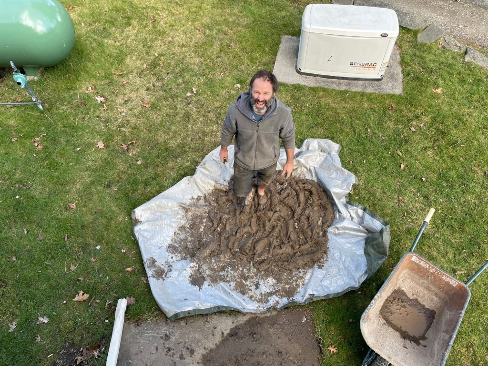

*Mahavir and Clay*

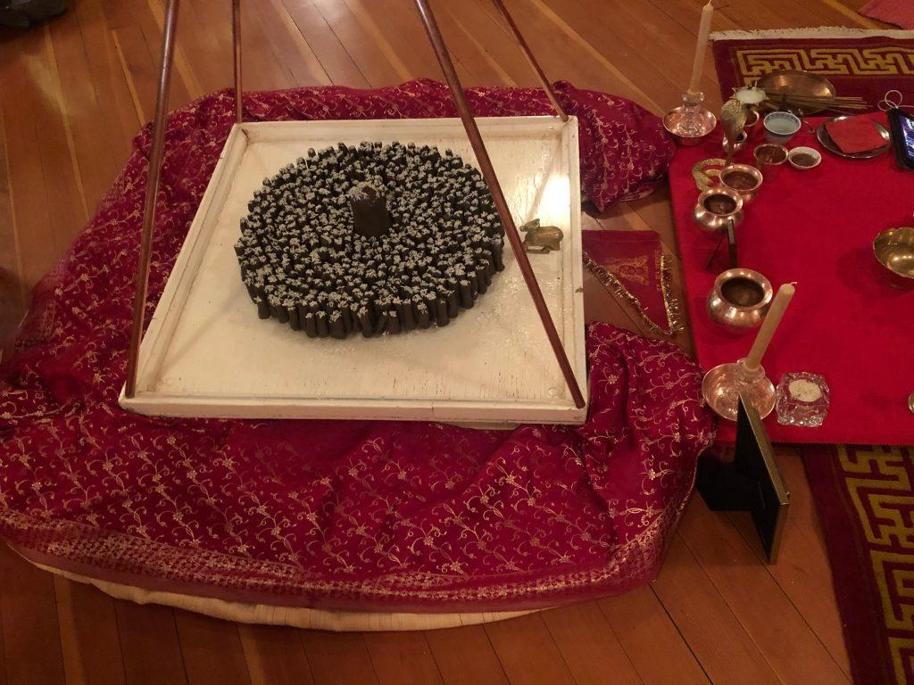

*Clay Lingams*

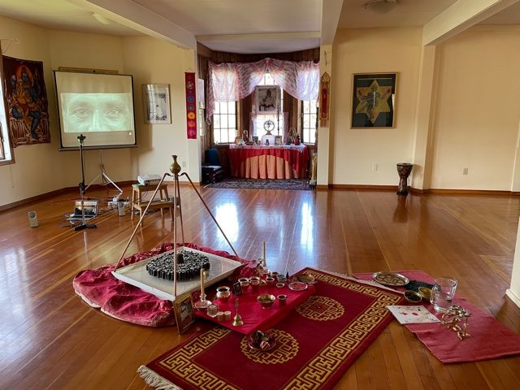

*Room set up*

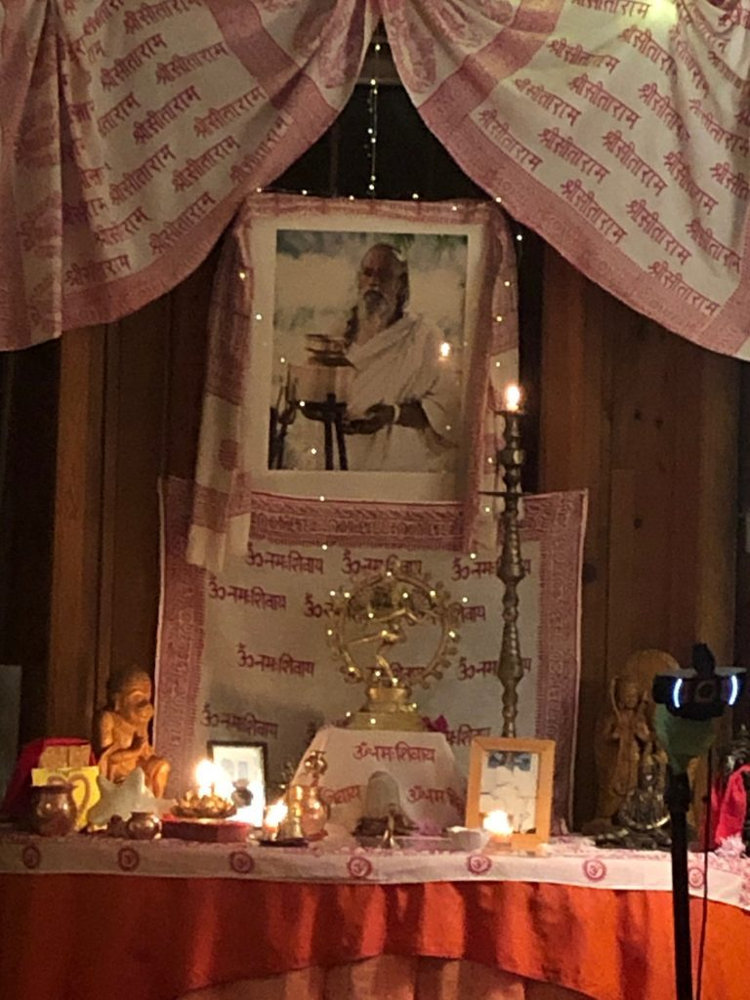

*Babaji and Nataraj*

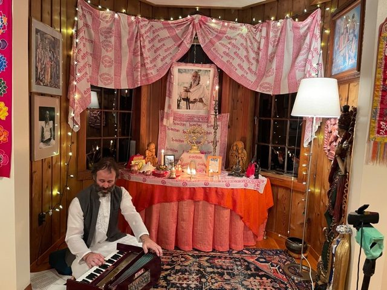

*The evening begins*

Mahavir started the Centre preparations early, digging clay from the Land and cleaning it up for our Lingams. He, Suneel and Anuradha took two hours time, chanting mantra and making 549 lingams for our Shivaratri mandala. We started with the Chalisa and then Shiva chants, Usha told the Shiva story, and later we had the forgiveness asanas on video with Bhavani and Mangala from MMC. The midnight puja we did together with the temple followed by chanting. Close to 4am Suchi led us in the Sun Salutations and mantras.

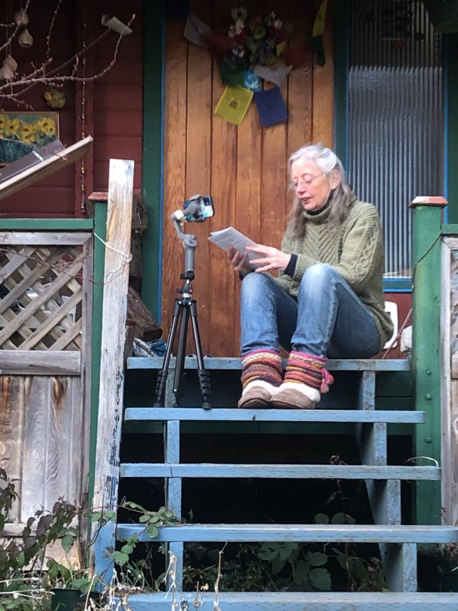

*Usha story*

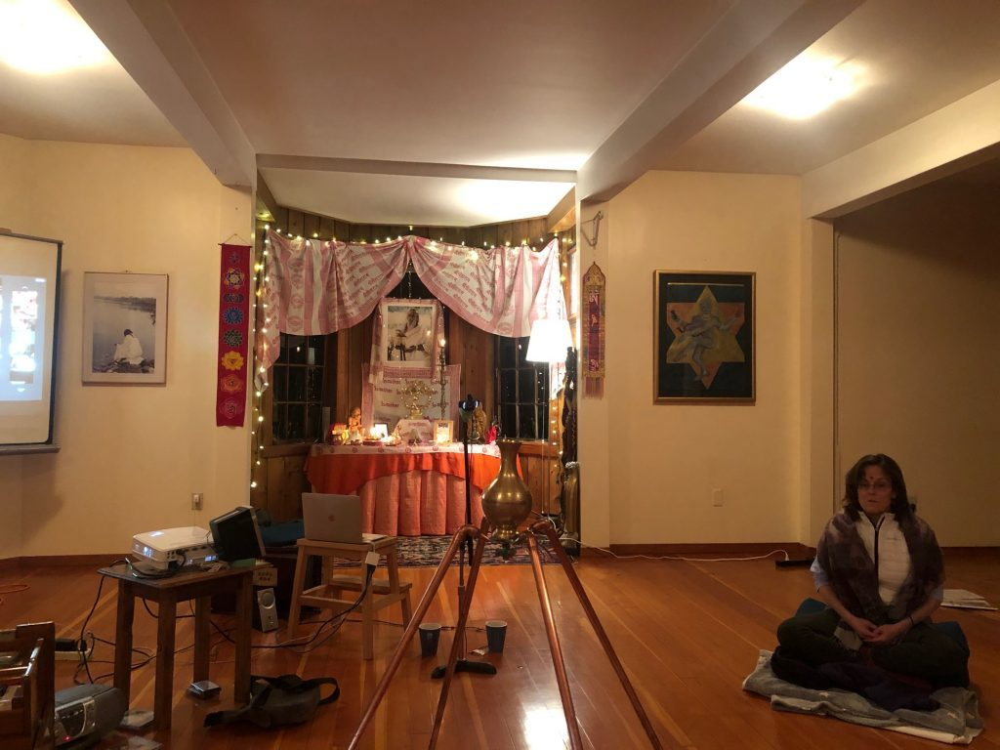

*Noelle*

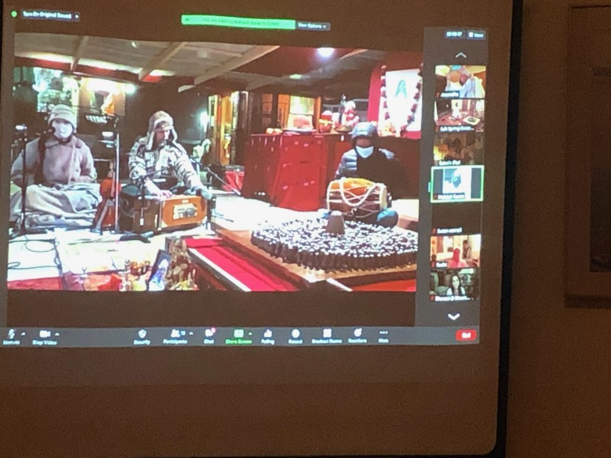

*MMC Kirtan*

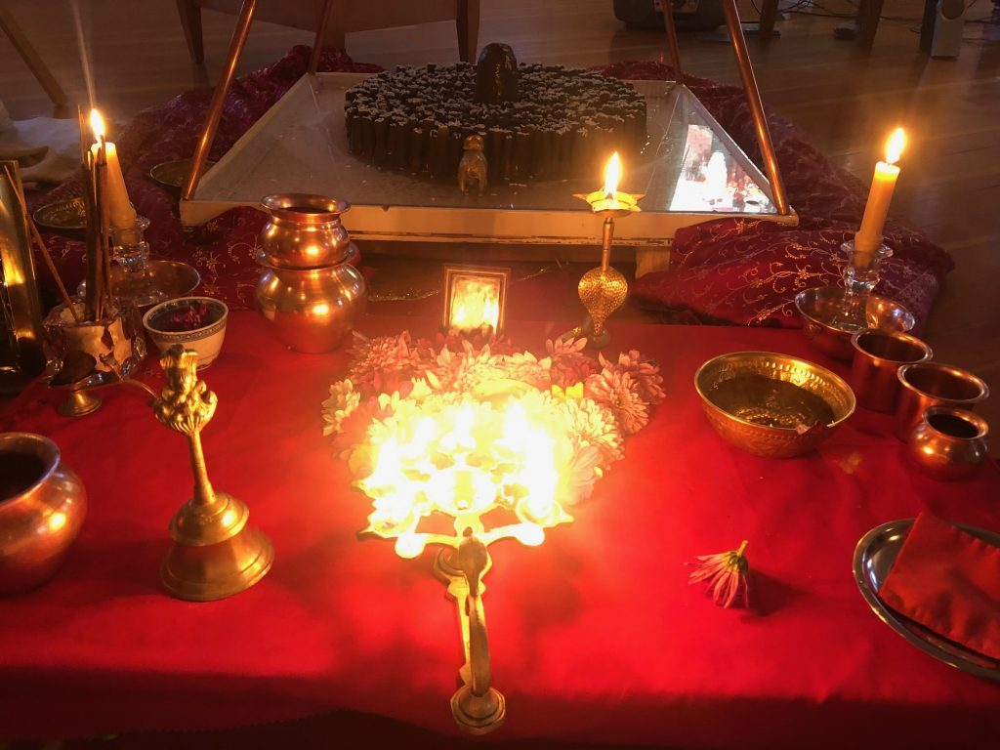

*Lingams and Arati*

As the evening turned into morning and the last puja was finished there were about a dozen people still online with Mahavir, Noelle and Anuradha in the Satsang room. We realized that we needed help to bring the lingams to the pond. Lucky that Yog was still online, lives close by and could come down quickly.

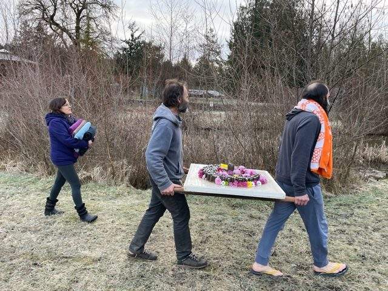

*Jaya Jaya Ganga Ma*

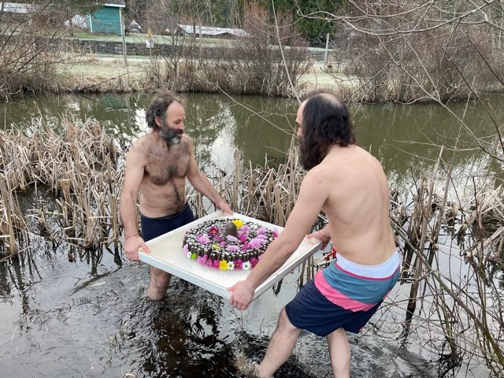

*Lingams in the Pond*

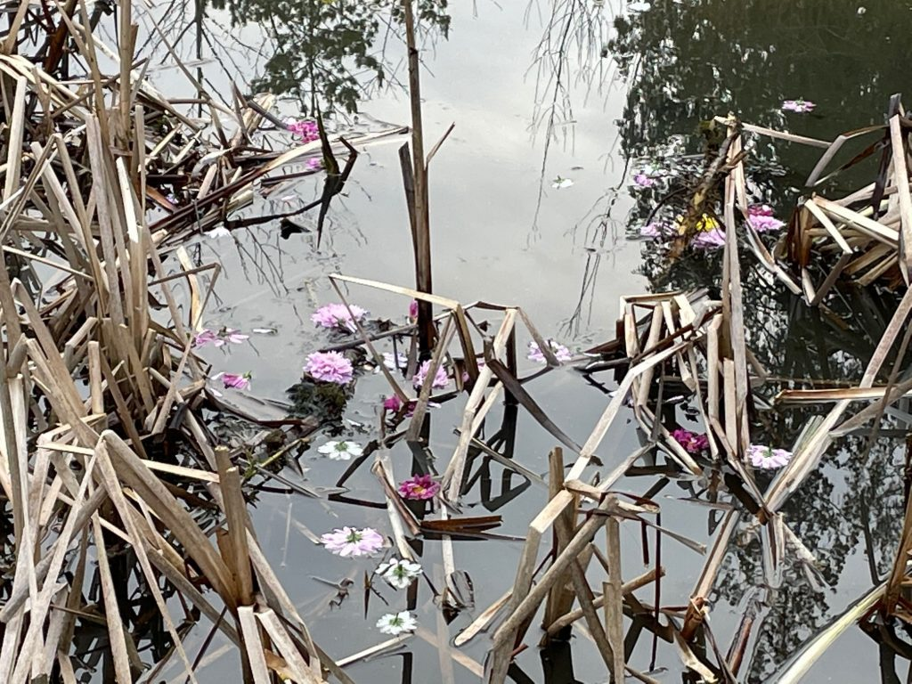

*Shiva Offerings*

Jaya Jaya Ganga Ma Jaya Jaya Shiva Shankara. The lingams were immersed, us as well, Hara Hara Mahadev!! Thank you Babaji!! Thank you Satsang family and friends!!
