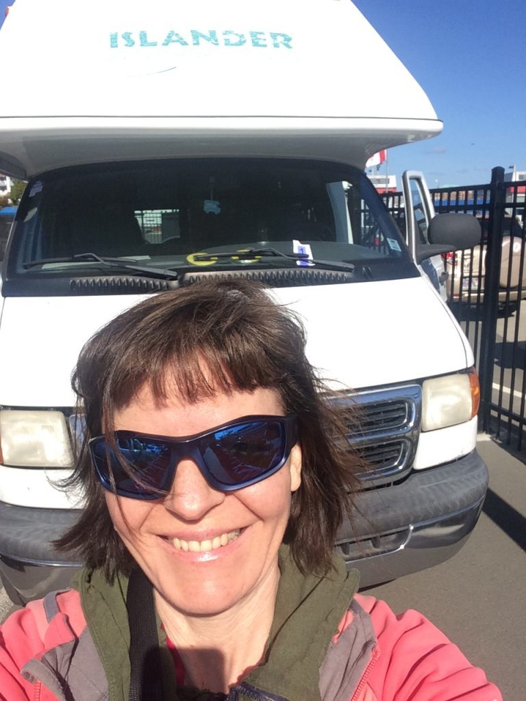
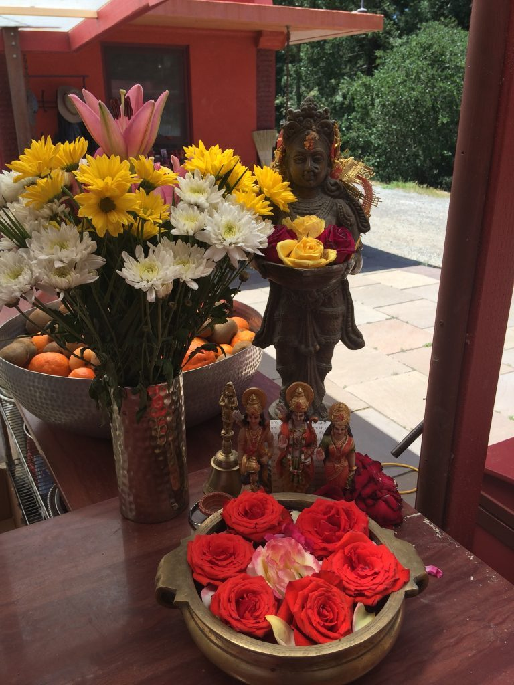
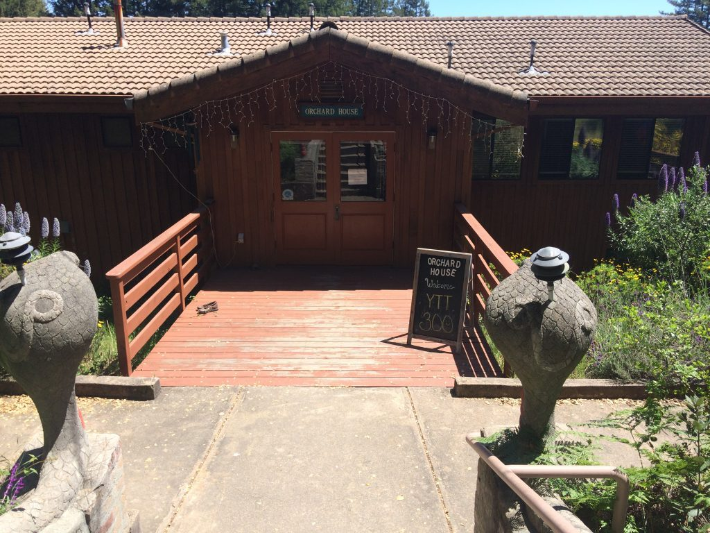
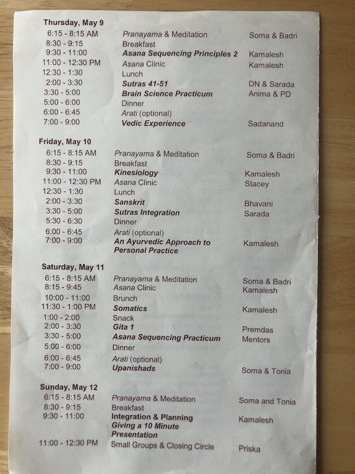
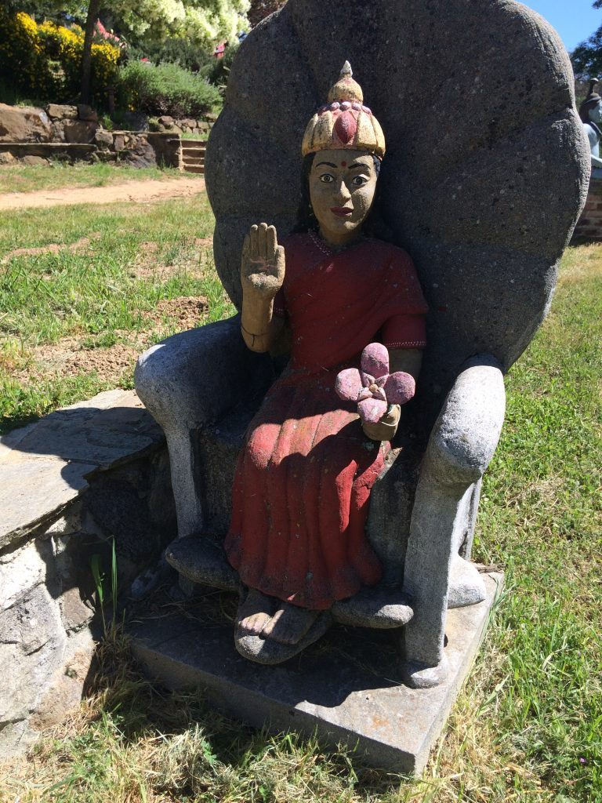
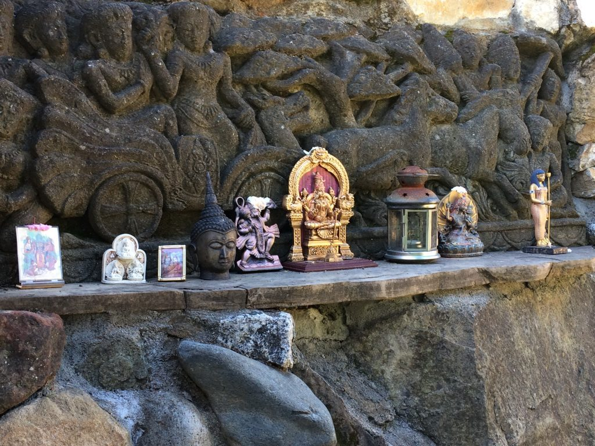
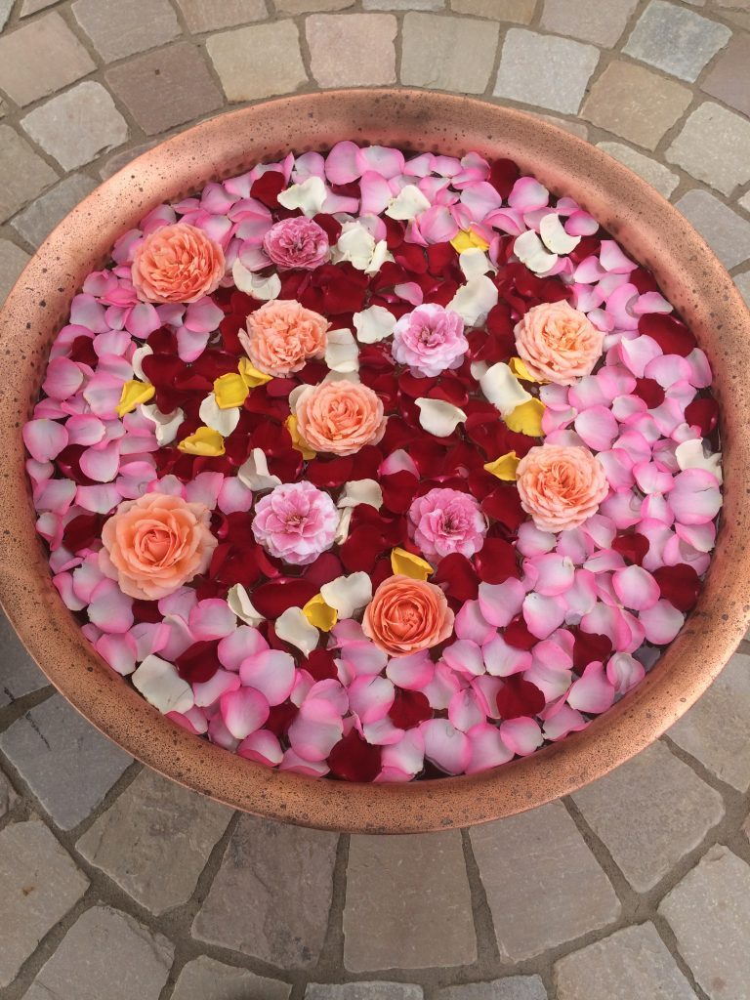
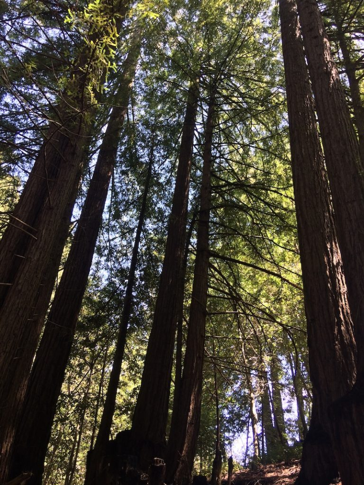
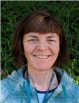

## The Decision or How I Got Here

I met Babaji in Ontario at a retreat in 2001. At the retreat I practiced karma yoga, learned about Sri Ram ashram, attended a fire yajna and got woken up by the angelic sounds of pad kirtan. Mount Madonna Center and The Salt Spring Centre of Yoga sounded like magical places. In 2003 I made my way to Salt Spring as a karma yogi “for the season”. I haven’t looked back.

As a karma yogi in various roles over the years I often wondered what it was like to experience the classical teachings as a formally enrolled student. Seeing people enter the program and emerge quite differently at the end piqued my interest. My background is in Vinyasa yoga with training from Toronto. A couple of years ago I spoke to Chetna (who is now the ytt Program Coordinator and Lead trainer at SSCY) about various yoga training I was considering. One of those programs was Mount Madonna's 300 hour teacher training. With her encouragement I decided to go for it.

I got accepted for the program starting in May 2019. Wonderful! Three modules of 100 classroom hours each awaited me. I was beyond excited at the opportunity to study on the mountain with the Elders. Yoga teacher training in California at the ‘MotherShip’? I must have some great karma.

## **A Thousand Roads lead to the Mountain**

My next decision was how to get down to California for Module 1 in May. After consulting with several Salt Springers well seasoned on that journey, I opted for a road trip! I rented a 20 foot camper van with a bed, stove, fridge, and even a toilet. It had plenty of room for all of my gear and the ceiling was high enough for me to practice standing asanas in it. That sealed the deal. Never having driven anything like it, I was quite impressed with my adventurous spirit. Overall the trip went well and I enjoyed driving through wine country and the redwood forest immensely.

*Leaving Victoria with the camper van*

## **Apavarga**

Previously I’d been to MMC for one New Year’s retreat and that was it. I was beyond excited to see Bhavani and Pratibha and the others I know from Salt Spring retreats. Also I was thrilled to be able to be there for 11 days and immerse myself in study. Upon arrival I breathed a big sigh of relief and went to the temple (as Babaji did upon arrival at SSCY). The first people I saw were three pujaris. I took this as a positive sign as well as a signal to move from an outward bhoga focus to an inward apavarga focus.

*temple flower offerings*

*orchard house our classroom*

Four days of driving increased my Vata dosha quite a lot and I was both nervous and excited. I went down the 54 stone steps to the Orchard House and entered the room as everyone was chanting om. After that, the first things mentioned were welcome and please practice asteya, for example, avoid stealing others' time by being on time for class. Noted.

Our initial go-around of introductions is mostly gone from my memory as I was over the moon. What I do recall was feeling relief that I was not the only one there in my 40s. In fact, 40+ were the majority and we even had three male students. Our group had 12 students, three assistants, one Program Coordinator and several faculty. We would get to know each other very well over the course of this program. I was curious about the others and very grateful to be there.

We received the schedule of classes (see photos) and had the opportunity to ask questions. I could see that intensive did not adequately describe this program. I am still searching for the correct words to describe it. Intensive intensity comes close.

*YTT schedule*

## Module 1: Working on yoga

Sadhana started at 6:15 am each morning and we had to be settled in the room before then so that meant getting up extra early. Despite not being a morning person, most mornings I got up early to do my own sadhana first and then go to class. This practice of getting up around 4:30am plus the long days of classes was, in retrospect, perhaps a bit ambitious. I found I was tired and wired after a few days. Yet I also felt exhilarated, extremely fortunate and I thoroughly enjoyed getting to know my peers.

After three days we were split into groups of six for morning sadhana. We got paired up to take turns practice teaching beginner level pranayama and meditations from the primer. I felt trepidation about this, and preparation helped a lot. Somehow I missed the fact that an Elder would be attending and evaluating our teaching. I found out as she walked in the door!

Each session of the program was carefully constructed and professionally led. Many of the faculty are career  educators and it shows. The asana focused classes on Biomechanics, Kinesiology, Somatics and Sequencing principles I ate up like candy. Classes on meditation and Brain Science I also found inspiring. Sharada and Dayanand’s Sutra classes greatly assisted me in finally getting a very basic understanding of Samkhya. In the hands of these two and later Soma, it was no longer a “headache yoga” experience. I am highlighting what stood out for me here, and I could just as easily mention the rich classes on Ayurveda, Sanskrit and on ancient texts. My understanding and appreciation for yoga as a multivariate tradition greatly expanded.

The program ran from 6:15am-9pm every day for 10 days. Jam packed is an understatement. The rigorous schedule left little time for integration. I chose to take silent meals most of the time to assist in digesting the material. This turned out to be a wise choice and aided in my physical digestion immensely as well. Fortunately the early dinnertime allowed us to attend Arati in the evenings at the outdoor temple. I experienced deep healing during those ceremonies.

*blessings from Ma*

*Murtis at the Ganesh Temple*

What a blessing to be on the land, have meals prepared and be taken care of in order to fully focus on this immersive experience. I wrote in my journal that I felt blessed to be swimming in the essence of the teachings in Babaji’s essence. He is palpable in every building, every statue, on every path and in every plant.

I am a lifelong learner and yoga school is certainly my happy place. There was so much to take in and so many amazing people sharing their knowledge with us. What a wondrous world the Classical Ashtanga teachings are! I felt we were shown a portal to another universe, with competent and experienced guides offering support.

## Bhoga

When it was time to leave, I felt happy, sad, grateful, blessed and a whole lot more. On the one hand, I was tired and I needed my own bed as well as time to integrate and process. On the other hand, I hated to leave the Mountain and the community. The mix of emotions was very similar to how I feel every time I leave the Salt Spring Centre.

*flower mandala*

*Redwoods on the mountain*

The road trip home was more streamlined than the way down. I heeded Pratibha’s advice and took deep breaths all the way. Driving through areas that had been ravaged by forest fires was sobering. A refreshing stop at a mineral spring felt rejuvenating. This transition back to “reality” was a practice of being in the world but not of it writ large.

Back in Victoria I immediately got down to my homework (of which there was a substantial amount) and started preparing for my 10 minute presentation for Module 2 in October.The inspiration and motivation for deepening into regular sadhana continued throughout the summer, bolstered by regular online check-ins with our class. I looked forward to seeing everyone again in person and felt we shared the common thread of a very special experience.

***To be continued...***

*Kathryn Kusyszyn came to yoga for relief from anxiety and pain. What she found changed her life. She completed her yoga teacher training in Ashtanga Vinyasa and Flow yoga in 2001 with Kathryn Beet and Marla Joy. Starting in 2008 Kathryn began studying yoga for scoliosis as taught by Elise Browning Miller. She recently completed a 300 hour yoga teacher training in Classical Ashtanga Yoga from Mount Madonna Center. Kathryn holds an Honors Degree in English Language and Literature. Her health interests led her to obtain certifications in several Eastern Therapies. She is the author of the book Scoliosis Undone:Back Pain relief with yoga. Kathryn lives in Victoria and offers private sessions, yoga classes and workshops online. [www.yogakat.ca](http://www.yogakat.ca)*
