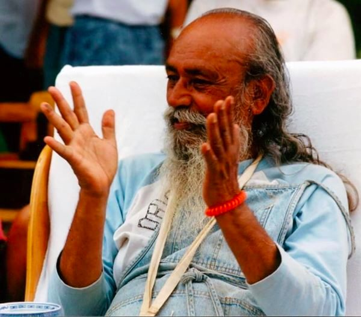

Babaji teaches that surrender means letting go of our identification of being the doer -  Thy will, not mine. This is what is meant by Ishwarapranidhana, the last of the yamas and niyamas. It’s the final letting go. While we may hold surrender to God as an intention, as long as we’re still identifying as these separate, individual beings, it’s hard to let go; in fact it’s the idea of ourselves as separate entities itself that we’re being called to surrender.

Babaji says:

> *When we don’t keep the ego of being a doer, we surrender our ego to that supreme power, which is explained as supreme consciousness, supreme existence, and supreme bliss, the absolute Lord of the universe. Then all the coverings of ignorance drop away from our heart and there remains only pure love, a universal love in which no differentiation, no judgement, and no discrimination exist.*

Most often - let’s face it - we want our way. We don’t want to let go of our identity as separate beings. We tend to cling to our individual conceptual world and we don’t want to give it up.

It’s not that we don’t try; all the spiritual practices are about the gradual wearing away of the sense of separateness and  thereby recognizing the unity in all life. We all want to live in peace, yet most often we’re so caught in our own personal stories that it’s hard to find a way out. How do we work with this dilemma?

Let’s look at our experience of daily life. When we face a difficult situation in our lives, we have our habitual ways of responding. Sometimes we’re able to say, “Okay, this is what’s happening. I’ll face it honestly and deal with it wisely and compassionately.” Sometimes. More often we respond with  some variation of  “This shouldn’t be happening”, and we can come up with many ways things “should” be different, often involving other people changing. Sometimes we blame ourselves - “I shouldn’t have gotten myself into this”, “If only I had or hadn’t done…..”.

We can use our challenging situations as an entry point to awareness. The mind’s response to pain  in the body is a good example. My body experiences pain and my mind adds a layer of suffering because I want the pain to go away. I have a desire to surrender to what is, to God,  without judgement, but at the same time I watch myself judging my inability to let go. This adds another layer of self-imposed suffering.

There’s a fine line between letting go and giving up. Giving up can take many forms. Sometimes the mind shifts between resignation and taking action. “There’s nothing I can do. I give up” is resignation that can  lead to depression. “I’m going to fight this” is probably a more useful response because there’s some movement. However, it may be in opposition to or in denial of the current experience. Both these responses are based on seeing ourselves as separate, dealing with something that’s happening to ‘me’, something ‘I’ don’t like.  More effective - but difficult - is to accept that whatever is going on is what’s happening, and be present with it, allowing the natural wisdom inside us to respond clearly and open-heartedly. That is surrender.

Wayne Liquorman, in his book, “Never Mind”, tells a story about a man who falls over the edge of a cliff and, half way down, grabs a branch. He yells up, “Help! Can somebody help me?” A voice calls down, “I’ll help you.”  He says, “Oh, thank goodness somebody’s up there. You’ll help me?” The voice says, “Yes, I am God and I will help you.” The man says, “Wow! What a relief! Okay God, what do you want me to do?” God says, “Let go.” The man yells back, “Is there anybody else up there?”

It’s a funny story because it’s how we live. We don’t like to surrender; we’d rather look for something easier. The way the word “surrender” is commonly used, it implies giving up, failing, losing. We’re used to living in an ego-based world in which some are winners and some are losers.

Letting go is completely different. There are no longer two worlds - my world, my story, and what’s true, which is that everything really is okay. The problem arises when I argue with it. It’s still  my job to do what I can to heal this body; the tricky part is when I want a particular outcome which may or may not happen. Letting go is surrendering to what’s happening, full stop. This can get pretty subtle; there can  be a preference for a particular outcome, but with no insistence on it. Holding onto wanting things to go our own way is the glue that keeps us locked into our story, and therefore into suffering. If we could see the situation from outside our personal experience, we might have some compassion for our predicament as we struggle to free ourselves while we hold on tight.

As we face whatever situations bind us in our struggles, we can - when we remember - take steps to dissolve the glue of attachment to our stories, our sense of separateness. We can lighten up, breathe, and trust the unfolding of life.

> *Life is not a burden. We make it a burden by not accepting life as it is. We desire everything. If we don’t get what we desire, we feel anger, depression and pain. If we do get it, we feel attached, jealous and discontented, which again causes pain. If we put a limit on our desires, there will be a limit to our pain. Gradually we can reduce the limit and one day the desires will be decreased so much that we will not even think about them. That state of mind is peace.*
>
> *The future is unknown. Whenever we walk toward that unknown, we carry a lamp. In worldly-minded people, that lamp is the ego and in spiritually-minded people, the lamp is divine presence. Both are walking toward the same unknown, dark space; one is afraid and the other is fearless.*

contributed by Sharada  
quotes in italics by Baba Hari Dass

---

**Sharada Filkow,** a student of classical ashtanga yoga since the early 70s, is one of the founding members of the Salt Spring Centre of Yoga, where she has lived for many years, serving as a karma yogi, teacher and mentor.
