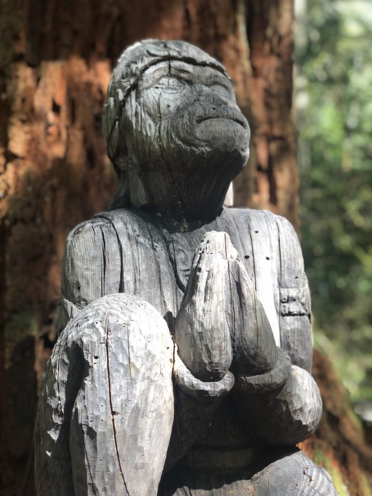
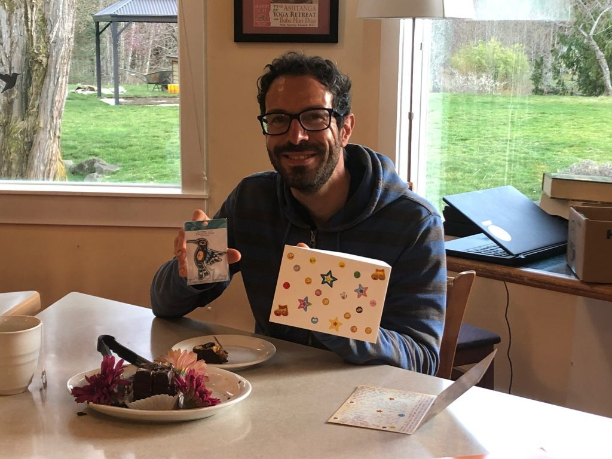

***Q-How should we show love to others?****A-If you have love inside, it will spread everywhere. Love can't be made and shown if there is no love inside our heart. If there is love inside us we don't need to show it. It will reflect by itself around us and will light the hearts of others.*  
*~ Babaji, from the Yellow Book*

Dear friends,

This note finds its authors writing from ‘off-land’ this month as Courtenay and Kenzie take over editing the monthly newsletter from their own home bases (Ucluelet and North Vancouver respectively) for a few months while Sharada focuses on her health and healing. Though we are not physically at the Centre, our hearts always are, so it’s extra special to check in with those on the land in order to bring news of the Centre to you.

Dan Naccarato (aka Farm Dan) returned to Ontario at the beginning of April, after a fantastic and productive month at the Centre, wherein many tasks were accomplished: harvesting over-winter crops such as kale, carrots & leeks; pruning raspberry and blueberry bushes; helping out the community in the kitchen; and the huge job of pruning the orchard, with lots of on-land help. Dan’s going away lunch was held on April 3rd just before his leaving. Deep bows to Dan - we look forward to his next return as always.

*Dan at his goodbye dinner*

Noelle remains on as part of the small on-land community, fully embracing the role of nourishing residents with her exemplary care in the kitchen. By publishing date, Suneel will have departed for Ontario to help out with family. He plans to return in a couple of months and he is already missed. Marion continues to bring her energy and spirit in her help with housekeeping, the kitchen, and whatever other tasks are needed. Mahavir keeps the flame of ceremony lit for us all, devotedly performing regular arati, pujas, and monthly yajnas. Santosh continues his long term care for the land through landscaping and maintenance duties. Anuradha thankfully shines her bright, beautiful light on all, and keeps everything flowing as the community’s heartbeat.

*Daffodil Ram*

We ask for prayers and loving thoughts for our dear Sharada; dedicated newsletter baroness, longtime teacher, and Mother to all who have ever had the good fortune to come stay on the land. Sharada heads into another back surgery in May, and we will all be there in spirit with her, and by her side in her recovery.

Anuradha and the garden team have begun selling starts grown from Dan Jason’s Salt Spring Seeds at the Centre Farm Stand. No contact payment is offered via e-transfer so everyone can safely start their gardens this spring.

*Selling starters grown from SS Seeds*

*Marion at the Farm Stand*

Mahavir and Adam made like Dionysian grape stompers, and laid a new earthen floor for the outdoor yajna shala with their bare feet.

*Santosh creating the earthen floor*

*Mahavir creating the earthen floor*

There is a beautiful new surprise along our beloved forest path! Situated between towering cedars, and next to the stream, there is a new home for mindfulness and solace. A beautiful, carved wooden Hanuman holds his hands together in prayer and looks up to the sky through the tree branches, inviting you to rest your weary feet on one of the log seats nearby, and receive the deep peace of the forest.

*Beautiful wooden multi at new Hanuman Grove*

Gratitude to Gita Govind for the generous donation of the Hanuman murti. When it is once again safe to do so, we invite you all to visit and feel the deep peace of Hanuman’s forest blessing.

## **Rituals and other News**

This year our [200 hour Yoga Teacher Training](https://saltspringcentre.com/yoga-teacher-training/) is moving on-line, which means anyone, anywhere can take part in this modular, accessible experience. The strong reputation of our Yoga Teacher Training program is built on our outstanding faculty and their dedication to passing on the spiritual teachings that have enriched their own lives. Designed for those who want to deepen their own personal practice as well as those who have a desire to teach, this is a transformational program. With this new on-line format, students can bring the practice and study of classical ashtanga yoga into their own homes for a truly remarkable experience.

Be the first to know: [Sign up to receive information](http://eepurl.com/hm2nRz) and updates about this online teacher training, including program dates, registration dates and more.

[Classes and satsang continue online](https://saltspringcentre.com/programs-retreats/public-offerings/), from Salt Spring, Vancouver, and Mount Madonna Center. These on-line resources have allowed even more folks to take part than normally would be able to in person, and it’s never too late to join in.

A Full Moon Yajna took place on Monday, April 26th, with the next one planned for May 26th.

Dharma Sara Satsang Society’s AGM is coming up (virtually) on May 22nd. Members have received notice of the meeting via email, but if your membership has expired, renew before the AGM so you can have a vote; and if you are interested in knowing more but are not yet a member, you can [join here](https://saltspringcentre.com/dharma-sara-satsang-society/). The Board has been working especially hard to keep the Centre afloat during the pandemic, and exciting news is on the horizon! Come to hear updates on new hires, as well as the highly anticipated presentation of the Strategic Plan, which will take us forward together.

## **For Your Reading Pleasure…**

This month Kathryn takes us on [The Road to Mount Madonna, Part 1](https://saltspringcentre.com/the-road-to-mount-madonna-part-1/), letting us live vicariously through her as she describes some of her experiences at Mount Madonna Centre during her 300 Yoga Teacher Training. This was back when we could still travel and before her training pivoted to on-line. Congratulations Kathryn and thanks for sharing. Look out for Part 2 of this story next month.

Mahavir's piece [Back to the Garden](https://saltspringcentre.com/back-to-the-garden/) has provided an absolutely beautiful meditation on the garden, both past and present, with lots of photos and a timely shout out to Woodstock.

And Sharada offers us [Letting Go](https://saltspringcentre.com/letting-go-2/) from the archives. Even though it was written in October 2013, is just as timely now as ever. Over the last year many of us have had to simply ‘let go and let god’ whether we wanted to or not. Through Babaji’s teachings, Sharada wisely reminds us that suffering is optional, but that doesn’t mean letting go is easy.

As we look towards another summer unable to pilgrimage to the Centre Land, and having spent a year already not able to visit and commune with our Satsang, we give thanks for all of the on-line offerings so freely given. We offer our gratitude to  the committed handful of karma yogis who have held space for the Centre light to shine on,cultivating peace within and without.

Wishing you all peace, peace, peace.  
Kenzie and Courtenay
