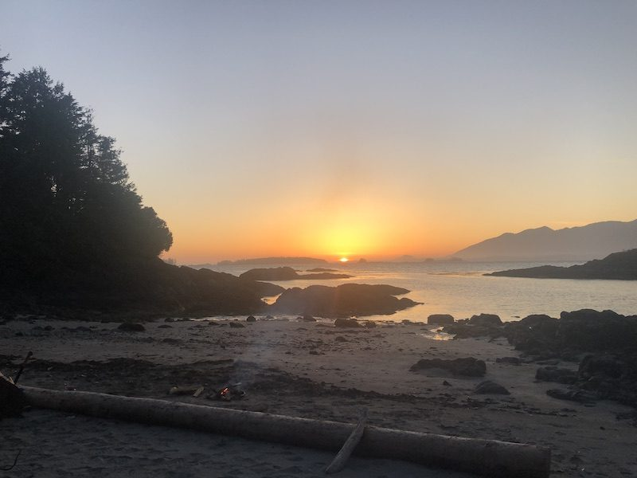

> *“You are your own little plant.*  
> *Water yourself.*  
> *Speak kindly to yourself.*  
> *Flower.”*

From *The Little Prince* by [Antoine de Saint-Exupéry](https://en.wikipedia.org/wiki/Antoine_de_Saint-Exup%C3%A9ry)

Dear friends,

As we continue to bask in the fecundity of the season in our own little corners of the world, may the growth from spring into summer lift the corners of our mouths and bring sparkles to our eyes. Emerson wrote, “The earth laughs in flowers,” which seems like just the medicine we need right about now to shake off this last year of tribulation.

The quiet of life at the Centre presently is allowing many areas of the land to be even more thoroughly attended to than usual. This care is especially obvious in the garden, where greenhouse seedlings are being planted out and seeds are getting tucked into the warming earth. Flowers have been a particular focus of planting this year, and they hold the promise of much beauty to come, including marigolds, asters, zinnias, sunflowers and dahlias. Many thanks to Dan Jason, Kishori, and S.N. for donating their time, efforts, seeds and tubers! Thanks as well to Santosh, for his continued care in moving the vast grounds; to Mahavir, for his garden care and coordination; to Marion, for planting a wonderful garden mandala, which will only get better as it grows; and to David and Noemie, Marion’s friends who donated their time and energy to the small on-land community for the month of May (after isolating to ensure everyone’s health and safety). Suneel continues to offer support from Ontario where he is busy with family, and we all look forward to his return at the end of June.

And, as always, Anuradha continues to guide the way forward with so much love and grace, always quick to point out the beauty and abundance of the land, and remind us of Babaji’s teachings.

The farmstand also continues its successful venture of offering seed starts (grown from [Salt Spring Seeds](https://www.saltspringseeds.com)), herbs, and Noelle’s lovingly baked goods - all payable by donation via e-transfer, which can be sent to [info@saltspringcentre.com](mailto:info@saltspringcentre.com) (please note it is for the garden).

*Beautiful garden mandala*

*David & Noemie amongst Hanuman’s blossoms*

## Sharada Update

As many of you know, our beloved Sharada underwent back surgery in May. We are very happy to report that her surgery went well, and she is now recovering. She is being tended to and visited by her family and Satsang in Victoria, and should be returning home to the land soon. Prayers and extra healing mantras for her speedy and full recovery are most welcome.

*Sharada just before her May surgery*

## Rituals and other News

### Annual Community Yoga Retreat

Save the Date!! Our 47th Annual Community Yoga Retreat will be held ONLINE from **August 6-8, 2021.**

\*\*Please note that this is different from our usual dates of the August long weekend, in recognition of the fact that people will be moving around more this summer (hooray!) and will likely want to be outside over the long weekend.

Not only has planning begun, but so has recording! A huge shout out and gratitude to Ian Ramesh Rusconi for traveling to the Centre to be our own in-house audio/visual engineer. Here are some snapshots of “live” kirtan on the Mound!

ACYR 2020 showed us that meaningful connection and communion is possible through virtual programming, allowing an even wider audience to share in Babaji’s teachings. This year the team is focusing even more on play, and on less screen time. Stay tuned for more details to come!

If you would like to be added to the ACYR Mailing List, please contact Anuradha at [info@saltspringcentre.com](mailto:info@saltspringcentre.com).

### Annual General Meeting

The AGM for members in good standing of the Dharma Sara Satsang Society was held via Zoom this past month on Saturday, May 22nd.

Here are some highlights for those who could not attend:

- New Board Members were voted on and elected! Special thanks to Kalpana, for stepping in when needed this past year when needed.

*Your 2021 Dharma Sara Satsang Society Board of Directors is:*  
Tracy Chetna Boyd - President  
Willow Lampard - Treasurer  
Natasha Jyoti Samson  
Anila Lacroix  
Adrienne Cousins  
Kris Cox

- The 5-year Strategic Plan was voted on and accepted! This is the culmination of much hard work by Board Members and Centre Managers since late 2019, and will be an invaluable roadmap as the Centre reopens and grows over the coming years. Special shout out to Natasha Jyoti Samson and Kris Cox for their hard work bringing this one home!

- We were very excited to meet the Centre’s new Executive Director: **Sarah Kemmers!** Sarah brings an incredible repertoire of experience, leadership and energy with her, and we are so excited for her to land at the Centre on June 16th! Stay tuned for more to come on Sarah in next month’s newsletter.

- Remember, anyone can join the DSSS and become a voting member! To join, simply click [here](https://saltspringcentre.com/form/?fid=7) to pay the small annual fee and make your voice heard.

### Yoga Teacher Training

This year our [200 hour Yoga Teacher Training](https://saltspringcentre.com/yoga-teacher-training/) is moving on-line, which means that anyone, anywhere can take part in this modular, accessible experience. The strong reputation of our Yoga Teacher Training program is built on our outstanding faculty and their dedication to passing on the spiritual teachings that have enriched their own lives. Designed for those who want to deepen their own personal practice as well as those who have a desire to teach, this is a transformational program. With this new on-line format, students can bring the practice and study of classical ashtanga yoga into their own homes for a truly remarkable experience.

Be the first to know: [Sign up to receive information](http://eepurl.com/hm2nRz) and updates about this online teacher training, including program dates, registration dates and more.

### Update on Classes

We are happy to announce the **return (again) of in-person asana classes!** With the release of BC’s new Public Health Orders, we will be following all protocols, including safe distancing and sanitizing between classes, as before. Direct Registration with each teacher will be required. Please stay tuned to our [website](https://saltspringcentre.com) for more details, such as start dates.

[Classes and satsang continue online](https://saltspringcentre.com/programs-retreats/public-offerings/), from Salt Spring, Vancouver, and Mount Madonna Center. These online resources have allowed even more folks to take part than normally would be able to in person, and it’s never too late to join in.

A **full moon fire Yajna** took place on Tuesday, May 25th, marking the extra auspiciousness of the total lunar eclipse, on the newly-installed earthen floor of the beautiful Yajna Shala on the Mound. The next Yajna will be held on Thursday, June 24th. Stay tuned to our [SSCY Facebook page](https://www.facebook.com/saltspringcentreofyoga) for live updates!

*Full Moon Fire Yajna set up*

*Glowing in the aftermath*

## For Your Reading Pleasure…

This month, we have a special treat for you! The long-awaited story of what brought beloved teacher, pujari and friend Yogeshwar into our midst, and set him on the path of yoga. [**Journey down Yog’s path**](https://saltspringcentre.com/yogs-story/) so far, as he outlines formative experiences with clarity, compassion and trademark self-deprecating humour.

Kathryn generously carries on sharing her 300 hour YTT experience at Mount Madonna Centre this month with [**Part II** of **The Road to Mount Madonna**](https://saltspringcentre.com/the-road-to-mount-madonna-part-2/). If you missed Part I, you can find it here ([Link to Part 1](https://saltspringcentre.com/the-road-to-mount-madonna-part-1/)). This is a wonderful overview of the program for those who are curious, but even more so, Kathryn conveys that excitement we all feel when we get to dive deep into meaningful studies that nourish us on a soul level. Yogis love yoga school!

And finally, we have an honest and timely piece on self-care from Chetna this month. She answers Tina Turner’s timeless question **[“What’s Love Got to Do With It?”](https://saltspringcentre.com/whats-love-got-to-do-with-it/)** with practical advice for all of us and a profound, yet disarmingly simple answer.

This sweet newsletter feels like such a blessed example of many hands making light work. May we continue to share and learn through our myriad peaceful endeavors. If you feel called to contribute to our monthly musings feel free to reach out to us at [info@saltspringcentre.com](mailto:info@saltspringcentre.com)

We hope this finds you blooming, wherever you are, dear Satsang! And as we bask in the extra sunlight of the year’s longest days, remember to water your own little plant, as well as the flowers all around you.

Love wins!  
Kenzie and Courtenay
