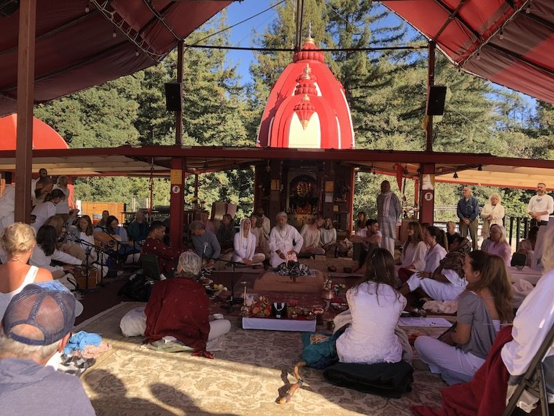
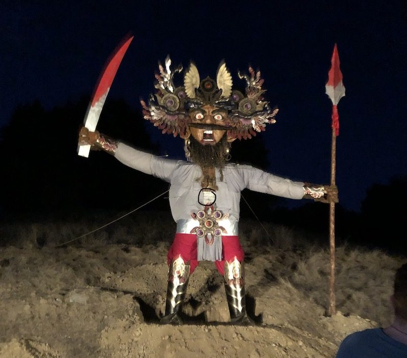
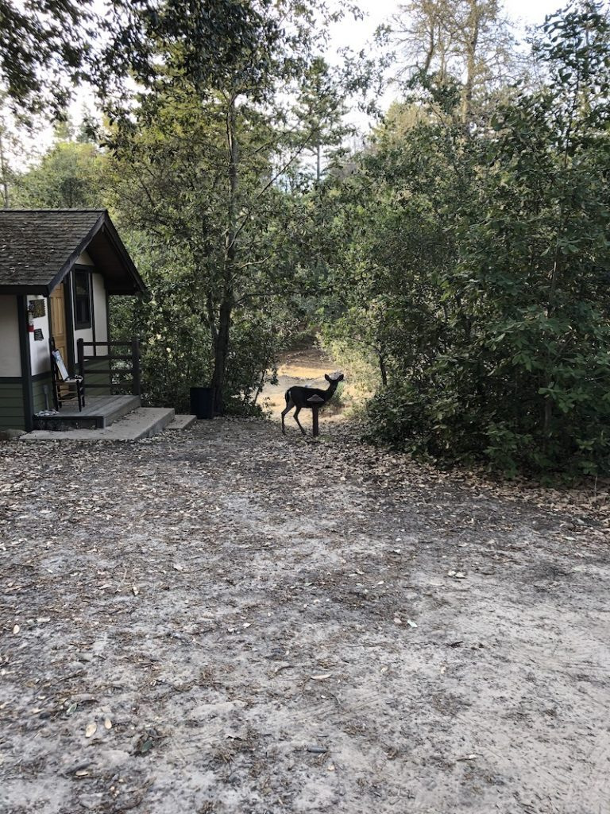
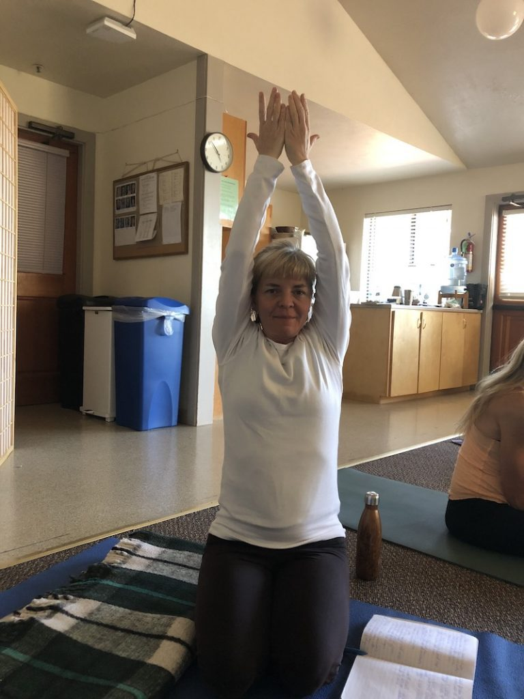
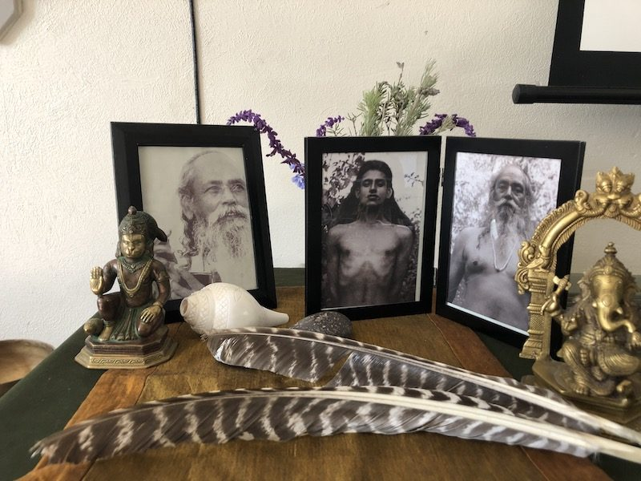
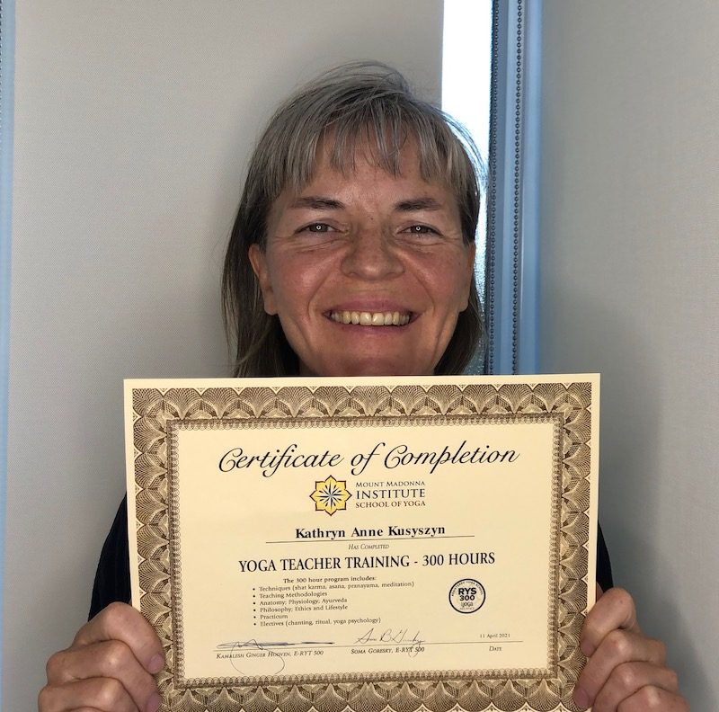

**Babaji on teaching:**

> “What are the most important elements of being a good teacher?”  
> “Teach to learn. Don’t become a teacher to show your power.”   
> “Are there specific skills that are important in teaching?”.  
> “Compassion, self-less service, love and kindness.”

**[For Part 1 of this story describing my experience with Module 1 of the 300 hour yoga teacher training, click here.](https://saltspringcentre.com/the-road-to-mount-madonna-part-1/)**

The bhakti bliss of the 300 hour yoga teacher training program at Mount Madonna Institute in May carried me through the summer of 2019. I was motivated, inspired and excited to learn more. Our monthly Zoom check-ins deepened our connections as a group and helped keep us focused.

Various homework assignments due between May and October supported us integrating the material of Module 1 and also “pre-work” to prepare for Module 2. Book 1 of Patanjali’s Sutras was a major focus of Module 1 and the homework involved reflections on groups of sutras. We also had 10 minute oral presentations to prepare for on any yoga related topic we liked. Mentors were assigned to support us in these preparations. I chose “Health effects of Sanskrit Chanting” and found some interesting studies showing positive benefits on the brain and heart.

For Module 2 I decided to fly and arrive a few days early to participate in the Reunion Retreat which started a few days before teacher training. This was the first time for that retreat, put on by the ‘younger’ (i.e. middle-aged) generation and it coincided with Navaratri. It was a wonderful experience to be involved as a retreat guest, and of course, there were karma yoga opportunities as well.

Some of these events were included as part of our teacher training curriculum. The Bhakti night and yajna provided heart-warming opportunities to connect with the resident and wider community. At the end of that retreat we all went out to shoot arrows at a giant effigy of Ravana, representing the self. This is a symbolic practice to slay the self-serving ego. Is it boasting to share that I got him in the middle of his gut? ;)

These retreat outings were a welcome change of focus from the 6am-9pm study schedule. Module 2’s schedule was just as packed as Module 1 except this time I was prepared. I stayed in a cabin (highly recommended) and focused on going straight to bed after class finished at 9pm. I also continued with my practice of silent meals which I found extremely supportive.

This round we looked at Book 2 of the Sutras and we began practice teaching each other intermediate pranayama during morning sadhana. Other juicy topics we got into included Yoga Psychology, Vedic Psychology and lots of time on neuroscience. I found it fascinating to learn about polyvagal theory, heart-rate variability and the science of compassion. Classes on Ritual, Tantra, Subtle Body and Samkhya opened my mind to more portals of study. Heaven for yoga nerds!

An asana class each morning kept us somewhat limber amidst the other hours of mostly sitting. Some of these were taught by us, the students. When my turn came I was nervous because my background is in a different tradition and I’ve only taught therapeutics for several years. Here we were asked to teach either a ytt200 level or 300 level class in this tradition. Gulp. It went *okay,* and I learned a lot. I certainly appreciated the feedback model used which is positive feedback only.

At the end of the module I felt conflicted: I wanted to stay on the land with my yoga peeps, and I also needed to rest and integrate. We’ll be back in March for the last module, I told myself. Little did I know the changes to come.

Continuing with homework assignments and monthly check-ins over the winter of 2019-20 kept me focused on learning the material. Incorporating intermediate pranayama into sadhana was a major energetic shift for me and I continue those practices today. Attending the Mount Madonna New Year’s retreat online was a boon to practice as well. And I finally learned the challenging hand mudras!

In February the faculty began to talk about the possibility of needing to postpone the March module due to this new corona virus. We were on tender-hooks until the beginning of March when lock down and border closing happened. The following few weeks are a bit of a blur of surrealistic memories. We continued our monthly Zoom check-ins and initially hoped to get back to MMC in June to finish. Well, that obviously didn’t happen. Kamalesh began teaching free asana classes on zoom twice a week. Mount Madonna put its weekly Sutra and Gita classes online. These supports kept our spirits up and our connection to the material as well as each other.

That May the 2020 ytt300 group started online one weekend per month. At the end of the summer the decision was made to join our 2019 group with this 2020 group for Module 3, to take place one weekend per month from January - April 2021. We lost a few more people from our group during this period so when we joined with the 2020 group our little circle instantly more than doubled.

Attending 24 hours of online classes from Thursday evening to Sunday afternoon was quite an adjustment. I give kudos to Sean, Kamalesh, Soma, Bhavani and all the teachers and assistants who pivoted the teachings online with grace. Our assistant teachers Tonia and Priska were joined by Kam and we felt very well supported.

Module 3’s focus included Books 3 & 4 of the Sutras, Ritual and more Neuroscience. In small groups we taught morning sadhana in pairs. I had another opportunity to teach an asana class and I felt that one went well. We each gave a 45 minute presentation on a yoga topic of our choice. Selections included: Tantra, Trauma-informed yoga, Ganesh, the Bhakti path, yoga for kids, and Jnana Yoga. Many of these were outstanding with gorgeous visuals and interactive sections. I chose to talk about the various learning preferences and how to apply them when teaching an asana class.

On our final weekend the format was a Going Deeper style of retreat. We were encouraged to be in silence and reduce outside distractions while at home. This worked surprisingly well in my experience. Our graduation ceremony was a yajna at the Temple. Two of the 2020 students, Dana Warsaw and Kailashpati, under the guidance of Bhavani, made the offerings and led the yajna. A few students who live local to MMC were permitted to stay there for the weekend and participate in the yajna. It was heartwarming to see a few of us there in the circle, at least.

While it was not the end of the training our group had hoped for, I’m glad I decided to do the last module online and complete the program. I highly recommend this training to anyone who wants to dive into the eight limbs of Classical Ashtanga Yoga. Whether you are planning to teach or not, it is an extremely powerful way to deepen your sadhana. If you have any questions about it, please write them below or contact me directly. I could talk about this experience for hours.

*Kathryn and her Certificate of Completion!*

I loved the faculty and the material so much. I continue to stay engaged by apprenticing with the next MMI yoga teacher training 200 hour program which begins in June online. They plan to shift to in-person retreats and training starting this fall. See you at the New Year’s Retreat!
