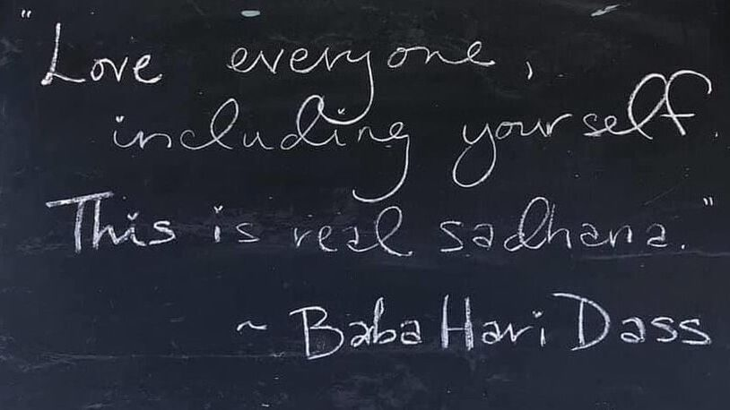

> *What’s love got to do with it?” Tina Turner*

As I am sitting down to write about how upset I am this week upon hearing more people of colour being killed at the hands of the police, I have Tina Turner’s song “*What’s love got to do with it*” rolling around in my head. I mean, it is unrelenting. It will not stop! Perhaps it is because I have had several conversations recently about the importance of centering love at the heart of all actions and I have just finished teaching a Yoga class that was themed around love: the importance of cultivating self-love as the foundation for loving others.

If you are unaware of this song, it is from 1984. Since I like words, I googled the lyrics and am surprised that my 2021 self sees that they are somewhat cynical, to say the least. The words speak to me about distrust and pain, and past disappointments. The line “who needs a heart, when a heart can be broken” is a common narrative in music and in life. The unwavering message it sends is that love hurts!

Many of us have been confused about love for our entire lives. We are conditioned to act as if love is a transaction - giving something to get something in return or withholding something if something is not received. If we are being honest, I suspect we have all been there at one time or another. It is messy and painful and dare I say, boring.  This type of “love” reminds me of an excerpt from Rumi’s poem:

*Subtle degrees*  
*of domination and servitude*  
*are what you know as love*  
*But love is different*  
*It arrives complete*  
*Just there*  
*Like the moon in the window*

Whether aware or not, many of us spend our lives looking for a source of love that is enduring and cannot be taken away. I am reflecting on when Baba Hari Dass was asked, “*how does one participate in loving others*?” he answered “*one can’t love anyone until love is established within. Love is a pure state of mind where self-interest ceases all together*.” Clearly, this is not what would normally be considered a romantic or transactional type of love. What is being pointed to here is tricky in the early stages of practice. If not vigilant, I acknowledge that even after many years of practice, it can still be tricky (my family can attest to that.) If we have not cultivated a loving attitude towards ourselves this teaching may be at the very least, a challenge.

Often when we embark on the Yoga journey we are in some type of physical or emotional pain and suffering. Our Yoga classes encourage us to let everything go, to love everyone, and that it is all love and light. The maiden voyage is smooth sailing for a time and we get a reprieve from the pain that life inevitably throws our way. The power of Yoga opens us to new possibilities of being and seeing the world. However, if one sticks with the practice long enough, we find that eventually things take an interesting twist and we come face to face with our conditioning. We come face to face with all the less than kind ways we treat ourselves and each other; like negative self-talk, how much anger we have, how we self-medicate with food or alcohol or \_\_\_\_\_\_\_\_\_\_\_\_ (fill in the blank).

Make no mistake, I believe that absolute, unconditional love is at the heart of Yoga. I would say, besides peace, if there was a goal in Yoga, unconditional love might be it. I wonder though, how difficult it is to experience unconditioned love and remain there in a sustainable way if we have not yet, at the very least, cultivated an attitude of basic goodness towards ourselves.

Perhaps more accessible, is another important teaching from Baba Hari Dass, which is to *“Love everyone, including yourself*. *This is real sadhana*.” Babaji reminds us to not abandon ourselves or one another.

So, how do we go about loving ourselves? How can we move towards unconditional, transaction free love of others? Depending on our life circumstances, the answers to these questions will be different for different people. Nevertheless, we can begin by simply acknowledging that the most intimate relationship that we will ever have is with our own self.

## Small Steps to Developing Self Love

Each of us can learn the fine art of nourishing self-love and happiness. As Thich Nhat Hanh says, ‘Everything needs food to live, even love’. This is not an exhaustive list, but we can begin to develop love by experimenting with a few small steps:

- Self-talk: notice how you talk to yourself - talk to yourself with love, or at least kindness, much like you would talk to a beloved friend, but also forgive yourself at times when you are not so kind to yourself.
- Self Judgement: notice self judgement – is there a way to be less critical of yourself?
- Boundaries: Set healthy boundaries. Setting a boundary is about communicating what you need (and expect.) This can be tough if you're unfamiliar with boundary setting. Start with something small and grow from there.
- Gratitude: Express what you are grateful for. Notice the good things in your life. Perhaps even write them down in a journal.

## Metta Meditation

If meditation interests you, the *Metta Meditation* is a beautiful accessible practice. This practice uses prayer like a Mantra. The word Mantra in Buddhism means “mind protecting” and prevents the mind from getting up to its usual mechanics. This practice gives a simple, direct way to help cultivate the quality of love in your own heart:

- Find a comfortable position, either sitting on some height with crossed legs on the floor, in a chair or even laying down on the floor or in your bed.
- Take a couple of centering breaths and allow the mind to rest on the easy rhythm of the inhalation and exhalation.
- Once settled begin to recite the following prayer repeatedly:
  - May I be filled with loving kindness
  - May I be well
  - May I be peaceful and at ease
  - May I be happy
- As you repeat the prayer, allow a compassionate attitude to converge in your heart and mind.

## Asana (Physical Practice)

When it comes to opening the heart through an asana (physical) routine; I suggest keeping it soft and quiet. However, if you are working on strengthening your resolve, you may want to add a couple of loving warriors. In any case, *don’t move the way fear makes you move, move the way love makes you move, move the way joy makes you move (Osho.)* Here is a short, sweet and accessible practice:

- Savasana/Corpse or Constructive Resting: Lie on your back, have the soles of the feet on the floor and as wide as your mat with the knees collapsed towards each other. Give yourself a big hug. Stay for several breaths.
- Pavan Muktasana/Wind Release: Hug the knees to the chest. Stay for several breaths.
- Supta Baddha Konasana/Reclining Bound Angle: Bring the soles of the feet together and allow the knees to separate towards the floor. Use blocks or pillow cushions under the knees for support as needed. Allow hands to rest on the belly or chest. Stay for several breaths.
- Sukhasana/Easy Pose: Sitting on some height with crossed legs (or straight legs) on the floor.
  - Roll shoulders forward and then reverse the direction.
  - Interlace hands behind the back and open the heart space.
  - Bring right fingertips to the floor and float left arm up beside the ear to lengthen the side body and then do the same on the opposite side.
  - If the legs get tired crossed, give yourself permission to straighten them.
  - Integrate movement with breath. Stay for several breaths.
- Cat/Cow: Start on hands and knees. Stack shoulders and wrists, and knees and hips. If you have tender knees, place a blanket under the knees. Inhale release belly to the floor, bring gaze up slightly, exhale round spine towards the sky. Repeat several times.
- Lunge/Hip Opener: Step right foot between hands. Stay for several breaths. Next transition to bring the left foot between hands. Stay for several breaths.
- Jathara Parivartanasana/Reclining Belly Turning: Lay on your back with the arms in a “T” position (palms face down) and the soles of the feet on the floor. Press the feet into the floor, lift the hips and shift them off to the left and rest the back of the pelvis on the floor. Bring the knees to the chest and then release them to the right, if you like you can place a block or pillow under the knees on the right side. Repeat on the opposite side. Stay for several breaths.
- Savasana/Corpse or Constructive Resting: Lie on your back, have the soles of the feet on the floor and as wide as your mat with the knees collapsed towards each other. Give yourself a big hug. Stay for several breaths.

## Thich Nhat Hanh's Elements of True Love

Learning the fine art of loving another is also a practice. In his book *How to Love*, Thich Nhat Hanh teaches that true love is made of four elements:

1. Maitri/Loving Kindness: The essence of loving kindness is simply being able to offer happiness. You can be the sunshine for another person.
2. Karuna/Compassion: Compassion if the capacity to understand the suffering in oneself and the other person. If you understand your own suffering, you can understand the suffering in another person, and this brings compassion and relief.
3. Mudita/Joy: This is the capacity to offer joy. When you know how to generate joy, it nourishes the other person. Your presence is an offering, like fresh air or spring flowers.
4. Upeksha/Equanimity: Equanimity is another word for inclusiveness or non-discrimination. You are they and they are you. Your suffering is their suffering. Simply put, your understanding of your own suffering helps your loved one suffer less.

Both Baba Hari Dass and Thich Nhat Hanh teach something similar; it is personal. We must start with ourselves first by “purifying” the mind and attend to our own suffering before we can love fully and without self-interest. Through these practices we learn that love is an organic living thing that needs tending and watering, much like a garden. When we take this level of responsibility for our own well-being, love becomes a healer. I want to underscore this takes time and perseverance and lots of humility but exploring practices that open the heart is a worthy endeavor.

As I come to the end of these musings, I am still disturbed about what initially led me to write this post. I notice however, that even writing about the transformative power of these practices has soothed my heart and mind. My breath is deeper, and I have more space in my consciousness and my heart to hold the complexities and contradictions of life at the same time. Tina Turner’s song “what’s love got to do with it” is still rolling around in my head – and to that I say, everything. Love has everything to do with it!

---

***Chetna has been studying and practicing yoga in its many aspects since 1999.** She began teaching in 2003 and is a graduate of the Salt Spring Centre of Yoga, where she was certified in classical ashtanga and hatha yoga systems and is registered with the Yoga Alliance. She has completed the 1000 hours Yoga Therapy training through Integrative Yoga Therapy and achieved certification through the International Association of Yoga Therapists (C-IAYT). Chetna joined the faculty of the SSCY Yoga Teacher Trainings in 2007 and in 2018 assumed the role of YTT Program Director. Chetna teaches private yoga therapy sessions for specific conditions and specializing in yoga for cancer. As well she teaches public and corporate classes in Victoria. Her compassionate approach to teaching promotes an environment that is relaxing and encouraging, empowering and fun.*
