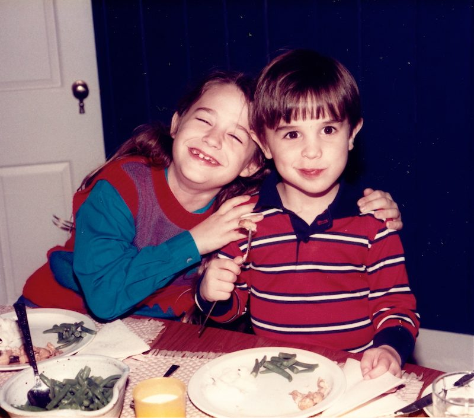
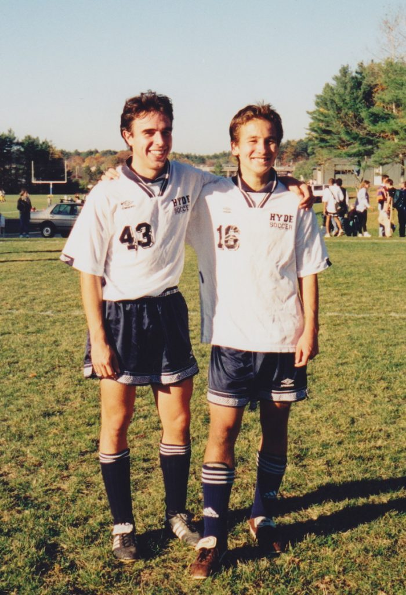
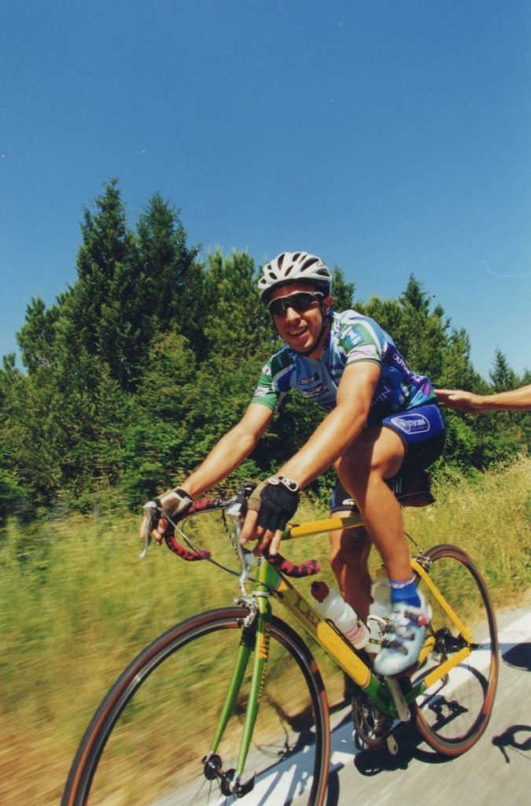
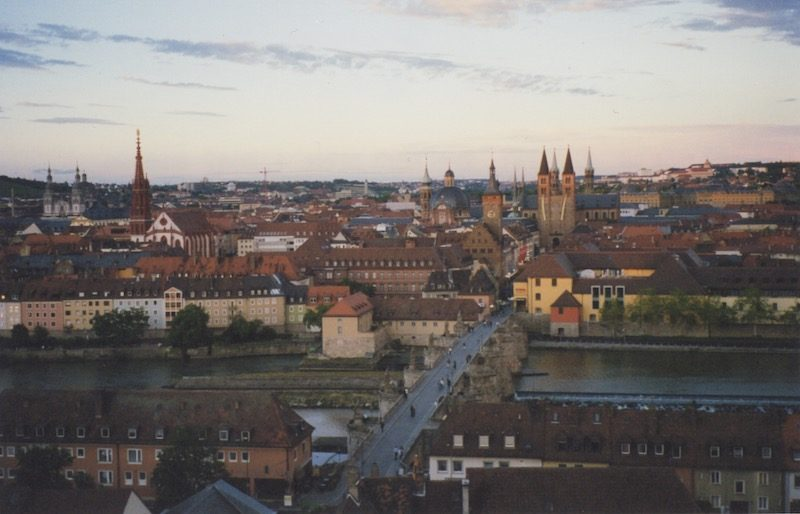
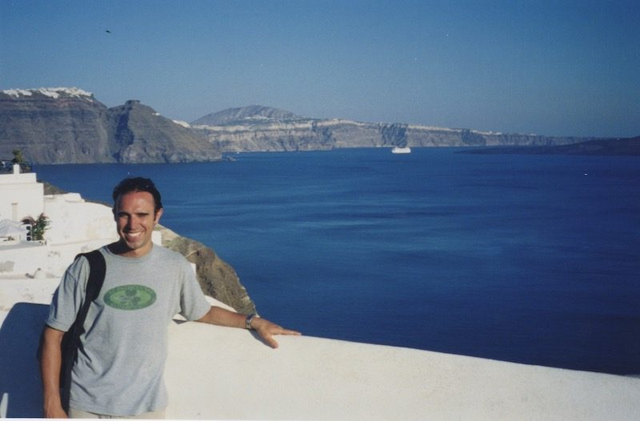
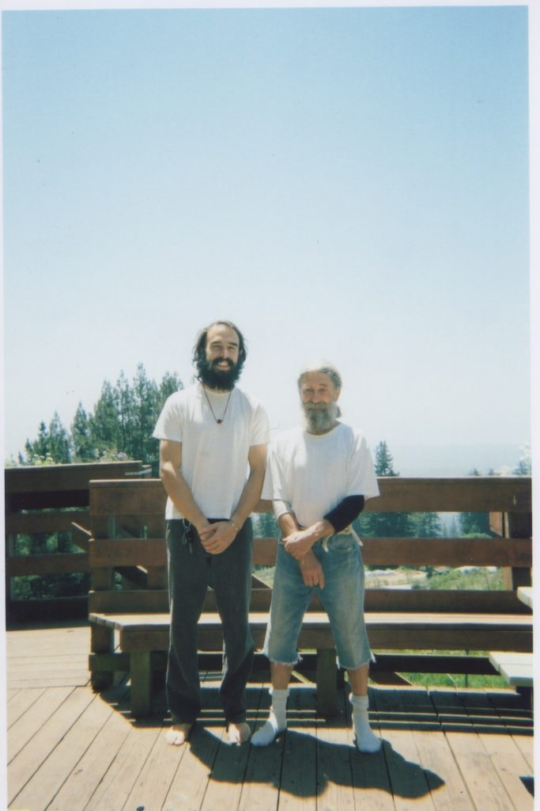
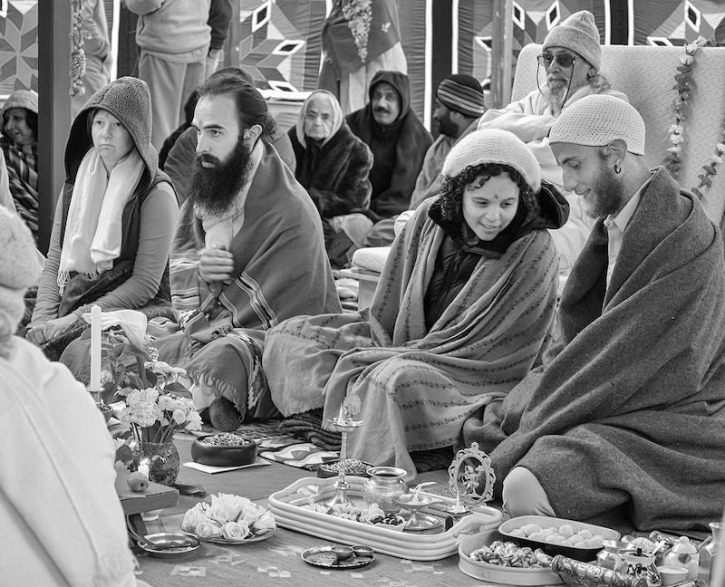
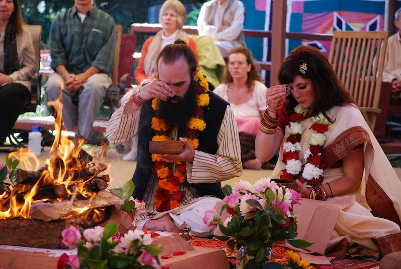
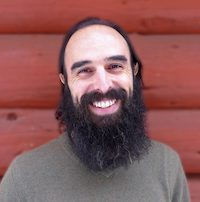

One time, I heard someone ask Babaji about the details of his past. He wrote, “I live in a room with two doors: come in and go out.” Who can say for sure what Babaji, himself a living poem, meant by that? I will try, God help me. The room is the present moment. Through one door, things come into being. A possible future condenses into what is actually happening. Through the other door, they dissolve and disappear. What is actually happening disappears and becomes accessible only as memory. It becomes the past. Really, we all live in this room. Really, this room is me, just as it is you; it is Babaji, it is the light of the Self, but I am forgetful of it.

If the past exists, it tells us so in the present, in this room. Different memories arise according to different desires, and there are as many pasts as there are desires. Each one is born from the present forgetting itself in a string of events that presents itself as the past. And each such string inscribes a particular self, a main character to whom it happened, or who made it happen. Such is life. As I write this I’m humbled by all the relations and events that make a life, and any story I tell has to leave something out; it isn’t the whole truth. Sadanand at Mt. Madonna often quoted Margaret Meade: “All stories are false, and some are useful.” May this story at least be of use, and may it also bring you some delight, wherever you are.

First, the basics: I grew up in Columbia, South Carolina. I’m the youngest of three, with an older sister and an older brother. My dad was a cardiologist, my mom was mostly a homemaker, although she’d done graduate work in psychology and she did a lot of volunteering through our church and community.

*Growing up in* *South Carolina*

I don’t think there were any auspicious signs of my future interest in yoga when I was a kid, other than me being a little odd. Growing up in South Carolina, my family was really active in the church, and I got a proper Presbyterian education, with Sunday school, confirmation class, the whole nine yards. I never really found it that oppressive. Church was where I saw all my buddies, and cutting up in Sunday school didn’t carry the same consequences as regular school, so we always got to have a few laughs. The services were another matter. Think stiff pews, starched collars, and organ arrangements from the 1800s. For a wiggly young boy, it was hard *tapas*, and sitting still in church was probably my first attempt at a steady *āsana.* Sitting through sermons, I would see how long I could go without blinking. I’d let myself immerse in the boredom, until whatever I was looking at would start to shimmer and vibrate, and this humming sound would arise in my ears. Then my sister would notice, nudge me, and whisper, “Quit being weird.” I’d snap out of it.

*Being* *weird*? *With siste*r *Elizabeth*

My parents’ and grandparents’ faith never really seemed fundamentalist. Even though it was conservative by West Coast countercultural standards, it was tempered by my folks’ secular education, travel, and pragmatic good sense. I do remember learning that love and kindness were valuable. And, I do remember asking my parents big questions when I was little, like “what’s the meaning of life?” and “What is God?” In some circumstances, asking those kinds of questions was also a good way to prolong having to go to bed, and they seemed to light a spark in my parents that fascinated me to see.

As I grew older and got into my teens, I became quieter and somewhat withdrawn. My family went through some rough times, and my brother wound up getting sent to boarding school. He and my parents weren’t getting along. Things were going badly for him in school, and my parents took it very seriously. The boarding school was up in Maine, and it was a pretty rough place in retrospect. It was part of that troubled teen industry of tough-love therapeutic boarding schools that flourished in the US in the ‘80s and ‘90s. The school’s pedagogy was a combination of an up-East prep school with elements of the human potential movement and encounter groups, which verged into Synanon-style attack therapy. Sports were mandatory for all three seasons, and intense physical exercise was used as a punishment. It would probably take a whole memoir or sociology dissertation to do it justice. It was a rough ride.

*Playing soccer at Hyde School*

I was exposed to the school at a pretty early age, and I wound up going there myself from grades 10 through 12. Looking back, it was like a journey through the underworld. And, like a journey through the underworld, there were harrowing trials, but also gifts. I met some truly brilliant misfits and saw a side of life that a lot of people from my background are sheltered from. It was a *tapas* in many ways, and I gained both a strength of will and an appreciation for how deeply human suffering ran under the surface of polite society. I was also struck that all of these wealthy people were still not immune from the sort of emotional and spiritual crises that would make someone send their kid to a boarding school like that. It left me certain that there had to be something more to life than just material success.

After graduating from boarding school, I went to Davidson College, a small liberal arts college in North Carolina. It was a relief after boarding school. I became absorbed in my studies, my new girlfriend, and my newfound hobby of cycling. There was a pent-up restlessness in me, and I found I didn’t have the same drive toward conventional success as a lot of my peers, who were busy getting ready for law, med, or business school. I was kind of a dreamer. In my junior year, I went abroad to Germany and spent a year studying German at the Julius-Maximilians Universität in Würzburg through a program at my college.

*Yog on two wheels*

Being abroad was intoxicating. There was something about stepping outside of my home culture and country that was thrilling and eye-opening, as was the experience of being immersed in a foreign language. I threw myself into travelling, eating, and drinking in a way that had never been available to me before. There was a giddiness from finally being free from the confines of the US that took me by surprise. I wanted to devour everything around me: see everything, do everything, taste everything, learn everything.

Eventually, this led to Amsterdam, as the backpacker trail often does for young Americans. There was plenty of legal ganja to be had, as well as psilocybin mushrooms. I was familiar with the former, although not terribly. The latter were new to me, but came highly recommended by many of my rowdy friends from boarding school. So, on my 21st birthday, a friend of mine and I bought some fresh from a little smart shop, divided them between us, gobbled them up, and set out, I believe, for the Van Gogh Museum.

Perhaps unsurprisingly, we did not make it to the Van Gogh Museum that day. In retrospect, I’m sure it would have been awesome. But, if I recall correctly, pretty much everything around me had turned into a work of art anyway. It was like someone turned on a light switch that I didn’t know had been turned off. The light around me danced, and the most ordinary things—the water rippling in the canals, the pavement stones of Dam Square—seemed alive with an almost unspeakable beauty. My mind left its well-trodden, humdrum neuronal pathways and suddenly came alive with long-forgotten memories of childhood delights and with insights, revealed with gentle humour, about how much energy I wasted being afraid and divided against myself. I got into my heart for the first time in a long time. I’ll spare you the blow by blow report, but after that, I was fascinated.

*A year studying German (among other things) in Würzburg, Germany*

So began what I think of as my second education. This was something I had to explore, and my inquisitive mind reeled at why something that felt so beautiful and heart-opening had been so hated and denigrated throughout my upbringing. I tried psilocybin mushrooms on a few more occasions and felt like my sense of awe and wonder was being restored to me. It was like the literature, art, music, and philosophy that my privileged education had presented me with were finally coming alive, like my gaze was being lifted to see the stuff of life that these great minds were trying to communicate.

After a few of these sweet experiences, though, I had an extremely intense one on a higher dose. The gentle know-thyself wonder and delight I’d been experiencing shifted into something even more profound. Whereas before the experience seemed to gradually tease apart the threads of the veil that is limited, egoic experience, this time the veil was ripped in one fierce tear.

The effects came on quickly, rocketing me through a giddy euphoria to something else entirely. I remember time suddenly having no meaning. I was looking at the clock on the wall where I was, but the fact that it was 3:45 just didn’t stick. There was only now, and now was at the same time eternally. The problem was that the person who I thought I was, was in time. I had a past and I looked to a future, and losing that felt like I was dying. This death wasn’t in a physical sense, like my heart was going to stop, but in the sense that identity itself just didn’t make any sense anymore. Nowadays, I actually try to hang out in that space, but at the time, this seriously freaked me out, and my mind tried to do everything it could to get away from it.

In doing so, though, I found myself in the grips of what seasoned psychonauts refer to as a thought loop. One’s mind, in going down a series of thoughts, loops back to an original thought, which then starts the series over again. The result is the feeling of being stuck thinking the same thoughts over and over, in an endless loop. There is no longer any illusion of the ego controlling the contents of the mind. Unless there’s profound dispassion, it is a very hellish situation to be in. I would recognize that such a loop was happening and feel a sense of relief that I’d broken out of it. Then I’d realize, to my horror, that the thoughts of recognizing the loop and feeling relief at being out of it were now segments of a new, larger loop in which I was now stuck going round and round. The classic horror trip realizations were spliced into the loop as well: I’d broken my brain; I was stuck here forever; this was hell.

I don’t know how or why, but something in me just kind of accepted it and let go. What else could I do? It was then that an inner vision arose. I saw the thought loop before me as a golden ring floating in space. Then I saw the mental image of that ring was itself inscribed on a filmstrip going by in my mind. My mind then panned out, so to speak, from that filmstrip. As it did so, it became apparent that the filmstrip that I’d panned out from was itself another golden ring floating in space. And that ring was on yet another filmstrip, which my mind again panned out from to reveal as another ring. This continued on for a few iterations until I realized that, no matter what, there was always something appearing. Everything in my life was going by on this filmstrip, this stream. All I could remember, imagine, touch, see, love, hate—everything. Even the idea of ‘me’ was going by on this stream. There was, in fact, nothing else. I was that. That was I. Everything was that. That was everything. This may seem trivial on the page, but the moment it occured to me, it was like some switch got thrown. A bolt of energy shot through me, and everything turned into a brilliant white light. The world and my body dissolved into that light. As it did so, I half-said, half-moaned, “hoooolllllllyyyyyy.” My mind stopped before it could find whatever expletive was supposed to come next, and the word “holy” just hung there. There was only light and this feeling that everything was complete and whole.

I wish, dear reader, that I could say that such a state remained, or that ever since then my life has been easeful and carefree, bathed in the certainty of this experience. It hasn’t. In fact, after I’m not sure how long, that light subsided, and out of that light, a separate ‘I’ re-emerged, forgetful of, or not really fully understanding, that it arose out of consciousness, not the other way around. It claimed that experience for its own. There was a separation. And, steadily, I came down. I knew something profound had happened, but I couldn’t feel it anymore. I didn’t know quite what it meant and what it was, much less how to get back there. Compounding the problem was that this was all very taboo in the culture at large. It was against the law in most places, derided as a form of hippie navel gazing at best, and outright depravity at worst.

I returned to the States for my last year of school. It was tough going back. Another quote of Sadanand’s comes to mind: “an initation that goes unwitnessed leads to alienation and depression.” This was very true in my case. I was so inspired by these new experiences, and yet there seemed to be no way to integrate what had happened to me, or even to speak its name. It was like a flying saucer had landed in the front yard, but everyone around me was just busy cutting the grass, and I had to cut the grass, too.

It took a lot of willpower to stay focused in that final year, but I finished my degree. At the same time, I became like a detective. Even though I was at a pretty open-minded school, I was still in the very conservative and traditional South, and this was still well before Michael Pollan was writing books on psychedelics and people’s grandmas were micro-dosing psilocybin. There wasn’t a scene with which to connect, or any flesh and blood guides or elders to whom I could turn. So, in my own nerdy way, I went to the library and online. I remember getting big stacks of books through inter-library loan. They were dusty old monographs from the 60s detailing LSD experiments at Harvard, old dissertations and long-defunct journals on psychedelics. I discovered the classical white dude psychedelic pantheon: Huxley, Leary, Alpert, Watts, Schultes, Shulgin, and McKenna. In McKenna’s words, I built my own damn boat.

Nevertheless, I began to think I was too late. To borrow from Erik Davis, it was like I was walking among the spent fuel casings left from the counterculture’s moonshot into inner space. But, as I read and searched and faced my own dissatisfaction and frustration, a clear signal began to emerge from the noise: if I wanted to do that experience honour, if I wanted to bring that deep peace and wonder in my life, I was going to have to take up a spiritual practice. Psychedelics were nowhere to be found, and I’d already figured out that even when I took them, I still came down.

It was around that time that I discovered *Be Here Now,* and something about Ram Dass’ story and way of putting things really spoke to me. I remember listening to a talk of his, and he said something like, “after a while I’d learned what got me high, and I realized I was going to have to face what it was that made me feel lousy.” I realized on some level it was my impatience, my fear, and my generally busy mind that were the obstacle. I couldn’t think—or dose—my way to that deep freedom and peace I’d felt in any lasting way. Some work was required on my part. I took a class on Asian contemplative traditions in the department of religion with a wonderful professor (Bill Mahoney—check him out). I started going to the only yoga studio I could find. I read. I meditated (rarely for more than 10 minutes at a time). I tried to be a better person. I was kind of on my own with it all, but it felt right.

After I graduated, I took a year-long position teaching English to high school kids in Austria. It was a small town,  with not much going on. I practiced the little bit of asana I’d learned, did a lot of running and hiking. Teaching as an American at the height of the Iraq War was difficult. The confrontation with all of the hurt and anger felt toward my home country was humbling, and it taught me a lot about meeting others’ anger with spaciousness, as well as my own. I started to see everything as grist for the mill, as Ram Dass puts it. I figured the best thing I could do for those kids was show them that at least I wasn’t a jerk, and try my best to teach them something and explain why my country was the way it was.

*Yog abroad in Greece after teaching in Austria*

At the end of that year teaching, I came back to the States. After all that time away at boarding school, college, and abroad, I felt a pull to be closer to my parents, and I think I’d finally gotten a little homesick. I took a job waiting tables, rented a little apartment, reconnected with old friends. I felt like there was something I was supposed to be doing, but I couldn’t figure out what, so I just kept it simple. Behind it all, I kept tending this little flame of spiritual inquiry.

After about a year of that, though, I felt something had to change if I was going to understand these practices and traditions with which I’d been flirting. There really wasn’t much available in South Carolina. I decided I wanted to go to find a teacher and live in an ashram for a while. In the back pages of the edition of *Be Here Now* that I had, I think there was actually a listing for Mt. Madonna Center. I checked them out online, and was surprised to learn that the silent monk Ram Dass had met in India was not in a cave somewhere in the Himalayas, but living close to Santa Cruz, California. I printed out the application for YSC (Yoga Service and Community) and mailed it in. A few weeks later, this guy named Ashish called. He sounded down to earth, the place sounded reasonably sane, and they were happy to have me, so off I went.

I’d never been to California, and I drove out there, right across the country on I-40. I camped along the way. It was a powerful trip for me, especially the time I spent in the desert in New Mexico and Arizona. There was a real innocence in that first trip to Mt. Madonna. The spiritual path seemed shiny and new, with all sorts of bells and whistles, practices to try, adventures to be had, stories to hear, teachings to imbibe. It definitely kept my mind and body busy. In a gentle way, life in a community pointed out how uptight I could be and kept teaching me tolerance and patience with others. I only spent about five months that first visit, but I felt light, open, and high on life by the end of it.

*New friends & teachers at Mt. Madonna - here with Vishwanath*

And, of course, there was Babaji. My experience of him was subtle at first. I think a lot of my overachieving tendencies blocked the transmission in my earliest days around him. I was worried about doing something wrong in his presence, or whether he would think I was pure or smart. I think I didn’t really know how to approach him. It was like there was something I was supposed to get from him, but I didn’t know how. What question was I supposed to ask? What lever was I supposed to pull? I learned after a while, though, that it wasn’t like that. He said what he always said: “regular sadhana.” He wasn’t going to zap me with a beam of light or reveal some instant pathway to enlightenment.

So, I practiced day by day, and I watched his every move when I was around him. It was like reading a poem. It wasn’t something I could understand with just my rational mind. For a lot of my life, I had felt this sense that it wasn’t ok just to be still, to not think some great thought, or have some peak experience, or do some great thing. As though I were in debt to life, some part of my mind was always dissatisfied, reaching after the next thing, however subtly. I’m still haunted by this feeling. But, around Babaji, that sort of just melted away. I could just be. It took a long time for me to trust that reality, to surrender to it. I still don’t, a lot of the time, but I know it’s there.

*Yog, with Babaji, pre-yajna at Mt. Madonna*

I left Mt. Madonna for a couple years. I worked and lived in Asheville, NC, tended the fire of my practice, and kept this goal of earning enough money for a longer stay at MMC. I met some beautiful people in Asheville, but I knew something was calling me back to California. My second time around at Mt. Madonna felt very different. The first time was kind of like this sweet time leaving the world for the mountaintop. The second time, the mountaintop became the world, or rather, I realized that if I hung out long enough my mind would create the world wherever I was. I found myself with more and more duties. It seemed like there was always work to do. I saw that there were plenty of disagreements and conflicts to negotiate, and I got into plenty of scrapes of my own. It was almost like the more I expanded and dropped into that place of just being, the more life would offer up to be digested in that space. Soon I was teaching in retreats, a pujari, in charge of housekeeping, helping facilitate YSC, Operations, Admin, temple committees, and on and on. And, as if that weren’t enough, I met Rebecca there, the love of my life, and we got married. But that’s a story to which a few paragraphs can’t really do justice, and it will have to wait for another time. In fact, it feels like I’ve lived a whole other lifetime since I met Babaji, and this piece of writing has probably gone on a lot longer than a SSCY newsletter article needs to.

*Yog & Rebecca’s wedding at Mt. Madonna’s Hanuman Temple*

Anyway, my life has continued on this path since then. There have been other breakthroughs and moments of profound insight, just as there have been times of dullness and depression. I’ve spent a lot of time learning and doing, especially on the yogic path, but as I get a little older, it feels like I’m starting to let myself relax into what all of that practice and study is meant to reveal in the first place. Babaji writes that liberation occurs in the present moment. It’s easy for me to fall into the trap of thinking liberation is somewhere else, and that I’ll get it later once I’ve gotten something else. Really, it’s right here, moment by moment.

Come in, and go out.

---

**Yogeshwar (Will) Humphrey has been a student of Baba Hari Dass since 2006.** He lived at Mt. Madonna Centre for a total of four years in the period between 2006 and 2012, where he also completed 200 and 300-hour Yoga Teacher Trainings, served as a pujari, and worked in a variety of different roles in the community. He was also Operations Manager at the Salt Spring Centre of Yoga from 2017 to 2018, and has also served on the DSSS Board. He holds an MA in Religious Studies from the University of Calgary, and he continues to teach yoga philosophy, pranayama, and meditation through both MMC and SSCY. He lives on Salt Spring Island with his wife Rebecca.
