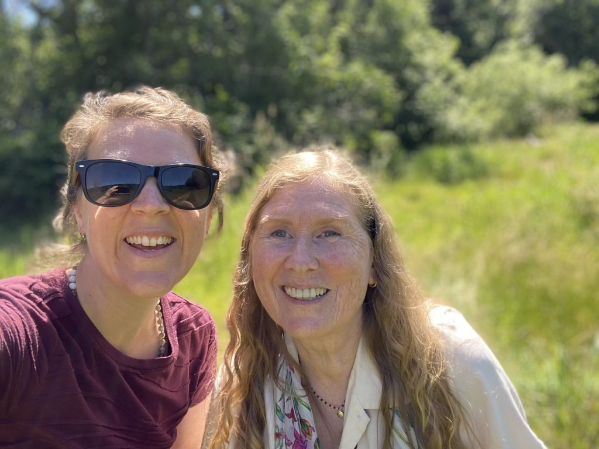

***Read on to learn some of Sarah’s history, her vision for the future, and her first impressions upon landing at the Centre - in her own words.***

*Sarah and Anuradha*

I first stepped upon the Centre land in May of 2016 on a visit to a dear friend who was residing here. After only a few days, I knew I had to return to the island. Not sure I could articulate why – but regardless, I went back to Calgary determined to make it happen. I was approved for a 3-month leave of absence and returned June 2017 as a KY. My time here in 2017 was deep, playful, and inspiring. (I wrote a whole album about it!) I served primarily in the housekeeping department, while also participating in some work parties on the farm and kitchen. I left right before ACYR, but came back to retrieve some things during the retreat and remember being captivated by the amount of energy and connectivity on the land.

I have served the majority of my career in leadership roles within the non-profit sector. I spent a decade with a large Calgary non-profit, wearing many different hats as the organization grew and expanded the ways we were serving vulnerable children and youth. They invested heavily in me as a young leader and I am forever grateful. The past two years I was an internal consultant for the City of Calgary, using various innovation methodologies to empower teams to solve complex, long-standing challenges. While I was really loving my work, I was hungry to dedicate more of my days to my growing passion for supporting people in their lives, and in particular, on their spiritual journeys. In 2020 I graduated as a Certified Life Cycle Celebrant and became ordained as a Metaphysical Minister. I began performing weddings, memorials, and ceremonies. I also finished a one-year, in-depth course on Patanjali’s Yoga Sutras and had begun to provide some dharma talks around the sutras and their relevant connection to our daily lives.

I was forwarded the job posting and had not even read the whole thing when I decided to apply. I had been curious if my growing interest in dedicating my time to walking alongside people in their transitions and spiritual practice would eventually require me to walk away from my passion for and long history with organizational leadership. This job seemed to marry the two worlds in a beautiful way that I could not have foreseen. When I stepped onto the land June 9th and quietly walked the forest trail, I was affirmed in my decision (was it though? Ha!) to be here. The land here is so gracious, beautiful and alive - unparalleled in my experience.

My intentions for my time here are the following.

1. **Service**. Serve the Centre to the best of my skill and abilities. Operationalize our strategic plan, and steward the Centre as we head into a renewed time of vision and operation. Seek every way to empower our community to serve the Centre to the best of their skills and abilities. By his grace.
2. **Growth.** Continue to deepen my own practice and understanding. It’s the most incredible privilege to be serving an organization with such a rich and long history of teaching and practice - and to even walk upon land where so many devoted yogis have walked and served before me is humbling. Relentlessly provide opportunities for others to taste and experience the personal growth and peace that comes with/from service, community and practice.
3. **Vibrancy**. Seek to collaboratively cultivate vibrant programs and operations, vibrant community connections, and secure a plan for financial vibrancy that allows us to not just survive, but thrive.

I am humbled and thrilled to be here. We are coming out of an incredibly difficult season that has been collectively endured. People are in need of healing, of connection, and of the deep and ancient wisdom for peace that was taught and embodied by Babaji. We can offer those things – they exist in abundance. Thank you in advance for lending your wisdom, hands, and hearts in service as we collectively move toward re-opening our doors to the world; who need this place more than ever.

P.S. Here is a link to one of the songs I wrote during my time here recorded with my fellow KY’s on a beautiful afternoon. <https://www.youtube.com/watch?v=noWTOeazGms>
