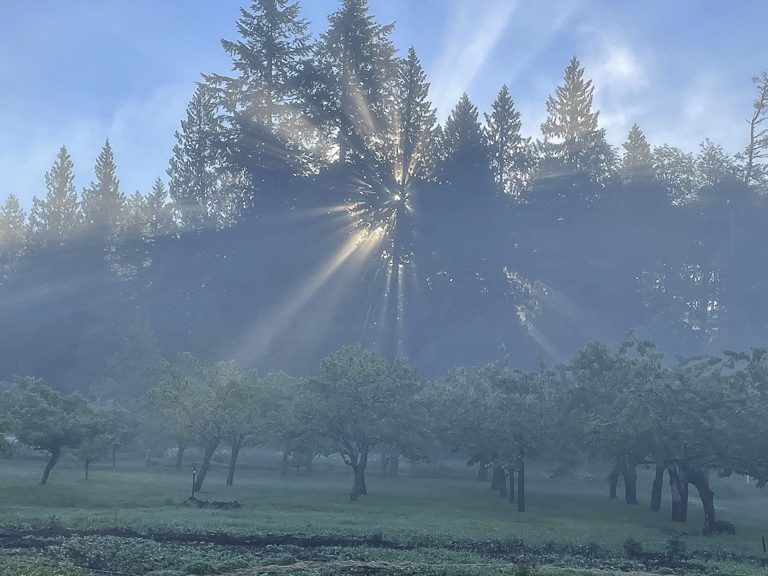
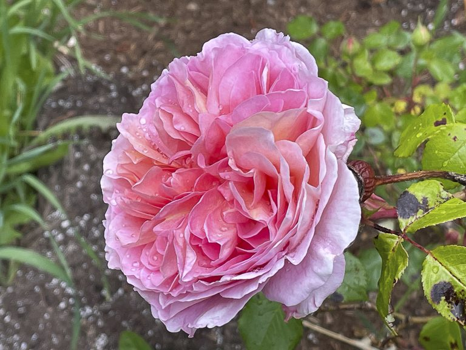
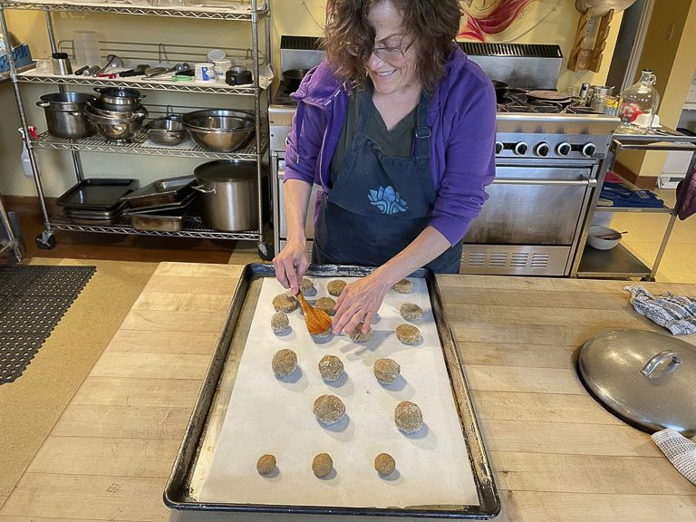
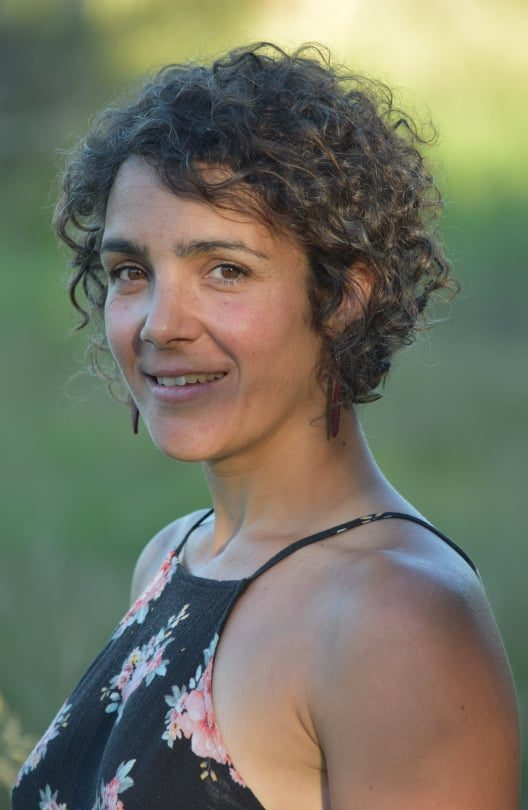
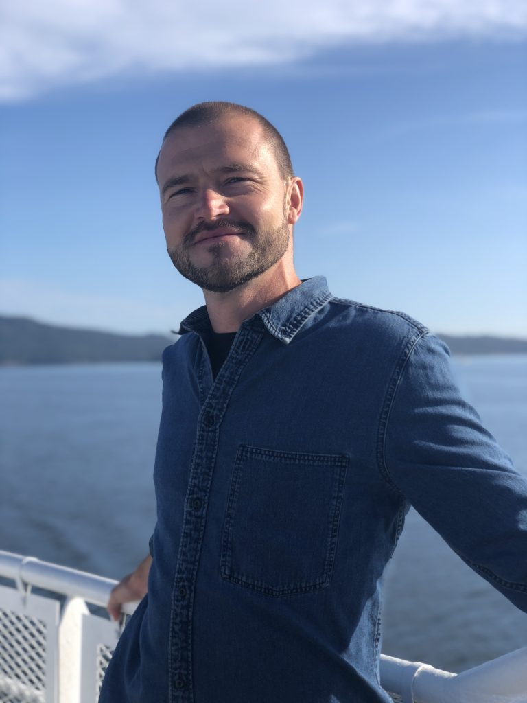
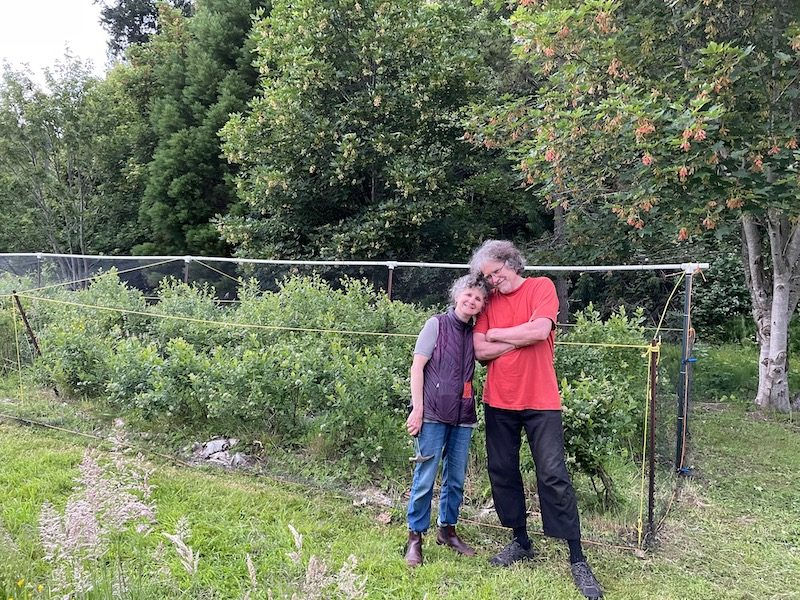
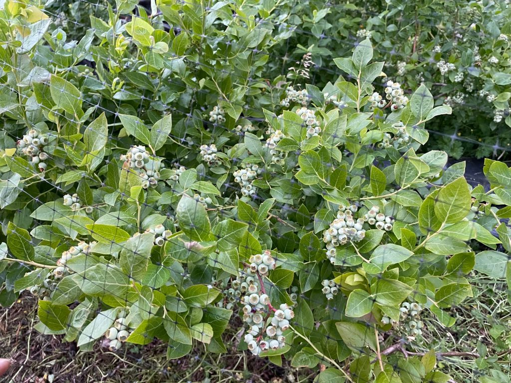
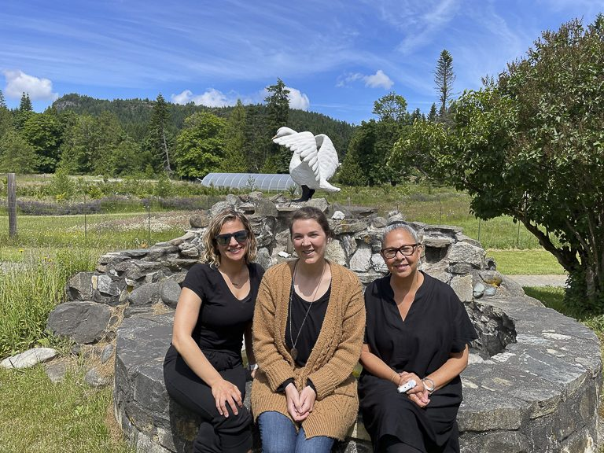
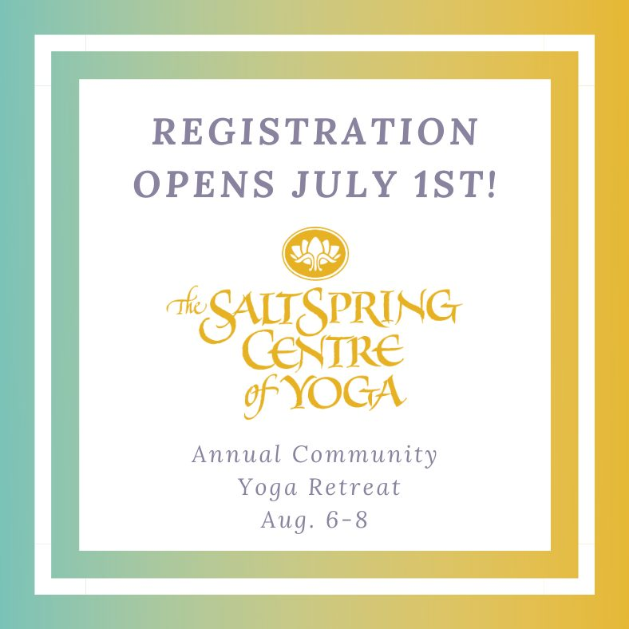
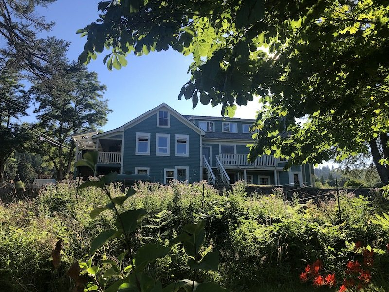

***“And the day came when the risk to remain tight in a bud was more painful than the risk it took to blossom.”***  
***― Anais Nin***

Happy belated summer solstice, friends. As society at large begins to open up through the easing of pandemic restrictions, the expansive spiral of summertime energy seems to want to help us along. We’ve been holding tight in our safe little springtime buds, but now the season urges us to grow, and even dare to bloom.

The Centre community continues to shapeshift with its own energy of the season. Noelle is returning home to Alberta, but plans to move back to BC in August. She has been the main kitchen person supporting the residents for the last four months, making great meals and looking after the baking for the Farm Stand. She (and her ginger snaps and cinnamon buns) will be deeply missed.

*Noelle making cookies*

Marion has also decided to leave the Centre land at this time, after a year and a half of full time residency. She will be relocating to Victoria for the time being, and we are excited to see what comes next for her! To read more about Marion’s journey, please visit the “For Your Reading Pleasure” section this month.

- 

  Marion
- 

  Adam Santosh

Lastly, long time community member Adam Santosh will be moving back to Ontario soon as well. While living on the land full-time for many years, he has served in many, many capacities : musician, weekly kirtan leader, yoga teacher, community member and devoted caretaker of the land. Adam Santosh will be dearly missed, but we send him on his journey with joyous thoughts for his future and so much gratitude. We hope to offer more from Adam Santosh’s time at the Centre in next month’s edition.

- 

  Rajani and OmPK
- 

  The blueberries!

Many thanks to Rajani and OmPK for their continued service to the Centre land. Here is a sweet photo of them after a day weeding the blueberries. Those bushes are loaded!

*We welcome our new Executive Director, Sarah Kemmers (at centre, with Kris and Chetna)*

New Executive Director Sarah Kemmers has arrived on the land, and was warmly greeted by both Chetna and Kris. Learn a little bit more about what brought Sarah to us, and what inspires her about her new role in the “For Your Reading Pleasure” section of the newsletter below.

Regarding new articles for all our reading pleasure - we are always looking for folks to write for this newsletter! Do YOU want to write for us? Do you have a story to share? We are wide open to anything yoga-related or seen through a yogic lens. Asana/Flow of the Month (could have a video link), yoga book reviews, scriptural/philosophical study, yoga modality exploration, poetry, how yoga helped your personal pandemic experience, the 'Yoga of' your current job...etc. If so, contact us at [info@saltspringcentre.com](mailto:info@saltspringcentre.com)

## Rituals and Other News

### **ACYR**

Save the Date!! Our 47th **[Annual Community Yoga Retreat](https://saltspringcentre.com/annual-community-yoga-retreat-2021/)** will be held ONLINE from August 6-8, 2021.

From our ACYR Marketing Co-op Student, Olivia…

> *It's Summer!! We are thinking of the Summer Retreat  - officially the 47th Annual Community Yoga Retreat (ACYR). We will be online one more time. There is no question we miss being with you all in person here on the land, and, without question, we had an amazing Retreat last year on ZOOM! Finding balance in a constantly changing world is our 24/7 Sadhana. It is strengthened by the many teachings from Babaji and Yoga, and by fellowship of those who seek the truth in Satsang. Every seeker counts, so let’s all be there this year, invite family and friends, it will be amazing!*
>
> Thank you, Olivia

*\*\*Please note that this is different from our usual dates of the August long weekend, in recognition of the fact that people will be moving around more this summer (hooray!) and will likely want to be outside over the long weekend.*

### **Update on Classes**

We are happy to announce the **return (again) of in-person [asana classes](https://saltspringcentre.com/yoga-classes/)!** With the release of BC’s new Public Health Orders, we will be following all protocols, including safe distancing and sanitizing between classes, as before. **All classes require registration in advance** to support the covid protocols and safe distance spacing.

[**Classes and satsang continue online**](https://saltspringcentre.com/programs-retreats/public-offerings/), from Salt Spring, Vancouver, and Mount Madonna Center. These online resources have allowed even more folks to take part than normally would be able to in person, and it’s never too late to join in.

### **Rituals**

- Hanuman Puja and Chalisa (11 rounds) took place June 22nd  and the Full Moon Yajna took place June 23.
- Guru Purnima will be held July 23rd and people are invited to attend in person! Social distancing will still be in effect, but we are grateful to be able to gather in person once more. Proceedings will begin between 8:30-9:00am, and go until 12:30pm.

Please contact Mahavir if you have any questions, at [theseentheseen@yahoo.com](mailto:theseentheseen@yahoo.com)

### **Call out to SSCY YTT alumni for Online Program Proposals** **for 2021-22**

What workshops, courses, podcasts, or series would you love to put out in the world to help others on their path to a more contented, peaceful life? The Salt Spring Centre is now scheduling online offerings for 2021-2022 and  welcome our talented YTT Alumni to partner with us in delivering paid programs. For 2021-2022 we are focusing on the following themes: Lifestyle and Preventative Health such as immune system support, addressing sleep disorders, navigating change, etc. Beginners Courses especially Meditation, Breathwork, and developing a home practice. Mental Health including anxiety, getting unstuck, improving social connection, focus and concentration. If you are not sure how your work might fit, have an idea, question or want more information connect with Civi, Online Programs Manager [civi@saltspringsentre.com](mailto:civi@saltspringsentre.com)

## For Your Reading Pleasure…

Our new Executive Director has landed! Sarah Kemmers has penned [**a lovely introduction**](https://saltspringcentre.com/meet-sarah-kemmers-our-new-executive-director/) for us all about what has brought her back to us, and we are so happy to have her. Welcome home, Sarah!

In her story [**Cultivating Balance**](https://saltspringcentre.com/cultivating-balance/), Marion takes some time this month to share from her past year and a half at the Centre, and how she came to find balance in the study of Ayurveda.

We’ve dug one out from the digital archives for you this month with [**Developing Positive Qualities**](https://saltspringcentre.com/developing-positive-qualities-2/), a piece Sharada wrote back in May, 2013, exploring Babaji’s teachings around developing positive qualities through regular sadhana. Sharada writes ”As much as we’d like it to be otherwise, we have no control over how other people act. If we have control over anything, it’s our own responses. That’s the work.”

We are wrapping up July’s newsletter in the midst of an extreme heat wave throughout most of our province and beyond. Even as we sit with our discomfort, may we find ways to take care of ourselves and each other.

And to spare a thought for our animal friends, as well. Please enjoy this poem and feel free to submit a favourite in the months to come!

**The Hummingbird***By BLAS FALCONER*

A blur in the periphery,  
like the mind if the mind  
were airborne, a buzz among  
leaf and orange blossom,  
the long beak pressing quick  
into flower after flower, high  
on each sweet center, and  
each iridescent feather shines  
hard—a thought, half-formed,  
charged, a hum before it lights  
on the branch—and you  
see it clearly—dimmed, now,  
small, no longer what it was.

*Love Loves Love,*  
*Kenzie & Courtenay*
