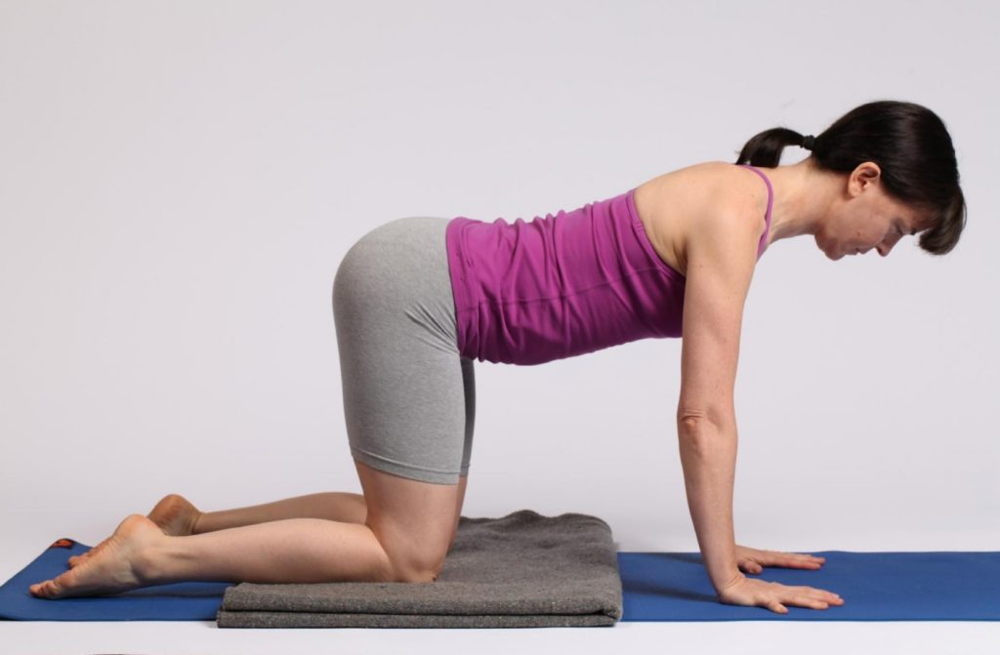
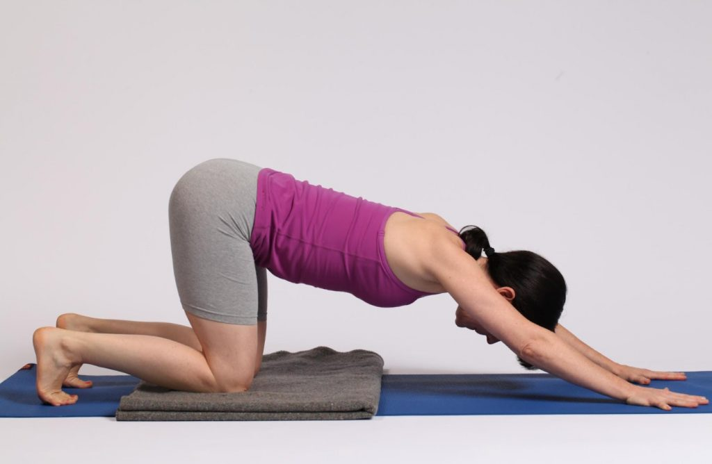
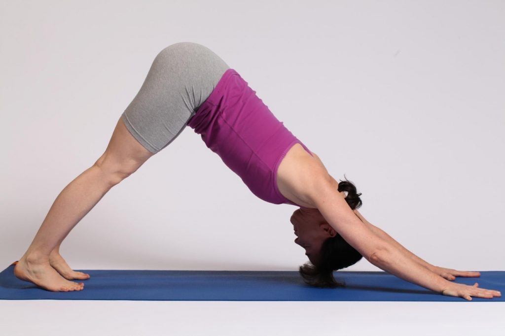

## **aka Adho Mukha Śhvānāsana, Downward Facing Dog** by Kathryn Kusyszyn

This is a standing forward bend, half inversion and balance pose.

I love this pose and practice it every day. As one of my teachers says “Another day, another dog pose.”

This pose is used as a type of transition pose and a type of eraser, to smooth out the effects of the previous pose on the body and prepare for the next one.

In preparation for this article I attempted to bring more mindfulness to my practice of it. It is easy to go on autopilot doing something you are very familiar with. What I love is the sense of my spine lengthening towards the floor, the shoulders feeling stable and the backs of the legs opening.

When I first began a regular asana practice, my hamstrings and calves were so tight that they pulled on my lower back and caused it to round. To alleviate this, my teacher recommended I practice with my feet wider than the mat and step forward until they were flat on the floor. This took the back of the legs out of the equation and allowed for me to focus on strengthening the arms, shoulders and torso, while reaching the body back in space. Essentially, I learned the top half of the body’s mechanics for this pose, and then later on when my leg muscles softened, I learned the lower body mechanics.

It helped that I ditched my desk job and practised more yoga instead!

Babaji calls this Bhudrāsana or Mountain Pose. I like that it brings to mind the stability and shape of a mountain. So the angles of the top half and bottom half of the body are roughly symmetrical.  There is equal weight in all four points that are touching the earth.

## **How to practice this pose:**

Start on hands and knees. (See photo #1) Tuck your toes under and engage your legs.

Imagine you have a block between your thighs and hold it there - or you could put one there for real.

Inhale and extend your arms from your bottom ribs forwards and walk them a hand span or two ahead of you, hinging your torso forward at your hips and bringing your ears in line with your torso. Keep your arms firmly in your shoulder sockets and your upper shoulders far away from your ears.

This is what is called Puppy pose, an unofficial pose that is very useful as a preparation.

From here, with strong legs, an engaged pelvic floor and deep core muscles, inhale and then exhale as you press your hands and feet into the floor. Keep your upper body as it is, and lift your knees towards a straighter position. Reach your buttocks back to where the wall meets the ceiling behind you. Up and back. Adjust your legs so that your heels are slightly off the ground, legs are straight with soft knees, arms are straight with soft elbows and upper arms are in the shoulder sockets. Ears are in line with your upper arms. Gaze can be just beyond the tip of the nose or at the navel. Breathe and keep lifting your pelvis up and back to lengthen your spine.

To exit the pose, gaze forward between the hands and come down onto hands and knees.

## **Variations:**

If you have a lot of sensation in your legs, bend your knees slightly, lift your heels high and reach your pelvis back and up again.

Then, lower your heels and move your legs towards straight.

If you still have a lot of sensation in the backs of your legs, step your feet wide and walk them closer to your hands until the feet are flat on the floor. Work with the upper body first.

If you have a lot of weight in your hands rather than your feet, press the floor away from you and reach your pelvis back and up.

Use the forearms on the floor instead of the hands to stabilize the shoulders and relieve weight on the wrists.

Practice with the heels lightly touching the wall and assess the effort and weight in each leg.

A gentle version of this pose is to place the hands on the outside edges of a chair seat and walk back until your heels are slightly lifted off the floor.

## **Effects**:

Muscular: strengthens muscles in arms, wrists, legs, ankles and back. Stretches all spinal vertebrae.

Respiratory: diaphragm is lifted towards the chest cavity, working with gravity.

Endocrine: stimulates thyroid, pituitary, tones adrenals and gonads.

Cardiovascular: partial inversion. Torso and head get increased blood flow.

Nervous: exhilarating pose that removes fatigue.

Digestive: tones abdominal organs, strengthens spinal muscles.

Urinary: tones kidneys.

**Dosha effects**: Balancing in this order: kapha, vāta, pitta

Vayu effects: Prāna (upward flowing energy) & apāna (downward flowing energy) stimulated, samaāa toned.

**Contraindications**: carpal tunnel syndrome, late term pregnancy, high blood pressure, caution during menses.

**Sources**: Mount Madonna Institute yoga teacher training manual, personal practice, teaching experience and many helpful teachers.
