## RETREAT TIME! Break the net of your attachments & be free; Reaffirming the strong Connections of our Community

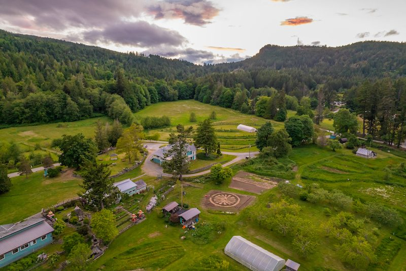

> “The silkworm makes a net to imprison itself. In the same way a person makes a net of attachments, desires, and possessiveness, and sits inside that net in pain and depression. As long as this net is not broken, the silkworm remains dormant. But as soon as it is broken, the silkworm emerges in a new form: a butterfly that can fly and that makes everyone happy. So break the net of your attachments and be free.”
>
> -Babaji

And just like that, August is here! The sun shines on us, and is as close as it will be all year. Berries have ripened and hang heavy on their branches. The fullness of the year is upon us, and it is a time for light, joy, and play!

This month, as many things in our communities continue to open back up, we are exploring themes of how we come together and connect as a community, and how to find and hold the essence of our own personal freedom no matter what may come, as Babaji’s wise words remind us. And, as outwardly we dance more closely  together and forward through this joyous season, we also challenge you to turn your gaze inward and ask:

*What is the net of your own attachments made of?*

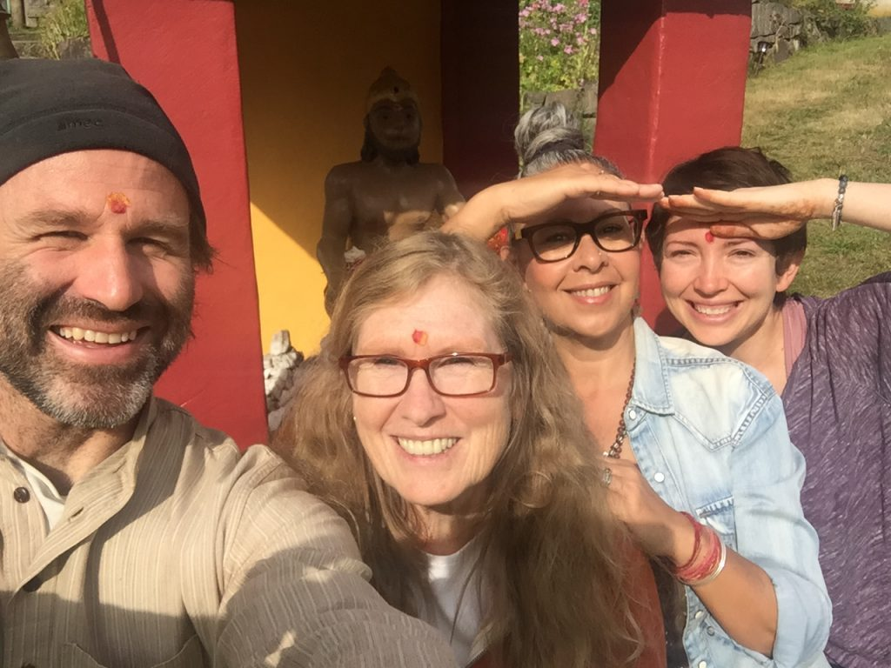

*Hanuman gang*

Of course, August can also mean only one thing to many in our Satsang…..that’s right, it’s retreat time!! Our [**47th Annual Community Retreat**](https://saltspringcentre.com/annual-community-yoga-retreat-2021/) is coming to you *online* again this year, on the new dates of August 6-8th, in order to give everyone the much-needed time to enjoy their long weekend outdoors.

With a ***brand new Ramayana performance***, ***Asana classes*** with your favourite teachers, ***Latte Da Stage Talent Show*** and of course our famous ***Kids’ Program***, this year’s retreat will be better than ever. For more information, please see the ACYR section, as well as a beautiful video from Retreat Director Anuradha, below!

In other news from the land, the community at the Centre continues to ebb and flow. With the departure of Adam Santosh and Marion last month, we also saw the return of dear Satsang members and former residents Selva and Moss, who are lending their hands and energy to the land this summer.

Sarah Kemmers continues to sink her feet into the land and her teeth into her new role as Executive Director! And with the Centre’s re-launch of in-person retreats this September, there is lots to do and excitement in the air.

- 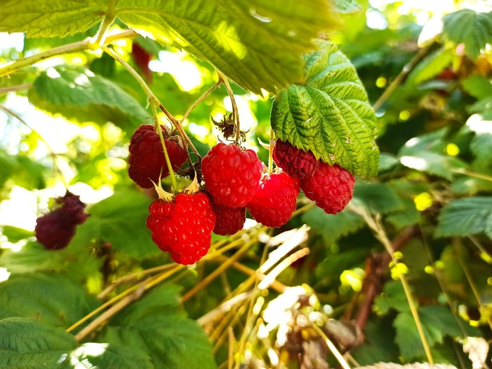
- 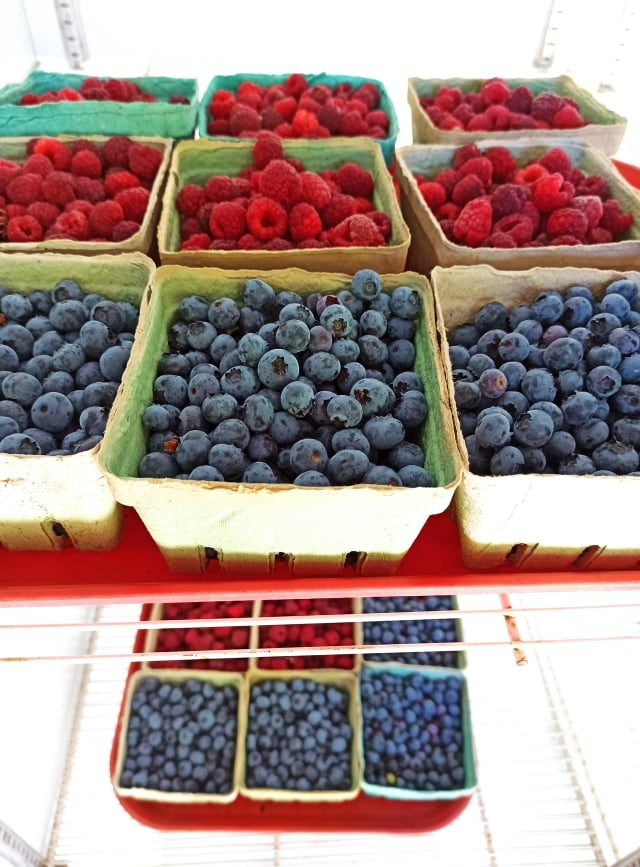
- 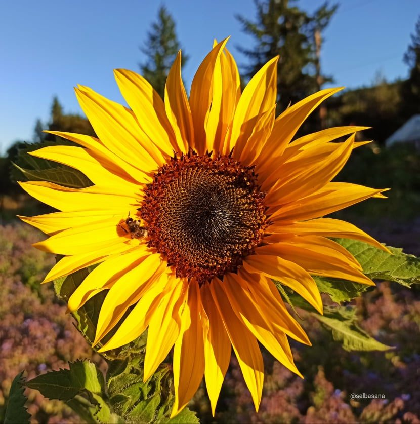
- 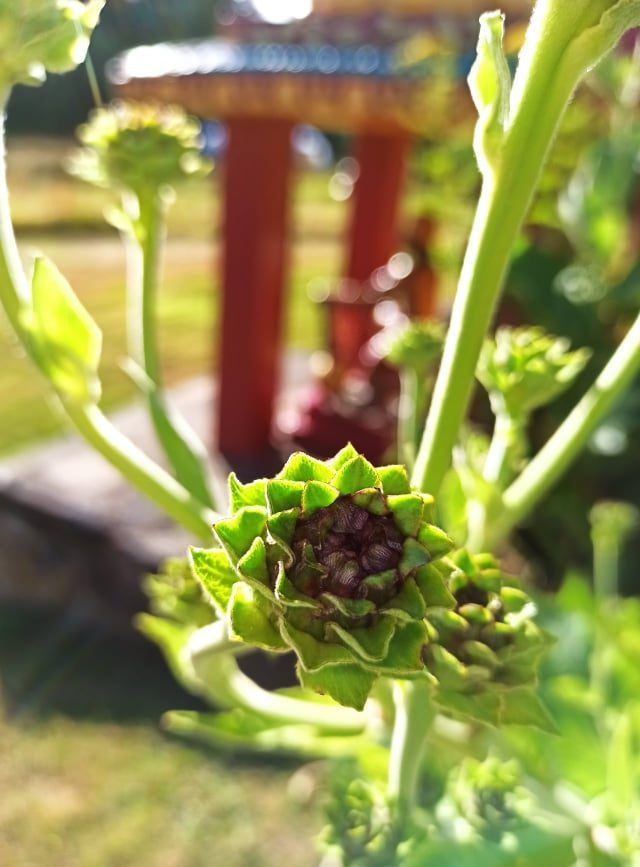
- 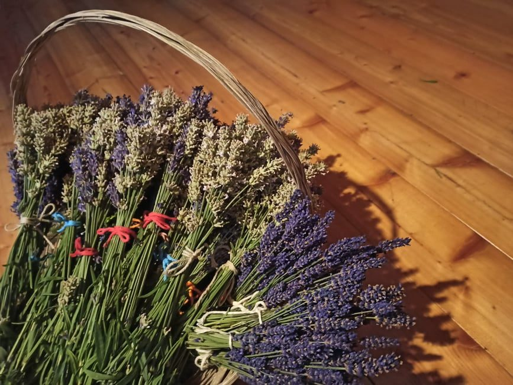
- 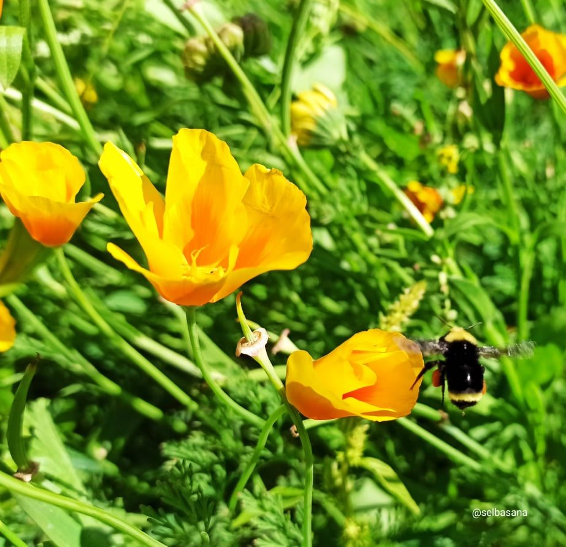
- 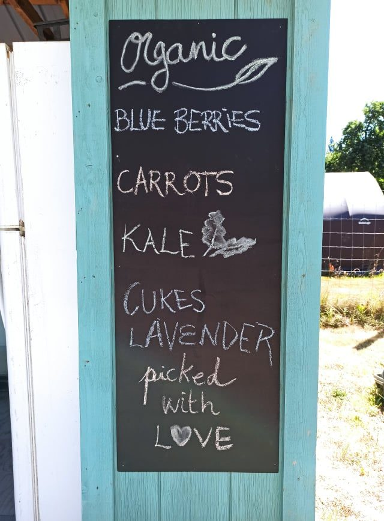
- 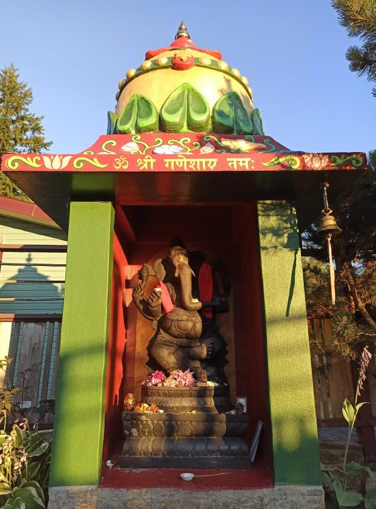

---

## **Centre Benefit Concert - Anand Band**

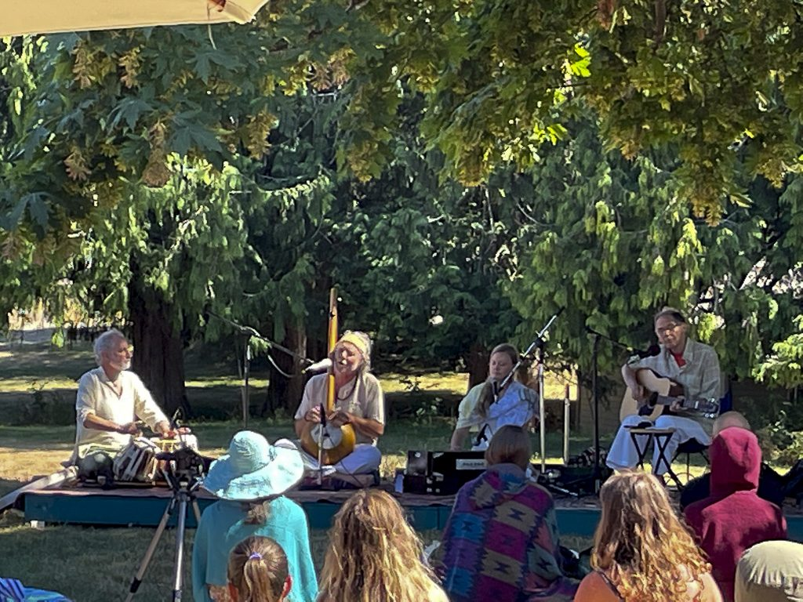

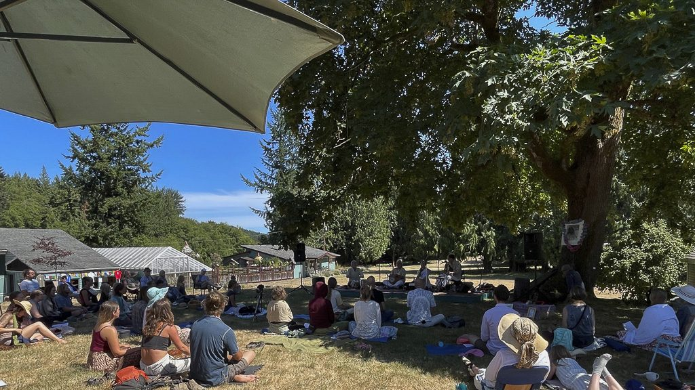

We’d like to extend a big, heartfelt and happy THANK YOU to the Anand Band for the magical benefit concert they put on recently for the Centre. Thanks to Vikash, Johanna Sanjeevani, Damien & Adam Huber, and of course to Harry Prasad for the sound.

We had a great turnout - 80 people, outside in the sun under Babaji’s tree, and all well distanced! There was even a concession serving real pakoras, yummy cookies, sweets, khir and blueberries, as well as our very own Jai Store selling our yogi swag.

This was a great success in all ways, as it finally brought our Yoga/Kirtan devotees together to sing in the first large gathering in a very long time. We missed this, and look forward to more to come!! The concert was also a wonderful and welcome financial support for the Centre.

---

## **Rituals and Other News**

### **Annual Community Yoga Retreat - August 6-8th: You’re Invited!**

***There is still time to register for our [47th Annual Community Yoga Retreat](https://saltspringcentre.com/annual-community-yoga-retreat-2021/)!***

https://www.youtube.com/watch?v=oTU8cca4sPg

Here, to tell you about this year’s retreat, and to remind you why it is always so special - notes from Anuradha, Sharada and Kris:

> Dear Salt Spring Centre Retreat friends and family,
>
> The Annual Community Yoga Retreat is AUG 6, 7, 8th this year, one more time online. ZoOMMMM is not as new, and we are not as isolated as we were last year. But we have great excitement to see each other, practice and play and together feeling our collective energy so strongly as we all embody change on our path to peace.
>
> We hope that you will still register to give support for the Centre. Pre-recorded materials will be available to take on your own time if that is better for you. I hope you will join the live sessions as much as you are able. It's important. Energetically coming together and monetarily looking after this most precious Centre supporting our mission and practice. "A place where people will find peace." Babaji
>
> [Registration is open](https://saltspringcentre.com/annual-community-yoga-retreat-2021/). Looking for you!!
>
> With love and gratitude....OMMMM Shantih!!  
> Anuradha and Sharada

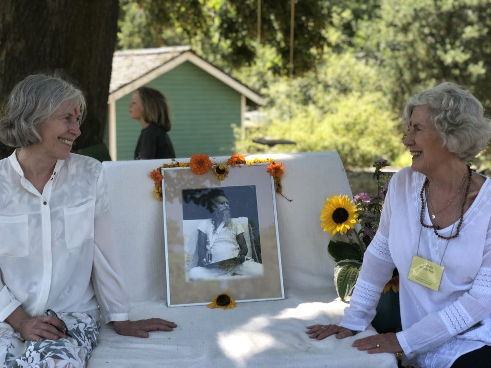

*Mayana and Chandra at ACYR 2019*

> The Annual Yoga Community Retreat is just what it says; we’ve been coming together as a community for over four decades. We come together not only in community but in practice.
>
> Last summer, at a time where we all felt the disconnection of social distancing and quarantine, we came together online in a way that had us connecting from all around the world. This year, we’re hosting the annual retreat again online as we walk the path of change. We are also coming together to support our beloved Salt Spring Centre of Yoga. The Centre has been closed to residential programs for almost a year and a half and has been negatively impacted in a significant way. We still need your support.
>
> Dear community, this is a time where we are asking to come together as a community again. We are in need of the financial support that this event brings and we are asking our dear community to join us in a profound weekend of practice, learning and play. We have made some small changes that allows you to enjoy some of the retreat in your own time, while keeping the supportive container that practicing with a satsang brings.
>
> We hope you will join us.  
> Kris

### **Yoga Asana Classes**

In-person asana classes are back! Numbers are up and less physical distance is required, but pre-registration for classes is still recommended.

Click [here](https://saltspringcentre.com/yoga-classes/) for a schedule of our current yoga classes, and info on how to register.

*\*Please note that the Centre still requires that teachers and students continue to wear masks while inside, until they are on their yoga mats.*

### **Yogic Theory and Other Classes**

[Classes and satsang continue online](https://saltspringcentre.com/programs-retreats/public-offerings/), from Salt Spring, Vancouver, and Mount Madonna Center. These online resources have allowed even more folks to take part than normally would be able to in person, and it’s never too late to join in.

*\*Please note that our weekly class on Patajali’s Yoga Sutra, led by Yogeshwar, is on summer break until September 2021.*

### **Rituals**

- 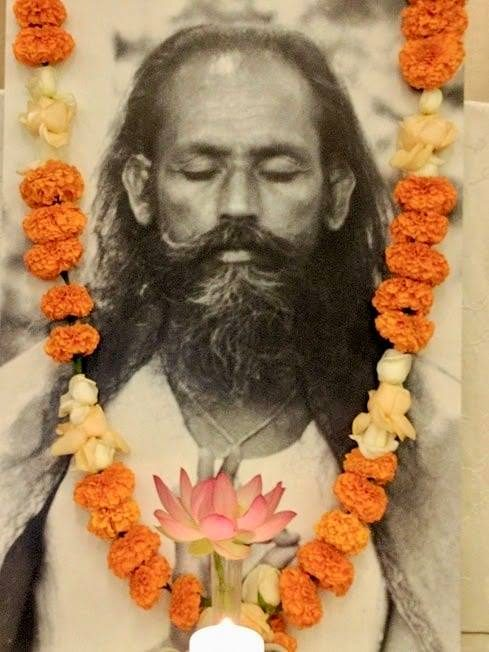
- 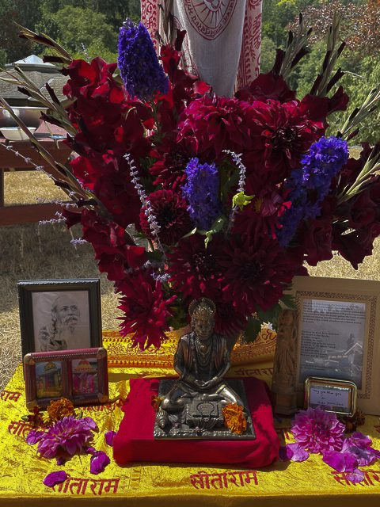
- 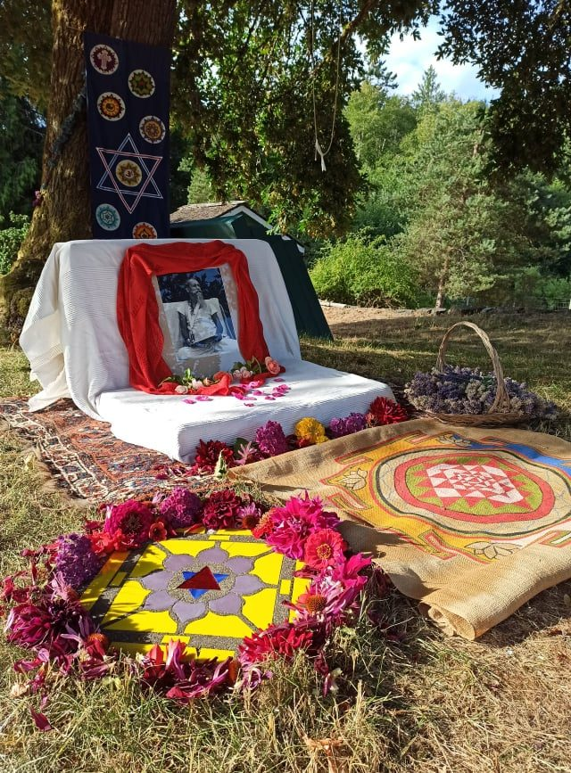
- 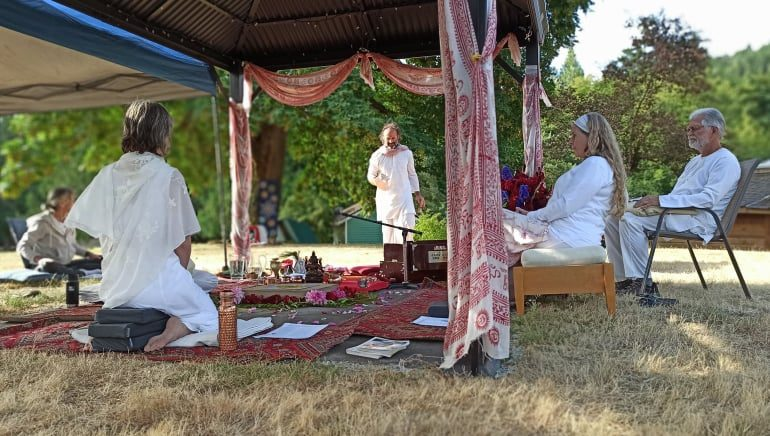
- 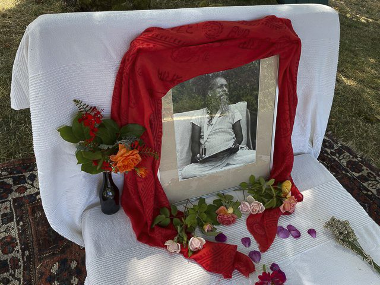
- 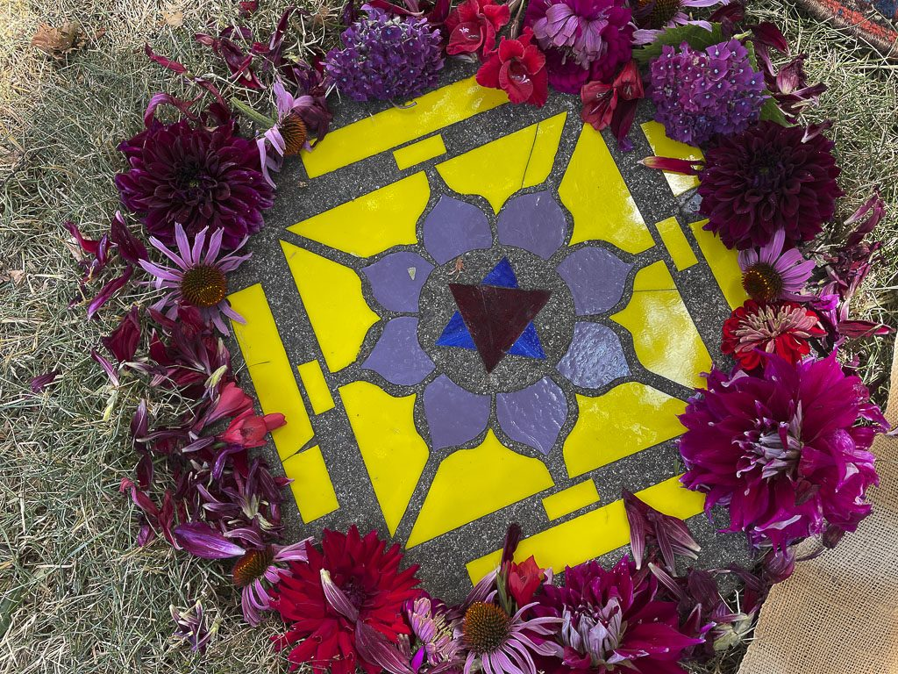

**Guru Purnima** was celebrated this month with a beautiful ceremony, graciously facilitated by Mahavir, and held at the new yajna shala on the mound, just as the moon reached her fullness on July 23rd.

This auspicious day is marked in gratitude to guru, and indeed to all teachers, spiritual and otherwise, who take us from darkness into the light.

Babaji’s own guru, Raghubhar Dassji Maharaj, said to Babaji:

> "I am with you in the form of my teachings. We are always together as a guru and disciple, or as ‘teachings’ and ‘learnings.’ When the teachings are learned well, the learner becomes the teacher and carries the lineage of teaching eternally (*The Path Unfolds*)."

Babaji, as always, is foremost in our hearts on this day, as are all our Satsang members who join in spirit when they cannot be on the land in person. The photos show our family on the land who marked this special day for all of us, and who continue to keep the flame of ceremony lit and glowing.

It is also a day to honor all those who have helped show us our own path, and who reflect back to us our own light. For me, it even calls to mind a certain grade seven teacher, who inspired - through hikes and drawings - a whole class of nature lovers, and who saw in me so much more than an awkward almost-teenage girl who felt self-conscious about being smart. He was the first person who really made me feel it could be cool to be smart, and maybe even cool to be me.

Jai Babaji! And Jai Mr. Humphreys ;)

---

## **Calling all...**

### **...Kitchen Karma Yogis!**

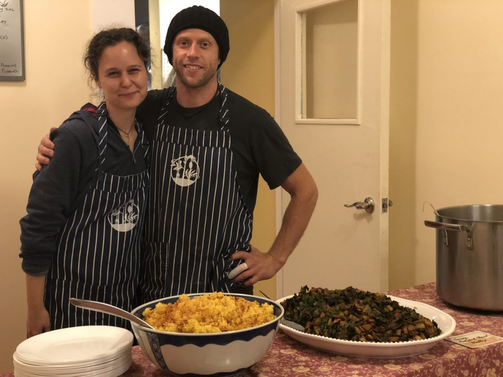

*Kitchen Karma Yogis*

In-person retreats are returning to the Centre this fall, and we need your help! With our relaunch date of September coming up, we are looking for TWO enthusiastic Kitchen Karma Yogis to come and join the on-land community for an 8-week commitment.

If interested, please see the position details [here](https://drive.google.com/file/d/1uBi_02edjCYCXfADvm5Kv8-_5UFifhDo/view?usp=sharing).

This is a wonderful opportunity to immerse yourself in the healing magic of the land, of Sadhana, of Satsang, and of Salt Spring, all while providing a wonderful and much-needed (and appreciated!) service as the Centre gets back on its feet and prepares to reopen its doors.

For more details you can email Sarah at [sarah@saltspringcentre.com](mailto:sarah@saltspringcentre.com).

### **...YTT Alumni!**

#### for Online Program Proposals for 2021-22

What workshops, courses, podcasts, or series would you love to put out in the world to help others on their path to a more contented, peaceful life?

The Salt Spring Centre is now scheduling online offerings for 2021-2022 and welcome our talented YTT Alumni to partner with us in delivering paid programs. For 2021-2022 we are focusing on the following themes:

- Lifestyle and Preventative Health such as immune system support, addressing sleep disorders, navigating change, etc.
- Beginners Courses especially Meditation, Breathwork, and developing a home practice.
- Mental Health including anxiety, getting unstuck, improving social connection, focus and concentration.

If you are not sure how your work might fit, have an idea, question or want more information connect with Civi, Online Programs Manager [civi@saltspringsentre.com](mailto:civi@saltspringsentre.com)

### **...Writers amongst us!**

We are always looking for folks to write for the newsletter! Do YOU want to write for us? Do you have a story to share? We are wide open to anything Centre-related, or seen through a yogic lens. How did you first come to the Centre? Asana/Flow of the Month (could have a video link), yoga book reviews, scriptural/philosophical study, yoga modality exploration, poetry, how yoga helped your personal pandemic experience, the 'Yoga of' your current job...etc. If so, contact us at [info@saltspringcentre.com](mailto:info@saltspringcentre.com)

---

## **For Your Reading Pleasure…**

### **Asana of the Month - Downward Facing Dog, by YogaKat** Kathryn Kusyszyn

This month our own YogaKat takes us through one of the most beloved of all poses - **[downward-facing dog](https://saltspringcentre.com/bhudrasana-mountain-pose-scriptural-or-cultural-pose/)** - and shows us that there is much more to this pose (including many more names!) than we might realize as we flow through it on a daily basis.

### **Coexistence, by Dan Naccarato**

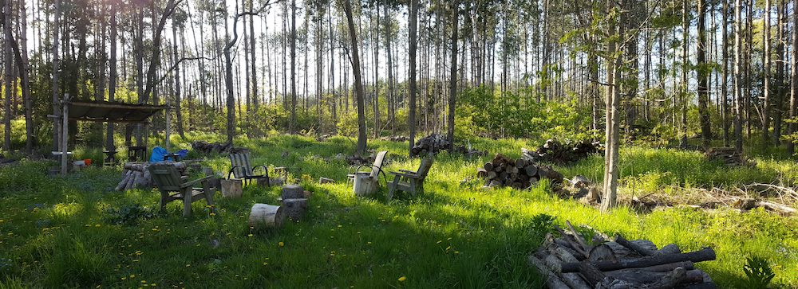

Garden Dan shares a short and very sweet piece about the invisible networks that connect the forests all around us, and indeed what connects us all, as we approach our annual retreat.

### From the Archive: **RAMAYANA, by Sharada**

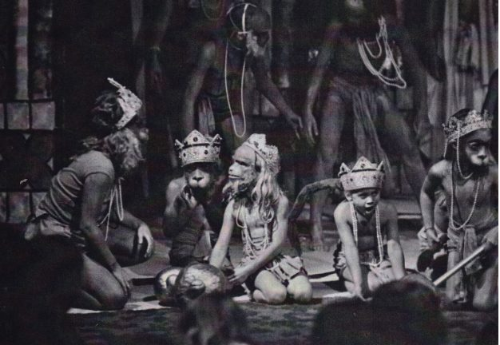

*Ramayana monkeys* from a past ACYR performance

From the archive this month, we bring back a wonderful piece from Sharada, who takes us through the many years of [Salt Spring Centre Ramayana productions](https://saltspringcentre.com/ramayana-history-at-salt-spring-centre/), including all the monkeys, the many incarnations of Ram, the wrath of Ravana, and the ultimate victory of Hanuman’s selfless love.

***\*\*Watch this year’s RAMAYANA production when you register for our 47th annual retreat*** [***here***](https://saltspringcentre.secure.retreat.guru/program/47th-annual-community-retreat-online/?lang=en)***!\*\****

---

## **In Closing…**

Of course, despite the fullness of the season and the beauty of Salt Spring, we must acknowledge that the great balance of nature has been disturbed.

Heat waves leading to record numbers of fires are scorching B.C.

Flooding has decimated many places in Europe. As humans, it is a time of reckoning not only environmental, but social. In Canada we are all grappling with the horrific discovery of the bodies of Indigenous children at residential schools.

This can all be a lot to contend with. But we do not have to do it alone. We have the gift of Satsang, of community, and the power that brings as well. This is why the theme of our Retreat this year is “Embodying Peace on a Path to Change,” because we recognize that there is much work to do, and that this work starts within each of us. We must do this work ourselves, and then we must come together.

And we must still embrace joy. For the berries are still ripe, the flowers continue to bloom, and the sun continues to bless us with her life-giving rays.

And so, we invite you to join us. Connect back in with us, with your Satsang, with your community. And, in doing so, connect back into your deep Self. It’s time to let the nets of our attachments fall away. Together let’s become truly free.

Blessings and Love to You All,  
Courtenay

*“In summer, the song sings itself.”*  
- William Carlos Williams

