

*Photo by Raghunath (Rodney Polden)*

You may have seen one of the Ramayana productions on Salt Spring over the years, or possibly one of the most recent Ramayana revivals in the Pond Dome at the Centre in 2014, 2015 or 2016. You may also have seen one of the spectacular Ramayana productions done by Mount Madonna School. The play is fun and exciting, and it also has deep meaning.

The Ramayana is an ancient story filled with symbolism. Rama is the God principle in everyone, while Sita represents human consciousness in the embodied soul. In the story Sita is abducted by the demon king Ravana, who represents the deluded ego. In the esoteric allegory, the individual soul loses contact with the higher Self when it is overpowered by material desires and, left defenseless, is kidnapped by egoism. In Ravana’s kingdom Sita tormented by demons, representing negative thoughts and tendencies. Hanuman, the epitome of faith and devotion, sets out to rescue Sita, with his army of monkeys, symbolizing the restless yet positive energies of the mind. In the inner analogy, the process of spiritual struggle really begins with the practice of spiritual disciplines to control the restless, scattered mind. When Rama arrives in Ravana’s kingdom, battles ensue. As in many epics - including Star Wars - the battles are between the forces of light and the forces of darkness. In the end, Ravana is vanquished and Rama and Sita are reunited.

During Dharma Sara Satsang’s first yoga retreat in 1975 we were entertained one evening by a group from Hanuman Fellowship that performed some scenes from the Ramayana - the first most have us had ever seen. It was colourful and fun, complete with costumes, props and music. Who remembers AD doing yoyo tricks in Ravana Court?

We were inspired, but it wasn’t till we had our first retreat on ‘the land’ (which is what we called the Centre in the earliest years) that we held our first production of the Ramayana, in 1982. People arriving from Vancouver and elsewhere were told they were going to be in the show and were given their parts - so not a lot of rehearsal time. That tradition has been revived in recent years.

The first show was held in the old hay barn (where the Garden House is now). The cast included Ravindra as Rama, Sanatan as Ravana and Kalpana as Mandodari. Ravana’s heads were too wide to get through the opening in the set so he had to come through sideways. Usha was taking care of the little monkeys elsewhere as there was no backstage area. Unfortunately it was dark and they got lost on the way to the barn. Madhav improvised for a full 5 minutes, singing “monkeys by the seashore.”

[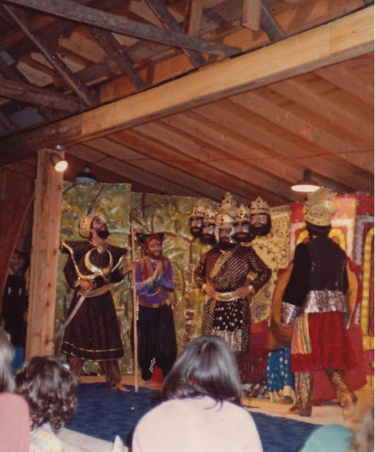](images/9ae12847_Salt-Spring-Centre-of-Yoga-Ramayana-1.jpg)

Ramayana in the barn: Barry as Aksha, Divakar as Ravana’s minister, Sanatan as Ravana.

The next Ramayana performance took place in the upstairs of the school building. The fact that it was still unfinished turned out to be a boon; it meant that Vidyasagar as Sugriva, the king of the monkeys, could enter by climbing on the rafters overhead and dropping onto the stage. Here are a few photos from that year.

[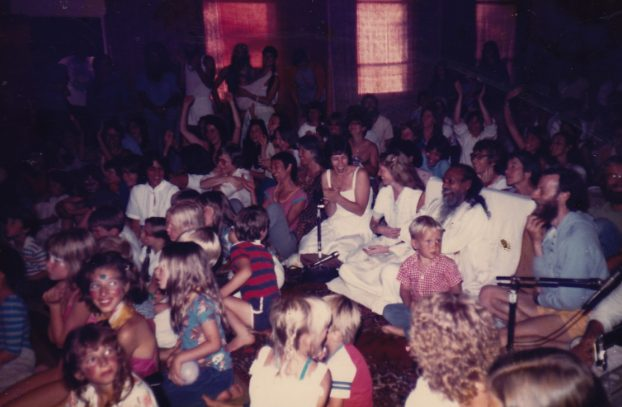](images/9ae12847_Salt-Spring-Centre-of-Yoga-Ramayana-3.jpg)

Waiting for the show to start. 1984.

[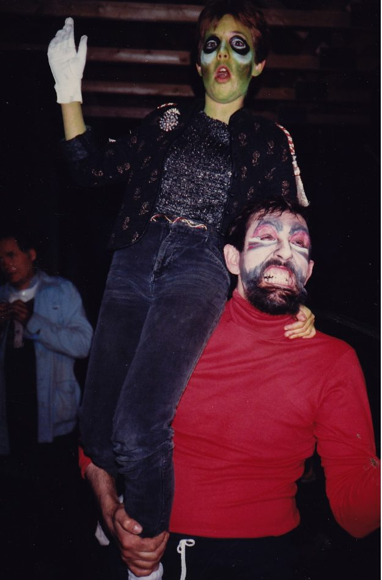](images/9ae12847_Salt-Spring-Centre-of-Yoga-Ramayana-4.jpg)

Daya (dressed for the moonwalk in Ravana Court), Vasudev (playing Ravana, but not yet in costume)

After that - in 1985 I think - we staged the Rock Ramayana, a 1950’s version of the classic story. Unfortunately, we don’t have any photos from that show. There was a video, but it seems to have disappeared. Varuna spent most of the retreat recording songs on a cassette tape for the actors to lip synch to. PK, wearing a blue suit, played a very cool Rama. Daya played Sita, wearing a full skirt with a crinoline underneath, and bobby socks - and chewing gum throughout. Rish was Ravana, a bad dude wearing a black leather jacket and riding a motorcycle. When he abducted Sita, he sang “Come and go with me.” When Rama arrived to rescue Sita, she sang to Ravana, “My boyfriend’s back and you’re gonna be in trouble.” People in the audience loved it! Babaji didn’t understand any of the cultural references and didn’t see what it had to do with the Ramayana, but he laughed and enjoyed it anyway.

The 1988 Ramayana was performed by kids and was held in the high school gym in town - Ganges, the main town on Salt Spring Island.

[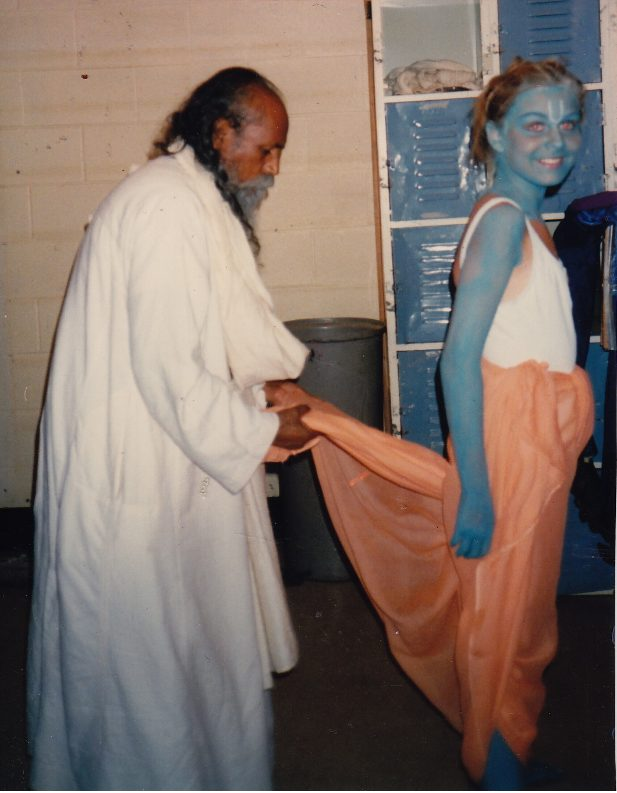](images/9ae12847_Salt-Spring-Centre-of-Yoga-Ramayana-5.jpg)

Babaji tying Arianna’s dhoti. She played the part of Rama in 1988.

[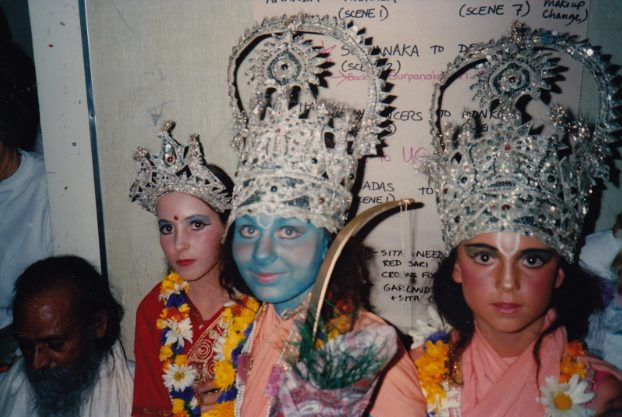](images/9ae12847_Salt-Spring-Centre-of-Yoga-Ramayana-6.jpg)

Babaji with some of the cast, 1988: Sunmoon as Sita, Arianne as Rama, Jaya as Lakshman

From then on - until recent years, the cast was all (or mostly) kids. Eventually the cast grew to about 70 kids - and almost as many on the production team and backstage.

Here is an assortment of Ramayana photos from 1989 - 1999, the last year of the Centre’s Ramayana performances until productions were revived in 2014.

[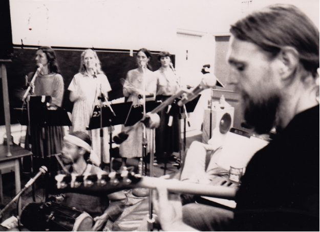](images/9ae12847_Salt-Spring-Centre-of-Yoga-Ramayana-7.jpg)

The choir in 1989: Rajani, Anuradha, Hamsa, Kishori, Ramesh on guitar.

[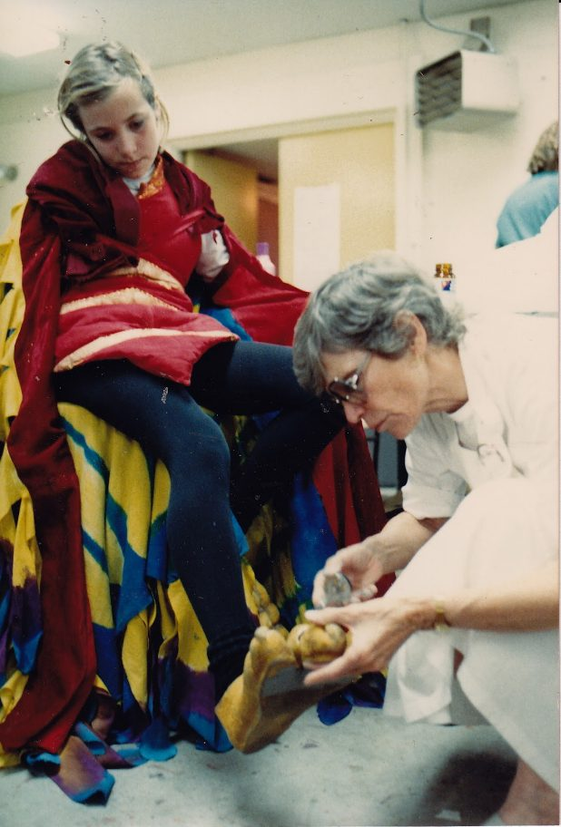](images/9ae12847_Salt-Spring-Centre-of-Yoga-Ramayana-8.jpg)

1989 Ma Renu fixing Jatayu’s (played by Sunya) toes backstage.

[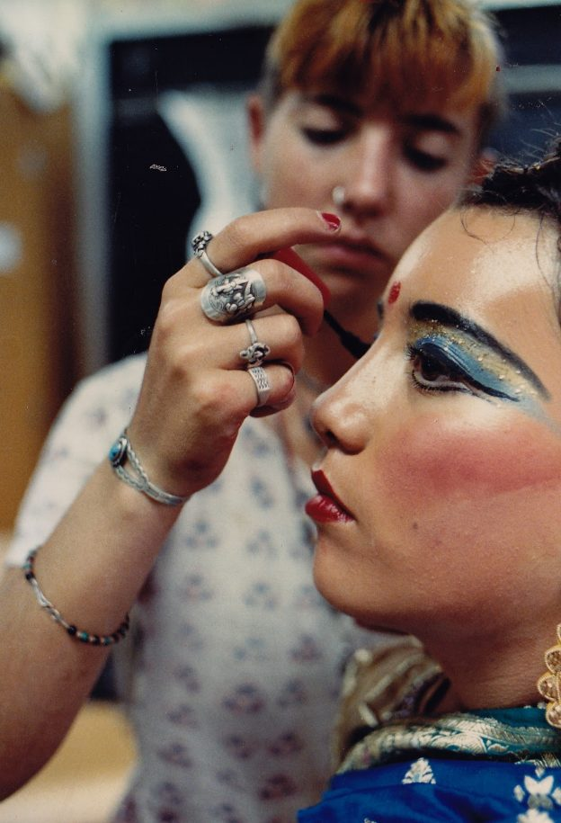](images/9ae12847_Salt-Spring-Centre-of-Yoga-Ramayana-9.jpg)

Daya doing Nayana’s makeup for her role as Mandodari. 1995.

[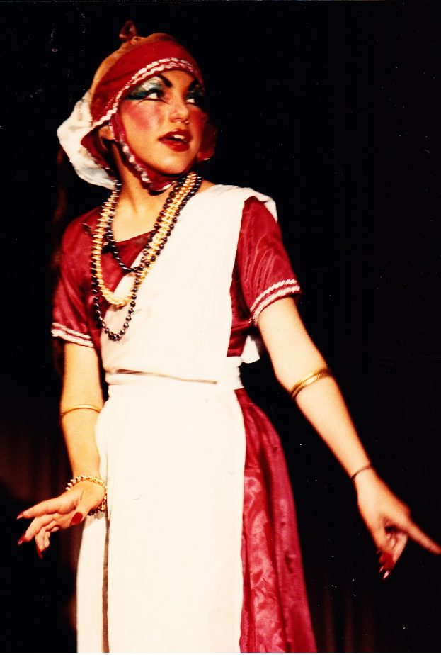](images/9ae12847_Salt-Spring-Centre-of-Yoga-Ramayana-10.jpg)

Farishta as Surpanaka

[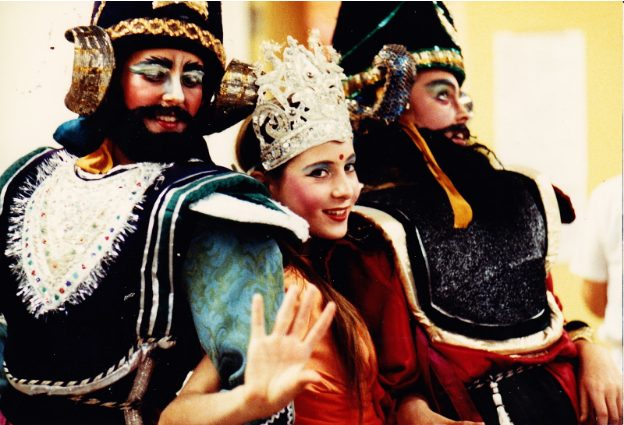](images/9ae12847_Salt-Spring-Centre-of-Yoga-Ramayana-11.jpg)

Demon princes played by Hamsa and Jaya, with Sunmoon as Sita

[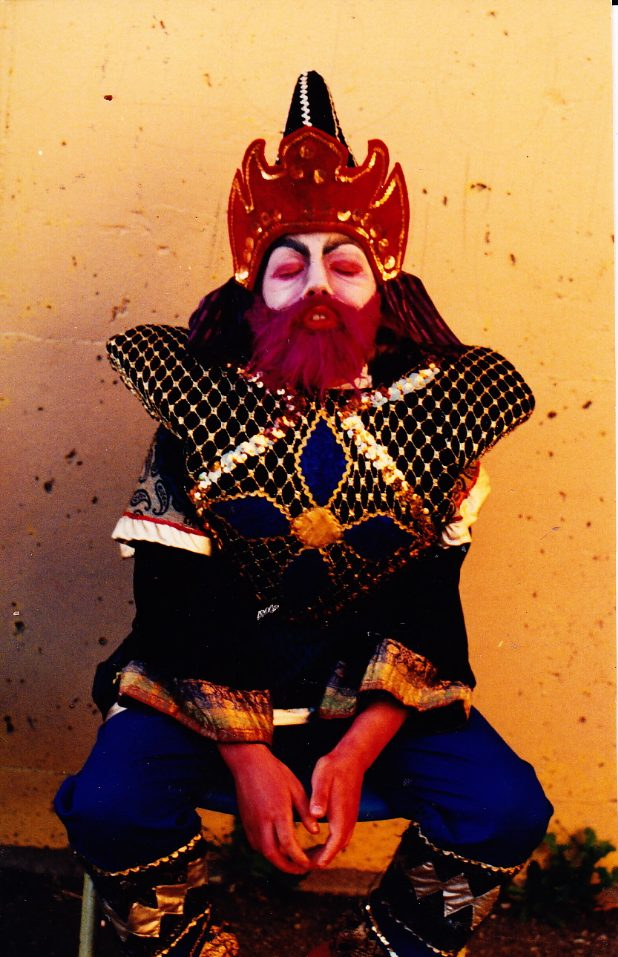](images/9ae12847_Salt-Spring-Centre-of-Yoga-Ramayana-12.jpg)

Pavan, playing either Bonehead or Hooknose.

[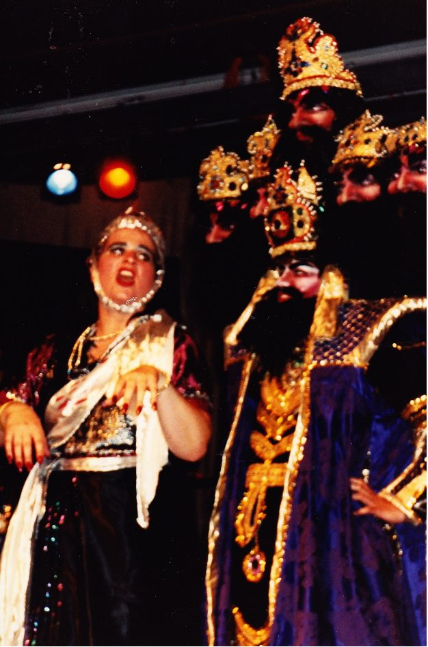](images/9ae12847_Salt-Spring-Centre-of-Yoga-Ramayana-13.jpg)

Surpanaka and Ravana

[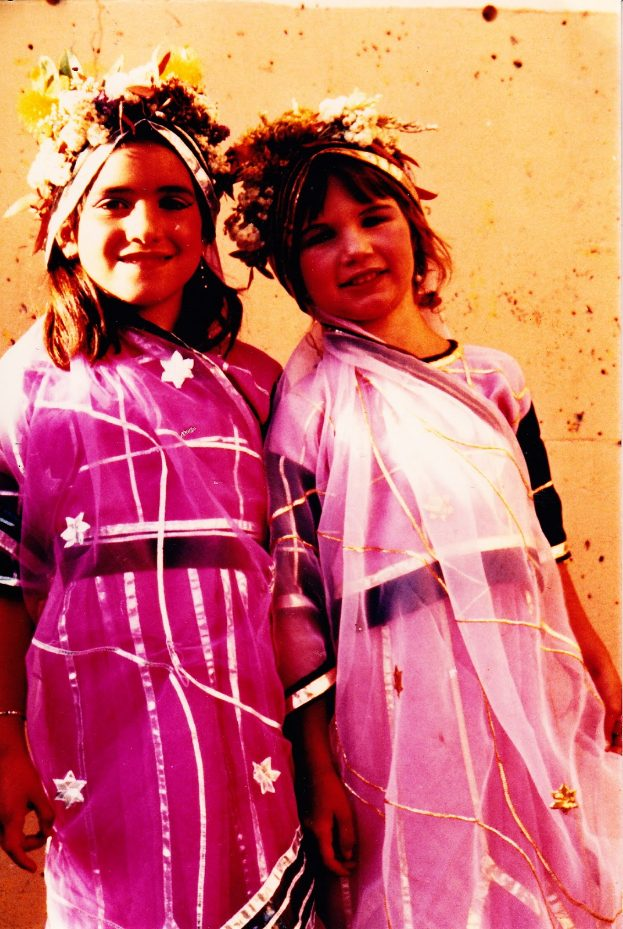](images/9ae12847_Salt-Spring-Centre-of-Yoga-Ramayana-14.jpg)

Temple dancers: Leala and Mamata

[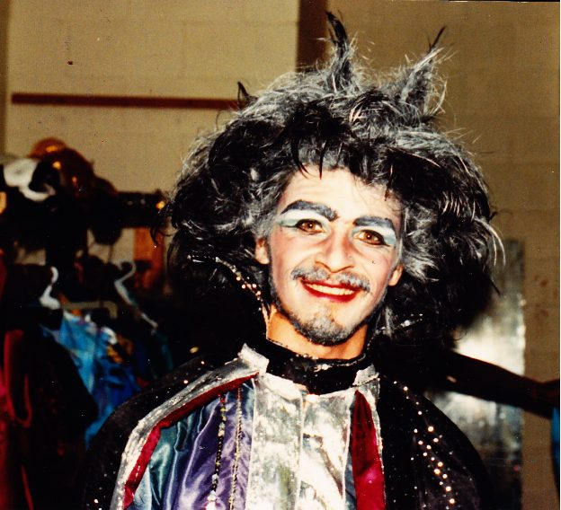](images/9ae12847_Salt-Spring-Centre-of-Yoga-Ramayana-15.jpg)

Marich

[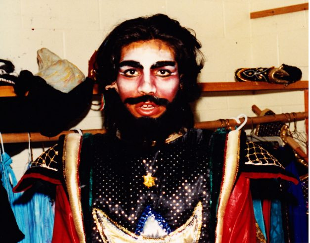](images/9ae12847_Salt-Spring-Centre-of-Yoga-Ramayana-16.jpg)

Meghnad

[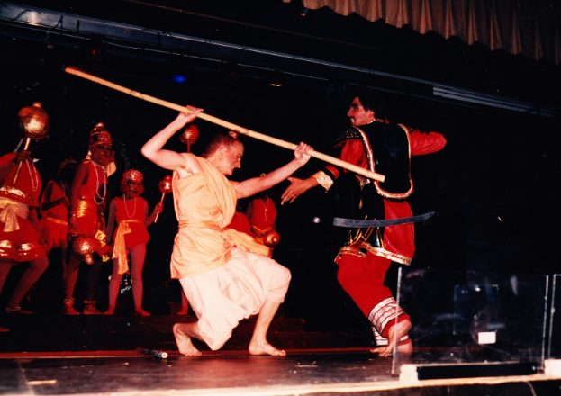](images/9ae12847_Salt-Spring-Centre-of-Yoga-Ramayana-17.jpg)

Battle between Lakshman and Meghnad

[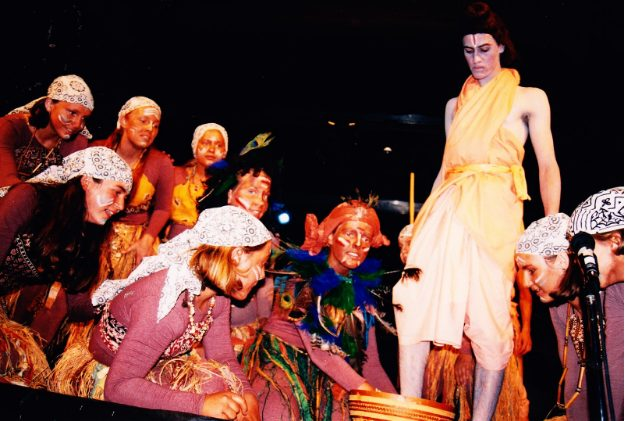](images/9ae12847_Salt-Spring-Centre-of-Yoga-Ramayana-18.jpg)

Guha washing Rama’s feet

[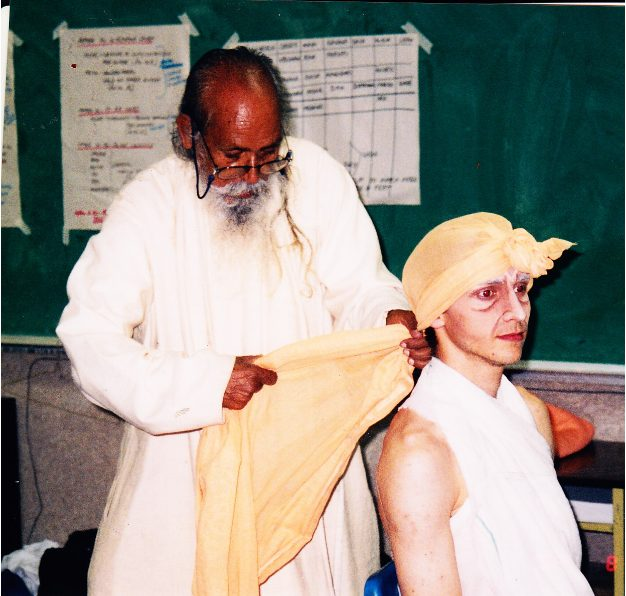](images/9ae12847_Salt-Spring-Centre-of-Yoga-Ramayana-19.jpg)

Babaji tying Caleb’s turban. Caleb played the part of the hermit. 1999

[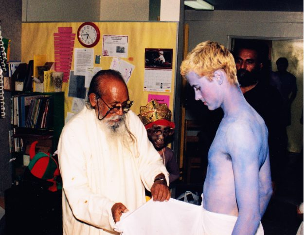](images/9ae12847_Salt-Spring-Centre-of-Yoga-Ramayana-20.jpg)

Babaji wrapping Rama’s dhoti. Piet played Rama in 1999.

If this leads you to wanting to watch the most recent Ramayana videos, here they are:

And come to the 2017 ACYR for more! Jai Sita Ram! Jai Hanuman!

Contributed by Sharada, with gratitude to Babaji for getting all this going, and to the many, many people who participated in Ramayana productions over the years - producing, making costumes and props, directing, choreographing, acting, singing, doing makeup, helping backstage, working hard and having fun. Bravo to all of you!
