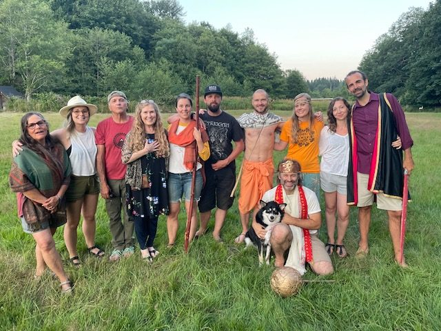
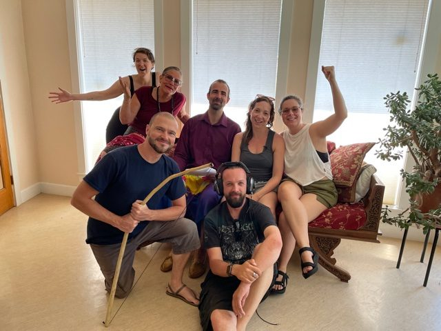
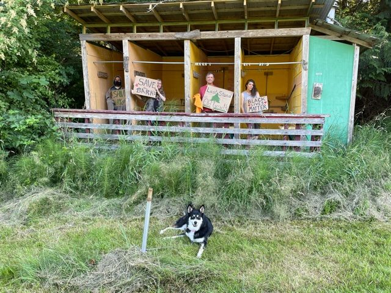
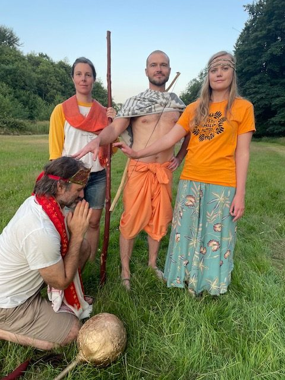
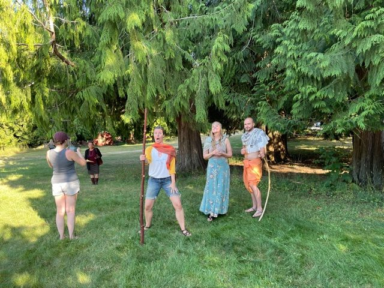
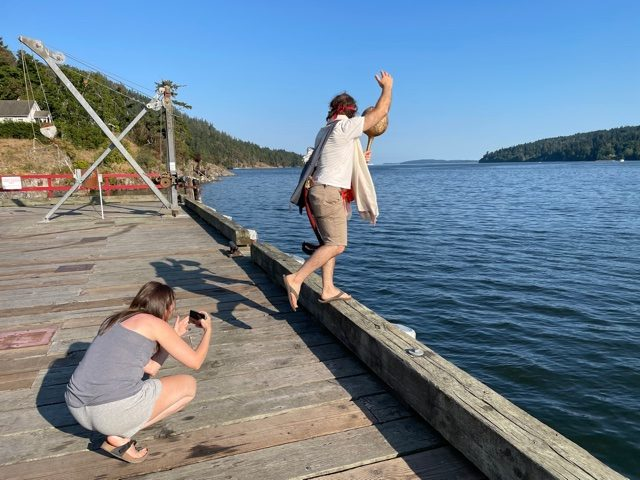
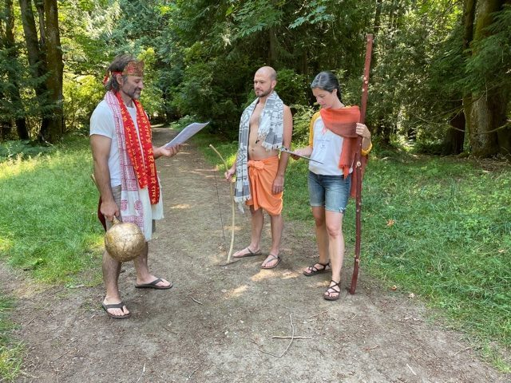
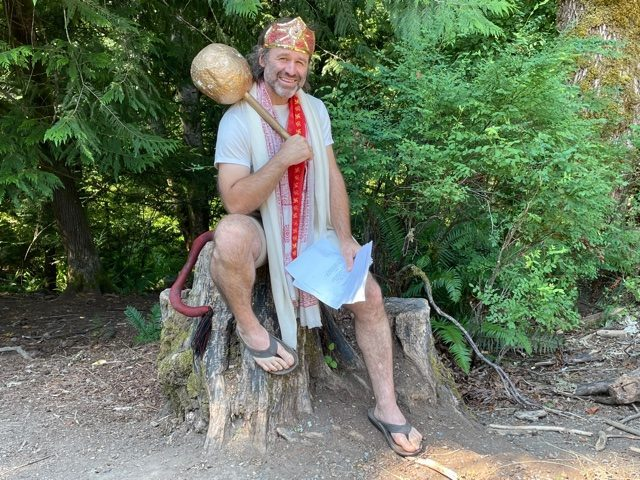
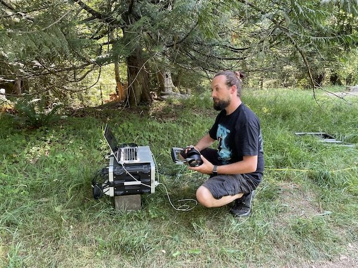

The 47th Annual Community Yoga Retreat (ACYR) came to a close on August 8th this year after a magical weekend filled with as much connection, peace and play as Zoom could handle! 84 Adults and 7 kids registered and attended online, joining us from all over the world.

In Retreat Coordinator Anuradha’s words, “Once again, the miracle that we are bodies of energy and light was real, and we felt it in our collective energy throughout the Retreat, connecting together. The miracle of the teachings and practice was also felt so strongly.”

In what we hope will be our final year (solely) online before coming back together on the land in person, the scope of this year’s retreat was still truly incredible. It included daily sadhana and asana classes, yoga sutra study, arati, the fun & creativity of the Kids Program, our famous Latte Da Talent Show, Tea Time - free time to chat & connect, live & recorded kirtan music, walking meditations, and new this year: an ecstatic dance party and a clowning workshop!

The true highlight this year, however, was the “Ramayana - Reimagined!” Performance! Centre residents and volunteers came together to film a new, documentary-style version of the Ramayana on this land this summer, and the result was a joyous spectacular of beauty and hilarity! Some photos here help to capture the spirit of fun and community and perhaps a sprinkling of Babaji’s magic that went into the making of this very special production!

- 
- 
- 
- 
- 
- 
- 
- 
- 

***\*\*Note: The Ramayana will be available online soon for a donation for those who wish to view it! Stay tuned!! It will brighten your day and you can return to it again and again :)***

We are deeply grateful to everyone who came ‘in person’; to those who registered support even when they could not attend; to those who purchased raffle tickets; to those who contributed their time; and to all those who shared posts or sent thoughts of love our way. It was all felt and all so appreciated, as is our whole Satsang, always.

The theme this year was “Embodying Change on a Path to Peace,” and we were honoured to have our own Anila’s wise words to both open and close the retreat - leading powerful talks about how we can truly bring the values of our practices into the world during this time of tumult and great reckoning, both social and personal.

As Anuradha says, this practice “is big, it is our Sadhana, the 24/7 practice. Can we continue to show up, truly being instruments for change; individual, local, global? Daily practice, study and prayer/contemplation will guide and support us. Coming together is also a great support and catalyst.”

Jai Sita Ram!! Jai Hanuman!! Jai Babaji!! Jai Satsang!!

"Love Loves Love"  
The ACYR Team
