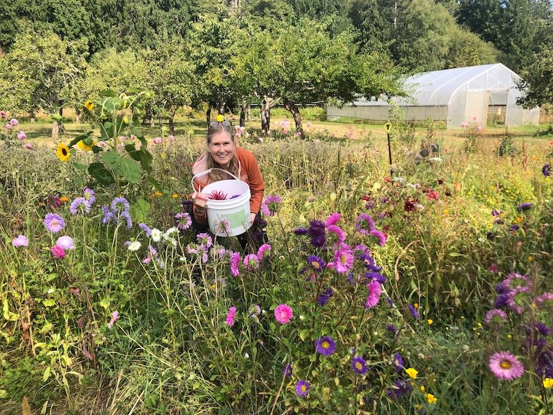
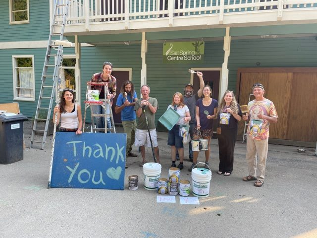
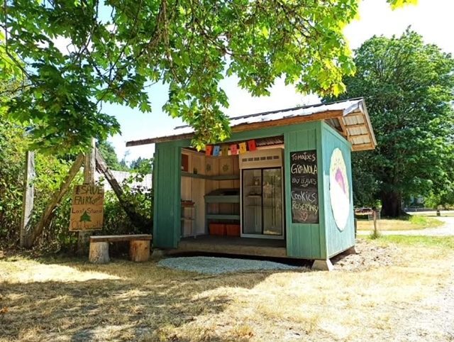
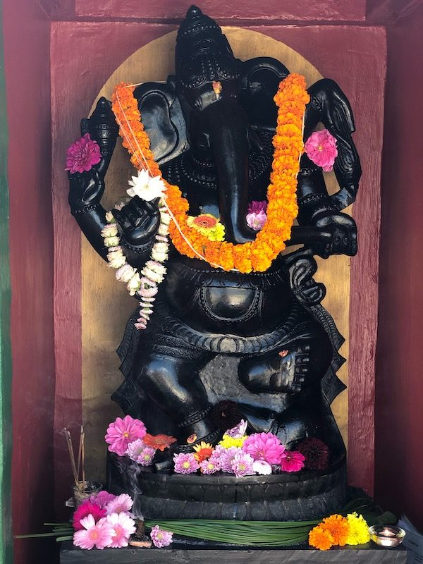
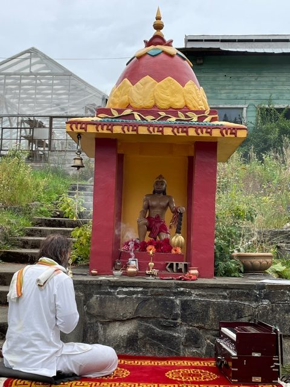
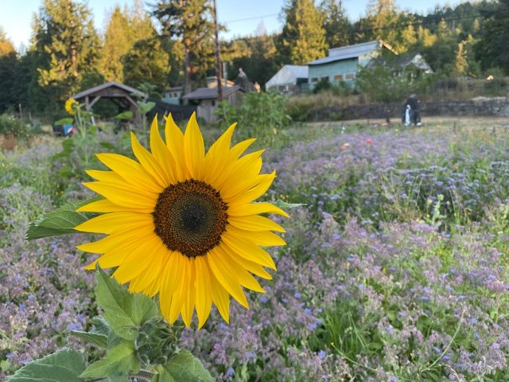

*Anuradha in the flowers*

> “Even a wounded world is feeding us. Even a wounded world holds us, giving us moments of wonder and joy. I choose joy over despair. Not because I have my head in the sand, but because joy is what the earth gives me daily and I must return the gift."
>
> Robin Wall Kimmerer, [*Braiding Sweetgrass: Indigenous Wisdom, Scientific Knowledge, and the Teachings of Plants*](https://www.goodreads.com/work/quotes/24362458)

As August turns to September, the days grow shorter and leaves begin to turn, and the energy of the season begins to shift; the expansive outward spiral begins to slow and draw inward once again, gathering us in. We harvest the abundance from our fields and meadows, and we also internalize and process the gifts of the summer months; time spent with loved ones, vacations to new or treasured destinations, time off from ‘work’ to recharge and renew.

According to the ancient wisdom of Ayurveda, we also begin to move into Vata (air + ether) Season, which we can start to see manifesting outwardly and inwardly, as the wind picks up, and both the leaves and our own thoughts begin to whirl, and the temperature drops. This is a time for nourishing and grounding foods to balance this energy, and we have a beautiful article from the archive from the wondrous Pratibha down at MMC who provides an easy guide to spices which will help us stoke our agni (digestive fire) to help keep us warm and cozy as we move into the fall season.

For many of us, this fall also marks a return to the workplace and to school - perhaps in person for the first time in a long time! Let us all take the time we need to tend to the garden of ourselves as we prepare to step back out into a changed world.

## Centre Happenings

### **Sharada’s Recovery!**

*We love you, Sharada!*

Every day, Sharada is gaining strength, supported by all her loved ones and community. She is going for daily walks and is now back participating in Satsang and offering readings and once again sharing her wisdom with the community. We love you Sharada!

### **We painted the School!**

*The paint squad!*

Our Fearless Painting Leader Bob arrived back at the Centre to do what he does, and help us paint, during some of the summer’s hottest days! He also brought with him a very kind donation of paint from Cloverdale Paint for which we are very grateful. Melissa, a former KY (2016) and also a painting pro, also came to help out. It was a team effort and the school looks fantastic! Special thanks to Bob, who has painted all the Centre buildings over the years and keeps coming back to help again and again. Thank-you Bob!!

### **The Farm Stand was rotated to face the road!**

Jagannath has been coming over monthly for yajnas, and he, Suneel, Lahiri and Moss all worked to move the farm stand to its new and better location. In all ways, it is so much more inviting! There is now even a table and chair with Babaji’s ‘Silence Speaks’ to read.

### **The Mountain Fountain was cleaned!**

Carolyn and Tahia both worked on this project, clearing the Mountain Fountain pond and refurbishing the whole OM park garden in front of the Ganesh Temple. Thank you ladies for such wonderful service!

### **Comings and Goings**

Moss and Selva arrived back at the Centre in July and it’s been wonderful to have them back. Moss took on the farm stand upgrade - painting and decorating it - and now keeping it supplied. His cookies are a favourite. Moss also gives a standout performance as Ravana in the “Ramayana Re-Imagined!!”

Selva re-gained the flower garden on her arrival here, harvesting lavender for the farm stand. She supports Sharada in her recovery, and is also sharing energy treatments for the community and the public. Both Moss & Selva support the community in the kitchen.

Cathy came at the beginning of July, for six weeks, offering her loving KY service at our request. She looked after housekeeping - and everything, the laundry, overall kitchen and cooking - and was also a major player on the painting team at the school. She also gardened and helped to support Sharada’s recovery.

Sarah has now moved off-land, after a lovely (and busy!) month of landing and centering in her new role on the land. This is a well-considered part of the role, to help prevent burnout. She now commutes to the Centre every day and is working hard on all aspects of the Centre’s next steps forward.

## **Centre Yoga Classes**

> *“Asana is not merely a physical exercise. It is a trinity of mind, breath and* *body movement….Asanas give enormous physical and mental strength.”*
>
> *- Babaji*

Thank you to our Yoga Teachers; Dorothy, Cara and John for their in person continued classes through the year, and CP (Lyndsay) who will be starting up classes again this fall. *[**Please register and check the schedules online**](https://saltspringcentre.com/yoga-classes/). Advance sign up recommended. Drop ins available – class size limited.*

### **Online Zoom Classes with Cara and Sam**

Wednesday at 11:00 to 12:15 – Mellow Yoga Class

### **In-Person Classes**

- Mon. 4:30 to 5:45 – All Levels Hatha – Dorothy Price – Pond Dome
- Wed. 4:30 to 5:45 – ‘Mindfulness in Nature’ Restorative – Cara and Sam Graci – Pond Dome
- Thurs. 4:30 to 5:45 – All Levels Hatha – Dorothy Price – Pond Dome
- Fri. 9:30 to 10:45am – Yoga Flow for Everybody - John Howe – email him in advance – Satsang Room
- Sun. 11:00 – 12:15am – Gentle Hatha - Cara and Sam Graci – Pond Dome

### **Satsang and other classes**

[Classes and satsang continue online](https://saltspringcentre.com/programs-retreats/public-offerings/), from Salt Spring, Vancouver, and Mount Madonna Center. These online resources have allowed even more folks to take part than normally would be able to in person, and it’s never too late to join in.

### **Rituals**

- 
- 

**Ganesh Chathurthi - September 9th, 7:30 am** - Come and celebrate Gaṇeśh’s birthday!! The fourth day (chaturthī) after a full or new moon is traditionally sacred to Gaṇeśh, and the fourth day after the new moon of the month of Bhadra in Vedic astrology is the traditional date given for Gaṇeśh's birthday. This year, the date falls on September 9th.

**Hanuman Puja and Chalisa Path - September 14th**, **6:30-8:30 am** - A ritual of worship in which the light of a lamp is offered to Hanumān, along with mantras, prayers, and songs.

## **Call out to SSCY YTT alumni for Online Program Proposals for 2021-22**

What workshops, courses, podcasts, or series would you love to put out in the world to help others on their path to a more contented, peaceful life?The Salt Spring Centre is now scheduling online offerings for 2021-2022 and  welcome our talented YTT Alumni to partner with us in delivering paid programs.For 2021-2022 we are focusing on the following themes: Lifestyle and Preventative Health such as immune system support, addressing sleep disorders, navigating change, etc.Beginners Courses especially Meditation, Breathwork, and developing a home practice. Mental Health including anxiety, getting unstuck, improving social connection, focus and concentration.If you are not sure how your work might fit, have an idea, question or want more information connect with Civi, Online Programs Manager [civi@saltspringsentre.com](mailto:civi@saltspringsentre.com)

## **For Your Reading Pleasure…**

**[Practices for Challenging Times](https://saltspringcentre.com/practices-for-challenging-times/)** - Long time YTT alumni and faculty teacher, Gita, shares with us a deeply honest and helpful detailing of some yoga practices that help her ‘weather the weather’ of life these days. This piece is FULL of ancient wisdom practically applied and simply explained.

[**Stoking the Fire - Spicing up your Autumn Meals**](https://saltspringcentre.com/stoking-the-fire-spice-up-your-autumn-meals-2/) - Continuing along the lines of helpful and practical, we’ve dug up another gem from the archives. In this concise accounting of how the change from summer to fall affects our digestive fire, or agni, Pratibha offers up some delicious suggestions.

[**A Magical Weekend - ACYR Retreat Summary**](https://saltspringcentre.com/a-magical-weekend/) - Our 47th Annual Community Yoga Retreat was a heartwarming success! Please read about its unique flavour and bounty in this short summary with accompanying photos from the filming of the Ramayana.

### **Are you a writer? Open Call for Newsletter Articles!**

We are always looking for folks to write for the newsletter! Do YOU want to write for us? Do you have a story to share? We are wide open to anything Centre-related, or seen through a yogic lens. How did you first come to the Centre? Asana/Flow of the Month (could have a video link), yoga book reviews, scriptural/philosophical study, yoga modality exploration, poetry, how yoga helped your personal pandemic experience, the 'Yoga of' your current job...etc. If so, contact us at [info@saltspringcentre.com](mailto:info@saltspringcentre.com)

## **In closing…..**

As another strange summer draws to a close - fires, heat waves, masks, no masks, masks again, floods, worldwide unrest, and upcoming election - things can feel overwhelming and like they may never return to ‘normal.’

Yet there is so much beauty and so much hope. We are reminded of this beauty by the magic of our annual retreat, and the simple, pure joy that comes from being together. This is what our Satsang is about, and why Babaji continues to bring us together. May the practices and wisdom of yoga, of simple seeing and smiles, and the joys of camaraderie and laughter continue to unite and inspire us all**.**

> "Action on behalf of life transforms. Because the relationship between self and the world is reciprocal, it is not a question of first getting enlightened or saved and then acting. As we work to heal the earth, the earth heals us."
>
> Robin Wall Kimmerer, [*Braiding Sweetgrass: Indigenous Wisdom, Scientific Knowledge, and the Teachings of Plants*](https://www.goodreads.com/work/quotes/24362458)

Blessings to All!  
Kenzie & Courtenay

