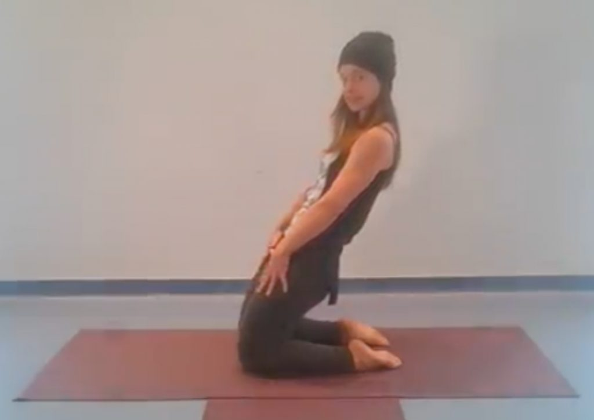

As the expansive heat and light of summer ebbs to chill golden, the Fall rhythms of family and work life resume in equal measure.  I imagine this transitional time like the opposing forces of a rising tide at a river’s mouth; there is an urge to dig in our feet and hold steady while also finding a way to go with the flow...

And so I find my practice wants me to get low and slow these last few weeks while cultivating strength and responsiveness in my lower body. I feel especially called to integrate my lower limbs and joints to the care of the earth and gravity while finding a flow of breath that guides me with necessary fluidity.

Mypersonal and professional interests have led me to learn alot about the importance of foot mobility and strength, and the upstream benefits to knees and hips. We, as a culture, so often forget that we evolved to kneel, squat and sit on the ground with ease. Ground movements and get-ups, as they are called in natural movement circles, can help us reclaim and/or maintain our movementheritage.When we relearn how to sit and move around on the ground comfortably, we have more options for physical ease throughout our days.

As a yoga teacher, this growing realization reinforces my commitment to teaching seated, kneeling and squatting poses in varied and accessibleways. I offer you this short practice to show some of the poses and movements I’ve been using to keep me feeling grounded in this transitional time. This is not a complete practice but could be added to a lower body warm up or repeated a few times. It also requires a certain amount of deep knee bend so is not available to everyone.

https://youtu.be/YVdIjO6FhTE

---

***Kenzie Pattillo** is a householder yogi living in North Vancouver, with her beloved partner and two rapidly growing  tween/teen boys/men(!). She completed her 200 hour YTT at Salt Spring Centre of Yoga waaaaaaaaaaay back in 2002, and her 500 hour YTT through Semperviva Yoga College in 2015. She currently teaches much less than she did pre-pandemic, and is most inspired by her ongoing work with Every Day Counts, a North Shore Hospice initiative. Through this (currently entirely on-line) program she has been given the opportunity to offer folks with life-limiting illnesses as well as their family, friends and caregivers, access to free Restorative and Therapeutic Hatha Yoga classes.*
