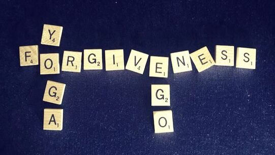

### by Tracy Chetna Boyd

> *“Holding onto anger is like drinking poison and expecting the other person to die.”*

One thing I can say with a high degree of certainty, is that human beings are complicated. The pairs of opposites are alive and well in each of us. Yoga tells us the sensory world is characterized by pairs of opposites (*dvandvas*): heat and cold, light and dark, male and female, positive and negative, honor and insult, success and failure (Yoga International).  We have the power cast much light, and yet we also have the power to cause much pain. Before jumping to the conclusion “not me,” all we need do is turn on our TV, read a newspaper or look at social media to bear witness to the ways we hurt one another in small and unthinkable ways. In fact, at the writing of these “musings” the remains of 215 Indigenous children have just been discovered buried beneath a former residential school. Without minimizing this tragic event, I am sure we can all agree, we hurt each other. Then of course there the wounds we receive in our family of origin. These can be passed on from generation to generation. They are pain unlike any other, and the emotional or actual scars can run deep. Each of us have our own story of how things did not go quite “right” on our parent’s watch. If we are not careful, we can end up living our life through the lens of these painful memories, and nursed grudges. All this heartache has got me thinking about the fine art of forgiveness; how difficult it is for the ego, why it is in our best interest to do it, and how the practice of Yoga can help us navigate these frequently uncharted waters.

When you hear the word “forgiveness,” what does it feel like, and where does the mind go? Perhaps it brings up feelings of righteous indignation, or a fear of losing the battle. At times, you may even go so far as to build an army of support in your efforts to “hold the line.” Many people have been quoted as saying *“holding on to anger is like drinking poison and expecting the other person to die.”* It is a losing proposition. Does, holding onto anger do you expect it will do? Reflect for a moment on the times you have held on to anger for dear life and felt free. Can you think of any? I can’t! We can spend our whole lifetime holding on to resentment or rehashing an argument, looking at it from different angles, and rehearsing a monologue that may never be shared with anyone but yourself.

## Ego and Forgiveness:

We could simply look at the negative aspect of ego as someone who is full of themselves, but of course the ego is much more than that. It is a collection of thoughts and stories of who I believe myself to be, which may or may not be rooted in reality. In Yogic terms, the ego is defined as *Ahamkara* or the sense of and the *over identification with “I-ness.”* Eckhart Tolle defines the ego as a dysfunctional relationship with the present moment which consists of compulsive, conditioned thought processes. In either case, the ego is the part of us that is largely responsible for all the pain and suffering in our lives. It holds onto painful baggage, makes us jealous, has us lash out in anger and is the part of us that wants to make us right and others wrong.

Let us be honest, the ego can be fragile, but it also needs to be pointed out that we need the ego to function in the world. When it is quiet, there is a sense of healthy self-esteem, and we are able to recognize our limitations. It can help us grow, express vulnerability, and help us take responsibility for our actions. However, when it is not quiet, which is to say that when we over identify with the ego, it is an obstacle on the Yogic path and in life. The unrefined ego has an extremely thin manifesto, in which it is trying to: be as comfortable as possible; be on the lookout for danger; be right at all costs; operate from a place of defensiveness; and attempt to get others to confess their faults. Something like, “You hurt me, now say you’re sorry.” Of course, when the apology does come, the ego only experiences a short-term reprieve from suffering, as it often does nothing to uproot the original hurt. Simply put, the unrefined ego continuously views the world as though it is being repeatedly attacked by other egos. It is like an egoic pinball machine, continually bouncing off the flippers and the walls, but not as fun. Suffice to say, the ego does not like anything that feels like it may destabilize its very survival.

When Baba Hari Dass was asked, what is forgiveness? He responded “*forgiveness is forgetting the past actions of some outer agency which created pain in life and not feeling the least amount of anger or hatred toward the person. As long as our ego is strong, we cannot learn to forgive. We always defend our ego and are ready to take revenge in any circumstances.”*

If the ego is so determined to be victorious at all costs, you might be asking, *how can we get it on board with forgiveness?* As Eckhart Tolle says one of the first things we can do is, *“simply become aware of when the ego is shows up.”*  Your next question might be when it does show up, how would you recognize it? Tolle also shares, *“you can be sure it has arrived when you are busy attaching verbal or mental labels to situations, and people, becoming more critical and deadened to reality.”*

It takes dedicated practice, over a long period of time, to refine the ego to a place where the idea of experiencing, or asking for forgiveness, beyond the superficial, is even possible. It takes time to arrive at a place where we can embody true compassion and realize that hurt egos, hurt egos. Once we arrive at this place though, an opportunity for real forgiveness opens within us. At the end of the day, we can only forgive to the degree to which we are conscious and present. Only then will we recognize that anything a person perpetrates against another is done out of a deep level of unconsciousness. The deeper the offence, the deeper the unconsciousness. And while this does not give anyone a green light to cause harm to another, it does provide context: people do what they know, and when they know better, they do better.

I will be the first to admit, it can be difficult to acknowledge and take responsibility when we cause harm to another. It is an intricate quagmire built on grief, shame, guilt, and embarrassment. This requires more than simply saying “I’m sorry” and moving on. This requires a certain level of ego fitness, deep self-reflection (*Svadhyaya*) and acknowledgement of the “wrongdoing” on how one’s actions have negatively impacted another. It is the essence of true reparation and like developing any new skill, it takes practice and courage and it is healing.

## Benefits of Forgiveness

While there might not be a hard and fast formula on how one should forgive, I am inviting us to explore the notion that when we hold onto anger and resentment, we suffer. There is a cost. Our tender hearts, despite having the capacity to hold so much pain and carry such burdens, pay a price.

Holding onto anger and resentment continues to uphold the ego’s manifesto. Although it may feel satisfying on some level, living with this type of stress does nothing good for our physical or mental health. There are many accounts which show that holding a grudge may have even more negative effects than the issue which caused it. According to the Mayo Clinic, chronic stress has many adverse effects on the nervous system such as:

- Anxiety
- Depression
- Digestive problems
- Headaches
- Heart disease

If that is not enough incentive to move us in the direction of forgiveness, a grudge held onto has the potential to bring its anger and bitterness into every relationship, and to darken new experiences.

On the other hand, when we can forgive or be forgiven and let go of anger and resentment, we create a pathway for improved peace of body and mind, and for healing to occur. Here the Mayo Clinic lists a slew of health benefits which forgiving someone can bring to our life:

- Healthier relationships
- Improved mental health
- Less anxiety, stress and hostility
- A stronger immune system
- Improved heart health

## Yoga Philosophy Tools for Forgiveness

I want to be clear; I am not suggesting for a minute that we should confuse forgiveness with approval, acceptance, or denial of a traumatic event. If you are struggling through difficulty, I encourage you to seek support and get the help you need.

If we are so inclined though, we may look no further than the Patanjali’s Yoga Sutra for guidance on forgiveness. At first glance, they can seem overwhelming, academic, inaccessible, and slightly out of reach. However, if we look at this philosophy as a tool to navigate our day-to-day lives, they reveal themselves in a different way.

Patanjali makes it very clear that that there *will be pain in life*, but he is also clear that *suffering is optional*. From the very beginning of Patanjali’s Yoga Sutra, we are welcomed into exploring how each of us can have a relationship with the present. Rather than being imprisoned by our past or seduced by the idea that life will be better in the future, we are encouraged to flow with the grace of the moment. *Sutra 1:1* starts by simply inviting us into the “now” or “*atha*,” a blessing and reminder that life only happens in the here and now, and in this place, joy is experienced, and suffering is lessened. It is not lost on me that this is easier said than done.

At the end of the day forgiveness, much like love, is a verb; it is an action. It is an active choice we make to let someone off the hook, to drop the story, and to deliberately release feelings of anger, resentment, or vengeance. If we dig a little deeper, *Sutra 1:12* introduces *Abhyasa* (practice) and *Vairagya* (dispassion, non-attachment, absence of desire) and reaffirms the importance of *Nirodhah* (controlled, restrained, blocked) regarding calming the thoughts, which I believe are at the core of forgiveness. *Abhyasa* is the quiet commitment and persistent effort that we make to remain in practice and harmony. This sutra helps us recognize that finding peace is not for the faint of heart, and like any other muscle that gets stronger by lifting weights, it can only be reached by dedicated and consistent practice. While there are many interpretations, I have read that the word *Abhyasa* comes from a combination of two root words: “*as*” meaning “to throw,” and “*abhi”* meaning “towards.” So, it could be said that *Abhyasa* is to continually practice throwing oneself towards wholeness, peace, and forgiveness.

In *Sutra 1:33* we are invited to explore another practical tool by what Baba Hari Dass calls *cultivating feelings of love for the happy, compassion for the suffering, delight for the virtuous, and indifference for the non-virtuous.* These four concepts are genuine methods that can help navigate the human condition. It shows us how to navigate jealousy, grief, and our reactions to people we think are being too good! But it is the last method, “*indifference for the non-virtuous,”* that is the kicker. This points to how we are to respond to people who have done wrong and are less than kind. When we feel we were mistreated, we come to accept that we cannot control the behaviour of others. We can learn to work with our own conditioning and our reactions first. The idea of *indifference* is quite different than *dispassion*. It does not mean we ignore the wrong deed, rather it means that we learn to respond more skillfully and cultivate kindness and compassion in our own body and mind first. To become more response-able, rather than reactive, takes time.

In full disclosure, I must confess that after many years of practice of exploring my ego, knowing all the health benefits, and studying the philosophy, it has not always been easy for me to let things go. The truth is depending on the “violation” at the hands of another or myself, sometimes things can still take a long time to digest. Like you, I am a work in progress. The process of unpacking what I am holding on to, identifying where it sits in my body, and finding the appropriate tool (Yogic or otherwise) to help loosen the grip of whatever has got me has at times been a complicated puzzle.

I want to assure you though, a forgiveness practice does not need to be complicated. Sometimes it is a simple as moving the body through a couple of sun salutations or getting close to the ground, lying on your back with hands on the belly and breathing. It could be walking in nature. At other times it might be a prayer like this one:

### *Buddhist Forgiveness Prayer:*

- *If I have harmed anyone in any way either knowingly or unknowingly through my own confusions, I ask their forgiveness.*
- *If anyone has harmed me in any way either knowingly or unknowingly through my own confusions, I forgive them.*
- *And if there is a situation I am not yet ready to forgive, I forgive myself for that.*
- *For all the ways that I harm myself, negate, doubt, belittle myself, judge, or be unkind to myself through my own confusions: I forgive myself.*

When you are stuck in emotional quicksand, and you find yourself reliving an old wound or becoming triggered or hurt from a new one – rest assured relief is as close as these words. With practice we realize what has become contracted and small. The instant we notice this and are brought back to presence, to the breath and to spaciousness, can be a moment of quiet celebration. This is the “*field beyond ideas of wrongdoing and right doing”* that the mystic poet Rumi writes about. *"I'll meet you there."*

---

**Chetna has been studying and practicing yoga in its many aspects since 1999.** She began teaching in 2003 and is a graduate of the Salt Spring Centre of Yoga, where she was certified in classical ashtanga and hatha yoga systems and is registered with the Yoga Alliance. She has completed the 1000 hours Yoga Therapy training through Integrative Yoga Therapy and achieved certification through the International Association of Yoga Therapists (C-IAYT). Chetna joined the faculty of the SSCY Yoga Teacher Trainings in 2007 and in 2018 assumed the role of YTT Program Director. Chetna teaches private yoga therapy sessions for specific conditions and specializing in yoga for cancer. As well she teaches public and corporate classes in Victoria. Her compassionate approach to teaching promotes an environment that is relaxing and encouraging, empowering and fun.
