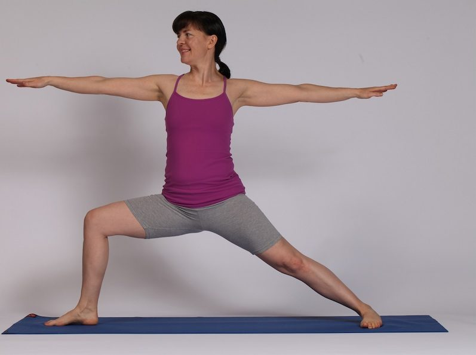

### Konasana VI / Virabhadrasana B

*by Kathryn ‘YogaKat’ Kusyszyn*

I love this pose for the challenges it offers. This pose demands strength and at the same time, it creates a sense of expansiveness. Being rooted in the present, looking to the future and releasing the past. Virabhadrasana B embodies the stance of the active warrior or hero, firmly planted and at the same moment, ready for action. This pose is beneficial for anyone wishing to increase strength and stability. It is especially helpful for those who have spinal curvatures or asymmetries as it helps them find centre.

## To get into the pose

Start in *Tadasana* / Mountain pose, facing the long edge of your mat. Inhale as you place your hands on your hips, and exhale as you step your legs apart, about  1.5 leg lengths. Inhale and then exhale as you externally rotate your right leg 90 degrees so the toes point to the short edge of your mat. Traditionally the front heel lines up with the back arch, and some people prefer heel to heel alignment, others arch to big toe knuckle. See what works for you.

Your shoulders and hips remain facing the long edge of the mat with a slight angle. See photo. Some people can stay here and some people may need to step the back heel out slightly away from the body. It depends on the body type you have. Check your back knee’s sensations and adjust accordingly.

Inhale and exhale as you bend your right knee, watching to see that you track that knee over the ankle. You should be able to see your right big toenail or knuckle on the inside of your foot. If not, straighten up and then bend that knee again, perhaps a little less deeply. Have equal weight between the front and back legs.

Check that your ears are over your shoulders and shoulders over your hips. Inhale and lift your arms to shoulder height. Keep the upper shoulders relaxed. Gaze over the front middle fingers. Tune in to the centre of your body, see if you can discover a sense of being centred and present. Breathe 5 breaths here. To come out, release your hands to your hips, straighten the front leg, turn your front toes towards the long edge of the mat and step your legs together back into Tadasana.

## Details

Press firmly into both feet, especially the outer edge of the back foot. Allow the outer edge of the front hip and buttocks to draw downwards. Lift the inner back thigh towards the outer thigh to keep it active.

## Options

This pose can be done with the back heel or back foot against a wall for support and anchoring. It can also be done with the back of the body against the wall for support in finding centre. A version especially useful for those with scoliosis is to face the wall and place hands at around shoulder height on the wall. This allows for sensing where the shoulders and torso are in space to help find the centre of the body.

A gentle version is to find a chair a suitable height and lunge the front leg over the seat of the chair so you can rest on it.

## Watch for

1. Pitching forward with the torso
2. front knee falling inwards
3. arch of the back foot collapsing
4. Uneven pelvis.

## Effects

- Strengthens muscles in arms, wrists, legs, knees, ankles and upper back.
- Respiratory: tones
- Endocrine: tones
- Cardiovascular: stimulates
- Nervous: tones
- Digestive: balances
- Urinary: tones

**Dosha effects:** stimulates: kapha, vāta, pitta

**Vayu effects:** Prāna, apāna and samanā toned.

## Contraindications

knee joint injuries, bursitis of the hip or knee joint

**Sources:** *Mount Madonna Institute yoga teacher training manual, personal practice, teaching experience and many helpful teachers.*
