*Someday, after mastering winds, waves, tides and gravity, we shall harness the energy of love and for the second time in the history of the world, humankind will have discovered fire*.~ Pierre Teilhard de Chardin

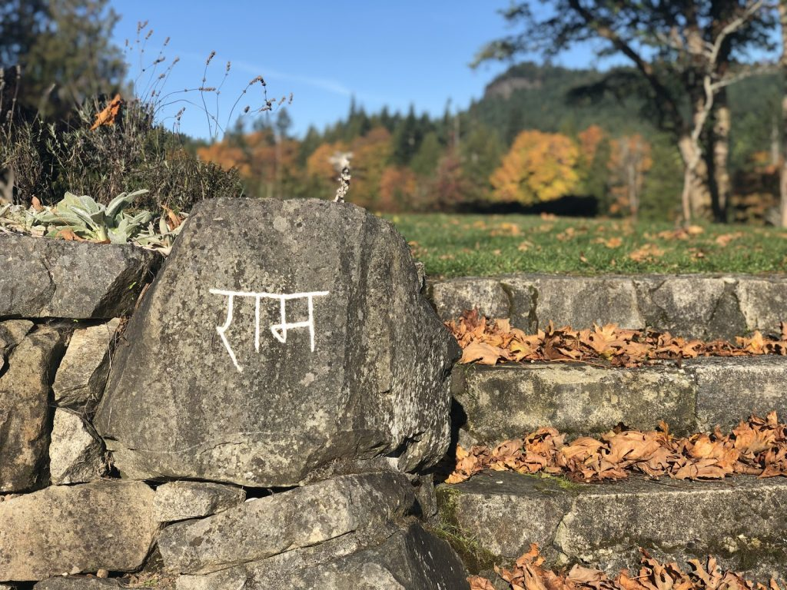

Hello friends,

As you will see in this month’s newsletter, we ARE harnessing the energy of love with the myriad ways our Satsang continues to come together in service to our community and by sharing the teachings of Baba Hari Dass. That energy is growing as we offer our first in person retreats this November, with hopefully more to come in 2022.

By practicing yoga both on and off our mat, we can let love fuel our endeavors and spread light even as the darker days of winter lay ahead. Love is the renewable resource we can all invest in with regular sadhana and connection to our spiritual community. You have come to the right place, friends. Read on and love on!

## Centre News & Rituals

### Centre Happenings….

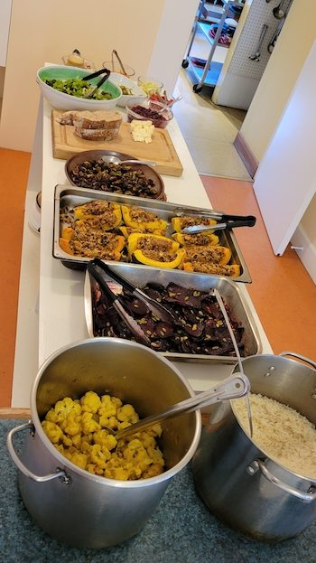

It’s November at the Centre and while temperatures cool and the final leaves fall, residents and friends move into their winter routines and settle in for the darker, quieter incubation of winter.

Thanksgiving was celebrated this month with a big beautiful meal, prepared mainly by Suneel with contributions from others as well.

The fall harvest has also continued, with the bumper crop of pears this year being brought in, however with fewer apples than the past few seasons. We know things go in cycles, however, and we still have plenty for the planned juicing coming up!

And it turns out we are not the only creatures who enjoy the bounty of the season - our local deer have been loving the leftover pear pulp from our juicing that the team has been leaving out for them in the evenings.

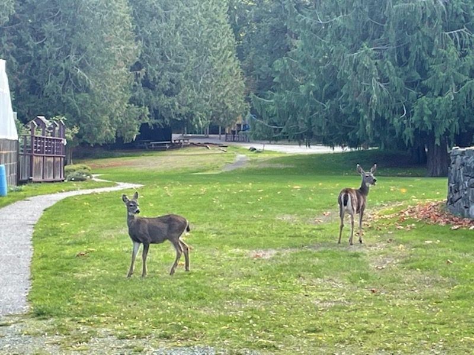

Patricia, our new Office Coordinator, has arrived! She has been settling in with the help of Kris and the whole gang at the Centre. We all wish Patricia a warm welcome! *Stay tuned next month for more on Patricia and to get to know her better.*

A Birthday Luncheon celebrating the amazing being of Anuradha was held this month, together with a Goodbye send-off for both Marion and Adam Santosh. Marion will be heading back to her native France in early November to reconnect with family. Adam Santosh has officially moved off the land after years of residency, but continues to support with work and heart, and remains thankfully on-island for now.

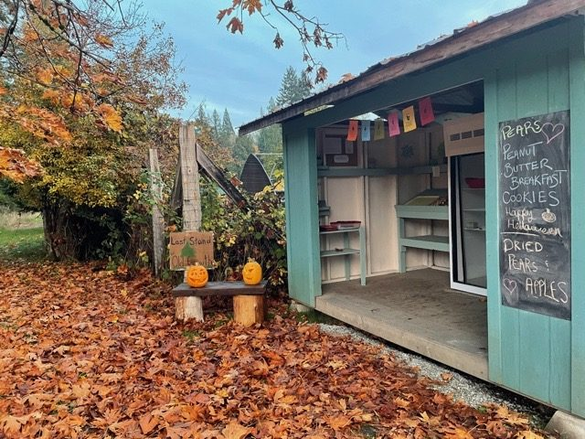

- 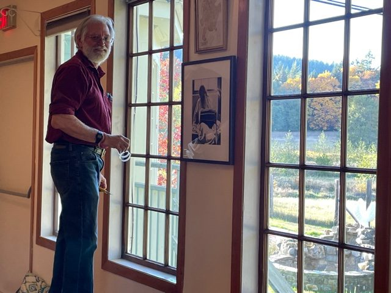
- 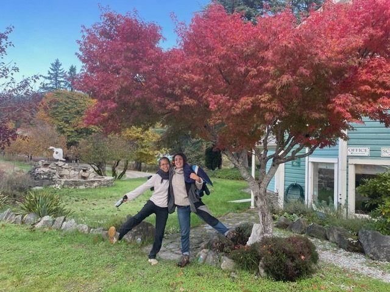
- 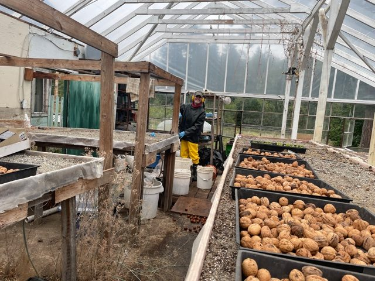
- 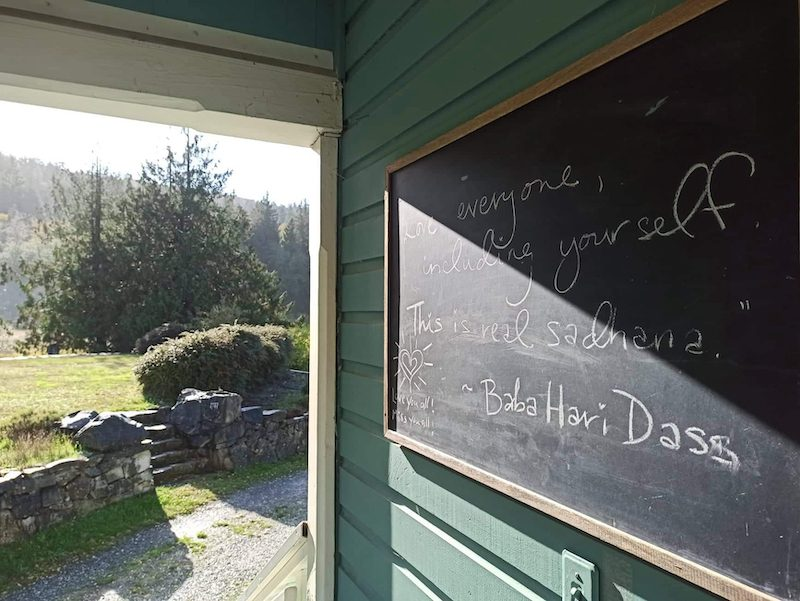

Moss remains on the land, and along with Lauren, continues to supply our ever-popular Farm Stand with delicious baked treats. He will be returning to Spain to join Selva in late November/early December, and plans to return to the Centre next spring.

Larry is still here with us as well, and continues to make a huge impact! He harvested the lion’s share of the walnuts this season and has been a big help in the pear and apple harvest as well.

Lauren, Steph and their twins Amelie and Noah - Sarah’s friends from out east - also remain here on the land with us, living in their bus! They have all been pitching in in many ways, including doing a ton of work during the recent fountain clean out, and Lauren’s contributions to the farm stand. The kids are enrolled in Fulford School and everyone has enjoyed having them and their energy as part of the community.

## Current and Upcoming Programs

### Rest, Restore and Relax  with Farah Nazarali

\***In-Person**\* **November 12-14, 2021**

The Salt Spring Centre of Yoga welcomes back Farah and her guests for our first IN-PERSON yoga retreat since 2019!! *“This weekend yoga retreat is all about rest. In the midst of the Autumn season, immerse in the quietude of a natural island setting, rest your body, relax your mind, unwind from the daily stresses of your life, and let the rhythm of yogic practices and wisdom fill your heart and spirit.”*

**Click**[**here**](https://farahnazarali.com/yoga-retreats/)**for more info and click**[**here**](https://form.jotform.com/212335977242256)**to register!**

### Meditation: Becoming your Full Potential with Soorya Ray Ressels

**\*Online\* Nov 25 - Dec 23** (**5 weeks) - Thursdays, 5-6 pm.**

Meditation is an inner journey awakening you to who and what you are. If you are feeling overwhelmed, agitated, and/or crystal clear, you can benefit from discovering more about yourself. Unlike studying a subject through your mind alone, you'll be guided into using your latent abilities to experience various dimensions of YOU.  Similar to a wheel with many spokes, the inroads to Self are many. We will dive along a few (guided imagery, body scanning, mantra) towards the centre of our being where inner peace and self-acceptance naturally resides. The benefits of meditation are many including greater perspective, self-confidence, and appreciation of our connectedness with all life. In this next 5-week series, we will explore breath as a focus for meditation. Feeling and sensing breath allows us to absorb our anxious or distracted thoughts allowing us to find ourselves at our centre.If you wish to learn more or tell me a bit about your experience with meditation, please contact [Soorya](soorya.jyoti@gmail.com). You are welcome to arrive in your seat just as you are.

**Click** [**here**](https://saltspringcentre.secure.retreat.guru/program/6-week-meditation-becoming-you-in-full-potential/?lang=en) **for more info. (Registration is closed for this series - stay tuned for the next one in December.**)

### Sweet Dreams: Ayurvedic Series on Sleep with Natasha Jyoti Samson

\***Online\***  
**October 14: Part I - Ayurvedic Art of Self Oil Massage**  
**November 17: Part II - Subtle Shifts in Routine for BIG Impact**  
**December 15: Part III - Holiday Hacks to Rest and Digest**

Our resident Ayurvedic expert, Natasha Jyoti Samson, is offering a Ayurvedic Sleep Series from October – December. Jyoti will get “under the covers” with these highly practical workshops for those who wish to improve their sleep, and want more than just a pre-bed checklist.

**Click** [**here**](https://saltspringcentre.secure.retreat.guru/program/sweet-dreams-subtle-shifts-in-routine-for-big-impact/?lang=en) **for more info and register today!**

### Bija: Planting Seeds for the New Year  with Farah Nazarali

**\*Online\* 5-day Yoga Retreat** / **December 27, 2021 - January 1, 2022**

Everything we do, say, and think leaves an impression deep in our consciousness. Commit to practices over the holidays that keep you anchored and balanced. Be moderate in your indulgences, humble in your desires, and dedicated to your health and well-being. This Retreat is intended for yogis who wish to stay rooted in their practice over the holidays and who wish to prioritize health as they begin a new year. Retreat includes 2 daily yoga classes (on video or Live on Zoom), optional workshops, wholesome and nourishing recipes, and a holiday inspired self-care package! Suggestion donation: $108 - $395 (30% of all revenue will be donated to the the SSCY and the OM Ashram)

**Click** [**here**](https://form.jotform.com/212935020157246) **to register and** [**here**](https://farahnazarali.com) **for more information on Farah and her many offerings. Read a lovely [Q&A with Farah here](https://saltspringcentre.com/bija-planting-seeds-for-the-new-year/).**

- 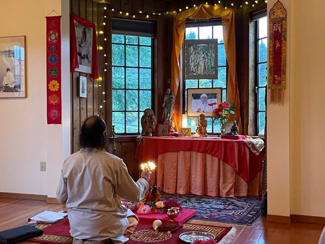
- 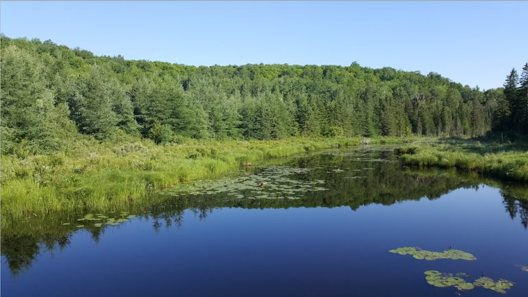

## Rituals

- Ganesh Puja - November 7, 6:30 pm at the Centre
- Hanuman Puja November 15, 6 pm at the Centre
- *Diwali is coming! Stay tuned to the Centre website for time & date of festivities, as we help bring the light to guide Ram & Sita’s way home on this most auspicious of occasions!*

## Centre Yoga Classes

*”The Body is the temple of the soul. The soul is God’s Temple” - Babaji, The Yellow Book*

We have been working to stay aligned with the Public Health protocols to ensure we are doing our part to keep our communities safe and compliant. As such, **all yoga teachers and students will need to provide proof of at least one vaccination starting September 13, 2021 for indoor classes.**

From **October 24th onwards, yoga teachers and students are required to provide proof of being fully vaccinated** for indoor classes, until provided different instructions from Public Health. We will continue to closely monitor the Provincial Health Orders for any changes.

In addition – British Columbia has reintroduced a provincial mask mandate for public indoor spaces; **all guests, staff, teachers and volunteers are required to wear masks when moving through our indoor public spaces** - including to and from your mat.

***We thank everyone for helping us to comply with Provincial Health Orders so we can continue to offer classes to our community!***

### YOGA CLASS SCHEDULE

Advance registration required for ALL classes at this time (both online and in-person)

[Click HERE for updated Schedule and registration details - always on the website](https://saltspringcentre.com/yoga-classes/)

**Online Zoom Classes  with Cara and Sam**

- Sunday 11:00am to 12:15pm - *Gentle Hatha Repair*
- Wednesday 11:00am to 12:15pm – *Mellow Yoga Class*

**In-Person Classes**

- Monday 4:30pm to 5:45pm – *All Levels Hatha* – Dorothy Price
- Wednesday 2:00pm to 3:30pm - *Continuing Beginner Class* - CP Lynday Savage
- Thursday 10:30am to 11:30am - *Gentle Yoga* - Jim Dickinson *\*Sept 30 – Dec 16\**
- Thursday 4:30pm to 5:45pm – *All Levels Hatha* – Dorothy Price
- Friday 9:30am to 10:45am – *Yoga Flow for Everybody* - John Howe
- Saturday 10:00am to 11:30am - *Mixed Levels* - CP Lyndsay Savage

**Weekly Satsang and Ongoing Classes**

- Tuesday 7:30pm - 8:30pm  - *Bhagavad Gita* - with Mahavir
- Thursday 7:00pm - 8:15pm - *Yoga Sutra Study* - with Yogeshwar
- Sunday 1:30pm - 2:30pm - *Satsang* on Zoom

[\*\*Please find more information, including the Zoom link, on the website HERE\*\*](https://saltspringcentre.com/programs-retreats/public-offerings/)

## 2021 RAMAYANA: RE-IMAGINED  *Watch it today!!*

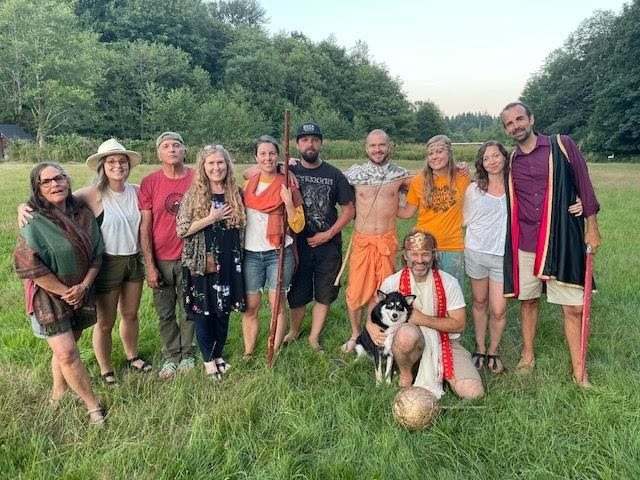

The 2021 Ramayana!! Re-Imagined, like never-before as a short documentary. If you haven’t seen it yet, be sure to click the link below and watch for a small suggested donation of $15. *Jai Sita Ram! Jai Hanuman!!*

[Click HERE to GET THE RAMAYANA!](https://saltspringcentre.secure.retreat.guru/program/ramayana-re-imagined/?lang=en)

## For Your Reading Pleasure…

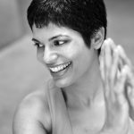

### [Q&A with Farah Nazarali: Bija: Planting Seeds For the New Year](https://saltspringcentre.com/bija-planting-seeds-for-the-new-year/)

If you have not had a chance to meet Farah Nazarali, here is your chance! Farah has been bringing her wonderful retreats to the Salt Spring Centre of Yoga for years, and soon she will be joining us on the land for our **first in-person retreat** since the pandemic hit. Find more info about Farah’s retreat offerings [here](https://farahnazarali.com/yoga-retreats/). If you cannot join Farah on the land this November, fear not! She will also be leading a very special online retreat over the upcoming holidays and into the new year, called *Bija: Planting Seeds for the New Year,* and will even be donating part of the proceeds to the Centre! Join us for an illuminating chat with Farah about what inspired this upcoming retreat, as well as to hear how her practice, and teachings, continue to inspire despite difficult times and old patterns.

### [Warrior 2 - Asana of the Month by Kathryn ‘YogaKat’ Kusyszyn](https://saltspringcentre.com/warrior-ii/)

This month Kat offers us a classical yoga pose that helps us meet our present circumstances with all of the grace asana cultivates in our lives.“I love this pose for the challenges it offers. This pose demands strength and at the same time, it creates a sense of expansiveness. Being rooted in the present, looking to the future and releasing the past.”

### [From the Archives: Remembering Our Innate Goodness, by Sharada Filkow](https://saltspringcentre.com/remembering-our-innate-goodness-2/)

Sharada is back, baby! And she has unearthed for us this month a beautiful piece from 2017, which is just as timely today as when it was written. Concise, and peppered with many bits of Babaji’s wisdom throughout. How beautiful to remember we are all simply made of love.

## Are you a writer? Open Call for Newsletter Articles!

We are always looking for folks to write for the newsletter! Do YOU want to write for us? Do you have a story to share? We are wide open to anything Centre-related, or seen through a yogic lens. How did you first come to the Centre? Asana/Flow of the Month (could have a video link), yoga book reviews, scriptural/philosophical study, yoga modality exploration, poetry, how yoga helped your personal pandemic experience, the 'Yoga of' your current job...etc. If so, contact us at [info@saltspringcentre.com](mailto:info@saltspringcentre.com)

## In closing…

Though the path ahead may continue to feel unfamiliar, may we remember to tune in to the familiarity of this season through our senses. We can smell the sweet decay of leaves in the air, and hear the wind and rain against our window panes and roof tops. We can delight our eyes with the (seemingly rare) gift of sunlight setting Autumn’s golden palette aglow. And we can continue to feel the rhythmic expanding and contracting of our body with our breath; feel our firm footsteps against the ground, inviting gravity to pull us earthward, to be held close and nourished until the light returns.

And in the meantime...remember…

You are love.  
You and I and   
We are all love.  
And if God is love,  
Then we are God.  
-Anonymous (from the Book Season of the Witch)

With Love and Gratitude,  
Courtenay, Kenzie and Sharada
