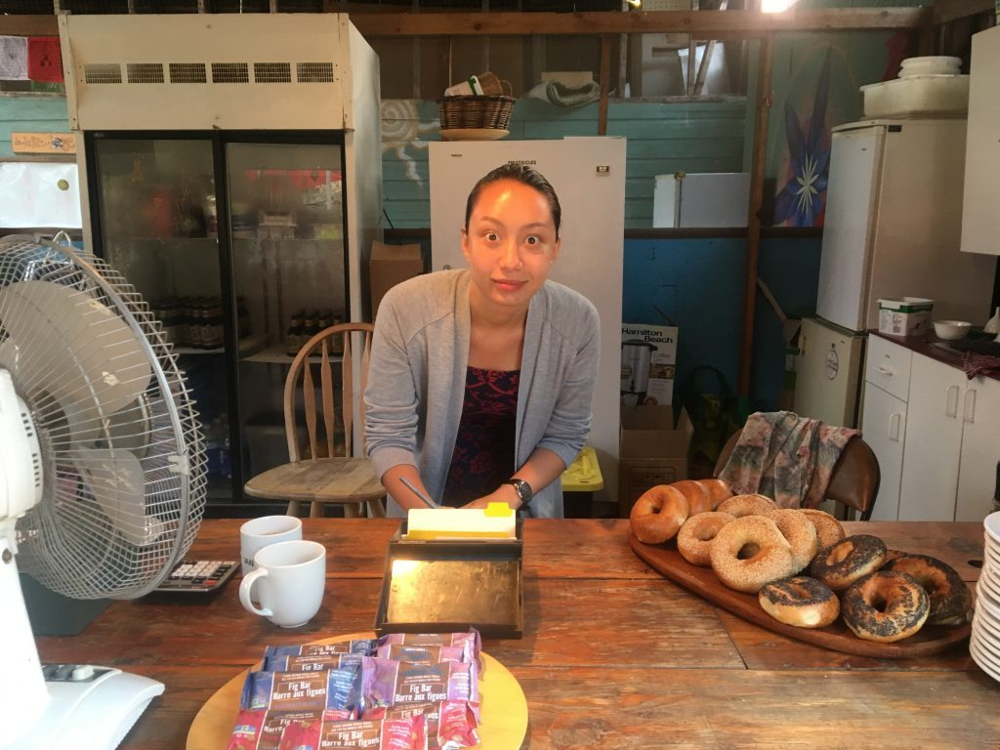

### by Courtenay Cullen

Amita Kuttner

***DISCLAIMER:*** ***The Salt Spring Centre of Yoga has no official political affiliations. The views expressed in the interview below are those of the author. The aim is to inform our readership of something incredible that a member of our Satsang has stepped up to take on.***

***PLEASE NOTE:*** ***This article was first published in summer 2020, when Amita made their first bid for leadership of the federal Green Party. They have since been elected as Interim Leader of the Greens after Annamie Paul stepped down in October 2021.***

There’s nothing like a conversation with an astrophysicist to remind you of how small you actually are. They reveal terrifying information, such as, “there is a black hole at the centre of our galaxy,” as nonchalantly as the rest of us wax about the weather. They keep their cool. They can’t help having that thing I think we could all use more of at the moment: perspective. To an astrophysicist, the earth, while home, is truly one planet among billions, in a universe that also contains the mystery of black holes. Black holes are so massive, I’m told, that even if light goes into them, it can’t get back out, due to their unfathomable amounts of gravity. Their density is infinite. I’m also told that “we don’t understand how the physics works on the inside of a black hole,” (I assume because we appear to be unable to make a return visit), “but we can observe them, and they make sense mathematically.” And while I am fairly certain that they wouldn’t make sense to *me* mathematically, I find it deeply reassuring that there are people clever enough on this planet for whom this is true. And I am lucky enough to be talking with one of them: Amita Kuttner.

Amita earned their PhD in Astronomy and Astrophysics from the University of California at Santa Cruz in June of 2019. On this particular June evening, however, Amita is sitting beside their partner Ian (Ramesh) in the fading light on the porch of their home on Lasqueti Island, and chatting with me and Sharada over Zoom. (Identifying as non-binary and trans, Amita uses the pronouns them/they.) You may know the two of them as the dynamic duo that has run the Latte Da coffee stand at our Annual Community Yoga Retreat for years. The scene is a calm one, but it has not come at the end of a relaxing gulf island day, as one might imagine. No, sir. On the other side of the screen, there is a campaign in full swing. That is because after graduation, rather than relax and take some well-earned time off, Amita took a slightly different tack - they joined federal politics, and ran to be a Member of Parliament for the Green Party, instead. At this time, they were already the Green Party’s Critic for Science and Innovation, having taken on this position even before they graduated. And although they were not elected last year, they ran a campaign that was full of integrity, and was, according to the Tyee - an independent Canadian news source - based on “gender-inclusive policy, climate action, electoral reform, and protecting workers’ rights amid job automation and artificial intelligence,” (Hyslop, Katie. “Amita Kuttner on Being a Green, Non-Binary, and Pansexual Astrophysicist and Politician.” The Tyee. 26 Aug 2019. Web. 25 June 2020. <https://thetyee.ca/News/2019/08/26/Amita-Kuttner-Green-Candidate/> )

*Amita working at the Latte Da coffee stand*

And now, in light of Elizabeth May’s retirement, Amita is running for leadership of the Green Party of Canada.

Funnily enough, the pit stop at black holes has come in a conversation that began

at the Bhagavad Gita.

“I’ve been thinking about the Gita a lot recently,” Amita tells us, as we begin.

“As you go into battle?” Sharada asks.

“That’s exactly it. When you’re fighting oppression, as we are, [while] dedicated to nonviolence… it comes down to doing what you know is right, but not wanting to be invested in the fruits. Where it’s going, in my mind, is going from nonviolence to anti-violence; where you take action to remove violence, and [reconcile] past violence.”

And with that, we launch into a conversation that somehow seamlessly ties together yogic philosophy, astrophysics, duty... and politics. And in a list of odd bedfellows, the latter seems the most out of place. But in Amita, it turns out to make perfect sense. “People look at my life,” they say, “and they’re just like, ‘what are you doing? This doesn’t make any sense to me - you keep changing your mind.’ And I’m like, ‘I haven’t changed anything! I’ve had the same intentions this entire time. It’s just figuring out which projects make sense.’”

**I ask them how it is they came to the decision to run. This, it seems, is rather a big project.**

“It’s complicated,” they say. “It’s a huge commitment.” I nod. I can’t even imagine.

“It’s a different level of responsibility [than running for MP], but it also does give you a chance at a much greater impact. It involves being able to have a hand in framing the conversation. You don’t get that a lot. But if you’re willing to take the stage, and to speak to things often left out, to bring in an intention of seeing everybody and the rest of the planet like family, where you want to approach every individual with compassion and no judgment about where they’re coming from, [that’s] the ability to frame a narrative which would never have existed otherwise.”

It’s not how I’m used to hearing politicians speak. My eyes have not yet glazed over. In fact, I’m more alert, and there is a strange feeling in my stomach. I’m not sure what it is. We keep going.

**Elizabeth May is obviously the outgoing leader of the Green Party, I say. Can you talk about the impact she’s had on you, and how it feels to be potentially stepping into her shoes?**

“So Elizabeth is definitely why I’m in the party in the first place. Trying to choose which party to run for is not simple, especially when you're aiming for impact. I picked the Greens because it’s where I get to keep my integrity.”

“But it was a conversation with Elizabeth that convinced me of that in the first place, because she showed up as exactly what I would want in government: an actual representative. A person who is there because they care, because they actually want to listen, and they *do* listen. Also the fact that she immediately put her trust in the expertise that I brought forward. It was an immediate sign of interpersonal respect, and that she trusted me to live up to expectations, which is something that makes you want to exceed them. It shows a quality of leadership that you rarely see, because there’s no odd condescension, or control, just openness, and example.”

“Also,” they add, “she has different-sized shoes than me.”

**I smile at this. I get it; they can’t be Elizabeth May when they’re Amita Kuttner***.*

“I’m so proud to be a part of this,” they go on, “and to have her fantastic legacy. And I’m looking forward to adding a new piece that’s different. A lot of that has to do with creating the space, in politics, for the participation of more and more people. Especially young people and people from typically underrepresented backgrounds, who don’t get to participate in the political fray, or even political conversation for various reasons.”

“Elizabeth did a phenomenal job of getting the party from nowhere to here. The next goal is exponential growth, where we reach out to people who have never felt like they can be part of the conversation. There are a number of elements to that. One is really communicating our philosophy of life, which is tied to our values, which are really ecological wisdom and justice. And have our policy foundation in science, but even more from a philosophical perspective of how we are interconnected on the planet.”

“Of course,” they add with a gleam, “I want to use some astronomy for that.”

**Aside from the credibility that having their doctorate in Astrophysics brings, I ask, what other things are they drawing from their academic background, in terms of their campaign?**

“I was Critic for Science and Innovation for the Green Party from fall of 2018 to spring 2020, and during that time I brought forward policy on artificial intelligence and automation, data privacy, and a number of other technology concerns that are generally super under-addressed and where there’s not much policy expertise.”

“From a scientific perspective, you need to have assumptions and you need to have a hypothesis, right? These are the things you start with. So in terms of policy, if you want it to be scientifically-driven, which it should be… you need to start with what you’re intending to do. What, for your vision of the future, are you trying to accomplish? What are your values and how are you intending to act? And then you can look at evidence to see how you wish to accomplish it. And then you want somebody who has the ability to know what evidence is valid, or what evidence is biased.”

“Far too often, politicians will say, ‘this is evidence-based,’ and I’m like, ‘no, but it’s not. You’re missing the intention, you aren’t stating assumptions, you haven't told me any of the background.’ Without that, there is actually no context for using science and evidence in policy-making, and we need it. We desperately need it in the climate crisis era. And the climate crisis is not the only crisis we are facing; there’s one of inequality; there’s one of mental health… just honestly too many.”

“The other part of academic experience is honestly the politics. The political side of dealing with academia is another reason I found myself weirdly at home dealing with politics outside of the ivory tower, because it’s very similar. I did a lot of advocacy work for inclusivity in physics, and in astrophysics, and it's taught me a lot about how to make policy inclusive as well. The ways we have to address racism within the academy are the same ways we have to address it in government. And we’re a colonial nation; these things run very deep, all the way down.”

Once again, Amita has brought things together that I wouldn’t have expected.

---

Amita was raised steeped in yogic philosophy. They explain how their mother, Chandra Prabha, came to yoga through her father Satish, and it “became a huge part of her life.” She studied many aspects of yoga, and went on to become a regular teacher of meditation and pranayam at the Centre’s Yoga Teacher Training (YTT) program. She even created a board game based on the Yoga Sutras, which Amita used to play with her. While many of us come to yoga as adults, searching for something more, for Amita the practice and teachings are their native tongue.

“Both my parents were students of Babaji long before I was a concept in their minds. When I was born, my name came from phoning Babaji from the hospital to get [it]. I met Babaji at Salt Spring when I was eight months old. I’ve been connected to the Centre ever since.”

They are also very much connected to our sister Centre, Mount Madonna, in Santa Cruz.

“I had the great fortune of going to Mount Madonna for high school, which in the end saved my life, because I was there when the mudslide hit my house in 2005.”

This was the horrific mudslide in North Vancouver that killed their mother, gravely injured their father, and destroyed their family home.

“I became one of Babaji’s kids at that point. It was through his bringing two kids from Sri Ram Ashram in India [to California] that they reopened the boarding school, which allowed me to go.”

The three became very close, rooming together, attending school together, and going to Babaji’s house every Sunday night for dinner. Amita still refers to them as “my sisters, Soma and Prabha.”

**I ask them whether there is any particular wisdom of Babaji’s that feels most relevant right now.**

“Recently I’ve been thinking about the balance between compassion and dispassion… all the time, am I doing the right thing? Am I leading my life in such a way that I’m trying to achieve better for others? That I’m leading a life of service? Because that is the entire purpose of it.” Getting slightly choked up, but never sounding unsure or embarrassed, they simply go on.

“But the challenge of it is dispassion for somebody who is, as I am, unfortunately, overwhelmingly naturally compassionate. Where you feel it. And you understand it. And you relate to it. But you take a step back, and you take the larger perspective.”

“[But] you still have to be dedicated to improving it. You don’t want to be so dispassionate that you lose touch and you stop acting the right way, and you stop serving others, and you stop trying to bring about justice for the world.”

“Figuring out how to balance those is where I’ve been trying to remember all the things that Babaji said over the years. And how to achieve that is practice, for sure. The Sadhana of far more than Sadhana, where you roll self-awareness, and connection to the original and ultimate goal of service into every moment.”

And I can see now that Amita is not hobbled by their trauma, or by their grief. They have moved through it, learned from it. And with grace, and some help from Babaji, they have managed to stay beautifully open. It has made them stronger, and bigger, somehow. Their view is more expansive. More universal, perhaps?

---

**Next, for the first time in my life with somebody I know, we talk about the possibility of them becoming Prime Minister.**

“Trying to accept the possibility of ending up Prime Minister is… weird,” they say, smiling.

“But I also approach that from the concept of service. It sounds horribly unpleasant, but I would do it if it means that I could help people. If I could overhaul all the systemic issues we have, and actually put in place transformative change, and an example of how the world can actually be? *Any day.* Sign me up, if it means that’s what I can do.”

Then, Sharada nails it - “It’s duty.”

“Yep, it’s duty.” Amita agrees. “And I am very wary of people who enjoy politics. There are parts of it that I enjoy, for sure: reaching out, connecting with people, the policy process, talking about everything that we could accomplish — absolutely a beautiful experience. But dealing with so many people who are self-interested, who are in it for power, or money, or prestige… these are things I just don’t comprehend the desire for.”

**I point out that these folks probably have a heck of a time, on the flip side, comprehending them.**

“Yeah, they don’t get me at all,” they laugh, “it’s quite fun.”

Then Ian sums it up perfectly: “when being true to yourself and just acting natural confuses your opponents, it’s a power move that you didn’t intend to make.”

We all laugh.

Amita continues. “And there’s some people in between. They’re in it because they care, and they really do want to help people, but they don’t believe they can change everything. So they buy into incrementalism, and their scope is much lower. They act in a hyper-political manner. Not because they aren’t actually good, but because they’re so convinced that they’re *doing as much as they can.* And I just think that must be the most depressing existence.”

**Right, I agree; to resign yourself to having the smallest impact, rather than having big enough and confident enough dreams to try to make a big one.**

Amita points out that this malaise is actually where we’ve gotten to as a society, as well. But that wasn't always the case. “Even back a couple decades,” they note, “there was still a cultural consciousness with the intention of going forward. You can see it based on the media. You can see where the storytelling was.”

“But we’ve gotten lost in the way the system functions, which is completely destructive, and unsustainable. We need to be looking to the next place. Where do we want to go? What do we actually want our society to look like? There is something far beyond this, more beautiful, where we finally delve into all the gifts of being human and living on this amazing planet, that we’re not anywhere close to. That conversation, of ‘where do we go, what are we dreaming of, what future do we actually want,’ we need to have that conversation at a much greater societal level if we actually want to go anywhere. And we can’t stay here.”

**Now Sharada muses, “How many people would say, I wonder, ‘Yeah that’s a great dream, but let’s be practical?’”**

“I find, interestingly enough,” Amita replies, “that I tend to be the most practical in my approach to getting things done.”

“I dream wildly of where we need to go. But in terms of how I actually want to implement policy, I also understand you need to find the avenues where you can be most effective, [and] to set out the steps that actually accomplish it. So I feel like you’re diminishing your own capabilities if you refuse to dream.”

“It’s a weird dichotomy for sure, to be the dreamer, but to also be the practical one. But I find that they go hand in hand. If you don’t dream, you can never get there.”

“And you don’t get there with some sort of mild or mediocre change. Or half-accomplishing anything. Because then you leave everybody out. People don’t get what they need, they don’t even get their survival ensured in the future. Unless you can say ‘this is how this will improve everyone’s lives,’ and get people on board, then you get political apathy, which is where we are now.”

---

When I set out, I tell Amita, I wasn’t sure what the common thread would be in our conversation, what would tie it all together. It’s so much more clear now. The common thread is Amita. Their background, their values, their intentions.

“It’s all seeking, right?” They say. “For me, I’m driven by justice, empathy, compassion, and understanding. Those were the values that were instilled in me from my upbringing. I spent my academic years basically feeling like ‘until there’s something I really feel draws me in, I will learn about this amazing universe.’ Because it’s a great gift. And during that time, I fought for the same things.”

“I want people to be able to have what I have, giving every single person the opportunity to make their life whatever they want it to be… and to learn about the world, and their own existence, and have that space to do that reflection, both inside and out. And right now, we’re not offering everyone that opportunity, so there is no equity. And until there is, it kinda has to be my job.”

---

It’s sobering to be told that a great unknown like a black hole is at the centre of our galaxy. “Every galaxy,” actually, Amita goes on to say. “It’s why they exist the way they do. And they rotate, because they’re gravitational, just like our solar system, really.”

Just another order of magnitude, an even bigger perspective. I am realising that, while daunting for me to comprehend, Amita is right at home here in the really big stuff.

“And that’s why we have the shape we do, as the Milky Way,” they conclude. And I realize that I’ve never really thought of the Milky Way as my home. It’s a beautiful thought. And I find that  the feeling in my stomach from earlier on is actually hope. Excitement, even. For the future that this person has brought within our reach.

And while I may have started off feeling small, I actually find that my own perspective has been broadened during this conversation; I used to just live on Salt Spring. Now I am a citizen of the vastness that is the Milky Way. And here in the Milky Way, with Amita at the helm, all things are possible.
