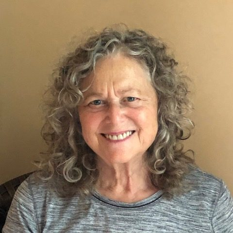

## Q&A with Soorya Ray Resels

#### Why did you choose Salt Spring for your yoga teacher training, having already spent 20 years in India with your teacher?

You might find it interesting to hear how I came to yoga teacher training. I’d studied and taught meditation and yoga philosophy in India and centres in Europe and North America since the early 1980’s. I’d toyed with taking the 200 hour Yoga Teacher Training since leaving India in order to add the element of Hatha Yoga to my life because I’d only dabbled all through the years, never taking the physical aspect seriously.

About six years ago, I found a lump in my breast. I tried all kinds of alternatives to dissolve the lump because I’d had a truly unpleasant and inconclusive experience getting biopsied and distrusted the western medical approach. I delayed and the lump did not dissolve but grew instead. When I was at last given the diagnosis of breast cancer after a second biopsy, I was truly caught off guard. Even my years of meditation didn’t help me in that early stage of facing the truth. I couldn’t understand why I’d have cancer when none of my family had had it as far as I knew. I was fighting with reality. Of course, once I stopped fighting, my state of mind settled.

I went through surgery and then radiation and gratefully did not need to receive chemo. A year and half later in the summer of 2019 I chose to take my yoga teacher training at the Saltspring Centre of Yoga to finally get my act together and include my physical health training. What I received was much more than that.

How I came to SSCY was through my friends Sam and Cara Graci, who told me that given my background I’d find this training to be most rewarding and fulfilling overall. And it was. It gave me a chance to be with the teachings of Hari Das Baba (whom I’d met several times in the 1980’s in Canada enjoying his company very much) as well as to be with seasoned yogis. I loved this training. I met a wonderful group of teachers and students of all ages.

#### What is it that attracts you to the practice and the teaching of meditation?

Meditation and the application of yoga philosophy has always been my lifestyle and passion. When Covid first began to intrude into our lives in March 2020, I wondered how I could offer something worthwhile to people easily and effectively. I’d taught yoga for a year at a studio on Bowen where I live. I also led kirtan and meditative inquiry practices there for several years, before in person sessions closed down entirely due to Covid.

Then the zoom platform came in. And a lovely idea sprung from within — to offer daily 30 minute meditations online. It was so much easier to do from home with people sitting in the comfort of their own homes. It was a perfect gift to receive and to give — and it stuck. It is still happening almost 2 years later.

When SSCY asked for its trained teachers to come forward with suggestions and offerings for online classes, offering meditation classes along certain themes, emphasizing a specific focus with each series, came to mind. I greatly appreciate being part of this online service.

#### What have  you noticed about the ‘moving to the new normal’ that suggests meditation would be of service?

I’m not sure there will be a new normal. We are living in rapidly changing times, even more than our parents’ generation faced. It’s ramping up on the outside — with environmental, racial, health, and political concerns of global proportions.

Having a safe place to stand within yourself is most important when change is all around. This has always been needed. To experience change with a sense of well-being really does depend on training yourself to remain centred and balanced even while expanding your awareness to know how much more you are than who you think you are — and to know this directly.

#### How has your practice changed by going online? What’s good about it? What’s challenging?

While it will always be wonderful to meet in person, the pandemic has shown us that we can live with less busyness in our lives. That less rushing about is good for us. This time of restriction has allowed us time to value family life, to realize that some of us can work and study from home. As we go back into our lives outside the home, online classes can still keep us connected to a self-care practice.

Going online has been excellent for me personally, both as a teacher and as a student. It has enhanced my personal physical fitness practice, which has always been a weaker link for me. And it’s made a meditation offering easy and comfortable to manage.

In terms of meditation, I’ve mentioned how you can do it from the comfort of your home. You learn to value your home environment and arrange it for your benefit. A big plus is not having to go out in your car to get all the benefits and spend so much time driving in traffic. If you live at a distance, being online provides easy access to classes and offers a sense of community far and wide.

What is challenging about the online experience? Many need that in person connection. They need the movement. They need to get out of the house.

We are all different. We have different ways of processing connections. Some of us are good with phone calls, others need the visual connection, and still others need in-the-body connection in classes, at work, or in leisure times. So both approaches are invaluable.

#### What is your favourite style of meditation to practice and/or teach? Is there a style of meditation that is beneficial for everyone, or does everyone have their own style?

There are many ways to enter the meditation space. If there is one thing that never changes for me it is that whether I guide people to scan their bodies, use their breath, manage their minds, emotions, sensations, use mantras, dwell on inspirational thoughts, it is YOU, the aware being, who is most important. Through meditation, we become familiar with ourselves as aware, expanded free beings. If you need a name for this style, it can be called Awareness Meditation.

I don’t know about you, but I need to feel the freshness of every meditation sitting. While certain rituals and routines are very helpful, there are no two meditations exactly alike. We come to sit for meditation with different moods, needs, and circumstances.  Through meditation, we learn how to navigate from wherever we are to where we want to be.  We learn to accept what arises, and instead of fighting it, we learn to observe where it comes from and what it dissolves into.

In terms of meditation, some of the important aims and benefits are greater peace, clarity, presence, joy, well-being, and a flow of gratitude. We discover energy to heal ourselves and bless one another, the planet, and the world.  And we learn to bring that into our daily lives. We learn how to speak to ourselves, guiding ourselves into experiencing the inner freedom that is already ours to experience. We find it when the mind settles, distractions settle. Once we do, we can recognize that peace is always there.

These many benefits belong to each of us. The pointers that are given or found along the way belong to us all as well. But what we hear and how we experience and process is through our personal filters. Meditation helps us find our true self, free of filters, so that we experience ourselves as whole, and life directly as it is.

Even as I guide people in learning how to recognize the subtler spaces as we travel throughout the vast domain of Self, my words will impact each person differently according to the state one arrives in. In each meditation, there is a journey we are going on. One could say it is a heroic journey where you face your obstacles and find inner freedom.

Meditation is a process to reach a place of wholeness, aliveness, truth, beauty, freedom much beyond  these words and meanings which act as pointers. Through guidance in meditation one learns many tools, devices, anchors, or means to choose from — so that one can navigate, by oneself, to successfully reach that space of peace.

I like to quote a verse from the Shiva “stotram” or song called Shiva’s Garden. “There are many doors into the mansion of your being.” I say, “Learn to use them. Then you can pick the ones that serve you in each sitting.”

#### What are common challenges people face when learning meditation?

The biggest challenge is generally one’s mind: having too many thoughts, being disturbed by noise, life events, problems. Compounding that is the human tendency to judge ourselves in our meditations. I like to emphasize that there is never a bad or wrong meditation. With every meditation we explore who we are with non-judgmental awareness. We discover our greater self while navigating the terrain of our human programming. There can never be enough reminders for this.

Another challenge is the belief we bring that we must sit still. We see statues of Shiva or Shakti or gods and goddesses, or the Buddha. But we are not made of stone or wood or metals. I like to encourage people to move when they feel the need to, and to consciously breathe so that slowly they can relax into stillness, releasing blockages on the way.

We don’t need a fancy place to meditate. We need a space where we can feel comfortable and sit upright, even using props if we need. It doesn’t have to be on the floor. It can be on a couch or bed or chair. What is important is to make yourself easy.

#### Have there been ‘aha’ moments you have experienced or witnessed that inform/inspire your teaching?

Yes. There have been many. Amongst the earliest are several clearly defined moments of stepping through my mind with its many corridors into the clarity of the natural luminous world. Feeling the direct sensation that I’m seeing clearly without my mind’s filters.

Also, there was a time where I spontaneously experienced moving through subtle dimensions from physical to breath, to mind, to the discerning intellect, into the bliss of no-thingness. I’ve experienced the perception that “this body is me and I am alive with life that is far more than can be contained in one body. I am ME.”

There have also been moments of profound stillness and silence and a vastness of perspective, not the angular ones of my personal training and belief systems that I’ve grown up with.

There have been inner battles with the demon voices of “being not good enough, nor capable enough, nor having been given proper guidance by parents and teachers  about what ‘living’ really is.” And there have been the felt sensations of emerging with greater clarity and understanding, of slaying the demons, of being free.

#### What I’ve learned personally and have seen now in others meditating with me is that when you’ve broken through the filters of your own mind, words of truth in any scripture or teaching ring clearly beyond the words being used. It is a wonderful feeling.

And so I am left with only these words: Please come join me in this awesome journey into Inner Space.

---

### about Soorya Ray Resels

Soorya has been involved in Yoga since the 1970’s. She lived, studied and  taught internationally, including 23 years at the International Meditation Institute in Himachal Pradesh, India, where she co-authored the book [“Vision of Oneness”](https://library.swamishyam.com/shop/english-books/vision-of-oneness/) and received an Honorary Ph.D. in Meditation and Yoga Philosophy ~ Vishwa Unnyayan Samsad in India,1987. Soorya presently teaches meditation (Dhyan), breath-work (Pranayam), Vedanta and Yoga philosophy, and devotional chanting (Kirtan).

At a difficult point in her life, after breast cancer surgery and while looking for physical healing, she discovered the Salt Spring Centre of Yoga. She found so much more – the richness of the Yoga Teacher Training program reminded her of her time and studies in India. She completed her 200 Hour Yoga Teacher Training at the Centre. Most recently Soorya taught at Open Door Yoga in Vancouver, B.C. and The Well Yoga Studio on Bowen Island, B.C. before making the transition to online.

Since Covid, she leads daily online meditations and online chanting twice a month. When she is not meditating, coaching or mentoring, Soorya loves singing, walking in the woods, and participating whole-heartedly in the community where she lives.

### For information about the Salt Spring Centre of Yoga’s YTT program, visit:

[Yoga Teacher Training](https://saltspringcentre.com/programs-retreats/trainings/yoga-teacher-training/)
