*Do not be daunted by the enormity of the world’s grief. Do justly, now. Love mercy, now. Walk humbly, now. You are not obligated to complete the work, but neither are you free to abandon it.* ~ The Talmud

Dear friends,

Winter is upon us. The long dark has arrived, and hours of light are scarce. Mother Nature is enraged, overflowing and bursting her banks as flooding runs rampant across our province of BC. People are more polarized than ever, and friends seem to have forgotten how to listen to each other.

It is, at first glance, a very frightening time.

But there is a deep stillness and magic in the darkness, and a chance for transformation in crisis. If we heed the call and the lessons of the dark, we may be brave enough to look within, stouthearted enough to stand together, and above all, soft enough to bend and forgive.

In this spirit, we choose to celebrate this as the season of hope!

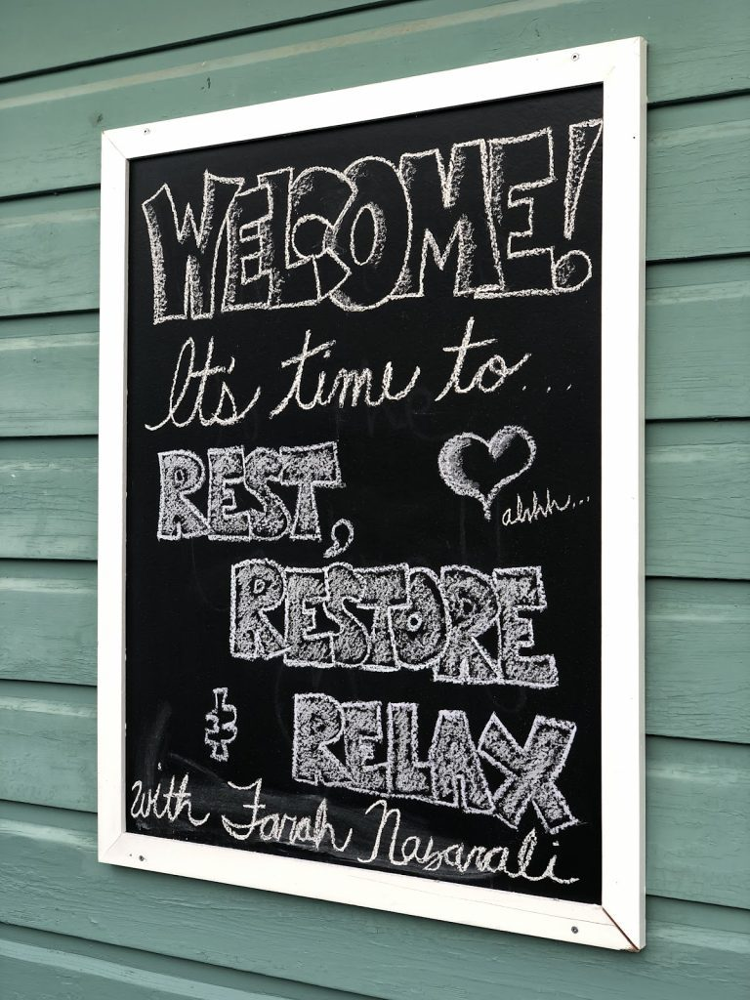

This month we saw the Centre re-emerge from its own chrysalis, reminding us of its beautiful purpose in offering space for folks to come together in deep practice. As well as giving the chance for a community of yogis to offer their service freely, in order to hold this sacred container.

We are reminded by Kenzie and her dive into Jessamyn Stanley’s groundbreaking book, Yoke, that Yoga is, at its core, a practice of radical honesty. A Q&A with YTT Alumnus Soorya Ray reveals the “aliveness” found in a long, meditative life. And, last but not least, we re-publish an interview from summer 2020 with Amita Kuttner - a longtime member of our Satsang who has ***just been elected Interim Leader of the Green Party of Canada.***

You read that right!!  And if having a person who grew up with Babaji influencing federal policy is not a reason to hope, then I don’t know what is.

So while there is much work to do, let’s come together, rather than turn away from each other. Let’s look into the darkness until our gaze softens and adjusts to its depths. As Maeanna Welti wisely tells us,

*‘Carry your candle, yes. But do not let it blind you to the radiance of the dark. Do not let it crowd out the silence. Do not let it deafen the music of the heartbeat, breath, starlight, humanity.’*

## Centre News & Rituals

### Centre Happenings….

It has been a busy, beautiful time of reopening at the Centre. This November we hosted our first two in-person retreats since the pandemic hit. It was all hands on deck, as all the residents, and Satsang from both on and off-island answered the call to come together and offer their service.

- 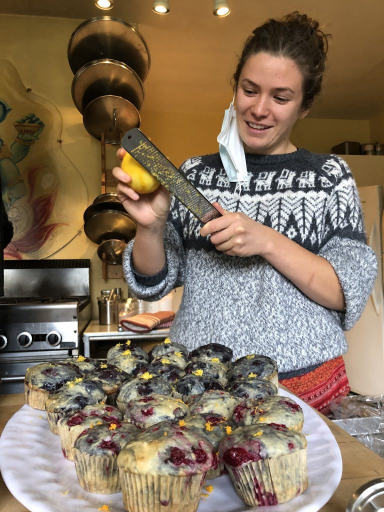
- 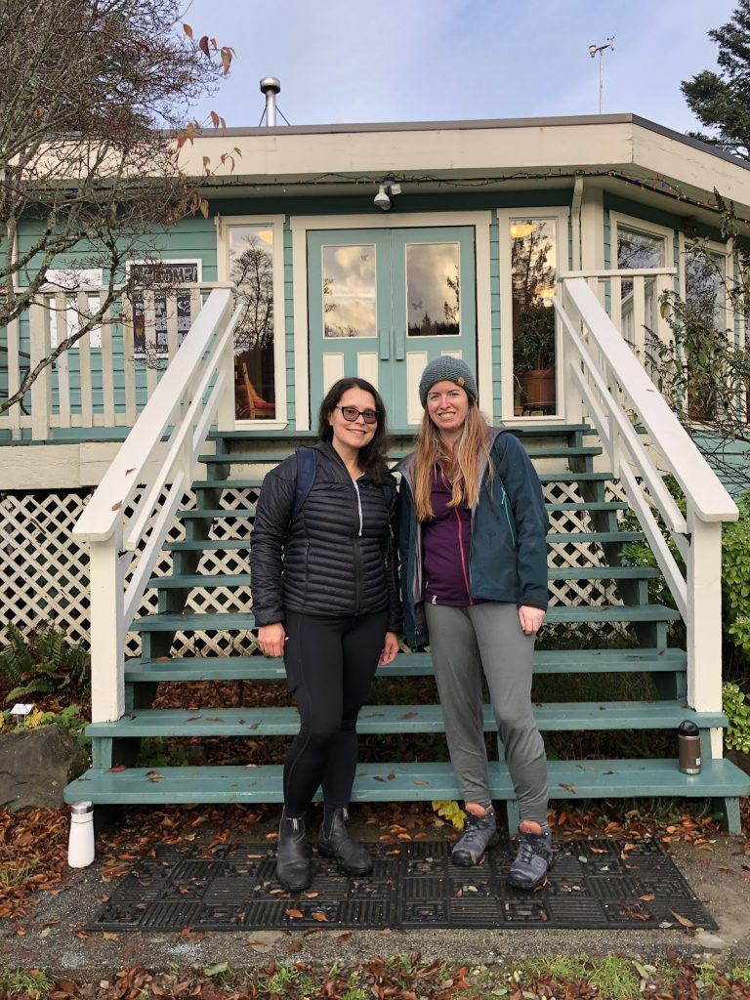
- 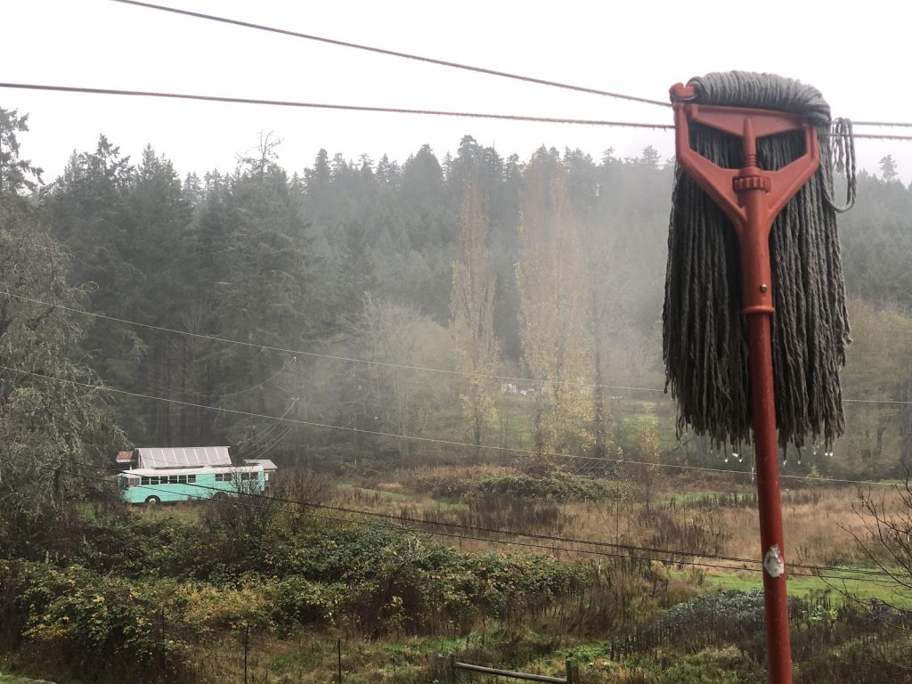
- 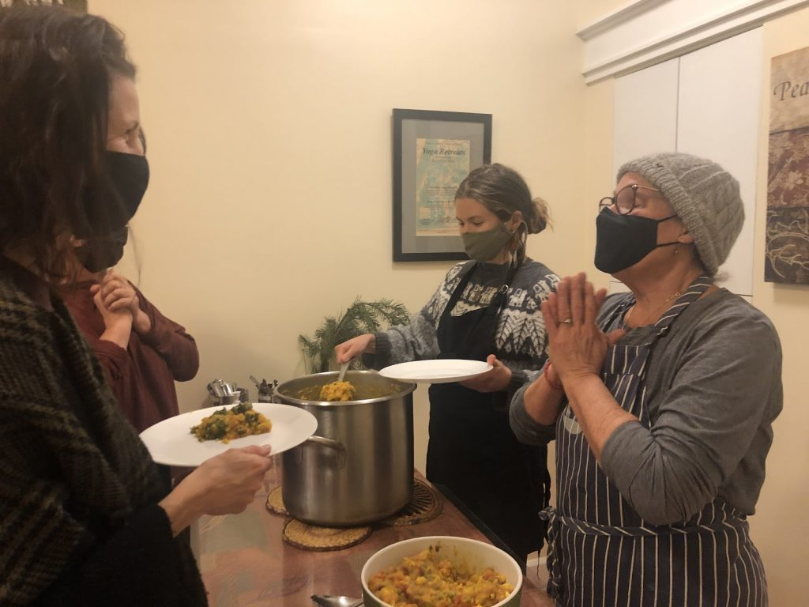
- 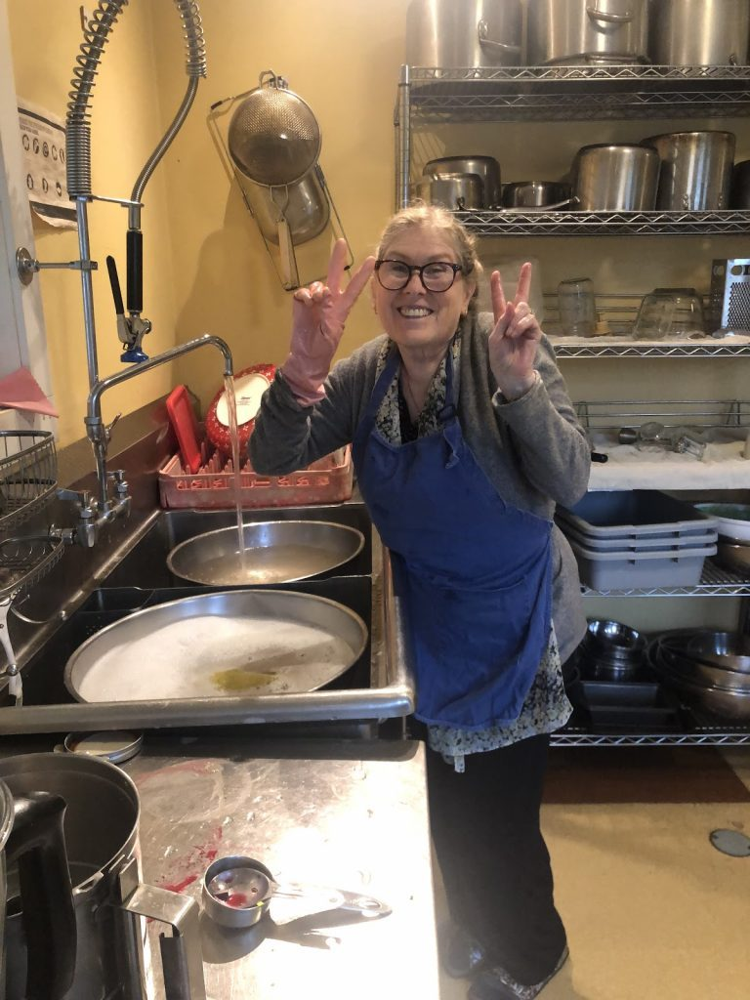
- 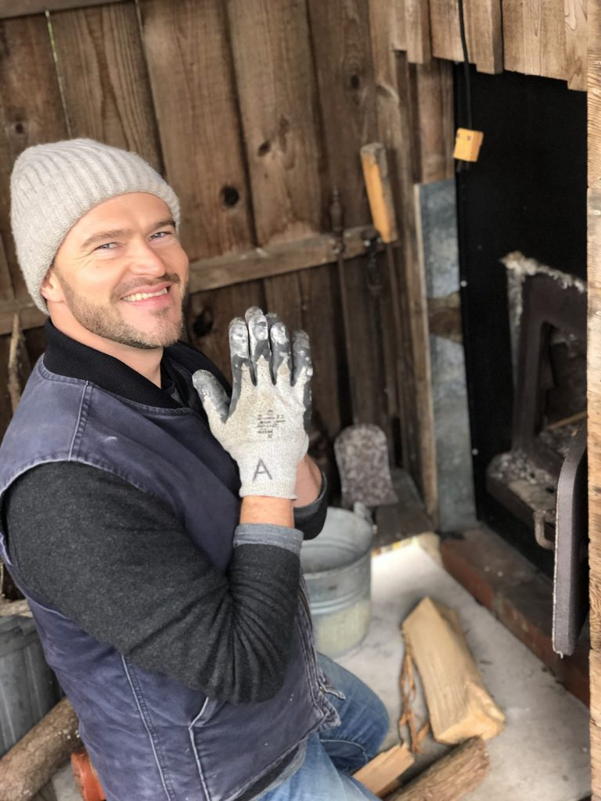

We scrubbed, we cleared out cobwebs both literal and metaphorical, and we shook the dust of the pandemic off, we opened those big beautiful doors and we let in the light (and the yogis!). The kitchen team put out such delicious, nourishing food that requests for recipes are still pouring in. Fires were lit and rooms kept warm, dishes were scrubbed with love, bathrooms were shined up, meal prayers were chanted, and the dining room was full of happy chatter and laughter. It felt good, and oh so right, to be back.

Deep bows of gratitude to everyone who helped make these retreats happen!

Both retreats were big, beautiful successes, and we are grateful to everyone who helped. We will carry this momentum forth this month and on into 2022, ready for a full season.

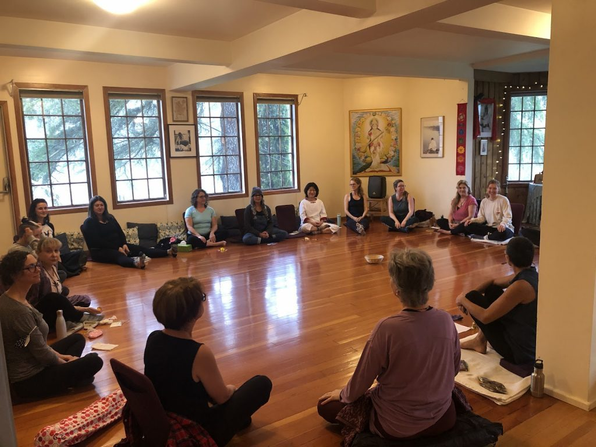

In the midst of all this, the rains came. Salt Spring, like many places, experienced wild and sudden flooding. Blackburn Lake swelled to over twice its normal size, and eventually gushed right over Fulford-Ganges Road. The road is still being fixed and there are detours in many places on the island.

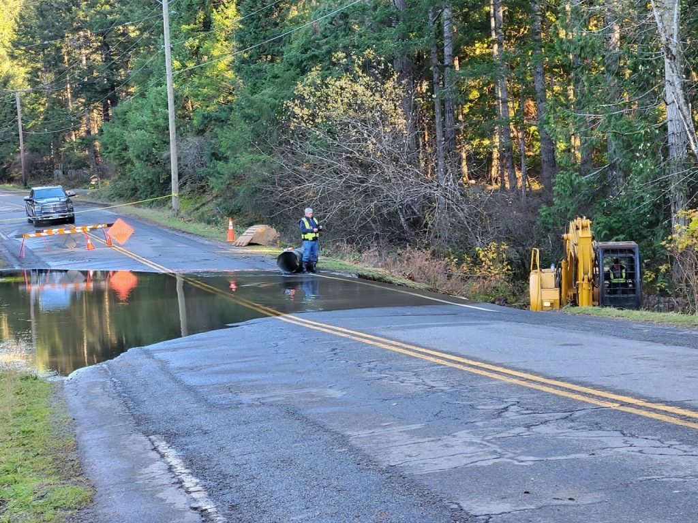

*Blackburn Lake flooding over the road*

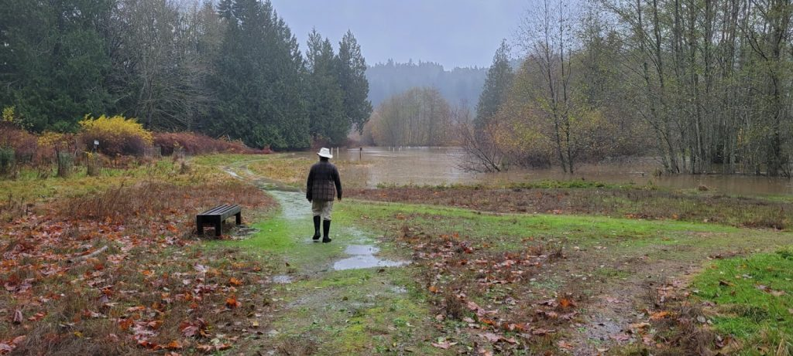

*Blackburn Lake nearing Centre property line in the Conservancy*

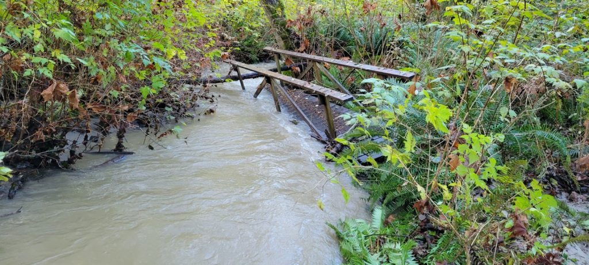

*Bridge washed out on the Centre forest trail*

On our own land, the forest trail became impassable as several of our bridges were literally picked up by our stream and moved twenty feet down the trail. Big thanks to Suneel and our volunteer maintenance team, who have been working hard, getting bridges fixed impressively quick!

## Current & Upcoming Programs

### Bija: Planting Seeds for the New Year  with Farah Nazarali

**\*Online\* 5-day Yoga Retreat** / **December 27, 2021 - January 1, 2022**

Everything we do, say, and think leaves an impression deep in our consciousness. Commit to practices over the holidays that keep you anchored and balanced. Be moderate in your indulgences, humble in your desires, and dedicated to your health and well-being. This Retreat is intended for yogis who wish to stay rooted in their practice over the holidays and who wish to prioritize health as they begin a new year. Retreat includes 2 daily yoga classes (on video or Live on Zoom), optional workshops, wholesome and nourishing recipes, and a holiday inspired self-care package! Suggestion donation: $108 - $395 (30% of all revenue will be donated to the the SSCY and the OM Ashram)

**Click** [**here**](https://form.jotform.com/212935020157246) **to register and** [**here**](https://farahnazarali.com) **for more information on Farah and her many offerings. Read a lovely [Q&A with Farah here](https://saltspringcentre.com/bija-planting-seeds-for-the-new-year/).**

## Rituals

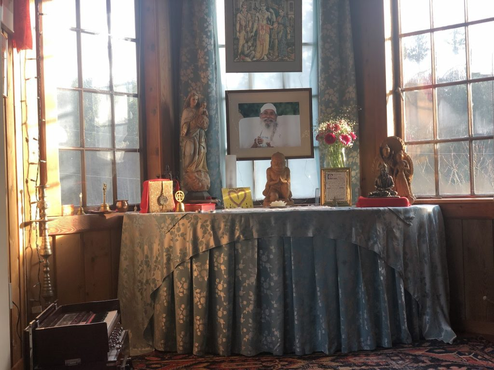

### December Full Moon Yajna  - Saturday, December 18th at 7pm.

***\*If you wish to join in person or via Zoom, please reach out to Mahavir directly at info@saltspringcentre.com\****

## Centre Yoga Classes

*”The Body is the temple of the soul. The soul is God’s Temple” - Babaji, The Yellow Book*

**All** **yoga teachers and students are required to provide proof of being fully vaccinated** for indoor classes, until provided different instructions from Public Health. We will continue to closely monitor the Provincial Health Orders for any changes.

In addition – British Columbia has reintroduced a provincial mask mandate for public indoor spaces; **all guests, staff, teachers and volunteers are required to wear masks when moving through our indoor public spaces** - including to and from your mat.

***We thank everyone for helping us to comply with Provincial Health Orders so we can continue to offer classes to our community!***

### YOGA CLASS SCHEDULE

Advance registration required for ALL classes at this time (both online and in-person)

[Click HERE for updated Schedule and registration details - always on the website](https://saltspringcentre.com/yoga-classes/)

Online Zoom Classes with Cara and Sam

- Sunday 11:00am to 12:15pm - *Gentle Hatha Repair*
- Wednesday 11:00am to 12:15pm – *Mellow Yoga Class*

In-Person Classes

- Monday 4:30pm to 5:45pm – *All Levels Hatha* – Dorothy Price
- Wednesday 2:00pm to 3:30pm - *Continuing Beginner Class* - CP Lynday Savage
- Thursday 10:30am to 11:30am - *Gentle Yoga* - Jim Dickinson *\*Sept 30 – Dec 16\**
- Thursday 4:30pm to 5:45pm – *All Levels Hatha* – Dorothy Price
- Friday 9:30am to 10:45am – *Yoga Flow for Everybody* - John Howe
- Saturday 10:00am to 11:30am - *Mixed Levels* - CP Lyndsay Savage

Weekly Satsang and Ongoing Classes

- Monday  7:00pm - 8:15pm - *Yoga Sutra Study* - with Yogeshwar  
  *\*\*Moved from Thursdays - starting Nov 29th\*\**
- Tuesday 7:30pm - 8:30pm  - *Bhagavad Gita* - with Mahavir
- Sunday 1:30pm - 2:30pm - *Satsang* on Zoom

[\*\*Please find more information, including the Zoom link, on the website HERE\*\*](https://saltspringcentre.com/programs-retreats/public-offerings/)

## For Your Reading Pleasure…

### [A Conversation with Amita](https://saltspringcentre.com/a-conversation-with-amita/)

Written by Courtenay Cullen

Meet the Interim leader of the Green Party of Canada!! Revisit a thoughtful and candid interview with Amita Kuttner from summer 2020 when they first ran for leadership, in a conversation that weaves together ideas around duty, the Bhagavad Gita, astronomy, black holes, and what true, inclusive leadership looks like.

### [Yogic Book Review: Yoke by Jessamyn Stanley](https://saltspringcentre.com/yoke-my-yoga-of-self-acceptance/)

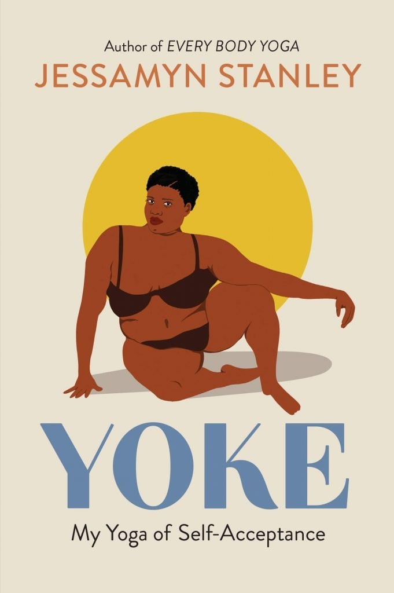

Written by Kenzie Pattillo

Jessamyn Stanley has written a collection of essays that need a spot on your yoga book shelf (I see you Yoga Book Lovers!) for SO many reasons. Yoke invites contemporary yogis to turn towards all aspects of the yoga practice through the lens of race, gender, sexual identity and body size...and then goes deeper still. This book is refreshingly honest, deeply wise, and ridiculously encouraging.

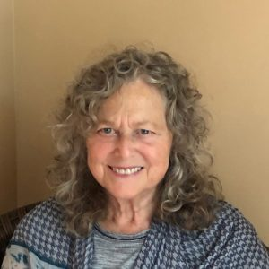

### [A Long and Mindful Road - Q&A with Soorya Ray Resels](https://saltspringcentre.com/a-long-and-mindful-road-qa-with-soorya-ray-resels/)

Soorya has been offering ongoing online meditation training through SSCY since the fall. She has hard earned wisdom and deep peace to share through her teaching. You will learn so much just by reading her thoughtful answers in this piece of writing.

*“What I’ve learned personally and have seen now in others meditating with me is that when you’ve broken through the filters of your own mind, words of truth in any scripture or teaching ring clearly beyond the words being used. It is a wonderful feeling.“*

## In closing…

As the darkening days lead us further along the inward spiral of winter time, may the heat of our regular sadhana keep our heart embers glowing. May our lovelight shine bright enough to guide our way through these unsettled times. As we bear witness to the suffering and injustice within our province and beyond, brought on by the hastening of climate change, may we find ways to take action that cultivates peace within and without. Our relative privilege begs us to accept responsibility and act. May our actions be guided by grace.

We can do hard things and we can do even harder things together. And sometimes the hardest thing is to have hope even when all hope feels lost. In the darkest of night, we hold hope for dawn’s fresh miracle.

No matter what you choose to celebrate or believe in, we wish you a season of hope, togetherness, and deep - even dark - peace.

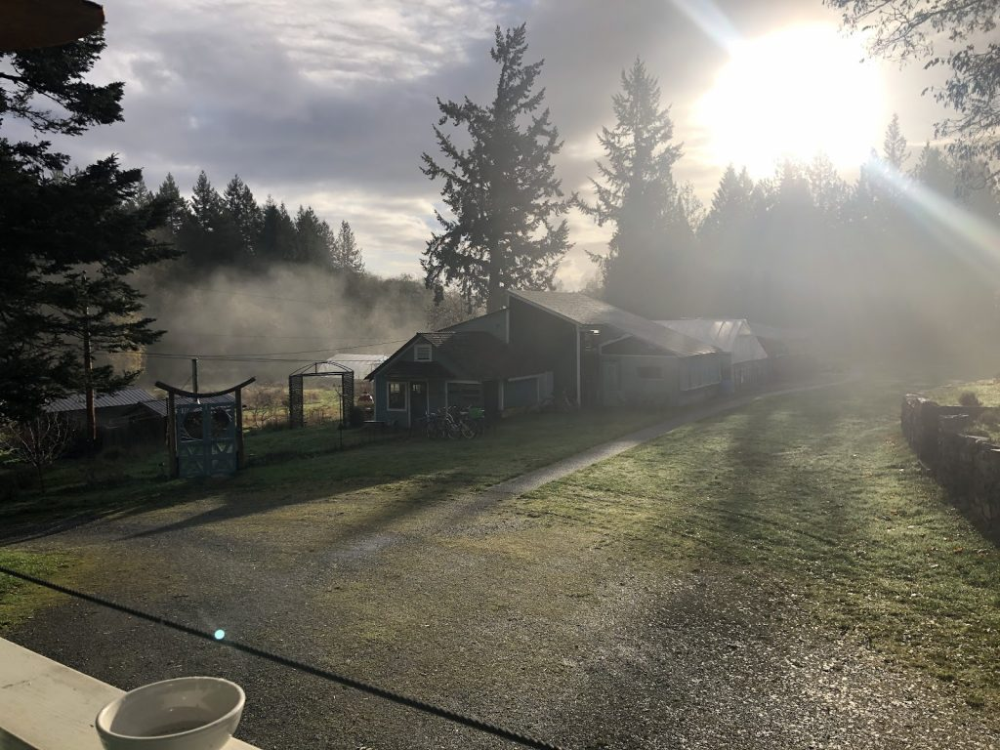

“*There was never a night or a problem that could defeat sunrise or* *hope.”*  -Bernard Williams

With Love, Gratitude and Infinite Hope,  
Courtenay, Kenzie and Sharada
