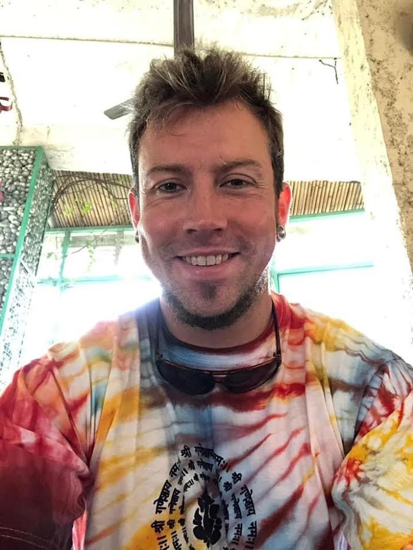

The Centre recently received a very generous memorial grant called the Joshua Bell-Altizer Grant to be directed for [Yoga Teacher Training](https://saltspringcentre.com/programs-retreats/trainings/yoga-teacher-training/). We are so grateful to these anonymous and compassionate donors and friends of Joshua; keeping his dream and the Centre’s mission alive. Here is a copy of Joshua’s introductory speech at the first men’s yoga class that he taught at the Comox Valley Recovery Centre. Whatever you are struggling with, I hope you are inspired and moved by Joshua’s words.
Civi Jacobsen, Manager, Salt Spring Centre of Yoga

## Quitting isn’t the hard part

### by Joshua William Bell -Altizer, January 2020, Comox Valley Recovery Centre.

*An introduction speech at the first men’s yoga class Joshua taught there.*
Quitting using isn’t the hard part. *Deciding* to quit is the hard part. Our very identities come [from] a part of all those actions, all those patterns of behaviour and all those routines. All those people participating with us relative to that identity, represent components of ourselves that we’ve become accustomed to.
And I mean that technically.
Deciding to quit literally means facing the unknown. It *literally* means choosing something new, something different, something terrifying. But it’s only terrifying insofar as it is unfamiliar to you. To discover something new, you must look where you’ve never looked.
And that which you most want to find, as they say, is in the place you least want to search for it.
Exactly one year and one month ago, to the day; I sat where you now sit -in the darkness. In the depths of despair. Staring up from the bottom of a well at a speck of light seemingly miles above; some certain unattainable distance beyond me.
I felt many of the things you now feel. The coldness of fear gripped me tightly and made my body tense and rigid to the point to aching. My mind was heavily overcast and intimations of anything resembling coherent thoughts were illusory at best. Anxiety stricken; it made my heart race and my breath shallow. [For] being in the company of other men, especially ones with whom I was unfamiliar, cause major feelings of insecurity.
Not “good” enough, not “manly” enough, not “cool” enough, etc.
I always felt extra vulnerable and intimidated in their presence. The intense feeling of shame for having ended up in here at all...for this place, I thought, wasn’t for somebody like me. I’d ended up here, but this wasn’t me.
It was me, though. My decisions, every single one of them, whether influenced chemically somehow, encouraged by others or made with positive intention, were MY DECISIONS. I’d put myself there. I was responsible. And the only way through hell, is to go through hell.
You get through by becoming accountable to yourself for where you are now. It can be an agonizing process, but when you acknowledge it this way and take responsibility within yourself, you become responsible. And when you become responsible for it all, you are no longer a victim of anything, because you’ve taken your power back.
You begin to wake up and move forward consciously. Not doing everything perfectly, and not thinking you ever could. But doing things consciously and with intention. Intention is sacred, because energy follows thought.
Take the bull by the fucking horns! Participate in your life rather than taking a backseat. Find joy in the once seemingly mundane, for all experience can be profound with the right attitude; one of gratitude and of appreciation. It involves changing the fundamental ways you view and thereby exist in the world.
And, the good news is, we’re actually capable of such a thing. Do the thing and you will have the power.
What is your 2020 vision? See it clearly. FEEL it clearly. Those feelings are impetus for creating the life you want. Do you know what kind of life you want? We live in a world of ideas. Everything around you, absolutely everything that exists in the human domain began merely as an idea.
Those ideas, through proper action and allowing, then become manifest in physical reality.
Know thyself.
The only way to move forward in any particular direction is to aim at something- otherwise you just wander around in the dark. Deciding what to aim at requires you to know who you are to the extent that you are currently able.
The degree to which we relate to others is a reflection of how well we know ourselves.
We can’t truly love another until we learn to love ourselves. And we can’t learn to love ourselves fully if we don’t know who the hell we are.
Know Thyself.
It is the fundamental to everything you do. It’s your foundation. It’s the bedrock that you build your entire conscious existence upon. When we lie to ourselves, when we hide parts of ourselves, when we are too afraid to feel our pain or too proud to share out joy, we’re participating in the world at a sub-par level. We leave a hole in the fabric of reality precisely the size and shape of your soul. And that is never okay.
We are all in this together. We are all a part of this world. Whatever the hell that means.
My most recent aha moment about the 12 steps is with regard to the higher power idea.
God.
The Universe.
Something Larger that Yourself.
These concepts can carry relative bondage. And by that I mean they have a particular weight or flavour about them, and they’re actually meant to.
You hear the word God and immediately there is a dogmatic load on your shoulders. You hear the term ‘The Universe’ and there’s a bit of fluff and new age-ness about it. Either of these things may feel uncomfortable to you, for whatever reason. “Something Larger that Yourself“ can seem somewhat watered down and maybe even a little bit vague, so it might not stick either.
What REALLY needs to occur is a sense of connection to something. And this connection comes from your heart, not your head. It’s love fundamentally but let me elaborate. Something as simple as being connected to another human being. A lover, a child, a parent, a brother or sister, perhaps. If you’re connected to them you understand that they impact you and defacto accept the claim that you impact them.
You’re not nothing. You’re never nothing.
You have influence on the world around you.
ALWAYS.
So to care about yourself is literally, technically to care about others as well.
