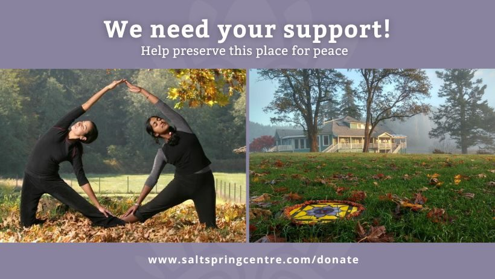

For an update on the Salt Spring Centre of Yoga's status in 2023, visit: 

- "[Message from the DSSS President](https://saltspringcentre.com/message-from-the-dsss-president/)" (Dec. 8, 2022)
- "[2023 Centre Operations Plan Summary](https://saltspringcentre.com/2023-centre-operations-plan-summary/)" (Jan. 31, 2023)

---

*Originally published on June 29, 2022*

Learn more about the Centre's current financial challenges and future plans.

### Help us keep our precious and sacred land!

(*From the June 28, 2022 Salt Spring Centre of Yoga newsletter*)

Dear community far and wide:

Whether you’ve been inspired by the Salt Spring Centre of Yoga through attending one retreat - or whether you’ve been in karma yoga service for years… you’re likely on this email list because you’ve been impacted by the Salt Spring Centre of Yoga.

You may have seen some invitations to participate in recent fundraising events. The truth is - the Centre has been struggling with financial viability for a long time. The lingering and ongoing impact of pandemic closures, inflation, recruitment challenges, and the Salt Spring housing crisis, has **rendered our struggling business model completely unsustainable**. Trying to balance the financial burden of re-starting the Centre after two years of closure - with the deep need to reimagine how we do business within such a tight timeframe - landed us in a cash flow pickle.

We are now in **critical financial need and the future is uncertain**. With this type of challenge always comes clarity and opportunity; the Centre is choosing gratitude for this catalyst to **surrender, get creative, pivot, and diversify** the operational model for long-term survival, sustainability, and reciprocity.

We invite you to consider how you might play an important part in our journey.

If everyone on our email list were to [donate](https://saltspringcentre.com/get-involved/donate/) **$150** - our immediate cash flow crisis would be ***solved***. We know that not everyone has the means to donate this amount, and that some friends are blessed with the means to donate much more than this. May this figure simply serve as a symbol of **how much is possible** when we all come together for the common cause of community and legacy!

There are many ways to support, big and small.

- [Support us through a donation](https://saltspringcentre.rallyup.com/donate)
- [Attend a fundraising event](https://saltspringcentre.rallyup.com/)
- [Host a fundraising event for us at your local studio](https://saltspringcentre.rallyup.com/)
- [Attend ACYR](https://saltspringcentre.com/programs-retreats/annual-community-yoga-retreat1/)

Every little bit helps to bridge and carry us through as we formulate a more sustainable, long-term strategy.

Time is of the essence. Check out the donation opportunities here: [https://saltspringcentre.com/donate/](https://saltspringcentre.com/get-involved/donate/)

There may also be innovative opportunities to partner with the Centre through more significant investments. More information to follow as we have clarity.

***Thank you to all of you who have already helped to organize fundraisers and who have given of your money, time and service.***

If you have any questions about how to participate in or organize a fundraiser, or to see how you can further support the Centre, please check out [www.saltspringcentre.com/donate](https://saltspringcentre.com/donate) or contact [info@saltspringcentre.com](mailto:info@saltspringcentre.com).

**Please help us preserve this place of peace!**

