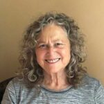

You are welcome here whether you are new to meditation, familiar with it, or practiced. As some people have expressed to me: "It's good to have a structure to drop into to support you (the being)." And that is meditation. 

There is something wonderful about meditating in community. And since Covid lockdown began, I've discovered how easeful it can be from the comfort of home. No travel time, no hurry to reach somewhere just to be able to sit and then capture the time to relax, self-care, and discover the world within. From wherever you are and a zoom link, you simply tune in . . . and then we begin.

Guided meditation is like going on a journey. This is because the mind can take us anywhere until we learn how to be with it and tame it. Like a wild stallion corralled in a small stall, who kicks at the walls, when the stallion (aka your mind) is given space, it will frolic for some time, run free and wild, and finally settle down to rest.

There is so much power when you and your mind are in sync, like horse and rider. I've noticed it. You must have too. Those moments of ease and peace and freedom.

Mind may be filled with thoughts and difficult to get free of. So, rather than trying to control them, ignore them, or get too involved in them, the practice of meditation is to expand your awareness to include them.  Let thoughts be like clouds in your spacious sky-like awareness. This is one of many pathways to travel to in meditation.
If you are available, come join one or all three online guided meditation sessions in August held by donation in support of the Salt Spring Centre of Yoga  -  **August 11, 18, and 25** from 5-6 pm.
To register for classes, visit: <https://saltspringcentre.rallyup.com/>

**Softening and Grounding:**

**A short journey into meditation**

Your shoulders soften, melting on their boney frame.

You feel the surfaces beneath you, the chair lightly at your back and firmly supporting your seat and legs.

Feet are held, weighted onto the floor rising from beneath you.

Your muscles drip down your skeleton as you grow roots into every surface your body touches.

You are held.

A deeper breath arises . . . and then falls, as you feel the soft front

of your chest and belly.

You recognize you are being supported by this beautiful earth, spinning in space, mightily onward.

Yet, it cradles and nourishes you.

Earth body, earth planet — one Being.

~ Soorya Ray Resels 2022

---

### About Soorya Ray Resels

Soorya has been involved in Yoga since the 1970’s. She lived, studied and  taught internationally, including 23 years at the International Meditation Institute in Himachal Pradesh, India, where she co-authored the book [“Vision of Oneness”](https://library.swamishyam.com/shop/english-books/vision-of-oneness/) and received an Honorary Ph.D. in Meditation and Yoga Philosophy ~ Vishwa Unnyayan Samsad in India,1987. Soorya presently teaches meditation (Dhyan), breath-work (Pranayam), Vedanta and Yoga philosophy, and devotional chanting (Kirtan).
At a difficult point in her life, after breast cancer surgery and while looking for physical healing, she discovered the Salt Spring Centre of Yoga. She found so much more – the richness of the Yoga Teacher Training program reminded her of her time and studies in India. She completed her 200 Hour Yoga Teacher Training at the Centre. Most recently Soorya taught at Open Door Yoga in Vancouver, B.C. and The Well Yoga Studio on Bowen Island, B.C. before making the transition to online.
Since Covid, she leads daily online meditations and online chanting twice a month. When she is not meditating, coaching or mentoring, Soorya loves singing, walking in the woods, and participating whole-heartedly in the community where she lives.
