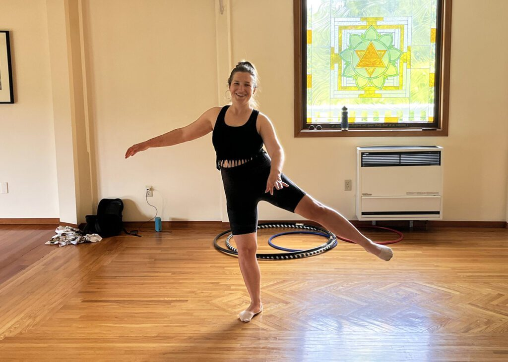

Photo by: Fernando García Vicario
 
What do you get when you cross a farmer and a dancer?
At the Salt Spring Centre of Yoga, you get the Centre’s [Farm](https://saltspringcentre.com/about-us/farm/) Coordinator, Mélisanne Loiselle-Gascon!
This fall, Mélisanne will be offering the [Embodied Gardener Retreat](https://saltspringcentre.com/events/embodied-gardener-retreat/) and several [classes](https://melisannedanse.wordpress.com/connect-2/) that draw on her experiences with both farming and dancing.
I asked Mélisanne about her unique background and her upcoming programs – beginning with how she got into farming in the first place and what she’s learned over the years about farming and self care.

Here’s what she told me:
*During my education in Environmental Studies, I learned a lot about the damage being done to the planet. I wanted to do something to contribute, and thought farming was a productive, sustainable thing to do.*
*Farming aligned well with my passions, and it allowed me to teach about the environment and to grow food that is sustainable and good for the planet. I’ve always done some kind of teaching, like running a farm camp for kids to teach them where their food comes from.*
*Although I grew up in the suburbs, not on a farm, this is my tenth growing season as a farmer. I started with a small plot of land, and at some point, I got a job with a bigger farm, which led to a full-time farming career. It was a gentle transition, but nothing prepared me for the intensity of farming!*
*There are a lot of injuries at this time of year because after all the work of the past few months, you are still not done – the harvest is coming. That’s why the [Embodied Gardener Retreat](https://saltspringcentre.com/events/embodied-gardener-retreat/) is scheduled at this time of year – September 17-18.*
*I started my career thinking, “I really want to save the environment”, but now I’m focusing on helping farmers take care of themselves so they can farm sustainably while caring for their own well-being.*
*I started to pay attention to self-care because farming can be very demanding for body, mind and soul. I had a lot of injuries starting out, and a lot of aches and pains, so I worked hard on my own self care. I like to impart that to others, so they pay attention to body aches, their energy levels and how they’re feeling,*
*So much of farming or gardening focuses on the need to get things done – productivity. But we also have to include ourselves in the picture. I ask myself: How do I grow food but also respect the farmers who are doing the job?*
*If the farmer is falling apart, then there is no more farming! Farmers work incredibly hard, but don’t necessarily take care of themselves while doing it. There are a lot of repetitive movements, postures that you hold for hours and hours, and the same muscles that are used repetitively all the time are the ones that get tight and get injured. You might feel a little tightness, but then stay in the same position for three hours and the tightness gets worse. The body knows what it needs to do; we just need to listen to what it’s saying.*
*The part that I want to highlight at this retreat is that we are our own worst judges. We have such high expectations about what our farm or garden should look like that we find it hard to keep up to our own standards. We forget that we’re the ones creating those standards in the first place, and we make it harder for ourselves with our ‘monkey minds’.* 
*The remedy is mindfulness. “Oh, look at me expecting myself to have a very lush, perfect garden, but I’m very stressed out and it’s not putting me in a very good mindset.” Starting that conversation, we can learn how to let it go or work with it.*
*The [Embodied Gardener Retreat](https://saltspringcentre.com/events/embodied-gardener-retreat/) is an opportunity to get to know the body, to become aware of the mind, to look at yourself as you create the garden. It’s an invitation to renew, to get to know yourself, to centre yourself so you can relax and enjoy the process and not get so drained.*
*Self care looks like a lot of stretches that I will be offering in the [Stretch and Strength](https://saltspringcentre.com/events/stretch-and-strength/) class. They are useful for dancers, but also for farmers!*
*I recommend trying to reverse the repetitive motions that come with farming. That is how ballet came into my life. It was the opposite of farming: stretching upwards, working the muscles that support your core, strengthening the muscles that are not used in farming, but also loosening up the ones that are tight.*
*Yoga is awesome for this. I know a lot of farmers who do yoga as a daily practice. It’s definitely a good option, but so is basic stretching and strengthening – but you need to do it daily, not just on weekends!*
*And be gentle with yourself.*
 
**Join Melisanne for one of her upcoming programs:**

- [Embodied Gardener Retreat](https://saltspringcentre.com/events/embodied-gardener-retreat/): Sept. 17-18
- [Learn to Dance: Brazilian Zouk](https://saltspringcentre.com/events/learn-to-dance-brazilian-zouk/): 5-week class starting Monday, Sept. 12
- [Strength and Stretch](https://saltspringcentre.com/events/stretch-and-strength/): 5-week class starting Tuesday, Sept. 13
- [Learn to Dance: Dominican Bachata](https://saltspringcentre.com/events/learn-to-dance-dominican-bachata/): 5-week class starting Wednesday, Sept. 14

**Work on our Farm!**

- [Farm Hand opportunity](https://saltspringcentre.com/about-us/employment-opportunities/) - Fall 2022 harvest season
