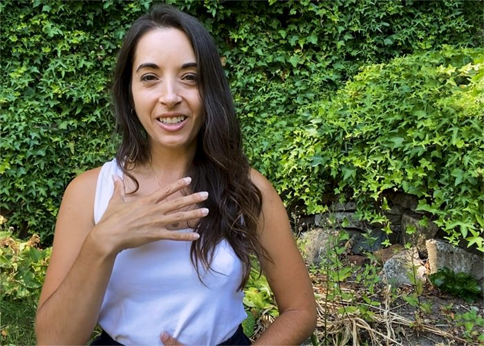

The fall season often brings a flurry of activity – whether sending kids back to school, settling back into a post-summer routine, or getting the garden ready for winter.

Ayurveda defines autumn as “Vata” season - and Vata is all about movement and change.

This excess of energy can leave people feeling unbalanced and needing to ground. However, this natural transition period can also be harnessed for positive change.

Natasha (Jyoti) Samson’s November [Ayurveda and Yoga “I Want More from Life” Retreat](https://saltspringcentre.com/programs-retreats/ayurveda-and-yoga-retreats/)will build on the natural energy of the season to motivate and empower people to change the trajectory of their lives for the better.

“In Ayurveda, there are two ways to manage excess energy – put it where it needs to go or ground it. In other words, channel and express, or pacify. With this retreat, I want to help people put it where it needs to go.”

[caption id="attachment\_29373" align="alignnone" width="500"] *Natasha (Jyoti) Samson teaching Pranayama on her Youtube channel*[/caption]

Over the past few years, Natasha has seen a number of clients who know they could be happier – who suspect there is more to life than they are currently experiencing – but who need a bit of guidance or inspiration to make those changes.

She understands that need for external support.

“People want to feel excited. They want to feel like things are attainable and they want to feel inspired right now. A lot of folks are feeling depressed, a bit off track, or out of sortsfrom the past few years. Everyone I have talked to has had some sort of personal difficulty to get through.”

She also recognizes that the summer was a bit of a post-pandemic boost for many of us.

“The summer gave us a chance to shake a bit of that off and I want to build on that momentum. That is why we are hosting this retreat in the fall. It’s about harnessing this feeling of change and using it to propel ourselves forward.”

She believes that many people are ready to reset, rejuvenate and start a new trajectory.

And while Natasha is happy to help people feel motivated, she notes that people will get the most out of her retreat if they are truly ready to change and put in the necessary effort.

“There are so many people out there right now thinking, ‘There’s got to be more to life than this. I know I can be happier than this. I know that I can be healthier than this.’ Those are the people who will benefit most from this retreat.”

[caption id="attachment\_29375" align="alignnone" width="357"] *Feeling the bliss after teaching at the Salt Spring Centre of Yoga's 200 hour Yoga Teacher Training*[/caption]

She also recognizes that many people have already been trying different modalities – such as yoga or therapy or energy work – but they are still struggling to find a system that works for them.

Natasha is familiar with that state from her own past. She distinctly remembers when that started to shift for her after her yoga teacher training at the Salt Spring Centre of Yoga.

“I remember feeling inspired at that time. I was meeting people who were doing these practices and growing old gracefully – with flexibility and happiness – and I wanted to know their secret.”

“Meditation, yoga, Ayurveda – it sets you free and I think we’re all looking for freedom. To me, happiness is equal to your level of inner freedom.  And how do you find inner freedom? Through these tools.”

Through her YTT and subsequent training as an Ayurvedic Health Counsellor, she discovered the tools to bring about positive change and wants to share them with others who are looking for more from their lives.

“Carve out a weekend for yourself. Know that that you are going to be completely taken care of, your meals and accommodations are taken care of, you are going to get time to exercise and meditate, but you are also going to get the tools that are going to give you more out of your life – to set you on that trajectory to feeling better.”

***Register now for the [Ayurveda and Yoga "I Want More from Life" Retreat](https://saltspringcentre.com/programs-retreats/ayurveda-and-yoga-retreats/) and come ready to reach a state of health and wellness that you have never experienced before!***

---

### About Natasha (Jyoti) Samson

#### CYA-RYT 200, Ayurveda Health Counsellor & Teacher

Natasha specializes in dynamic Ayurveda education, sharing her deep understanding of healing the mind, and root cause of suffering, through the physical tools of Ayurveda and Yoga as well as the philosophy and psychology of these sister sciences, developed through nearly ten years of study in both Ashtanga Yoga and Ayurveda.She is a graduate of the Mount Madonna Institute of Ayurveda, earning her Ayurveda Health Counselor Diploma in 2018. She is also a graduate of the Salt Spring Centre of Yoga YTT program in 2013, where her passion for Ayurveda was first kindled. Jyoti is an Ayurveda & Yoga educator, offering online and in-person, classes, courses and retreats to support the seeker’s self awareness and healing journey.She is also experienced in speaking engagements, Ayurveda consultations, holistic mind, body & soul counselling, and Abhyanga oil massage treatments. Past courses include “Yoga as Medicine”, “[East Meets West Wisdom for Woman](https://nourishyoufirst.ca/ayurvedic/courses/)” with Dr. Patricia Mills, and more.
 
*Join Natasha for the* ***[Ayurveda and Yoga "I Want More from Life" Retreat](https://saltspringcentre.com/programs-retreats/ayurveda-and-yoga-retreats/)*** *from November 4 - 6, 2022 at the Salt Spring Centre of Yoga.*
